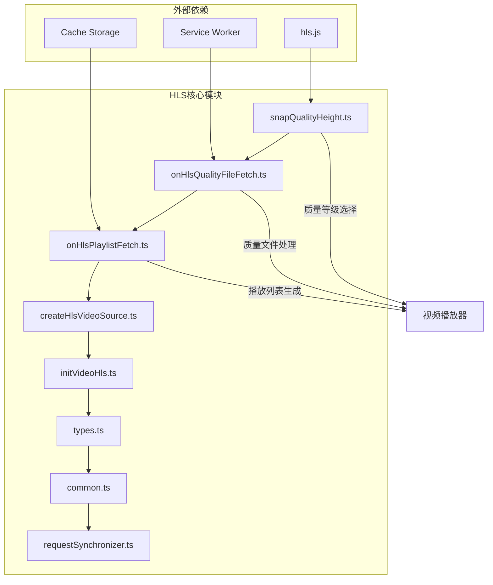
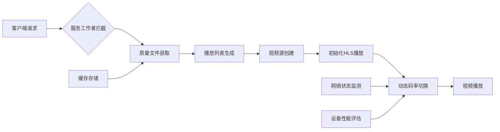
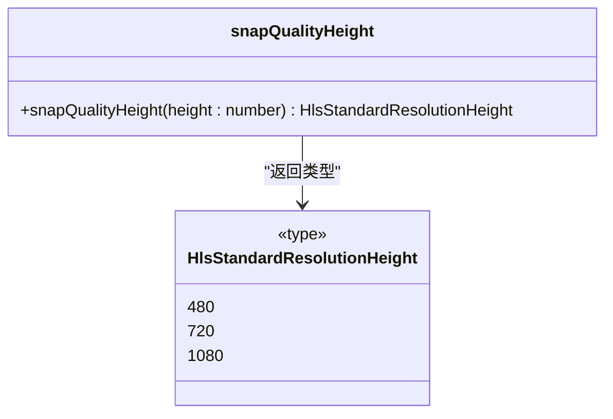
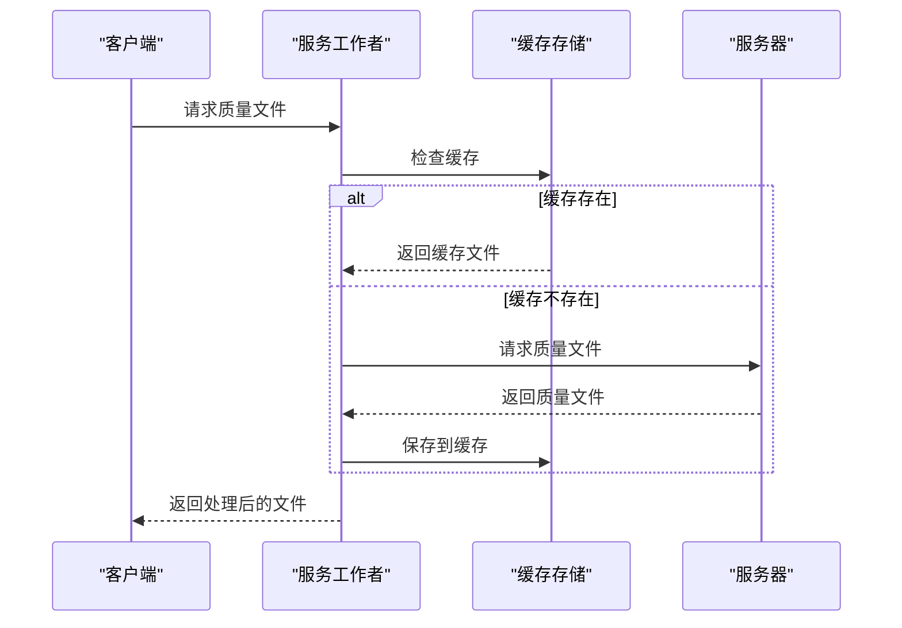
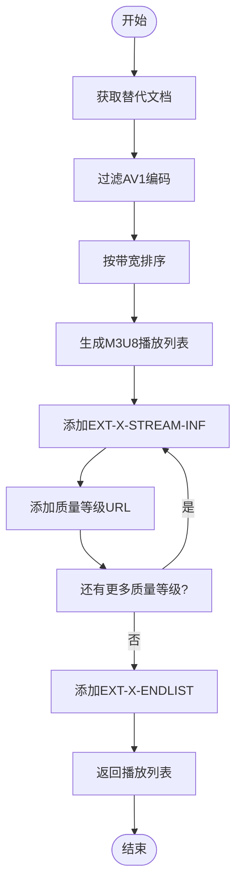
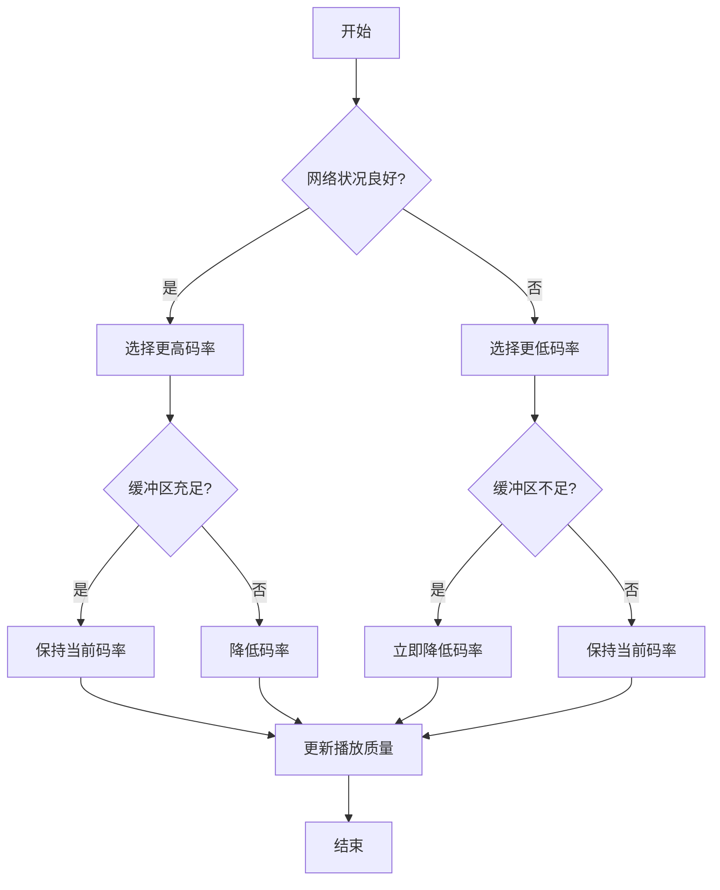
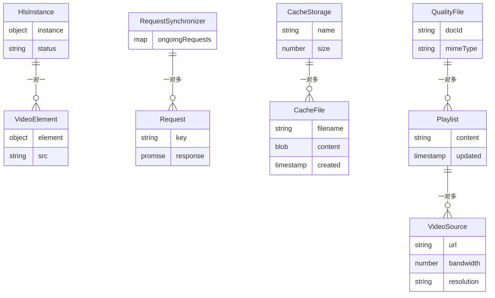

# 自适应码率管理

<cite>
**本文档引用的文件**
- [snapQualityHeight.ts](file://src/lib/hls/snapQualityHeight.ts)
- [onHlsQualityFileFetch.ts](file://src/lib/hls/onHlsQualityFileFetch.ts)
- [onHlsPlaylistFetch.ts](file://src/lib/hls/onHlsPlaylistFetch.ts)
- [createHlsVideoSource.ts](file://src/lib/hls/createHlsVideoSource.ts)
- [initVideoHls.ts](file://src/lib/hls/initVideoHls.ts)
- [types.ts](file://src/lib/hls/types.ts)
- [common.ts](file://src/lib/hls/common.ts)
- [requestSynchronizer.ts](file://src/lib/hls/requestSynchronizer.ts)
- [qualityLevelsSwitchButton.tsx](file://src/lib/mediaPlayer/qualityLevelsSwitchButton.tsx)
</cite>

## 目录
1. [简介](#简介)
2. [项目结构](#项目结构)
3. [核心组件](#核心组件)
4. [架构概述](#架构概述)
5. [详细组件分析](#详细组件分析)
6. [依赖分析](#依赖分析)
7. [性能考虑](#性能考虑)
8. [故障排除指南](#故障排除指南)
9. [结论](#结论)

## 简介
本文档详细解析了自适应码率管理系统的实现机制，重点分析了基于屏幕尺寸、网络带宽和设备性能的质量等级选择逻辑。系统通过HLS（HTTP Live Streaming）技术实现动态码率切换，确保在不同网络条件和设备环境下提供最佳的视频播放体验。文档深入探讨了质量等级文件获取、播放列表解析、码率切换决策等核心功能的实现原理。

## 项目结构
自适应码率管理功能主要集中在`src/lib/hls/`目录下，该目录包含了实现HLS流媒体处理的所有核心组件。系统采用服务工作者（Service Worker）架构，在客户端和服务端之间进行请求拦截和处理，实现了高效的视频流管理和缓存机制。

**Diagram sources**
- [src/lib/hls/snapQualityHeight.ts](file://src/lib/hls/snapQualityHeight.ts)
- [src/lib/hls/onHlsQualityFileFetch.ts](file://src/lib/hls/onHlsQualityFileFetch.ts)
- [src/lib/hls/onHlsPlaylistFetch.ts](file://src/lib/hls/onHlsPlaylistFetch.ts)

**Section sources**
- [src/lib/hls](file://src/lib/hls)

## 核心组件
自适应码率管理系统由多个核心组件构成，包括质量等级选择器、质量文件获取处理器、播放列表生成器等。这些组件协同工作，实现了从视频源到最终播放的完整流程。系统通过`hlsInstancesByVideo`弱映射来管理每个视频元素对应的HLS实例，确保资源的有效利用和及时释放。

**Section sources**
- [src/lib/hls/snapQualityHeight.ts](file://src/lib/hls/snapQualityHeight.ts#L1-L13)
- [src/lib/hls/onHlsQualityFileFetch.ts](file://src/lib/hls/onHlsQualityFileFetch.ts#L1-L101)
- [src/lib/hls/onHlsPlaylistFetch.ts](file://src/lib/hls/onHlsPlaylistFetch.ts#L1-L37)

## 架构概述
自适应码率管理系统采用分层架构设计，从底层的缓存存储到上层的播放器控制，各层职责分明。系统通过服务工作者拦截HLS相关的网络请求，利用缓存机制减少重复下载，提高加载效率。质量等级选择基于屏幕尺寸、网络带宽和设备性能等多维度因素进行综合决策。

**Diagram sources**
- [src/lib/hls/onHlsQualityFileFetch.ts](file://src/lib/hls/onHlsQualityFileFetch.ts#L1-L101)
- [src/lib/hls/onHlsPlaylistFetch.ts](file://src/lib/hls/onHlsPlaylistFetch.ts#L1-L37)
- [src/lib/hls/initVideoHls.ts](file://src/lib/hls/initVideoHls.ts#L1-L41)

## 详细组件分析

### 质量等级选择逻辑分析
质量等级选择器根据屏幕尺寸自动匹配最合适的视频分辨率，确保在不同设备上都能获得最佳观看体验。系统定义了三种标准分辨率：480p、720p和1080p，并通过阈值计算确定最佳匹配。

**Diagram sources**
- [src/lib/hls/snapQualityHeight.ts](file://src/lib/hls/snapQualityHeight.ts#L1-L13)
- [src/lib/hls/types.ts](file://src/lib/hls/types.ts#L1-L2)

**Section sources**
- [src/lib/hls/snapQualityHeight.ts](file://src/lib/hls/snapQualityHeight.ts#L1-L13)

### 质量文件获取与处理机制
质量文件获取处理器负责从服务器获取HLS质量文件，并将其转换为本地可访问的URL。系统采用请求同步器避免重复请求，同时利用缓存存储提高访问效率。

**Diagram sources**
- [src/lib/hls/onHlsQualityFileFetch.ts](file://src/lib/hls/onHlsQualityFileFetch.ts#L1-L101)
- [src/lib/hls/requestSynchronizer.ts](file://src/lib/hls/requestSynchronizer.ts#L1-L16)

**Section sources**
- [src/lib/hls/onHlsQualityFileFetch.ts](file://src/lib/hls/onHlsQualityFileFetch.ts#L1-L101)

### 播放列表解析与更新策略
播放列表处理器负责解析HLS播放列表请求，生成包含多个质量等级的播放源。系统通过`createHlsVideoSource`函数创建M3U8格式的播放列表，支持动态码率切换。

**Diagram sources**
- [src/lib/hls/onHlsPlaylistFetch.ts](file://src/lib/hls/onHlsPlaylistFetch.ts#L1-L37)
- [src/lib/hls/createHlsVideoSource.ts](file://src/lib/hls/createHlsVideoSource.ts#L1-L106)

**Section sources**
- [src/lib/hls/onHlsPlaylistFetch.ts](file://src/lib/hls/onHlsPlaylistFetch.ts#L1-L37)

### 码率切换决策流程
码率切换决策基于网络状况监测、缓冲区状态评估和用户体验优化等多方面因素。系统通过`hls.js`库提供的带宽估计功能，结合用户手动选择的质量等级，实现智能的码率切换。

**Diagram sources**
- [src/lib/mediaPlayer/qualityLevelsSwitchButton.tsx](file://src/lib/mediaPlayer/qualityLevelsSwitchButton.tsx#L153-L194)
- [src/lib/hls/initVideoHls.ts](file://src/lib/hls/initVideoHls.ts#L1-L41)

**Section sources**
- [src/lib/mediaPlayer/qualityLevelsSwitchButton.tsx](file://src/lib/mediaPlayer/qualityLevelsSwitchButton.tsx#L153-L194)

## 依赖分析
自适应码率管理系统依赖于多个外部库和内部模块，形成了复杂的依赖关系网络。系统通过弱映射（WeakMap）管理HLS实例，避免内存泄漏。请求同步器确保同一资源的并发请求被正确处理，提高系统稳定性。

**Diagram sources**
- [src/lib/hls/hlsInstancesByVideo.ts](file://src/lib/hls/hlsInstancesByVideo.ts#L1-L4)
- [src/lib/hls/requestSynchronizer.ts](file://src/lib/hls/requestSynchronizer.ts#L1-L16)
- [src/lib/hls/common.ts](file://src/lib/hls/common.ts#L1-L14)

**Section sources**
- [src/lib/hls/hlsInstancesByVideo.ts](file://src/lib/hls/hlsInstancesByVideo.ts#L1-L4)

## 性能考虑
系统在设计时充分考虑了性能优化，通过缓存机制减少网络请求，利用服务工作者实现离线播放支持。播放列表生成过程中对质量等级进行排序，确保低码率版本优先加载，提高初始播放速度。同时，系统设置了合理的缓冲区长度和最大缓冲区长度，平衡了内存使用和播放流畅度。

## 故障排除指南
当遇到自适应码率管理问题时，可以按照以下步骤进行排查：首先检查服务工作者是否正常注册和运行，然后验证缓存存储是否正常工作，最后确认HLS播放器配置是否正确。常见的问题包括质量文件无法获取、播放列表解析失败和码率切换不及时等。

**Section sources**
- [src/lib/hls/common.ts](file://src/lib/hls/common.ts#L8-L9)
- [src/lib/hls/onHlsQualityFileFetch.ts](file://src/lib/hls/onHlsQualityFileFetch.ts#L40-L41)

## 结论
自适应码率管理系统通过精心设计的架构和高效的实现，为用户提供流畅的视频播放体验。系统不仅考虑了技术实现的细节，还充分考虑了用户体验和性能优化。未来可以通过引入更智能的网络状况预测算法，进一步提升码率切换的准确性和及时性。