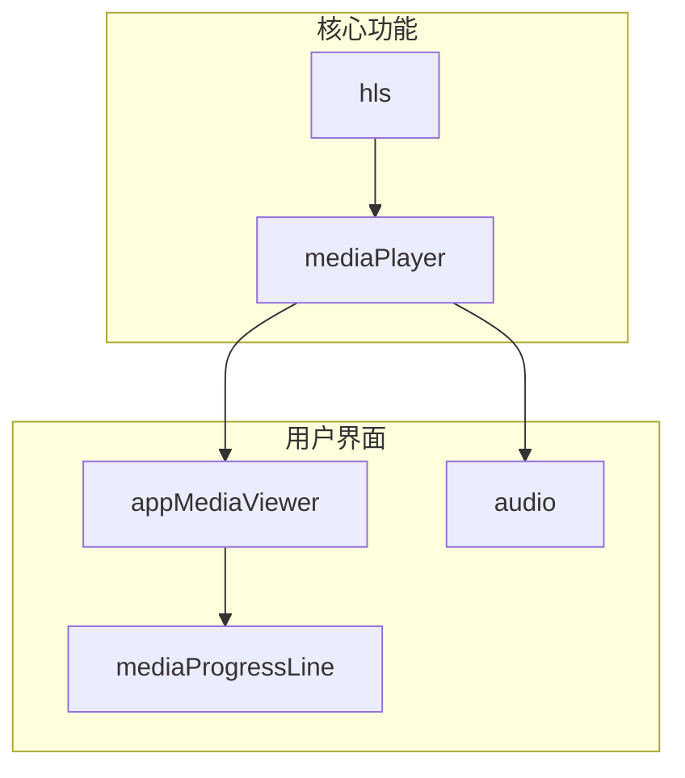
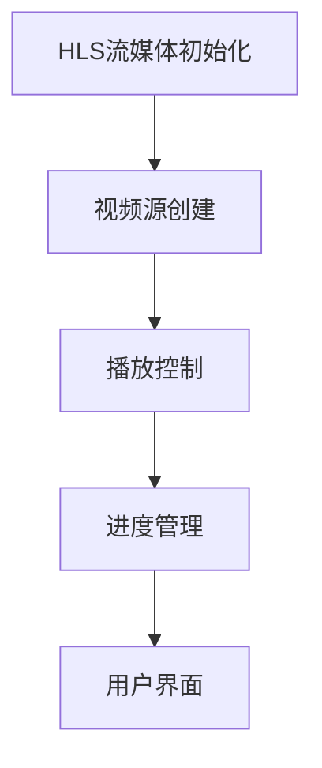
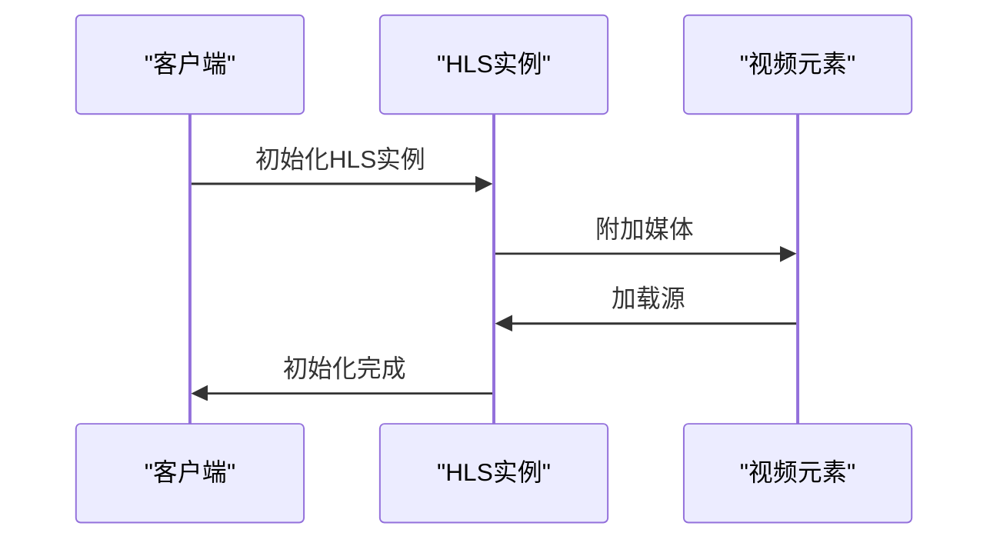
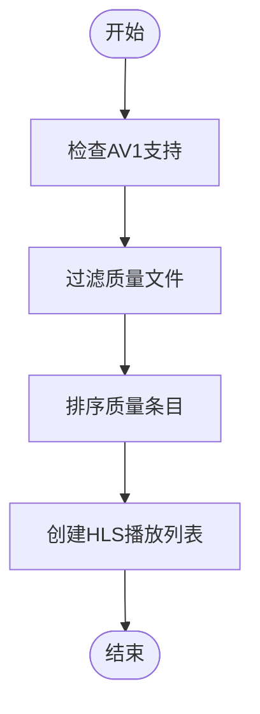
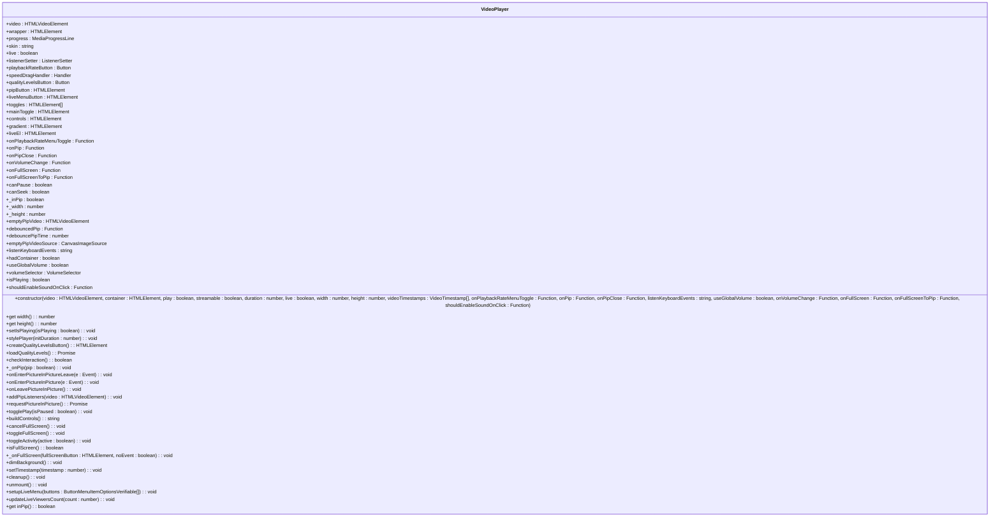
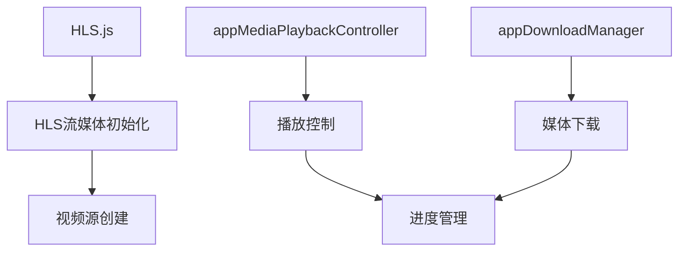

# 媒体播放

<cite>
**本文档引用的文件**   
- [initVideoHls.ts](file://src\lib\hls\initVideoHls.ts)
- [createHlsVideoSource.ts](file://src\lib\hls\createHlsVideoSource.ts)
- [index.ts](file://src\lib\mediaPlayer\index.ts)
- [appMediaViewer.ts](file://src\components\appMediaViewer.ts)
- [audio.ts](file://src\components\audio.ts)
- [appMediaViewerBase.ts](file://src\components\appMediaViewerBase.ts)
- [mediaProgressLine.ts](file://src\components\mediaProgressLine.ts)
- [onMediaLoad.ts](file://src\helpers\onMediaLoad.ts)
</cite>

## 目录
1. [简介](#简介)
2. [项目结构](#项目结构)
3. [核心组件](#核心组件)
4. [架构概述](#架构概述)
5. [详细组件分析](#详细组件分析)
6. [依赖分析](#依赖分析)
7. [性能考虑](#性能考虑)
8. [故障排除指南](#故障排除指南)
9. [结论](#结论)

## 简介
本文档详细阐述了媒体播放功能的实现，重点分析了HLS流媒体的初始化、视频源创建、自适应码率切换和质量等级管理。文档还涵盖了视频和音频消息的播放控制机制，包括预加载、缓冲和播放状态管理。此外，文档说明了媒体预览图的生成策略和缩略图处理流程，记录了不同媒体类型（图片、视频、音频）的播放器集成方式和用户界面交互，并包含了错误处理机制和性能监控建议。

## 项目结构
项目结构清晰地组织了媒体播放相关的组件和功能。核心媒体播放功能位于`src/lib/mediaPlayer`和`src/lib/hls`目录中，而用户界面组件则位于`src/components`目录中。音频和视频的播放控制、进度条、预加载器等组件都集中管理，确保了代码的模块化和可维护性。



**Diagram sources**
- [initVideoHls.ts](file://src\lib\hls\initVideoHls.ts)
- [index.ts](file://src\lib\mediaPlayer\index.ts)
- [appMediaViewer.ts](file://src\components\appMediaViewer.ts)
- [audio.ts](file://src\components\audio.ts)
- [mediaProgressLine.ts](file://src\components\mediaProgressLine.ts)

**Section sources**
- [initVideoHls.ts](file://src\lib\hls\initVideoHls.ts)
- [createHlsVideoSource.ts](file://src\lib\hls\createHlsVideoSource.ts)
- [index.ts](file://src\lib\mediaPlayer\index.ts)
- [appMediaViewer.ts](file://src\components\appMediaViewer.ts)
- [audio.ts](file://src\components\audio.ts)

## 核心组件
媒体播放功能的核心组件包括HLS流媒体初始化、视频源创建、播放控制和进度管理。这些组件协同工作，提供了流畅的媒体播放体验。

**Section sources**
- [initVideoHls.ts](file://src\lib\hls\initVideoHls.ts)
- [createHlsVideoSource.ts](file://src\lib\hls\createHlsVideoSource.ts)
- [index.ts](file://src\lib\mediaPlayer\index.ts)

## 架构概述
媒体播放功能的架构设计旨在提供高效、可扩展的媒体处理能力。HLS流媒体初始化和视频源创建是架构的核心，负责处理媒体流的加载和播放。播放控制和进度管理组件则负责用户交互和播放状态的管理。



**Diagram sources**
- [initVideoHls.ts](file://src\lib\hls\initVideoHls.ts)
- [createHlsVideoSource.ts](file://src\lib\hls\createHlsVideoSource.ts)
- [index.ts](file://src\lib\mediaPlayer\index.ts)
- [mediaProgressLine.ts](file://src\components\mediaProgressLine.ts)

## 详细组件分析
### HLS流媒体初始化
HLS流媒体初始化是媒体播放功能的关键步骤。`initVideoHls`函数负责初始化HLS实例，并将其附加到视频元素上。该函数还处理HLS实例的销毁，确保资源的正确释放。



**Diagram sources**
- [initVideoHls.ts](file://src\lib\hls\initVideoHls.ts)

**Section sources**
- [initVideoHls.ts](file://src\lib\hls\initVideoHls.ts)

### 视频源创建
`createHlsVideoSource`函数负责创建HLS视频源。该函数根据提供的文档属性生成HLS播放列表，支持自适应码率切换和质量等级管理。



**Diagram sources**
- [createHlsVideoSource.ts](file://src\lib\hls\createHlsVideoSource.ts)

**Section sources**
- [createHlsVideoSource.ts](file://src\lib\hls\createHlsVideoSource.ts)

### 播放控制
播放控制组件负责管理视频和音频的播放状态。`VideoPlayer`类提供了播放、暂停、全屏、画中画等控制功能，并支持键盘快捷键。



**Diagram sources**
- [index.ts](file://src\lib\mediaPlayer\index.ts)

**Section sources**
- [index.ts](file://src\lib\mediaPlayer\index.ts)

### 进度管理
`MediaProgressLine`类负责管理媒体播放的进度。该类提供了进度条的显示和控制，支持时间戳的显示和跳转。

```mermaid
classDiagram
class MediaProgressLine {
+filledContainer : HTMLDivElement
+filledLoad : HTMLDivElement
+currentTimeInfoElement : HTMLDivElement
+currentTimeElement : HTMLDivElement
+currentSegmentElement : HTMLDivElement
+progressRAF : number
+media : HTMLMediaElement
+streamable : boolean
+static svgClipPathIdSeed : number
+usedClipPathId : number
+clipPathSvg : SVGSVGElement
+segments : VideoTimestampSegment[]
+constructor(options : {withTransition : boolean, useTransform : boolean, onSeekStart : Function, onSeekEnd : Function, onTimeUpdate : Function, videoTimestamps : VideoTimestamp[]})
+setMedia(media : HTMLMediaElement, streamable : boolean, duration : number) : void
+unobserveResize : Function
+initResizeObserver() : void
+activeSegmentIdx : number
+hoverRAF : number
+onHover(e : MouseEvent) : void
+onPointerOut() : void
+toggleSegment(idx : number, active : boolean) : void
+wrapProgressLinesInContainer() : void
+clearTimeAndSegment() : void
+updateTimeAndSegment(x : number, width : number) : void
+setTimestampsClipPath() : void
+getTimestampSegments(totalWidth : number) : VideoTimestampSegment[]
+removeClipPathFromDOM() : void
+onLoadedData() : void
+onEnded() : void
+onPlay() : void
+onTimeUpdate() : void
+onProgress(e : Event) : void
+scrub(e : GrabEvent) : number
+snapScrubValue(value : number) : number
+setLoadProgress() : void
+setSeekMax(duration : number) : void
+setProgress() : void
+setListeners() : void
+removeListeners() : void
+cleanup() : void
}
```

**Diagram sources**
- [mediaProgressLine.ts](file://src\components\mediaProgressLine.ts)

**Section sources**
- [mediaProgressLine.ts](file://src\components\mediaProgressLine.ts)

## 依赖分析
媒体播放功能依赖于多个外部库和内部组件。HLS.js库用于处理HLS流媒体，而`appMediaPlaybackController`和`appDownloadManager`等内部组件则负责播放控制和媒体下载。



**Diagram sources**
- [initVideoHls.ts](file://src\lib\hls\initVideoHls.ts)
- [index.ts](file://src\lib\mediaPlayer\index.ts)
- [appMediaViewer.ts](file://src\components\appMediaViewer.ts)
- [audio.ts](file://src\components\audio.ts)
- [mediaProgressLine.ts](file://src\components\mediaProgressLine.ts)

**Section sources**
- [initVideoHls.ts](file://src\lib\hls\initVideoHls.ts)
- [index.ts](file://src\lib\mediaPlayer\index.ts)
- [appMediaViewer.ts](file://src\components\appMediaViewer.ts)
- [audio.ts](file://src\components\audio.ts)
- [mediaProgressLine.ts](file://src\components\mediaProgressLine.ts)

## 性能考虑
媒体播放功能在设计时充分考虑了性能优化。通过预加载、缓冲和自适应码率切换，确保了媒体播放的流畅性。此外，播放控制和进度管理组件的实现也尽量减少了对主线程的阻塞。

## 故障排除指南
### 网络中断恢复
当网络中断时，媒体播放器会自动尝试重新连接。如果重新连接失败，播放器会显示错误信息并提供重试选项。

### 格式不支持的降级方案
如果媒体格式不支持，播放器会尝试使用其他格式或提供下载选项。对于不支持的视频格式，播放器会显示预览图并提供下载链接。

**Section sources**
- [onMediaLoad.ts](file://src\helpers\onMediaLoad.ts)

## 结论
本文档详细介绍了媒体播放功能的实现，涵盖了HLS流媒体初始化、视频源创建、播放控制和进度管理等核心组件。通过合理的架构设计和性能优化，确保了媒体播放的流畅性和可靠性。未来可以进一步优化自适应码率切换算法，提升用户体验。