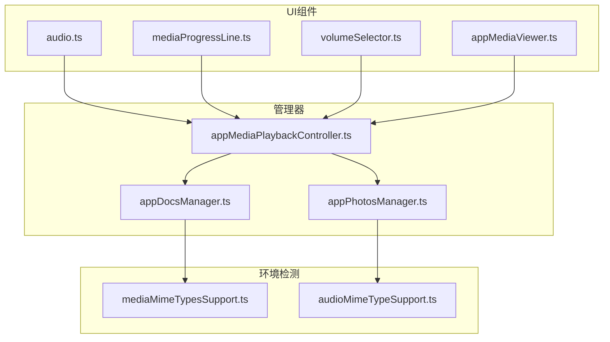
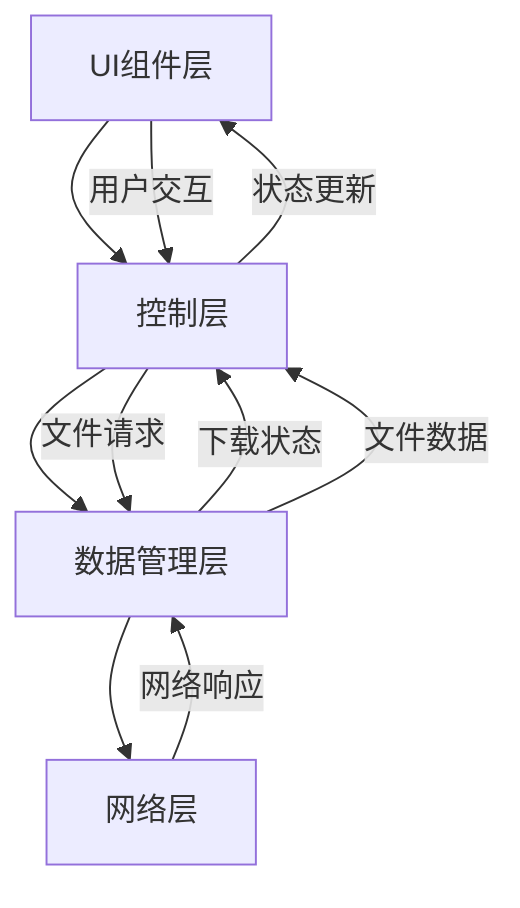
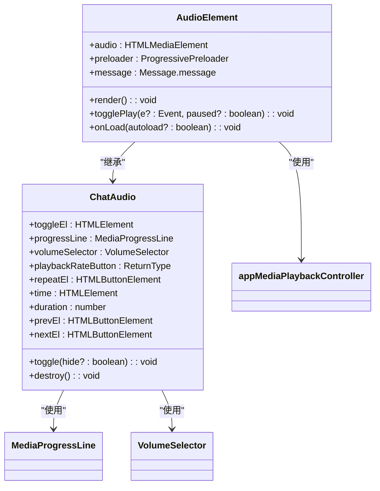
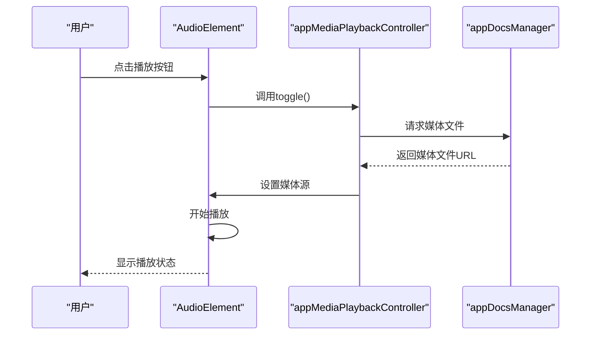
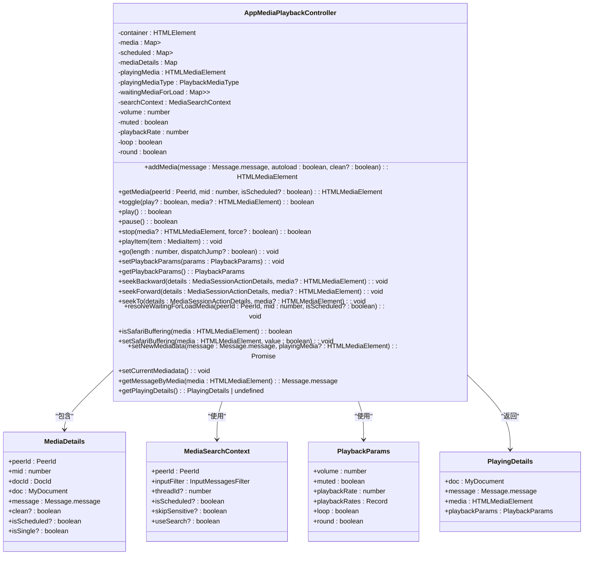
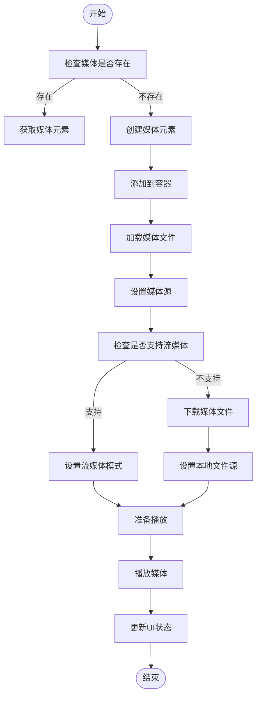
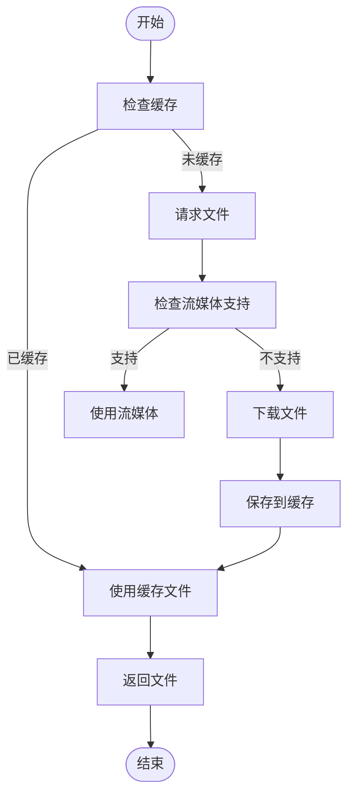
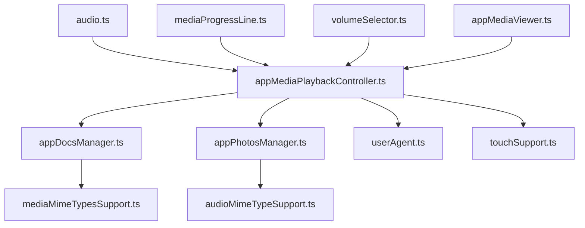

# 媒体播放控制

<cite>
**本文档引用的文件**   
- [audio.ts](file://src/components/audio.ts)
- [appMediaPlaybackController.ts](file://src/components/appMediaPlaybackController.ts)
- [appMediaViewer.ts](file://src/components/appMediaViewer.ts)
- [mediaProgressLine.ts](file://src/components/mediaProgressLine.ts)
- [volumeSelector.ts](file://src/components/volumeSelector.ts)
- [appDocsManager.ts](file://src/lib/appManagers/appDocsManager.ts)
- [appPhotosManager.ts](file://src/lib/appManagers/appPhotosManager.ts)
</cite>

## 目录
1. [介绍](#介绍)
2. [项目结构](#项目结构)
3. [核心组件](#核心组件)
4. [架构概述](#架构概述)
5. [详细组件分析](#详细组件分析)
6. [依赖分析](#依赖分析)
7. [性能考虑](#性能考虑)
8. [故障排除指南](#故障排除指南)
9. [结论](#结论)

## 介绍
本项目实现了一个完整的媒体播放控制系统，用于在聊天气泡组件中集成音频和视频播放器。系统通过appMediaPlaybackController管理播放状态，使用appDocsManager和appPhotosManager管理媒体文件的下载和缓存。播放器组件支持播放/暂停、音量控制、进度跳转和循环播放等核心功能，并实现了预加载策略和缓冲区管理机制。系统还包含错误处理流程和性能优化措施，确保在不同网络状况下的流畅播放体验。

## 项目结构
项目结构清晰地组织了媒体播放相关的组件和管理器。核心播放功能位于src/components目录下，包括音频播放器、媒体进度条和音量控制器等UI组件。媒体管理功能位于src/lib/appManagers目录下，负责媒体文件的下载、缓存和状态管理。环境检测模块位于src/environment目录下，用于检测浏览器对不同媒体格式的支持情况。



**Diagram sources**
- [audio.ts](file://src/components/audio.ts)
- [appMediaPlaybackController.ts](file://src/components/appMediaPlaybackController.ts)
- [appDocsManager.ts](file://src/lib/appManagers/appDocsManager.ts)

**Section sources**
- [audio.ts](file://src/components/audio.ts)
- [appMediaPlaybackController.ts](file://src/components/appMediaPlaybackController.ts)
- [appDocsManager.ts](file://src/lib/appManagers/appDocsManager.ts)

## 核心组件
核心组件包括音频播放器、媒体进度条、音量控制器和媒体播放控制器。音频播放器负责渲染播放界面和处理用户交互，媒体进度条显示播放进度并支持拖拽跳转，音量控制器提供音量调节功能，媒体播放控制器管理播放状态和媒体文件的加载。

**Section sources**
- [audio.ts](file://src/components/audio.ts)
- [mediaProgressLine.ts](file://src/components/mediaProgressLine.ts)
- [volumeSelector.ts](file://src/components/volumeSelector.ts)
- [appMediaPlaybackController.ts](file://src/components/appMediaPlaybackController.ts)

## 架构概述
系统采用分层架构，UI组件层负责用户界面的渲染和交互，控制层管理播放状态和媒体文件的加载，数据管理层负责媒体文件的下载和缓存。各层之间通过事件和回调函数进行通信，确保系统的松耦合和可维护性。



**Diagram sources**
- [appMediaPlaybackController.ts](file://src/components/appMediaPlaybackController.ts)
- [appDocsManager.ts](file://src/lib/appManagers/appDocsManager.ts)

## 详细组件分析

### 音频播放器分析
音频播放器组件实现了播放按钮交互、进度条更新和播放状态显示功能。播放按钮通过点击事件触发播放/暂停操作，进度条实时更新播放进度并支持拖拽跳转，播放状态显示当前播放时间和总时长。

#### 类图


**Diagram sources**
- [audio.ts](file://src/components/audio.ts)
- [appMediaPlaybackController.ts](file://src/components/appMediaPlaybackController.ts)
- [mediaProgressLine.ts](file://src/components/mediaProgressLine.ts)
- [volumeSelector.ts](file://src/components/volumeSelector.ts)

#### 播放流程序列图


**Diagram sources**
- [audio.ts](file://src/components/audio.ts)
- [appMediaPlaybackController.ts](file://src/components/appMediaPlaybackController.ts)
- [appDocsManager.ts](file://src/lib/appManagers/appDocsManager.ts)

**Section sources**
- [audio.ts](file://src/components/audio.ts)
- [appMediaPlaybackController.ts](file://src/components/appMediaPlaybackController.ts)
- [appDocsManager.ts](file://src/lib/appManagers/appDocsManager.ts)

### 媒体播放控制器分析
媒体播放控制器是系统的核心，负责管理所有媒体的播放状态和生命周期。它维护一个媒体映射表，存储每个媒体文件的播放状态，并提供播放、暂停、停止、跳转等控制方法。

#### 类图


**Diagram sources**
- [appMediaPlaybackController.ts](file://src/components/appMediaPlaybackController.ts)

#### 播放控制流程图


**Diagram sources**
- [appMediaPlaybackController.ts](file://src/components/appMediaPlaybackController.ts)

**Section sources**
- [appMediaPlaybackController.ts](file://src/components/appMediaPlaybackController.ts)

### 媒体文件管理分析
媒体文件管理由appDocsManager和appPhotosManager两个管理器负责，分别管理文档和图片类型的媒体文件。它们负责文件的下载、缓存和状态同步，确保媒体文件的高效访问。

#### 类图
```mermaid
classDiagram
class AppDocsManager {
-docs : Map<DocId, MyDocument>
-uploadingWallPapers : Map<WallPaperId, UploadingWallPaper>
-fixingChromiumMp4 : Map<string, MaybePromise<string>>
-requestingDocParts : Map<DocId, Set<() => void>>
-altDocsByMainMediaDocument : Map<DocId, Document[]>
+saveDoc(doc : Document, context? : ReferenceContext, altDocuments? : Document[]) : MyDocument
+getDoc(docId : DocId | MyDocument) : MyDocument
+downloadDoc(doc : MyDocument, queueId? : number, onlyCache? : boolean) : Promise<void>
+saveWebPConvertedStrippedThumb(docId : DocId, bytes : Uint8Array) : void
+prepareWallPaperUpload(file : File) : WallPaper.wallPaper
+uploadWallPaper(id : WallPaperId) : Promise<WallPaper.wallPaper>
+requestDocPart(docId : DocId, dcId : number, offset : number, limit : number) : Promise<ArrayBuffer>
+cancelDocPartsRequests(docId : DocId) : void
+fixChromiumMp4(src : string) : Promise<string>
+getAltDocsByDocument(docId : DocId) : Document[] | undefined
}
class AppPhotosManager {
-photos : Map<string, MyPhoto>
+savePhoto(photo : Photo, context? : ReferenceContext) : MyPhoto
+getUserPhotos(userId : UserId, maxId? : Photo.photo['id'], limit? : number) : Promise<UserPhotosResult>
+getPhoto(photoId : any) : MyPhoto
}
class MyDocument {
+id : string
+access_hash : string
+file_reference : Uint8Array
+date : number
+mime_type : MTMimeType
+size : number
+thumbs : PhotoSize[]
+attributes : DocumentAttribute[]
+dc_id : number
+pFlags : DocumentPFlags
+type : MediaType
+supportsStreaming : boolean
+duration? : number
+w? : number
+h? : number
+file_name? : string
+stickerEmojiRaw? : string
+stickerSetInput? : InputStickerSet
+sticker? : StickerType
+animated? : boolean
}
class MyPhoto {
+id : string
+access_hash : string
+file_reference : Uint8Array
+date : number
+sizes : PhotoSize[]
+has_stickers? : boolean
+pFlags : PhotoPFlags
}
AppDocsManager --> MyDocument : "管理"
AppPhotosManager --> MyPhoto : "管理"
AppDocsManager --> AppPhotosManager : "协作"
```

**Diagram sources**
- [appDocsManager.ts](file://src/lib/appManagers/appDocsManager.ts)
- [appPhotosManager.ts](file://src/lib/appManagers/appPhotosManager.ts)

#### 文件下载流程图


**Diagram sources**
- [appDocsManager.ts](file://src/lib/appManagers/appDocsManager.ts)

**Section sources**
- [appDocsManager.ts](file://src/lib/appManagers/appDocsManager.ts)
- [appPhotosManager.ts](file://src/lib/appManagers/appPhotosManager.ts)

## 依赖分析
系统各组件之间存在明确的依赖关系。UI组件依赖于控制层提供的播放状态和控制方法，控制层依赖于数据管理层提供的媒体文件和下载状态。环境检测模块为所有组件提供浏览器兼容性信息，确保在不同环境下都能正常工作。



**Diagram sources**
- [audio.ts](file://src/components/audio.ts)
- [appMediaPlaybackController.ts](file://src/components/appMediaPlaybackController.ts)
- [appDocsManager.ts](file://src/lib/appManagers/appDocsManager.ts)
- [appPhotosManager.ts](file://src/lib/appManagers/appPhotosManager.ts)
- [environment/userAgent.ts](file://src/environment/userAgent.ts)
- [environment/touchSupport.ts](file://src/environment/touchSupport.ts)

**Section sources**
- [audio.ts](file://src/components/audio.ts)
- [appMediaPlaybackController.ts](file://src/components/appMediaPlaybackController.ts)
- [appDocsManager.ts](file://src/lib/appManagers/appDocsManager.ts)
- [appPhotosManager.ts](file://src/lib/appManagers/appPhotosManager.ts)

## 性能考虑
系统在性能方面进行了多项优化。预加载策略根据网络状况智能选择预加载的媒体片段，缓冲区管理机制确保播放的流畅性。内存管理方面，系统及时释放不再使用的媒体资源，避免内存泄漏。电池消耗控制通过优化播放逻辑和减少不必要的计算来实现。

**Section sources**
- [appMediaPlaybackController.ts](file://src/components/appMediaPlaybackController.ts)
- [appDocsManager.ts](file://src/lib/appManagers/appDocsManager.ts)

## 故障排除指南
系统包含完善的错误处理机制。对于格式不支持的情况，系统会显示相应的错误提示并建议用户使用支持的格式。网络中断时，系统会自动重试下载，并在用户界面显示网络状态。解码失败时，系统会尝试使用备用解码方案或提供下载选项。

**Section sources**
- [appMediaPlaybackController.ts](file://src/components/appMediaPlaybackController.ts)
- [appDocsManager.ts](file://src/lib/appManagers/appDocsManager.ts)

## 结论
本媒体播放控制系统实现了完整的播放功能，包括播放控制、状态显示、文件管理和性能优化。系统架构清晰，组件职责明确，具有良好的可维护性和扩展性。通过合理的预加载策略和缓冲区管理，系统能够在不同网络条件下提供流畅的播放体验。错误处理机制确保了系统的稳定性和用户体验。