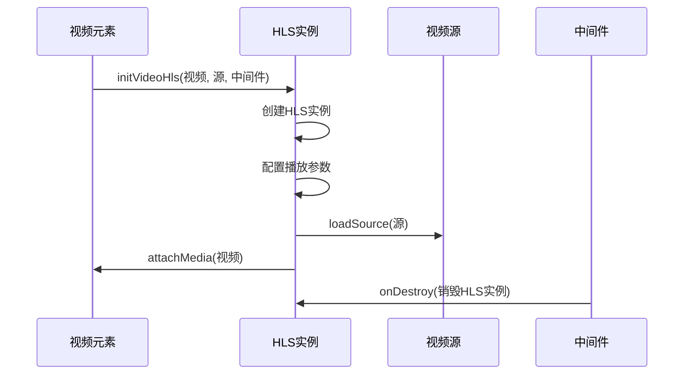
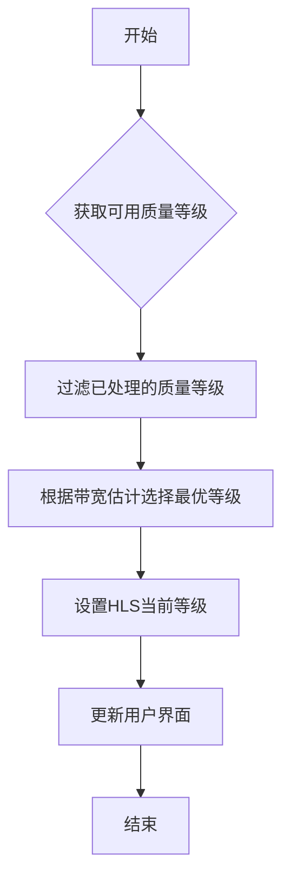
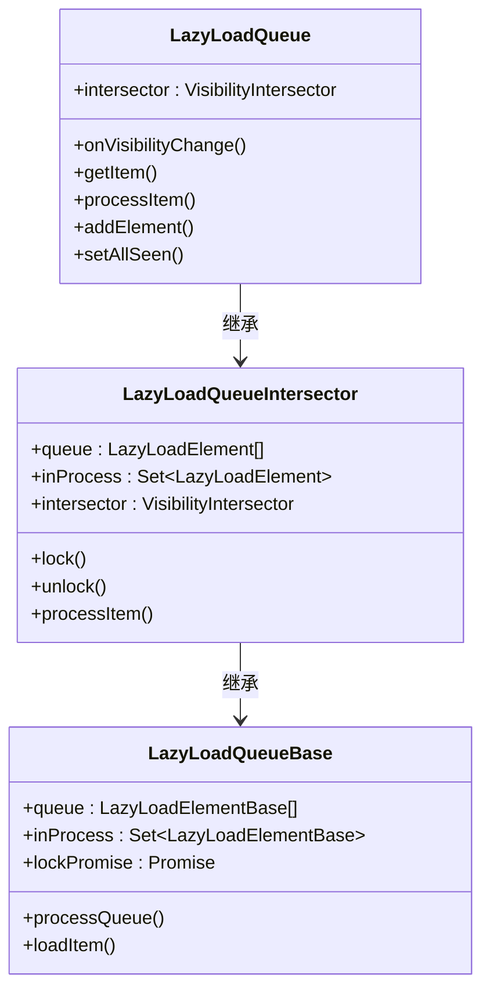
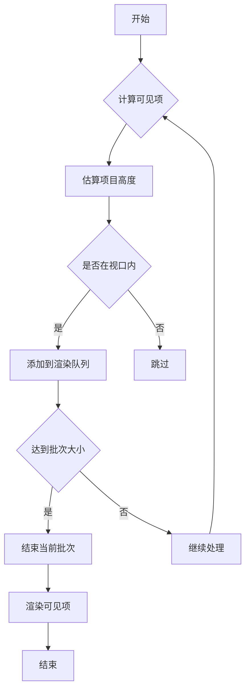
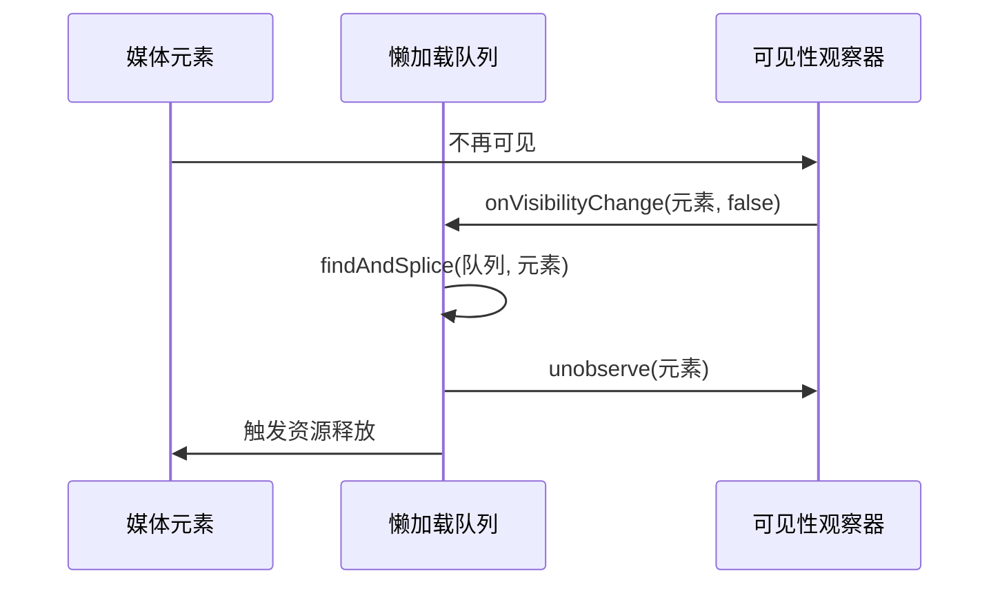
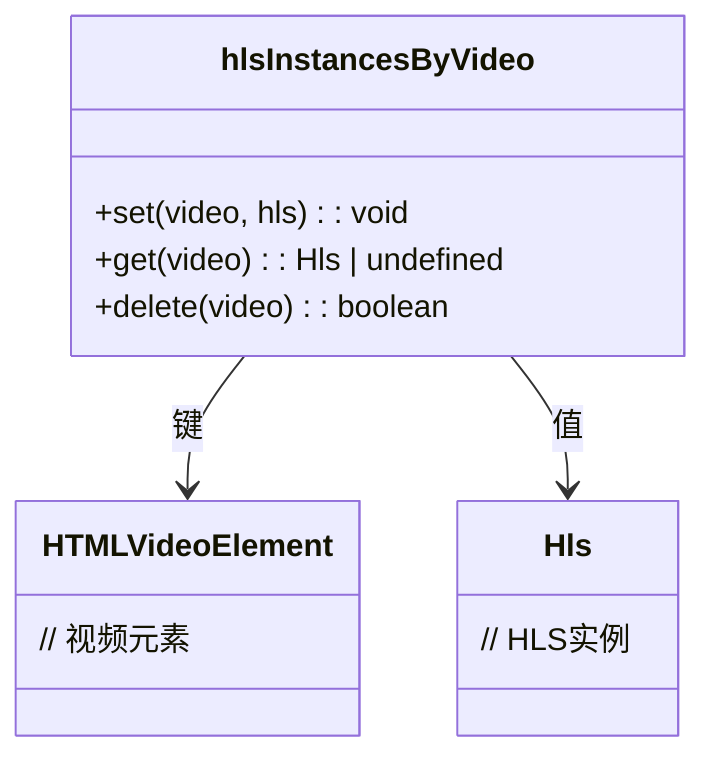
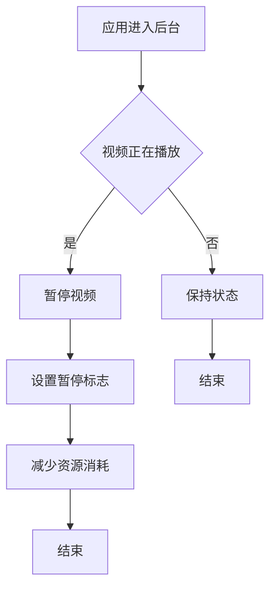
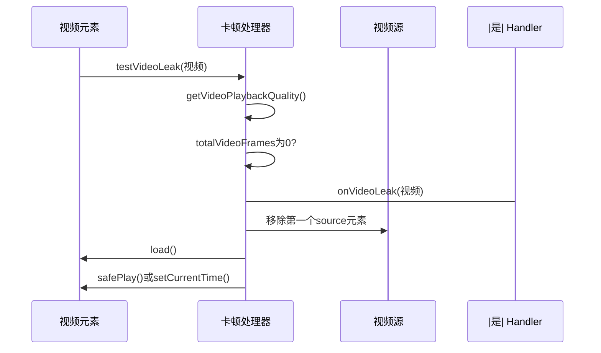
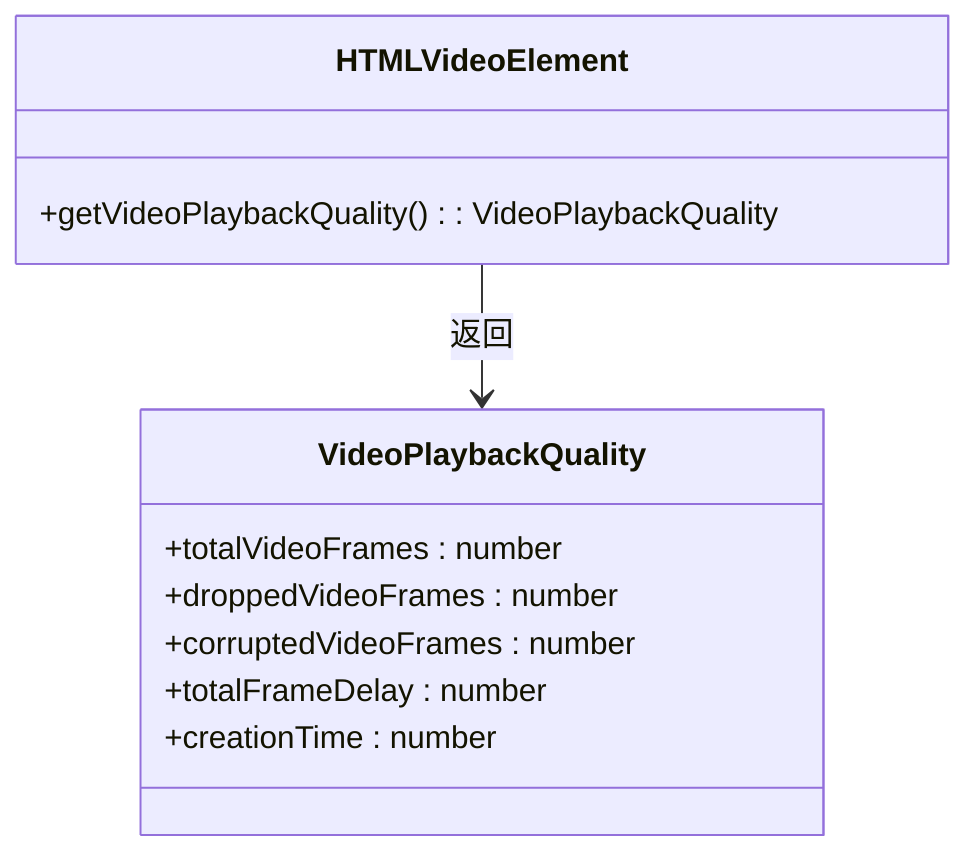
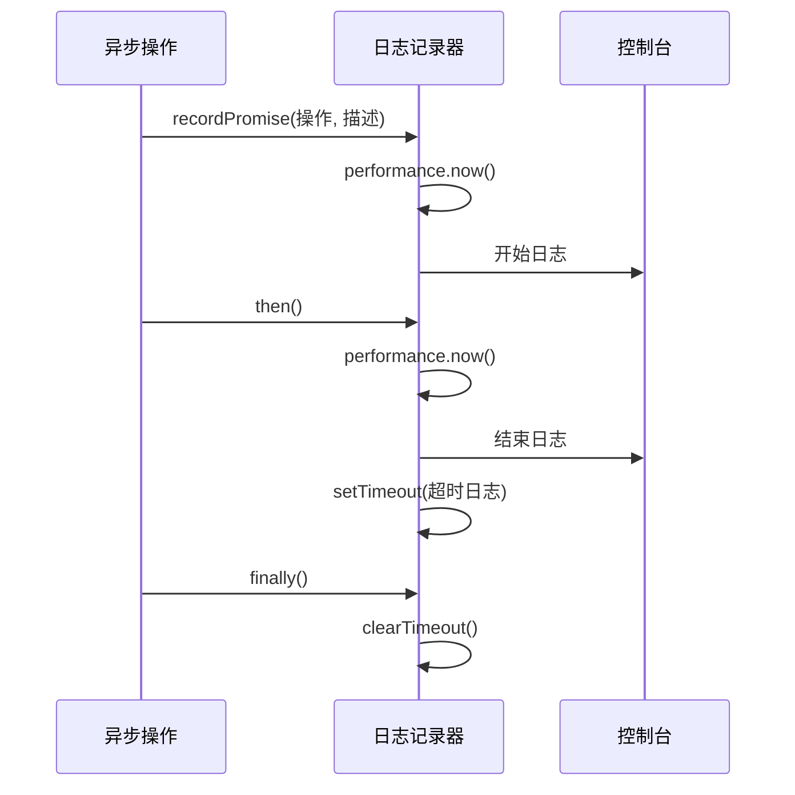

# 性能优化策略

<cite>
**本文档中引用的文件**  
- [initVideoHls.ts](file://src/lib/hls/initVideoHls.ts)
- [snapQualityHeight.ts](file://src/lib/hls/snapQualityHeight.ts)
- [qualityLevelsSwitchButton.tsx](file://src/lib/mediaPlayer/qualityLevelsSwitchButton.tsx)
- [lazyLoadQueue.ts](file://src/components/lazyLoadQueue.ts)
- [dynamicVirtualList/index.tsx](file://src/components/dynamicVirtualList/index.tsx)
- [hlsInstancesByVideo.ts](file://src/lib/hls/hlsInstancesByVideo.ts)
- [lazyLoadQueueBase.ts](file://src/components/lazyLoadQueueBase.ts)
- [visibilityIntersector.ts](file://src/components/visibilityIntersector.ts)
- [lazyLoadQueueIntersector.ts](file://src/components/lazyLoadQueueIntersector.ts)
- [handleVideoLeak.ts](file://src/helpers/dom/handleVideoLeak.ts)
</cite>

## 目录
1. [引言](#引言)
2. [基于HLS的流媒体播放实现](#基于hls的流媒体播放实现)
3. [预加载策略与缓冲区管理](#预加载策略与缓冲区管理)
4. [懒加载队列与动态虚拟列表](#懒加载队列与动态虚拟列表)
5. [内存管理技术](#内存管理技术)
6. [电池消耗优化措施](#电池消耗优化措施)
7. [性能监控工具与指标](#性能监控工具与指标)
8. [结论](#结论)

## 引言

本文档详细描述了媒体播放性能优化的策略，重点关注基于HLS的流媒体播放实现。文档涵盖了网络带宽自适应、预加载策略、缓冲区管理、懒加载队列、动态虚拟列表、内存管理和电池消耗优化等多个方面。通过分析代码库中的关键组件和实现机制，为开发者提供全面的性能优化指导。

## 基于HLS的流媒体播放实现

系统实现了基于HLS（HTTP Live Streaming）的流媒体播放，通过`initVideoHls`函数初始化视频播放。该函数使用`hls.js`库创建HLS实例，并根据网络条件动态调整视频质量。

**Diagram sources**
- [initVideoHls.ts](file://src/lib/hls/initVideoHls.ts#L13-L41)

**Section sources**
- [initVideoHls.ts](file://src/lib/hls/initVideoHls.ts#L13-L41)

### 动态质量选择机制

系统根据网络带宽动态选择视频质量，通过`snapQualityHeight`函数将视频高度映射到标准分辨率（480p、720p、1080p）。`qualityLevelsSwitchButton`组件提供了手动选择视频质量的界面。

**Diagram sources**
- [snapQualityHeight.ts](file://src/lib/hls/snapQualityHeight.ts#L3-L13)
- [qualityLevelsSwitchButton.tsx](file://src/lib/mediaPlayer/qualityLevelsSwitchButton.tsx#L124-L185)

**Section sources**
- [snapQualityHeight.ts](file://src/lib/hls/snapQualityHeight.ts#L3-L13)
- [qualityLevelsSwitchButton.tsx](file://src/lib/mediaPlayer/qualityLevelsSwitchButton.tsx#L124-L185)

## 预加载策略与缓冲区管理

系统实现了智能的预加载和缓冲区管理策略，以平衡流畅播放和数据消耗。HLS实例配置了合理的缓冲区长度参数，确保播放的连续性。

### 缓冲区配置参数

| 参数 | 值 | 描述 |
|------|-----|------|
| backBufferLength | 30 | 后向缓冲区长度（秒） |
| maxBufferLength | 60 | 最大缓冲区长度（秒） |
| maxMaxBufferLength | 60 | 最大缓冲区长度上限（秒） |
| maxBufferHole | 1 | 最大缓冲区空洞（秒） |

**Section sources**
- [initVideoHls.ts](file://src/lib/hls/initVideoHls.ts#L18-L28)

## 懒加载队列与动态虚拟列表

系统使用懒加载队列和动态虚拟列表优化长聊天记录中的媒体性能。

### 懒加载队列实现

懒加载队列通过`LazyLoadQueue`类实现，继承自`LazyLoadQueueIntersector`，利用`VisibilityIntersector`监控元素可见性。

**Diagram sources**
- [lazyLoadQueue.ts](file://src/components/lazyLoadQueue.ts#L13-L76)
- [lazyLoadQueueIntersector.ts](file://src/components/lazyLoadQueueIntersector.ts#L18-L101)
- [lazyLoadQueueBase.ts](file://src/components/lazyLoadQueueBase.ts#L39-L144)

**Section sources**
- [lazyLoadQueue.ts](file://src/components/lazyLoadQueue.ts#L13-L76)
- [lazyLoadQueueIntersector.ts](file://src/components/lazyLoadQueueIntersector.ts#L18-L101)
- [lazyLoadQueueBase.ts](file://src/components/lazyLoadQueueBase.ts#L39-L144)

### 动态虚拟列表实现

动态虚拟列表通过`DynamicVirtualList`组件实现，使用Solid.js的响应式系统优化长列表渲染性能。

**Diagram sources**
- [dynamicVirtualList/index.tsx](file://src/components/dynamicVirtualList/index.tsx#L1-L388)

**Section sources**
- [dynamicVirtualList/index.tsx](file://src/components/dynamicVirtualList/index.tsx#L1-L388)

## 内存管理技术

系统实现了多种内存管理技术，确保不再可见的媒体元素能够及时释放资源。

### 资源释放机制

当媒体元素不再可见时，系统会自动调用`unobserve`方法停止观察，并从队列中移除，触发资源释放。

**Diagram sources**
- [lazyLoadQueue.ts](file://src/components/lazyLoadQueue.ts#L26-L43)
- [lazyLoadQueueIntersector.ts](file://src/components/lazyLoadQueueIntersector.ts#L88-L99)

**Section sources**
- [lazyLoadQueue.ts](file://src/components/lazyLoadQueue.ts#L26-L43)
- [lazyLoadQueueIntersector.ts](file://src/components/lazyLoadQueueIntersector.ts#L88-L99)

### 视频解码器管理

系统通过`hlsInstancesByVideo`的`WeakMap`结构管理HLS实例，确保视频元素销毁时相关资源能够被垃圾回收。

**Diagram sources**
- [hlsInstancesByVideo.ts](file://src/lib/hls/hlsInstancesByVideo.ts#L3)
- [initVideoHls.ts](file://src/lib/hls/initVideoHls.ts#L31)

**Section sources**
- [hlsInstancesByVideo.ts](file://src/lib/hls/hlsInstancesByVideo.ts#L3)
- [initVideoHls.ts](file://src/lib/hls/initVideoHls.ts#L31)

## 电池消耗优化措施

系统实现了后台播放限制和自动暂停策略，以优化电池消耗。

### 后台播放限制

当应用进入后台时，系统会自动暂停视频播放，减少CPU和GPU的使用。

**Section sources**
- [wrappers/video.ts](file://src/components/wrappers/video.ts#L331-L338)

### 自动暂停策略

系统监控视频播放状态，当检测到播放卡顿时，会自动重新加载视频流。

**Diagram sources**
- [handleVideoLeak.ts](file://src/helpers/dom/handleVideoLeak.ts#L36-L45)

**Section sources**
- [handleVideoLeak.ts](file://src/helpers/dom/handleVideoLeak.ts#L36-L45)

## 性能监控工具与指标

系统提供了性能监控工具，帮助开发者识别和解决播放性能瓶颈。

### 播放质量监控

通过`getVideoPlaybackQuality` API监控视频播放质量，包括总帧数、丢弃帧数等指标。

**Section sources**
- [handleVideoLeak.ts](file://src/helpers/dom/handleVideoLeak.ts#L38)

### 性能日志记录

系统使用`recordPromise`工具记录异步操作的执行时间，帮助识别性能瓶颈。

**Section sources**
- [recordPromise.ts](file://src/helpers/recordPromise.ts#L4-L33)

## 结论

本文档详细描述了媒体播放性能优化的各个方面，包括基于HLS的流媒体播放实现、动态质量选择、预加载策略、缓冲区管理、懒加载队列、动态虚拟列表、内存管理和电池消耗优化。通过这些优化策略，系统能够在保证播放流畅性的同时，有效控制数据消耗和电池使用，为用户提供优质的媒体播放体验。