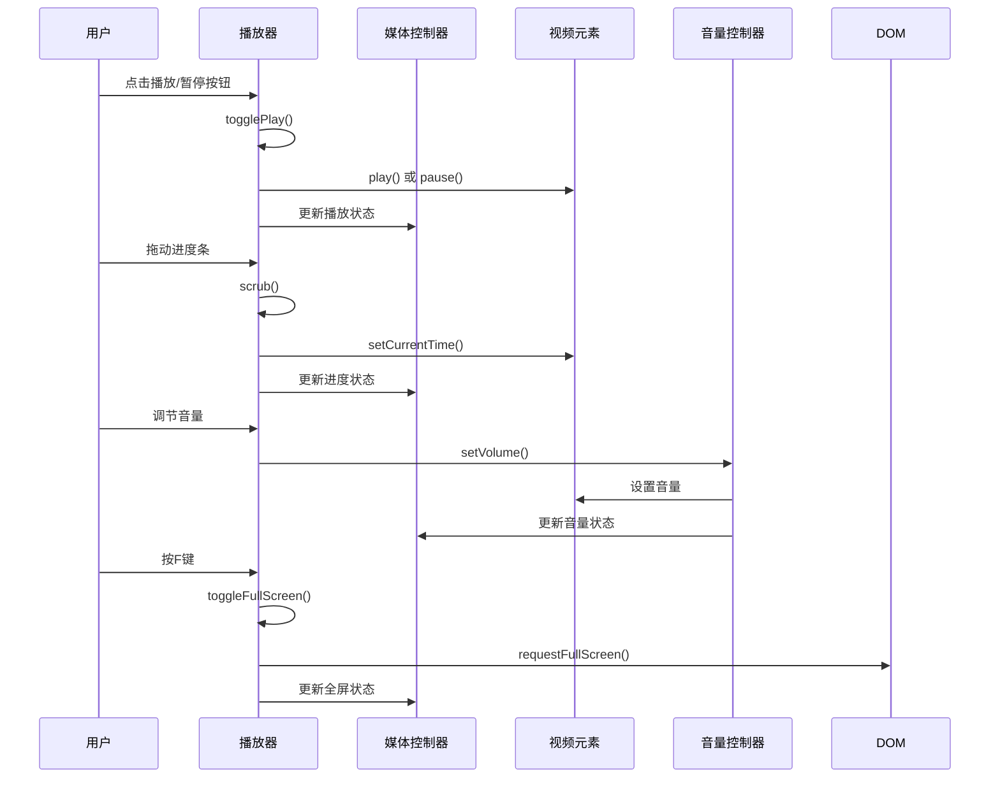
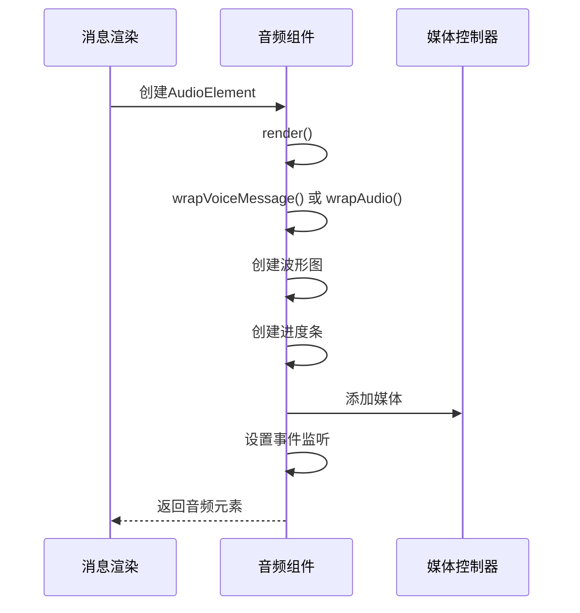
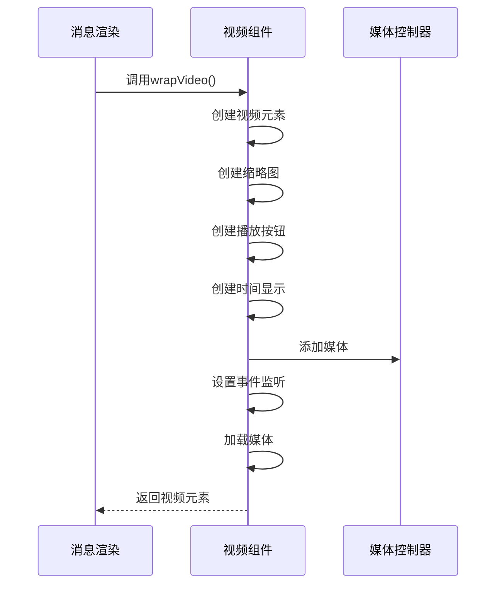
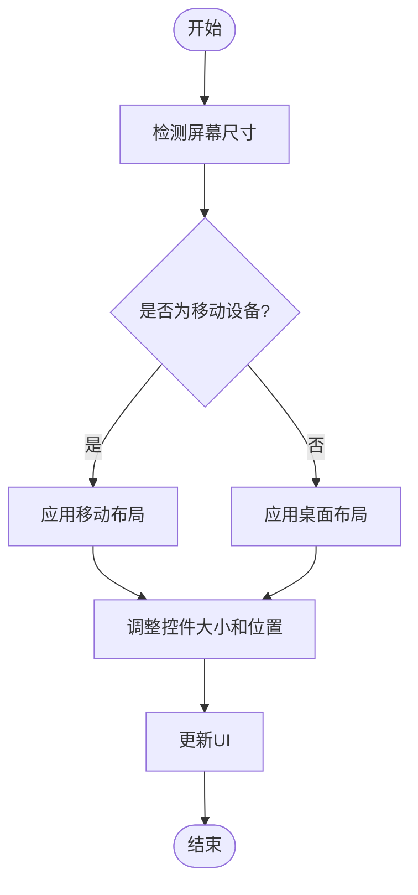
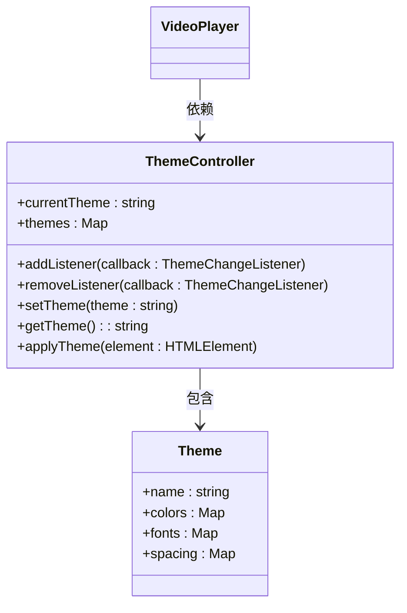
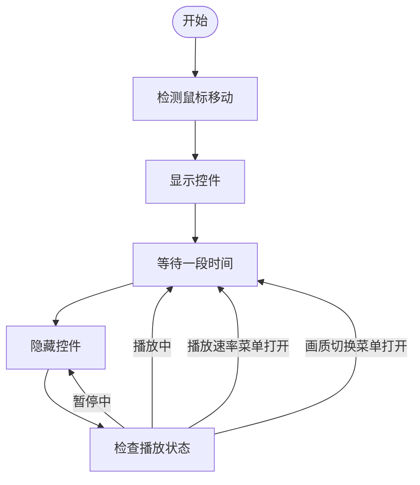
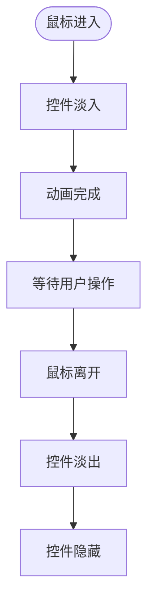
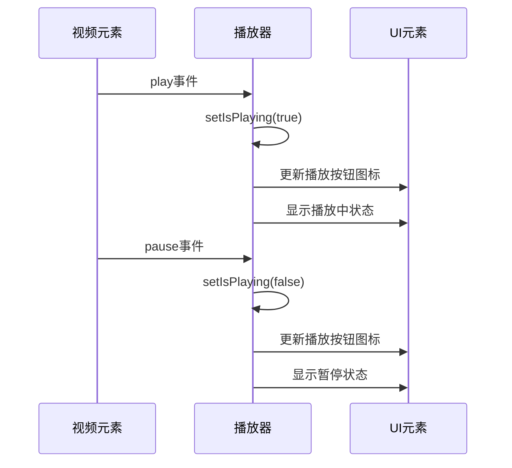
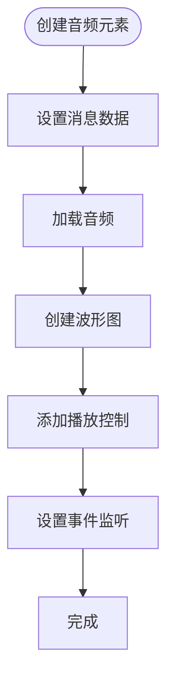
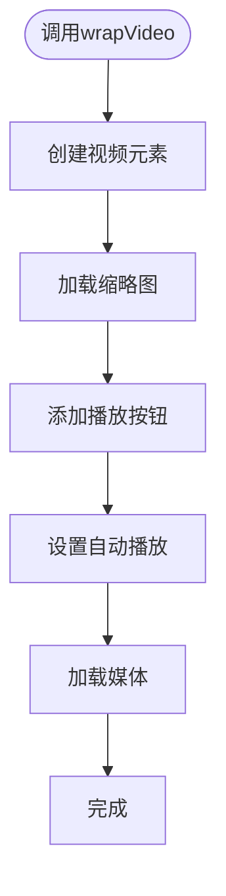

# 播放器UI组件

<cite>
**本文档引用的文件**
- [index.ts](file://src\lib\mediaPlayer\index.ts)
- [audio.ts](file://src\components\audio.ts)
- [playbackRateButton.ts](file://src\components\playbackRateButton.ts)
- [volumeSelector.ts](file://src\components\volumeSelector.ts)
- [mediaProgressLine.ts](file://src\components\mediaProgressLine.ts)
- [video.ts](file://src\components\wrappers\video.ts)
- [rangeSelector.ts](file://src\components\rangeSelector.ts)
</cite>

## 目录
1. [介绍](#介绍)
2. [视觉设计与用户交互](#视觉设计与用户交互)
3. [核心组件分析](#核心组件分析)
4. [播放器组件属性与事件](#播放器组件属性与事件)
5. [与聊天气泡的集成](#与聊天气泡的集成)
6. [响应式设计实现](#响应式设计实现)
7. [可定制化选项](#可定制化选项)
8. [动画与过渡效果](#动画与过渡效果)
9. [使用示例](#使用示例)
10. [结论](#结论)

## 介绍

播放器UI组件是聊天应用中用于播放音频和视频消息的核心组件。该组件提供了一套完整的媒体播放控制功能，包括播放/暂停、进度控制、音量调节、播放速率调节和画质切换等。组件设计考虑了在不同屏幕尺寸下的可用性，并支持与聊天气泡的无缝集成。播放器组件采用模块化设计，由多个子组件构成，包括进度条、音量控制器、播放速率按钮等，这些组件可以独立使用或组合使用。

**Section sources**
- [index.ts](file://src\lib\mediaPlayer\index.ts#L39-L706)
- [audio.ts](file://src\components\audio.ts#L504-L857)

## 视觉设计与用户交互

播放器UI组件的视觉设计遵循现代简洁风格，控件布局合理，易于用户操作。主要控件包括：

- **播放/暂停按钮**：位于播放器左侧，采用标准的播放和暂停图标，点击可切换播放状态
- **进度条**：显示媒体播放进度，支持拖动以快速跳转到指定时间点
- **时间显示**：显示当前播放时间和总时长，格式为"mm:ss"
- **音量控制**：通过滑块调节音量大小，点击可静音
- **播放速率调节**：提供0.5x、1x、1.5x、2x四种播放速率选择
- **画质切换**：在支持的情况下提供不同画质选项
- **画中画(PiP)按钮**：允许视频在小窗口中继续播放
- **全屏按钮**：切换全屏播放模式

用户交互模式包括：
- 点击播放器区域可切换播放/暂停状态
- 在进度条上拖动可快速跳转
- 鼠标悬停在播放器上显示控制条，移开后自动隐藏
- 支持键盘快捷键操作（空格键播放/暂停，F键全屏，M键静音）

**Section sources**
- [index.ts](file://src\lib\mediaPlayer\index.ts#L253-L577)
- [audio.ts](file://src\components\audio.ts#L545-L551)

## 核心组件分析

### 播放器核心类

播放器的核心实现位于`VideoPlayer`类中，该类继承自`ControlsHover`，提供了完整的媒体播放控制功能。

```mermaid
classDiagram
class VideoPlayer {
+video : HTMLVideoElement
+wrapper : HTMLElement
+progress : MediaProgressLine
+skin : 'default'
+live : boolean
+listenerSetter : ListenerSetter
+playbackRateButton : ReturnType<typeof createPlaybackRateButton>
+qualityLevelsButton : ReturnType<typeof createQualityLevelsSwitchButton>
+pipButton : HTMLElement
+toggles : HTMLElement[]
+mainToggle : HTMLElement
+controls : HTMLElement
+gradient : HTMLElement
+liveEl : HTMLElement
-onPlaybackRateMenuToggle : (open : boolean) => void
-onPip : (pip : boolean) => void
-onVolumeChange : VolumeSelector['onVolumeChange']
-onFullScreen : (active : boolean) => void
-canPause : boolean
-canSeek : boolean
-_inPip : boolean
-_width : number
-_height : number
-emptyPipVideo : HTMLVideoElement
-debouncedPip : (pip : boolean) => void
-debouncePipTime : number
-listenKeyboardEvents : 'always' | 'fullscreen'
-hadContainer : boolean
-useGlobalVolume : VolumeSelector['useGlobalVolume']
+volumeSelector : VolumeSelector
+isPlaying : boolean
+shouldEnableSoundOnClick : () => boolean
+constructor(options : VideoPlayerOptions)
+get width() : number
+get height() : number
-setIsPlaying(isPlaying : boolean)
-stylePlayer(initDuration : number)
-createQualityLevelsButton()
+loadQualityLevels()
-checkInteraction()
-_onPip(pip : boolean)
-onEnterPictureInPictureLeave(e : Event)
-onEnterPictureInPicture(e : Event)
-onLeavePictureInPicture()
-addPipListeners(video : HTMLVideoElement)
+requestPictureInPicture()
-togglePlay(isPaused : boolean)
-buildControls()
+cancelFullScreen()
-toggleFullScreen()
-toggleActivity(active : boolean)
+isFullScreen()
-_onFullScreen(fullScreenButton : HTMLElement, noEvent? : boolean)
+dimBackground()
+setTimestamp(timestamp : number)
+cleanup()
+unmount()
+setupLiveMenu(buttons : ButtonMenuItemOptionsVerifiable[])
+updateLiveViewersCount(count : number)
+get inPip() : boolean
}
class ControlsHover {
+element : HTMLElement
+listenerSetter : ListenerSetter
+canHideControls : () => boolean
+canShowControls : () => boolean
+showOnLeaveToClassName : string
+ignoreClickClassName : string
+setup(options : ControlsHoverOptions)
+hideControls(force? : boolean)
+showControls(force? : boolean)
+cleanup()
}
VideoPlayer --|> ControlsHover : 继承
VideoPlayer --> MediaProgressLine : 使用
VideoPlayer --> VolumeSelector : 使用
VideoPlayer --> "createPlaybackRateButton" : 使用
VideoPlayer --> "createQualityLevelsSwitchButton" : 使用
```

**Diagram sources**
- [index.ts](file://src\lib\mediaPlayer\index.ts#L39-L706)

### 进度条组件

进度条组件`MediaProgressLine`负责显示媒体播放进度和加载进度，支持时间戳跳转功能。

```mermaid
classDiagram
class MediaProgressLine {
+filledContainer : HTMLDivElement
+filledLoad : HTMLDivElement
+currentTimeInfoElement : HTMLDivElement
+currentTimeElement : HTMLDivElement
+currentSegmentElement : HTMLDivElement
+progressRAF : number
+media : HTMLMediaElement
+streamable : boolean
+static svgClipPathIdSeed : number
+usedClipPathId : number
+clipPathSvg : SVGSVGElement
+segments : VideoTimestampSegment[]
+constructor(options : MediaProgressLineOptions)
+setMedia(mediaOptions : MediaOptions)
+removeClipPathFromDOM()
+onLoadedData()
+onEnded()
+onPlay()
+onTimeUpdate()
+onProgress(e : Event)
+scrub(e : GrabEvent)
+snapScrubValue(value : number)
+setLoadProgress()
+setSeekMax(duration? : number)
+setProgress()
+setListeners()
+removeListeners()
+cleanup()
}
class RangeSelector {
+container : HTMLDivElement
+filled : HTMLDivElement
+seek : HTMLInputElement
+mousedown : boolean
+rect : DOMRect
+_removeListeners : () => void
+events : Partial<Events>
+decimals : number
+step : number
+min : number
+max : number
+withTransition : boolean
+useTransform : boolean
+useProperty : boolean
+vertical : boolean
+offsetAxisValue : number
+constructor(options : RangeSelectorOptions, value : number)
+setMinMax(min? : number, max? : number)
+get value() : number
+setHandlers(events : Events)
+setListeners()
+onInput()
+setProgress(value : number)
+addProgress(value : number)
+setFilled(value : number)
+scrub(event : GrabEvent, snapValue? : (value : number) => void)
+removeListeners()
}
MediaProgressLine --|> RangeSelector : 继承
MediaProgressLine --> "VideoTimestamp" : 使用
```

**Diagram sources**
- [mediaProgressLine.ts](file://src\components\mediaProgressLine.ts#L26-L457)
- [rangeSelector.ts](file://src\components\rangeSelector.ts#L12-L202)

### 音量控制组件

音量控制组件`VolumeSelector`提供了音量调节和静音功能，支持全局音量控制。

```mermaid
classDiagram
class VolumeSelector {
+static ICONS : Icon[]
+btn : HTMLElement
+icon : HTMLSpanElement
+listenerSetter : ListenerSetter
+vertical : boolean
+media : HTMLMediaElement
+useGlobalVolume : 'auto' | 'no-init'
+onVolumeChange : (type : 'global' | 'click') => void
+ignoreGlobalEvents : boolean
+constructor(options : VolumeSelectorOptions)
+removeListeners()
-modifyGlobal(callback : () => void)
-onMuteClick(e? : Event)
+setVolume(options : SetVolumeOptions)
+setGlobalVolume(eventType? : string)
}
class RangeSelector {
+container : HTMLDivElement
+filled : HTMLDivElement
+seek : HTMLInputElement
+mousedown : boolean
+rect : DOMRect
+_removeListeners : () => void
+events : Partial<Events>
+decimals : number
+step : number
+min : number
+max : number
+withTransition : boolean
+useTransform : boolean
+useProperty : boolean
+vertical : boolean
+offsetAxisValue : number
+constructor(options : RangeSelectorOptions, value : number)
+setMinMax(min? : number, max? : number)
+get value() : number
+setHandlers(events : Events)
+setListeners()
+onInput()
+setProgress(value : number)
+addProgress(value : number)
+setFilled(value : number)
+scrub(event : GrabEvent, snapValue? : (value : number) => void)
+removeListeners()
}
VolumeSelector --|> RangeSelector : 继承
VolumeSelector --> "appMediaPlaybackController" : 使用
```

**Diagram sources**
- [volumeSelector.ts](file://src\components\volumeSelector.ts#L19-L160)
- [rangeSelector.ts](file://src\components\rangeSelector.ts#L12-L202)

### 播放速率按钮组件

播放速率按钮组件提供了播放速率调节功能，支持四种预设速率。

```mermaid
classDiagram
class PlaybackRateButton {
+PLAYBACK_RATES : number[]
+PLAYBACK_RATES_ICONS : Icon[]
+button : HTMLElement
+setIcon()
+setBtnMenuToggle()
+addRate(add : number)
+isMenuOpen()
+element : HTMLElement
+setIcon : () => void
+addRate : (add : number) => void
+isMenuOpen : () => boolean
}
PlaybackRateButton --> "appMediaPlaybackController" : 使用
PlaybackRateButton --> "ButtonIcon" : 使用
PlaybackRateButton --> "ButtonMenuSync" : 使用
PlaybackRateButton --> "ButtonMenuToggleHandler" : 使用
```

**Diagram sources**
- [playbackRateButton.ts](file://src\components\playbackRateButton.ts#L8-L73)

## 播放器组件属性与事件

### 主要属性

播放器组件支持以下主要属性：

| 属性 | 类型 | 描述 |
|------|------|------|
| video | HTMLVideoElement | 视频元素 |
| container | HTMLElement | 容器元素 |
| play | boolean | 是否自动播放 |
| streamable | boolean | 是否支持流媒体 |
| duration | number | 媒体时长 |
| live | boolean | 是否为直播 |
| width | number | 播放器宽度 |
| height | number | 播放器高度 |
| videoTimestamps | VideoTimestamp[] | 视频时间戳 |
| onPlaybackRateMenuToggle | (open: boolean) => void | 播放速率菜单切换回调 |
| onPip | (pip: boolean) => void | 画中画状态变化回调 |
| onPipClose | () => void | 画中画关闭回调 |
| listenKeyboardEvents | 'always' \| 'fullscreen' | 键盘事件监听模式 |
| useGlobalVolume | VolumeSelector['useGlobalVolume'] | 是否使用全局音量 |
| onVolumeChange | VolumeSelector['onVolumeChange'] | 音量变化回调 |
| onFullScreen | (active: boolean) => void | 全屏状态变化回调 |
| onFullScreenToPip | () => void | 全屏转画中画回调 |
| shouldEnableSoundOnClick | () => boolean | 点击时是否启用声音 |

### 事件处理

播放器组件处理以下主要事件：

- **播放/暂停**：通过`togglePlay`方法实现，支持键盘空格键触发
- **进度控制**：通过`scrub`方法实现，支持鼠标拖动和点击
- **音量控制**：通过`setVolume`方法实现，支持滑块拖动和点击静音
- **播放速率调节**：通过`addRate`方法实现，支持快捷键Alt+加/减号
- **全屏切换**：通过`toggleFullScreen`方法实现，支持F键快捷方式
- **画中画**：通过`requestPictureInPicture`方法实现



**Diagram sources**
- [index.ts](file://src\lib\mediaPlayer\index.ts#L91-L129)
- [index.ts](file://src\lib\mediaPlayer\index.ts#L548-L550)

## 与聊天气泡的集成

播放器组件与聊天气泡的集成主要通过`AudioElement`和`wrapVideo`函数实现。音频消息和视频消息在聊天气泡中的显示方式有所不同，但都遵循相似的集成模式。

### 音频消息集成

音频消息在聊天气泡中的集成流程：



**Diagram sources**
- [audio.ts](file://src\components\audio.ts#L527-L857)

### 视频消息集成

视频消息在聊天气泡中的集成流程：



**Diagram sources**
- [video.ts](file://src\components\wrappers\video.ts#L85-L937)

## 响应式设计实现

播放器组件的响应式设计通过以下方式实现：

1. **CSS媒体查询**：根据屏幕尺寸调整控件布局和大小
2. **JavaScript屏幕尺寸检测**：动态调整组件行为
3. **自适应布局**：控件根据容器大小自动调整

### 屏幕尺寸检测



**Diagram sources**
- [video.ts](file://src\components\wrappers\video.ts#L58-L79)

### 自适应控件

播放器控件根据屏幕尺寸自动调整：

- **移动设备**：控件更大，便于触摸操作
- **桌面设备**：控件更紧凑，节省空间
- **小屏幕**：隐藏次要控件，只显示基本功能
- **大屏幕**：显示所有控件，提供完整功能

## 可定制化选项

播放器组件提供了丰富的可定制化选项，包括主题适配、控件隐藏策略和无障碍访问支持。

### 主题适配

播放器支持主题适配，可以根据应用主题动态调整外观：



**Diagram sources**
- [index.ts](file://src\lib\mediaPlayer\index.ts#L39-L706)

### 控件隐藏策略

播放器采用智能控件隐藏策略，提高用户体验：



**Diagram sources**
- [index.ts](file://src\lib\mediaPlayer\index.ts#L161-L173)

### 无障碍访问支持

播放器组件支持无障碍访问，包括：

- 键盘导航
- 屏幕阅读器支持
- 高对比度模式
- 字体大小调整

## 动画与过渡效果

播放器组件实现了多种动画和过渡效果，提升用户体验。

### 控件显示动画



**Diagram sources**
- [index.ts](file://src\lib\mediaPlayer\index.ts#L161-L173)

### 播放状态同步

播放状态与UI元素的同步通过事件监听实现：



**Diagram sources**
- [index.ts](file://src\lib\mediaPlayer\index.ts#L442-L450)

## 使用示例

### 音频消息嵌入



**Diagram sources**
- [audio.ts](file://src\components\audio.ts#L527-L857)

### 视频消息嵌入



**Diagram sources**
- [video.ts](file://src\components\wrappers\video.ts#L85-L937)

## 结论

播放器UI组件是一个功能完整、设计精良的媒体播放解决方案。组件采用模块化设计，各功能组件职责清晰，易于维护和扩展。通过合理的事件处理机制和状态管理，确保了播放状态与UI的同步。响应式设计和可定制化选项使组件能够适应不同的应用场景和用户需求。与聊天气泡的无缝集成使得音频和视频消息在聊天界面中能够自然地呈现，提升了整体用户体验。

**Section sources**
- [index.ts](file://src\lib\mediaPlayer\index.ts#L39-L706)
- [audio.ts](file://src\components\audio.ts#L504-L857)
- [video.ts](file://src\components\wrappers\video.ts#L85-L937)