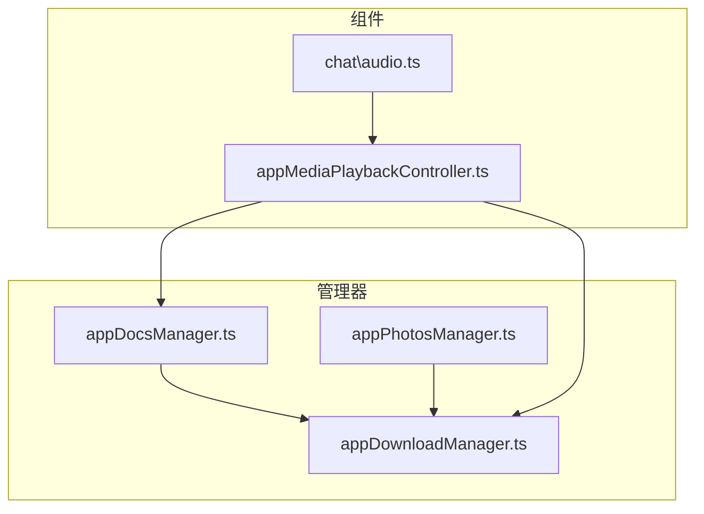
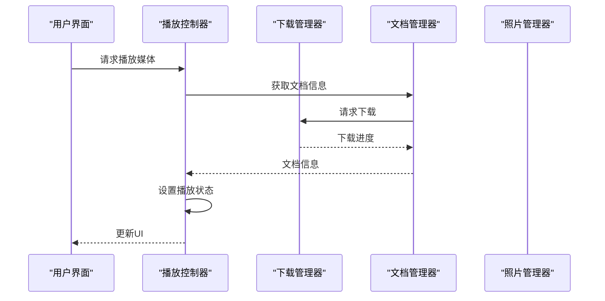
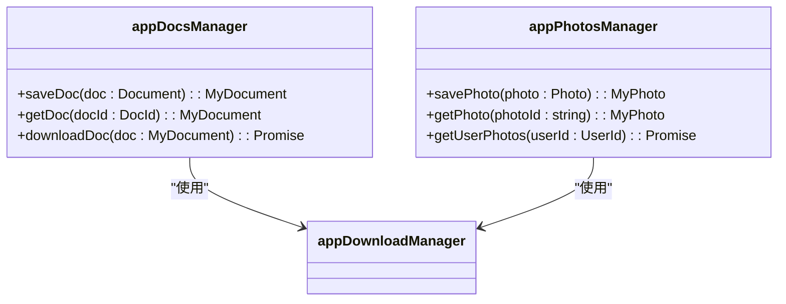
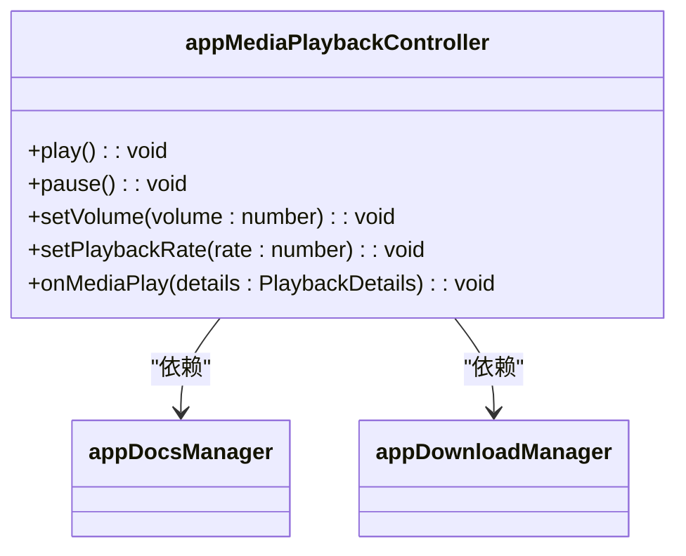
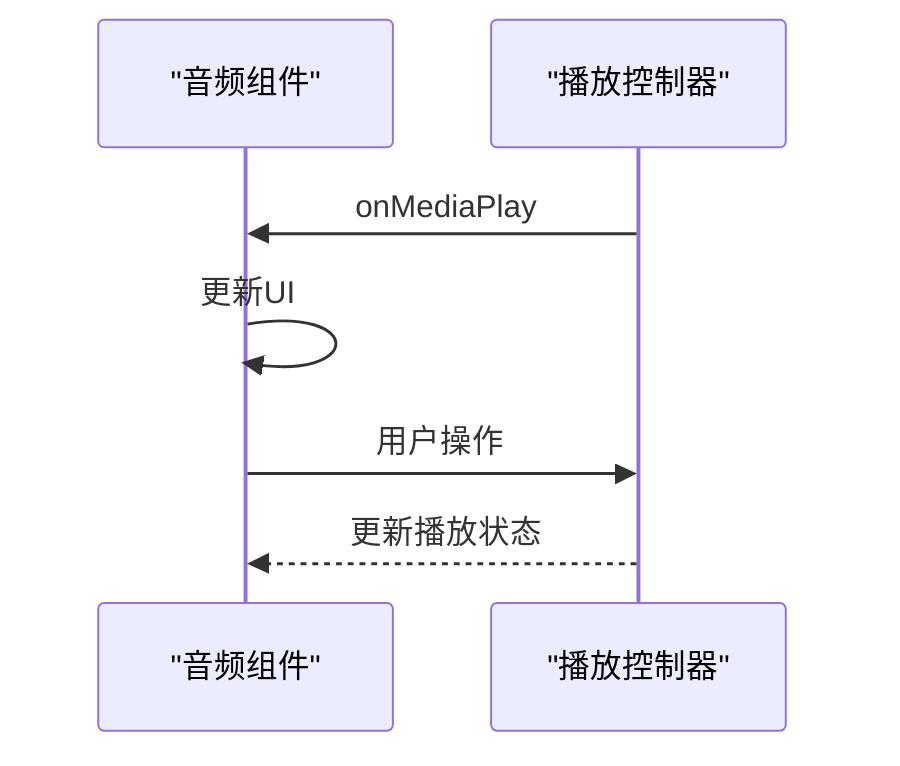
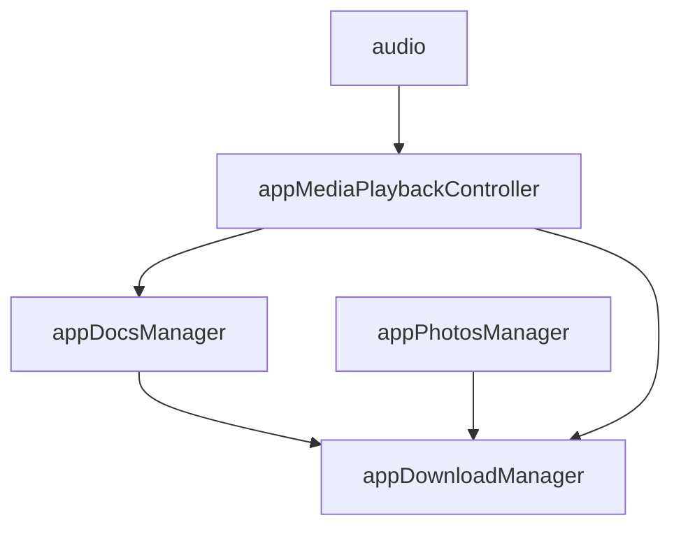

# 播放状态管理

<cite>
**本文档引用的文件**
- [appDocsManager.ts](file://src\lib\appManagers\appDocsManager.ts)
- [appPhotosManager.ts](file://src\lib\appManagers\appPhotosManager.ts)
- [appDownloadManager.ts](file://src\lib\appManagers\appDownloadManager.ts)
- [appMediaPlaybackController.ts](file://src\components\appMediaPlaybackController.ts)
- [audio.ts](file://src\components\chat\audio.ts)
</cite>

## 目录
1. [介绍](#介绍)
2. [项目结构](#项目结构)
3. [核心组件](#核心组件)
4. [架构概述](#架构概述)
5. [详细组件分析](#详细组件分析)
6. [依赖分析](#依赖分析)
7. [性能考虑](#性能考虑)
8. [故障排除指南](#故障排除指南)
9. [结论](#结论)

## 介绍
本文档详细描述了播放状态管理机制，重点介绍 `appDocsManager` 和 `appPhotosManager` 如何跟踪媒体文件的下载状态（未开始、下载中、已完成、失败）和本地缓存位置。文档还解释了播放器组件如何订阅这些状态变化并相应更新UI，以及播放进度、播放位置、播放速率等状态的持久化机制。此外，文档涵盖了多实例播放时的状态隔离策略、错误状态处理流程以及状态管理的最佳实践。

## 项目结构
项目结构清晰地组织了各个组件和管理器，确保代码的可维护性和可扩展性。核心的播放状态管理相关文件位于 `src/lib/appManagers` 和 `src/components` 目录下。

**图表来源**
- [appDocsManager.ts](file://src\lib\appManagers\appDocsManager.ts)
- [appPhotosManager.ts](file://src\lib\appManagers\appPhotosManager.ts)
- [appDownloadManager.ts](file://src\lib\appManagers\appDownloadManager.ts)
- [appMediaPlaybackController.ts](file://src\components\appMediaPlaybackController.ts)
- [audio.ts](file://src\components\chat\audio.ts)

**章节来源**
- [appDocsManager.ts](file://src\lib\appManagers\appDocsManager.ts)
- [appPhotosManager.ts](file://src\lib\appManagers\appPhotosManager.ts)
- [appDownloadManager.ts](file://src\lib\appManagers\appDownloadManager.ts)
- [appMediaPlaybackController.ts](file://src\components\appMediaPlaybackController.ts)
- [audio.ts](file://src\components\chat\audio.ts)

## 核心组件
核心组件包括 `appDocsManager`、`appPhotosManager`、`appDownloadManager` 和 `appMediaPlaybackController`。这些组件协同工作，确保媒体文件的下载和播放状态得到有效管理。

**章节来源**
- [appDocsManager.ts](file://src\lib\appManagers\appDocsManager.ts)
- [appPhotosManager.ts](file://src\lib\appManagers\appPhotosManager.ts)
- [appDownloadManager.ts](file://src\lib\appManagers\appDownloadManager.ts)
- [appMediaPlaybackController.ts](file://src\components\appMediaPlaybackController.ts)

## 架构概述
系统架构通过事件驱动的方式管理媒体文件的下载和播放状态。`appDownloadManager` 负责下载文件并通知下载进度，`appDocsManager` 和 `appPhotosManager` 跟踪文件的下载状态和缓存位置，`appMediaPlaybackController` 管理播放状态并更新UI。

**图表来源**
- [appDocsManager.ts](file://src\lib\appManagers\appDocsManager.ts)
- [appPhotosManager.ts](file://src\lib\appManagers\appPhotosManager.ts)
- [appDownloadManager.ts](file://src\lib\appManagers\appDownloadManager.ts)
- [appMediaPlaybackController.ts](file://src\components\appMediaPlaybackController.ts)

## 详细组件分析
### appDocsManager 和 appPhotosManager 分析
`appDocsManager` 和 `appPhotosManager` 负责管理文档和照片的元数据和下载状态。它们通过 `appDownloadManager` 下载文件，并在下载完成后更新本地缓存。

**图表来源**
- [appDocsManager.ts](file://src\lib\appManagers\appDocsManager.ts)
- [appPhotosManager.ts](file://src\lib\appManagers\appPhotosManager.ts)
- [appDownloadManager.ts](file://src\lib\appManagers\appDownloadManager.ts)

**章节来源**
- [appDocsManager.ts](file://src\lib\appManagers\appDocsManager.ts)
- [appPhotosManager.ts](file://src\lib\appManagers\appPhotosManager.ts)

### appMediaPlaybackController 分析
`appMediaPlaybackController` 管理媒体播放状态，包括播放、暂停、音量控制等。它通过订阅 `appDocsManager` 和 `appDownloadManager` 的事件来更新播放状态。

**图表来源**
- [appMediaPlaybackController.ts](file://src\components\appMediaPlaybackController.ts)
- [appDocsManager.ts](file://src\lib\appManagers\appDocsManager.ts)
- [appDownloadManager.ts](file://src\lib\appManagers\appDownloadManager.ts)

**章节来源**
- [appMediaPlaybackController.ts](file://src\components\appMediaPlaybackController.ts)

### 播放器组件分析
播放器组件如 `audio.ts` 订阅 `appMediaPlaybackController` 的事件，以更新UI并响应用户操作。

**图表来源**
- [audio.ts](file://src\components\chat\audio.ts)
- [appMediaPlaybackController.ts](file://src\components\appMediaPlaybackController.ts)

**章节来源**
- [audio.ts](file://src\components\chat\audio.ts)

## 依赖分析
各组件之间的依赖关系清晰，确保了系统的模块化和可维护性。

**图表来源**
- [appDocsManager.ts](file://src\lib\appManagers\appDocsManager.ts)
- [appPhotosManager.ts](file://src\lib\appManagers\appPhotosManager.ts)
- [appDownloadManager.ts](file://src\lib\appManagers\appDownloadManager.ts)
- [appMediaPlaybackController.ts](file://src\components\appMediaPlaybackController.ts)
- [audio.ts](file://src\components\chat\audio.ts)

**章节来源**
- [appDocsManager.ts](file://src\lib\appManagers\appDocsManager.ts)
- [appPhotosManager.ts](file://src\lib\appManagers\appPhotosManager.ts)
- [appDownloadManager.ts](file://src\lib\appManagers\appDownloadManager.ts)
- [appMediaPlaybackController.ts](file://src\components\appMediaPlaybackController.ts)
- [audio.ts](file://src\components\chat\audio.ts)

## 性能考虑
为了优化性能，系统采用了事件驱动的架构，减少了不必要的状态更新。此外，通过合理管理内存和使用缓存，确保了系统的高效运行。

## 故障排除指南
### 下载失败
- 检查网络连接。
- 确认文件URL是否正确。
- 查看 `appDownloadManager` 的日志以获取更多信息。

### 播放问题
- 确认媒体文件已完全下载。
- 检查浏览器的媒体播放支持。
- 查看 `appMediaPlaybackController` 的日志以获取更多信息。

**章节来源**
- [appDownloadManager.ts](file://src\lib\appManagers\appDownloadManager.ts)
- [appMediaPlaybackController.ts](file://src\components\appMediaPlaybackController.ts)

## 结论
本文档详细描述了播放状态管理机制，涵盖了从文件下载到播放状态管理的各个方面。通过合理的架构设计和组件协作，确保了系统的稳定性和高效性。