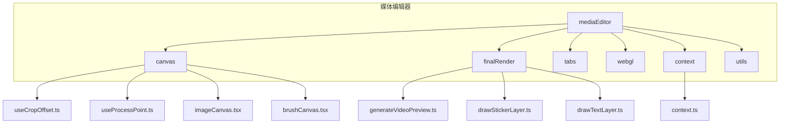
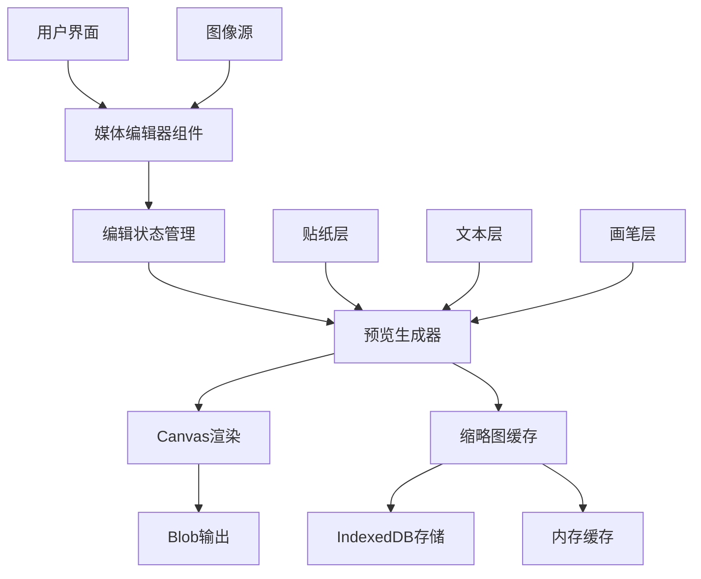
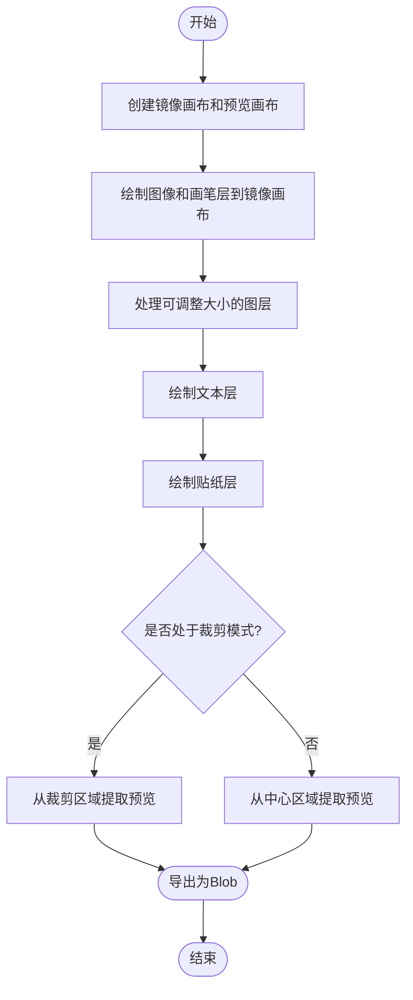
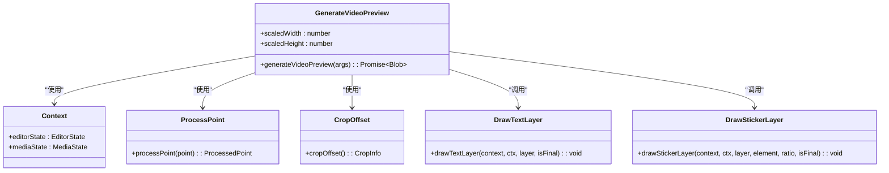
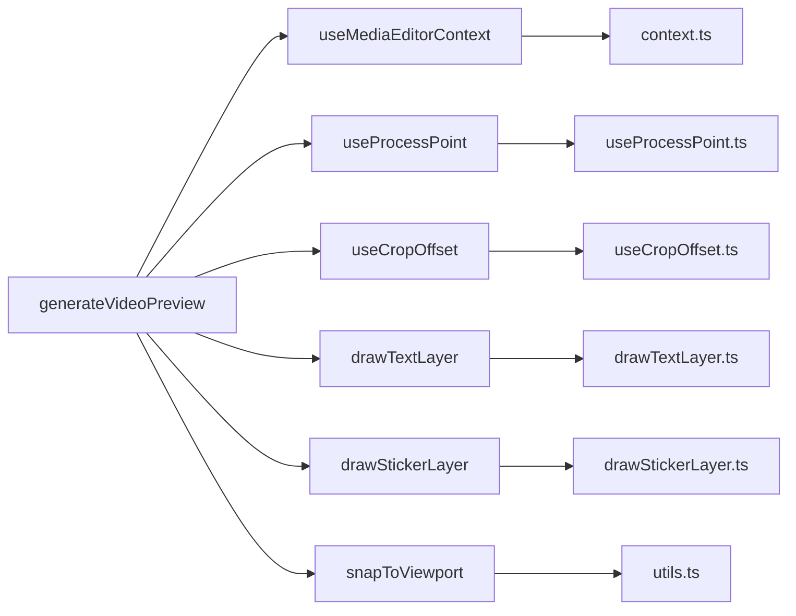

# 媒体预览生成

<cite>
**本文档引用的文件**  
- [generateVideoPreview.ts](file://src/components/mediaEditor/finalRender/generateVideoPreview.ts)
- [useCropOffset.ts](file://src/components/mediaEditor/canvas/useCropOffset.ts)
- [useProcessPoint.ts](file://src/components/mediaEditor/canvas/useProcessPoint.ts)
- [context.ts](file://src/components/mediaEditor/context.ts)
- [drawStickerLayer.ts](file://src/components/mediaEditor/finalRender/drawStickerLayer.ts)
- [drawTextLayer.ts](file://src/components/mediaEditor/finalRender/drawTextLayer.ts)
- [utils.ts](file://src/components/mediaEditor/utils.ts)
- [mediaEditor.tsx](file://src/components/mediaEditor/mediaEditor.tsx)
- [imageCanvas.tsx](file://src/components/mediaEditor/canvas/imageCanvas.tsx)
- [brushCanvas.tsx](file://src/components/mediaEditor/canvas/brushCanvas.tsx)
</cite>

## 目录
1. [简介](#简介)
2. [项目结构](#项目结构)
3. [核心组件](#核心组件)
4. [架构概述](#架构概述)
5. [详细组件分析](#详细组件分析)
6. [依赖分析](#依赖分析)
7. [性能考虑](#性能考虑)
8. [故障排除指南](#故障排除指南)
9. [结论](#结论)

## 简介
本文档详细描述了媒体预览生成系统的实现机制，重点分析视频预览图的生成流程。系统通过前端Canvas技术从视频中提取关键帧并生成缩略图，支持多种编辑图层的叠加渲染，包括文本、贴纸和画笔标记。文档涵盖预览生成算法、存储机制、错误处理和性能优化策略，为开发者提供完整的系统理解。

## 项目结构
媒体预览生成功能位于`src/components/mediaEditor`目录下，采用模块化设计，各功能分离清晰。核心预览生成逻辑位于`finalRender`子目录中，与画布操作、上下文管理和工具函数分离。

**图示来源**  
- [generateVideoPreview.ts](file://src/components/mediaEditor/finalRender/generateVideoPreview.ts)
- [context.ts](file://src/components/mediaEditor/context.ts)
- [useCropOffset.ts](file://src/components/mediaEditor/canvas/useCropOffset.ts)

**本节来源**  
- [src/components/mediaEditor](file://src/components/mediaEditor)

## 核心组件
视频预览生成系统的核心是`generateVideoPreview`函数，它负责将编辑状态渲染为静态预览图。该函数整合了图像画布、画笔层、文本层和贴纸层的内容，根据当前编辑状态（如裁剪模式）生成最终的缩略图。

系统采用多层画布合成技术，先在内存中创建镜像画布合并所有图层，再根据目标尺寸提取预览区域。预览图以Blob形式返回，可用于后续的显示或上传。

**本节来源**  
- [generateVideoPreview.ts](file://src/components/mediaEditor/finalRender/generateVideoPreview.ts#L15-L97)
- [mediaEditor.tsx](file://src/components/mediaEditor/mediaEditor.tsx)

## 架构概述
系统采用分层架构，将UI组件、状态管理和渲染逻辑分离。媒体编辑器通过SolidJS的状态系统管理编辑状态，预览生成器作为纯函数接收状态并生成输出。

**图示来源**  
- [generateVideoPreview.ts](file://src/components/mediaEditor/finalRender/generateVideoPreview.ts)
- [context.ts](file://src/components/mediaEditor/context.ts)
- [mediaEditor.tsx](file://src/components/mediaEditor/mediaEditor.tsx)

## 详细组件分析

### 预览生成算法分析
`generateVideoPreview`函数实现了视频预览图的生成算法，其核心流程包括画布初始化、图层合成和区域提取。

#### 算法流程图

**图示来源**  
- [generateVideoPreview.ts](file://src/components/mediaEditor/finalRender/generateVideoPreview.ts#L15-L97)

#### 图层处理逻辑
系统支持多种图层类型，每种类型有专门的绘制函数。文本层和贴纸层在预览生成时被重新渲染到镜像画布上，确保预览图包含所有编辑效果。

**图示来源**  
- [generateVideoPreview.ts](file://src/components/mediaEditor/finalRender/generateVideoPreview.ts)
- [drawTextLayer.ts](file://src/components/mediaEditor/finalRender/drawTextLayer.ts)
- [drawStickerLayer.ts](file://src/components/mediaEditor/finalRender/drawStickerLayer.ts)

**本节来源**  
- [generateVideoPreview.ts](file://src/components/mediaEditor/finalRender/generateVideoPreview.ts#L15-L97)
- [drawTextLayer.ts](file://src/components/mediaEditor/finalRender/drawTextLayer.ts)
- [drawStickerLayer.ts](file://src/components/mediaEditor/finalRender/drawStickerLayer.ts)

### 缩略图尺寸计算
系统通过`snapToViewport`工具函数计算预览图的最佳尺寸，保持目标宽高比的同时适配显示区域。尺寸计算考虑了当前是否处于裁剪模式，分别使用裁剪区域或原始画布尺寸作为基准。

**本节来源**  
- [generateVideoPreview.ts](file://src/components/mediaEditor/finalRender/generateVideoPreview.ts#L34)
- [utils.ts](file://src/components/mediaEditor/utils.ts)

### 质量压缩策略
虽然当前代码未显式实现质量压缩，但通过`toBlob`方法生成预览图时，浏览器会自动应用默认的压缩算法。系统设计允许在调用`toBlob`时指定MIME类型和质量参数，为后续的质量控制提供扩展点。

**本节来源**  
- [generateVideoPreview.ts](file://src/components/mediaEditor/finalRender/generateVideoPreview.ts#L95)

## 依赖分析
预览生成系统依赖多个组件协同工作，形成清晰的依赖链。核心依赖包括上下文管理、画布操作和图层渲染模块。

**图示来源**  
- [generateVideoPreview.ts](file://src/components/mediaEditor/finalRender/generateVideoPreview.ts)
- [context.ts](file://src/components/mediaEditor/context.ts)

**本节来源**  
- [generateVideoPreview.ts](file://src/components/mediaEditor/finalRender/generateVideoPreview.ts)
- [context.ts](file://src/components/mediaEditor/context.ts)
- [utils.ts](file://src/components/mediaEditor/utils.ts)

## 性能考虑
系统在预览生成过程中采用了多项性能优化策略：

1. **内存画布**：使用内存中的Canvas元素进行合成，避免DOM操作开销
2. **批量绘制**：一次性绘制所有图层，减少Canvas状态切换
3. **状态缓存**：通过SolidJS的响应式系统缓存计算结果，避免重复计算
4. **异步处理**：返回Promise以非阻塞方式生成Blob，保持UI响应性

建议在Web Worker中执行预览生成，以避免阻塞主线程，特别是在处理高分辨率视频时。

**本节来源**  
- [generateVideoPreview.ts](file://src/components/mediaEditor/finalRender/generateVideoPreview.ts)
- [context.ts](file://src/components/mediaEditor/context.ts)

## 故障排除指南
当预览生成失败时，系统可能遇到以下问题：

1. **Canvas创建失败**：检查浏览器是否支持Canvas API
2. **图层渲染异常**：验证贴纸元素是否正确加载（图像、视频或Canvas）
3. **Blob生成失败**：确保Canvas内容不为空且未被跨域策略限制

降级方案包括：
- 使用视频第一帧作为基础预览
- 简化图层渲染，仅保留基础图像层
- 提供静态占位符图像

**本节来源**  
- [generateVideoPreview.ts](file://src/components/mediaEditor/finalRender/generateVideoPreview.ts)
- [drawStickerLayer.ts](file://src/components/mediaEditor/finalRender/drawStickerLayer.ts)

## 结论
媒体预览生成系统通过高效的Canvas合成技术，实现了高质量的视频缩略图生成。系统架构清晰，组件职责分离，易于维护和扩展。通过进一步优化，如实现Web Worker支持和质量参数控制，可显著提升大文件处理性能和用户体验。