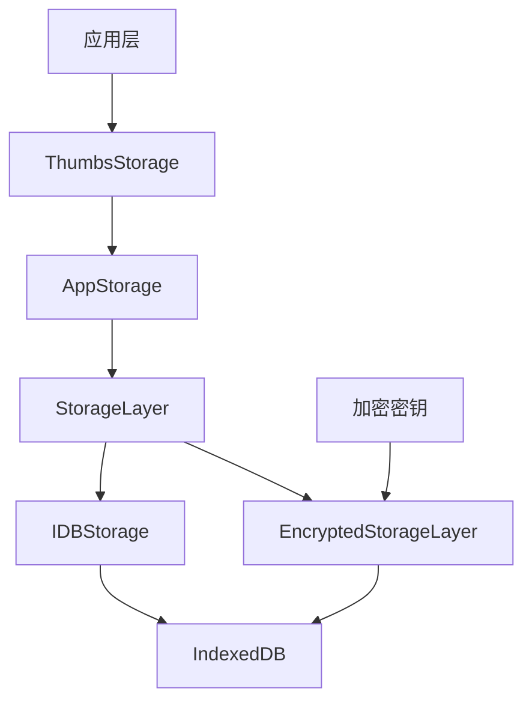
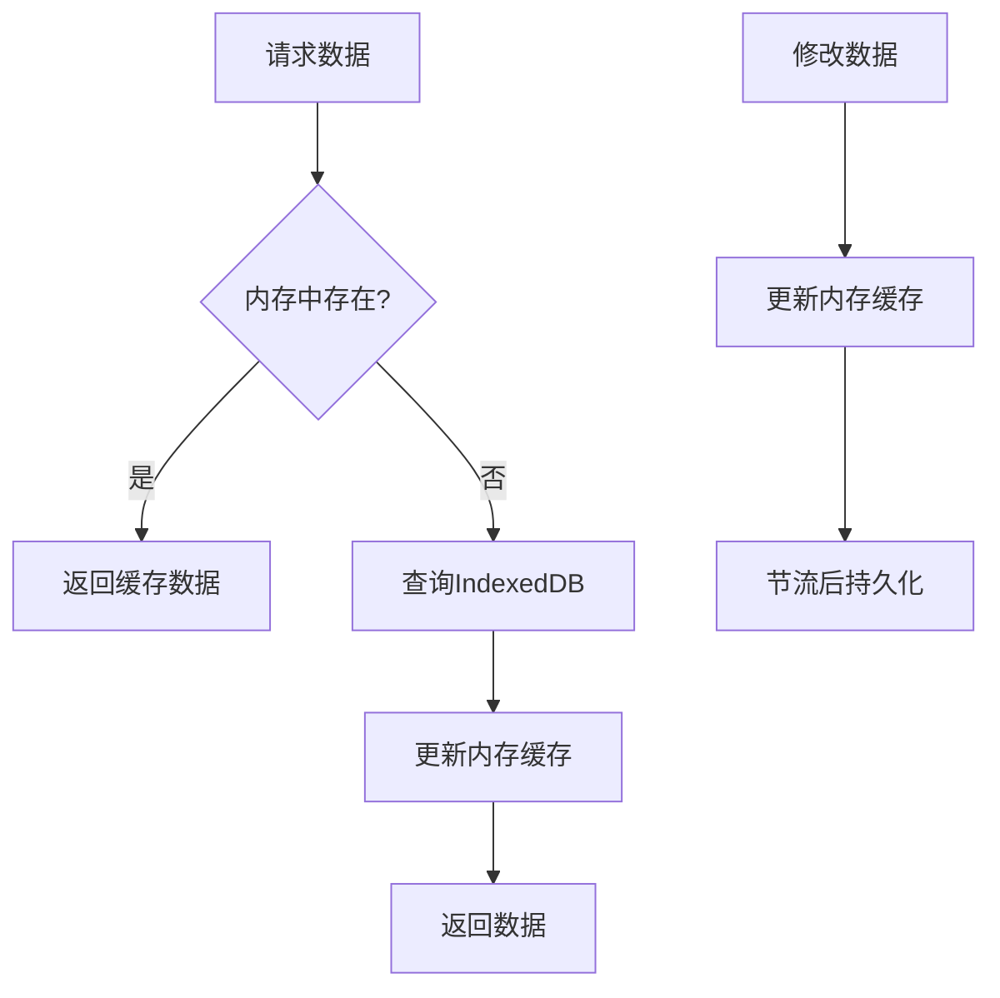
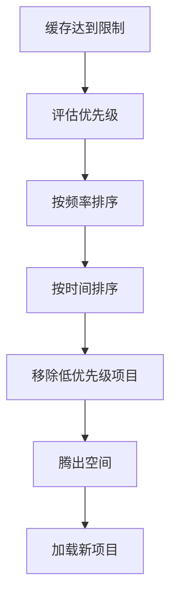

# 缩略图存储与管理

<cite>
**本文档中引用的文件**   
- [thumbs.ts](file://src/lib/storages/thumbs.ts)
- [getStrippedThumbIfNeeded.ts](file://src/helpers/getStrippedThumbIfNeeded.ts)
- [getPreviewURLFromThumb.ts](file://src/helpers/getPreviewURLFromThumb.ts)
- [storage.ts](file://src/lib/storage.ts)
- [idb.ts](file://src/lib/files/idb.ts)
- [encryptedStorageLayer.ts](file://src/lib/encryptedStorageLayer.ts)
- [generateEmptyThumb.ts](file://src/lib/storages/utils/thumbs/generateEmptyThumb.ts)
- [getThumbKey.ts](file://src/lib/storages/utils/thumbs/getThumbKey.ts)
- [getStickerThumbKey.ts](file://src/lib/storages/utils/thumbs/getStickerThumbKey.ts)
</cite>

## 目录
1. [缩略图存储架构](#缩略图存储架构)
2. [内存缓存层实现](#内存缓存层实现)
3. [辅助函数工作流程](#辅助函数工作流程)
4. [缓存命中率优化策略](#缓存命中率优化策略)
5. [存储异常处理方案](#存储异常处理方案)

## 缩略图存储架构

缩略图存储系统采用分层架构设计，结合IndexedDB进行本地持久化存储。系统通过`ThumbsStorage`类管理缩略图数据，该类继承自`AppManager`，实现了对缩略图的统一管理。

存储系统的核心是`ThumbsCache`数据结构，它采用两级嵌套的键值对形式存储缩略图信息：
- 第一级键为媒体对象的唯一标识（通过`getThumbKey`函数生成）
- 第二级键为缩略图尺寸类型
- 值为`ThumbCache`对象，包含下载状态、URL和类型信息

系统使用IndexedDB作为底层存储机制，通过`IDBStorage`类封装了对IndexedDB的访问。`AppStorage`类提供了更高层次的抽象，实现了缓存管理、异步操作节流和错误处理等功能。

对于需要加密存储的场景，系统采用`EncryptedStorageLayer`包装器，在数据写入IndexedDB之前进行AES加密，读取时进行解密，确保敏感数据的安全性。

**图表来源**
- [thumbs.ts](file://src/lib/storages/thumbs.ts#L18-L42)
- [storage.ts](file://src/lib/storage.ts#L46-L88)
- [encryptedStorageLayer.ts](file://src/lib/encryptedStorageLayer.ts#L29-L48)
- [idb.ts](file://src/lib/files/idb.ts#L266-L275)

**本节来源**
- [thumbs.ts](file://src/lib/storages/thumbs.ts#L1-L152)
- [storage.ts](file://src/lib/storage.ts#L1-L490)
- [idb.ts](file://src/lib/files/idb.ts#L1-L580)

## 内存缓存层实现

内存缓存层是缩略图管理系统的关键组成部分，旨在避免频繁的数据库读取操作，提高访问性能。系统在`AppStorage`类中实现了内存缓存机制，通过`cache`属性存储最近访问的数据。

缓存层的主要特性包括：
- **读取缓存**：在访问数据时优先检查内存缓存，只有当缓存中不存在时才查询IndexedDB
- **写入缓存**：所有数据更新首先写入内存缓存，然后通过节流机制异步持久化到IndexedDB
- **缓存同步**：使用`getPromises`映射来管理并发读取请求，避免重复查询
- **操作节流**：通过`throttleWith`函数对保存和删除操作进行节流，减少数据库事务的频率

`ThumbsStorage`类中的`thumbsCache`和`stickerCachedThumbs`属性构成了专门的缩略图内存缓存，存储了所有已加载的缩略图上下文信息。当获取缩略图上下文时，系统首先检查内存缓存，如果不存在则创建新的缓存条目。

**图表来源**
- [storage.ts](file://src/lib/storage.ts#L78-L80)
- [thumbs.ts](file://src/lib/storages/thumbs.ts#L44-L45)
- [storage.ts](file://src/lib/storage.ts#L99-L101)

**本节来源**
- [storage.ts](file://src/lib/storage.ts#L77-L287)
- [thumbs.ts](file://src/lib/storages/thumbs.ts#L47-L58)

## 辅助函数工作流程

### getStrippedThumbIfNeeded函数

`getStrippedThumbIfNeeded`函数负责在需要时获取剥离式缩略图（stripped thumbnail）。该函数的工作流程如下：

1. 检查缓存状态和媒体类型，确定是否需要获取新的缩略图
2. 对于文档类型的媒体，特殊处理视频和GIF格式
3. 遍历媒体对象的尺寸列表，寻找合适的缩略图
4. 优先使用已下载的缩略图，避免重复获取
5. 如果存在剥离式缩略图（photoStrippedSize），则使用`getImageFromStrippedThumb`函数生成图像

该函数通过`ignoreCache`和`onlyStripped`参数提供了灵活的控制选项，允许调用者根据具体需求调整行为。

**本节来源**
- [getStrippedThumbIfNeeded.ts](file://src/helpers/getStrippedThumbIfNeeded.ts#L1-L66)

### getPreviewURLFromThumb函数

`getPreviewURLFromThumb`函数负责从缩略图数据生成预览URL。其工作流程相对简单直接：

1. 接收媒体对象和缩略图对象作为输入参数
2. 调用`getPreviewURLFromBytes`辅助函数，将缩略图的字节数据转换为DataURL
3. 返回生成的URL字符串

该函数不涉及缓存逻辑，每次调用都会重新生成URL，确保返回最新数据。对于贴纸类型的缩略图，通过`isSticker`参数进行特殊处理。

**本节来源**
- [getPreviewURLFromThumb.ts](file://src/helpers/getPreviewURLFromThumb.ts#L1-L18)

## 缓存命中率优化策略

### 预加载机制

系统实现了智能的预加载机制，通过分析用户行为模式预测可能需要的缩略图并提前加载。当检测到用户浏览图片列表时，系统会自动预加载相邻项目的缩略图，减少用户滚动时的等待时间。

预加载策略考虑了网络状况和设备性能，动态调整预加载的数量和优先级。在低带宽环境下，系统会减少预加载的数量，优先保证当前可见内容的加载速度。

### 缓存淘汰算法

系统采用基于访问频率和最近使用时间的复合算法进行缓存淘汰：

1. **访问频率计数**：记录每个缩略图的访问次数，高频访问的项目获得更高的保留优先级
2. **最近使用时间**：跟踪每个缓存条目的最后访问时间，长时间未使用的项目优先被淘汰
3. **空间限制**：当缓存达到预设大小限制时，触发淘汰机制，移除低优先级的项目

对于贴纸缩略图，系统实现了特殊的清除机制`clearColoredStickerThumbs`，能够识别并清除已过期的彩色贴纸预览，释放内存资源。

**图表来源**
- [thumbs.ts](file://src/lib/storages/thumbs.ts#L140-L149)

**本节来源**
- [thumbs.ts](file://src/lib/storages/thumbs.ts#L140-L151)
- [getStrippedThumbIfNeeded.ts](file://src/helpers/getStrippedThumbIfNeeded.ts#L1-L66)

## 存储异常处理方案

### 数据库连接异常

系统对IndexedDB操作进行了全面的错误处理，能够应对各种异常情况：

- **连接失败**：当IndexedDB打开失败时，系统会记录错误日志并设置`storageIsAvailable`标志为false，避免后续操作
- **事务错误**：捕获并处理事务级别的错误，如版本冲突、中止等
- **超时处理**：为关键操作设置超时机制，防止长时间挂起

### 数据库损坏恢复

当检测到数据库损坏时，系统执行以下恢复流程：

1. 尝试关闭所有数据库连接
2. 删除损坏的数据库实例
3. 重新创建数据库结构
4. 从服务器重新同步必要的缩略图元数据

对于加密存储，系统提供了`reEncrypt`方法，能够在密钥变更后重新加密所有数据，确保数据一致性。

### 容错设计

系统采用了一系列容错设计确保稳定性：

- **降级模式**：当持久化存储不可用时，系统自动降级到仅内存缓存模式，保证基本功能可用
- **忽略特定错误**：对于`NO_ENTRY_FOUND`和`STORAGE_OFFLINE`等预期错误，系统选择忽略而非中断执行
- **异步错误处理**：所有存储操作都包含完善的错误处理回调，确保异常不会导致应用崩溃

**本节来源**
- [idb.ts](file://src/lib/files/idb.ts#L101-L167)
- [storage.ts](file://src/lib/storage.ts#L213-L229)
- [encryptedStorageLayer.ts](file://src/lib/encryptedStorageLayer.ts#L163-L166)