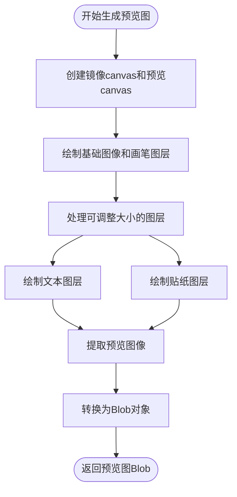
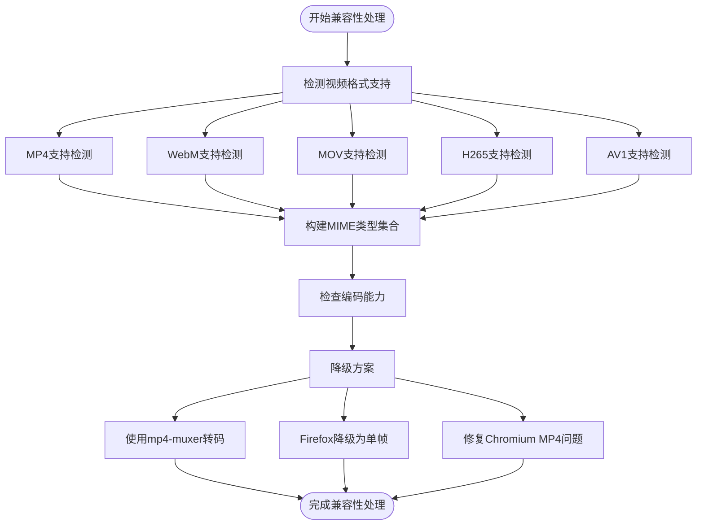

# 视频预览图生成

<cite>
**本文档引用的文件**  
- [generateVideoPreview.ts](file://src/components/mediaEditor/finalRender/generateVideoPreview.ts)
- [renderToActualVideo.ts](file://src/components/mediaEditor/finalRender/renderToActualVideo.ts)
- [renderToVideoGIF.ts](file://src/components/mediaEditor/finalRender/renderToVideoGIF.ts)
- [videoStickerFrameByFrameRenderer.ts](file://src/components/mediaEditor/finalRender/videoStickerFrameByFrameRenderer.ts)
- [imageStickerFrameByFrameRenderer.ts](file://src/components/mediaEditor/finalRender/imageStickerFrameByFrameRenderer.ts)
- [lottieStickerFrameByFrameRenderer.ts](file://src/components/mediaEditor/finalRender/lottieStickerFrameByFrameRenderer.ts)
- [videoSupport.ts](file://src/environment/videoSupport.ts)
- [videoMimeTypesSupport.ts](file://src/environment/videoMimeTypesSupport.ts)
- [support.ts](file://src/components/mediaEditor/support.ts)
- [calcCodecAndBitrate.ts](file://src/components/mediaEditor/finalRender/calcCodecAndBitrate.ts)
- [videoToImage.ts](file://src/helpers/dom/videoToImage.ts)
</cite>

## 目录
1. [简介](#简介)
2. [核心组件分析](#核心组件分析)
3. [视频预览图生成流程](#视频预览图生成流程)
4. [时间点选择策略](#时间点选择策略)
5. [帧质量优化方法](#帧质量优化方法)
6. [视频编码格式兼容性处理](#视频编码格式兼容性处理)
7. [预览图尺寸自适应逻辑](#预览图尺寸自适应逻辑)
8. [错误处理机制](#错误处理机制)
9. [性能优化建议](#性能优化建议)

## 简介
本文档深入分析视频预览图生成的完整流程，重点解析`generateVideoPreview.ts`中的核心算法。详细说明如何通过canvas和video元素提取视频第一帧作为预览图，包括时间点选择策略和帧质量优化方法。解释对不同视频编码格式（如MP4、WebM）的兼容性处理，以及在不支持的格式下的降级方案。描述预览图尺寸自适应逻辑，如何根据原始视频分辨率计算最佳缩略图尺寸。记录错误处理机制，包括视频加载失败、解码异常等情况的应对策略。提供性能优化建议，如使用Web Worker进行异步生成以避免阻塞主线程。

## 核心组件分析

`generateVideoPreview.ts`是视频预览图生成的核心文件，它通过canvas和video元素提取视频帧作为预览图。该函数接收缩放后的宽度和高度参数，创建两个canvas元素：一个用于镜像处理所有图层，另一个用于生成最终预览图。

函数首先从媒体编辑器上下文中获取当前状态，包括画布大小、图像canvas、画笔canvas、当前标签页、贴纸层信息和最终变换比例。然后根据是否处于裁剪模式，计算预览图的尺寸。创建镜像canvas和预览canvas后，将图像和画笔图层绘制到镜像canvas上。

对于可调整大小的图层，函数会处理每个图层的位置、旋转和缩放，确保它们在预览图中正确显示。文本图层和贴纸图层会分别调用`drawTextLayer`和`drawStickerLayer`函数进行绘制。如果是裁剪模式，从镜像canvas的裁剪区域提取图像；否则，从中心位置提取图像。

最后，将预览canvas转换为Blob对象返回，完成预览图的生成。

**Section sources**
- [generateVideoPreview.ts](file://src/components/mediaEditor/finalRender/generateVideoPreview.ts#L1-L99)

## 视频预览图生成流程

视频预览图的生成流程始于`generateVideoPreview`函数的调用，该函数在`renderToActualVideo.ts`和`renderToVideoGIF.ts`中被使用。整个流程涉及多个组件的协同工作，包括canvas操作、视频处理、图层渲染等。

流程开始时，系统创建两个canvas元素：镜像canvas用于处理所有图层的组合，预览canvas用于生成最终的预览图。镜像canvas的尺寸与原始画布相同，而预览canvas的尺寸根据目标缩放比例计算得出。

系统首先将基础图像和画笔图层绘制到镜像canvas上。然后遍历所有可调整大小的图层，对每个图层进行位置、旋转和缩放的处理，并将其绘制到镜像canvas上。对于文本图层，调用`drawTextLayer`函数进行渲染；对于贴纸图层，根据贴纸类型（静态、Lottie或WebM）调用相应的渲染器。

在裁剪模式下，系统从镜像canvas的裁剪区域提取图像；在非裁剪模式下，从画布中心提取图像。提取的图像被绘制到预览canvas上，最后转换为Blob对象返回。



**Diagram sources**
- [generateVideoPreview.ts](file://src/components/mediaEditor/finalRender/generateVideoPreview.ts#L1-L99)
- [renderToActualVideo.ts](file://src/components/mediaEditor/finalRender/renderToActualVideo.ts#L314-L316)

**Section sources**
- [generateVideoPreview.ts](file://src/components/mediaEditor/finalRender/generateVideoPreview.ts#L1-L99)
- [renderToActualVideo.ts](file://src/components/mediaEditor/finalRender/renderToActualVideo.ts#L314-L316)

## 时间点选择策略

视频预览图的时间点选择策略主要由`videoThumbnailPosition`参数控制，该参数表示预览图在视频中的时间位置，以视频总时长的比例表示。在`renderToActualVideo.ts`文件中，系统通过以下方式确定预览图的时间点：

```typescript
const thumbnailTime = videoThumbnailPosition * video.duration;
```

当视频处理到接近预览图时间点的帧时，系统会检查当前时间是否在预览图时间点的±0.5/EXPECTED_FPS范围内。如果在范围内，则将当前帧绘制到缩略图canvas上作为预览图。

对于未在主处理循环中捕获预览图的情况，系统会专门跳转到预览图时间点，重新渲染该帧作为预览图：

```typescript
if(!drewThumbnail) {
  video.currentTime = thumbnailTime;
  await Promise.race([deferred, delay(2_000)]);
  thumbnailCtx.drawImage(resultCanvas, 0, 0, thumbnailCanvas.width, thumbnailCanvas.height);
}
```

这种双重保障机制确保了预览图能够准确地在指定时间点生成，即使在主处理循环中由于性能原因未能精确捕获该帧。

**Section sources**
- [renderToActualVideo.ts](file://src/components/mediaEditor/finalRender/renderToActualVideo.ts#L90-L91)
- [renderToActualVideo.ts](file://src/components/mediaEditor/finalRender/renderToActualVideo.ts#L246-L249)
- [renderToActualVideo.ts](file://src/components/mediaEditor/finalRender/renderToActualVideo.ts#L387-L401)

## 帧质量优化方法

视频预览图的帧质量优化主要通过以下几个方面实现：

1. **canvas尺寸优化**：系统使用`snapToViewport`函数计算最佳的预览图尺寸，确保预览图在保持原始宽高比的同时，尺寸适合显示区域。

2. **图像质量保持**：在生成预览图时，系统直接从原始视频元素提取帧，避免了多次编码解码导致的质量损失。通过`video.videoWidth`和`video.videoHeight`获取原始视频的分辨率，确保预览图的质量。

3. **抗锯齿处理**：在绘制图像到canvas时，浏览器会自动应用抗锯齿算法，提高图像的视觉质量。

4. **缩放算法优化**：当需要缩放图像时，系统使用高质量的缩放算法，确保缩放后的图像仍然保持清晰。

5. **多层合成优化**：在处理多个图层时，系统先在镜像canvas上完成所有图层的合成，然后再提取预览图，减少了重复绘制的开销，提高了生成效率。


**Diagram sources**
- [generateVideoPreview.ts](file://src/components/mediaEditor/finalRender/generateVideoPreview.ts#L34-L41)
- [generateVideoPreview.ts](file://src/components/mediaEditor/finalRender/generateVideoPreview.ts#L46-L48)

**Section sources**
- [generateVideoPreview.ts](file://src/components/mediaEditor/finalRender/generateVideoPreview.ts#L34-L48)

## 视频编码格式兼容性处理

系统对不同视频编码格式的兼容性处理主要通过环境检测和降级方案实现。在`videoSupport.ts`文件中，系统检测浏览器对各种视频格式的支持情况：

```typescript
const IS_WEBM_SUPPORTED = !!video.canPlayType('video/webm') && !IS_SAFARI && !IS_APPLE_MOBILE;
const IS_MOV_SUPPORTED = !!video.canPlayType('video/quicktime') || IS_SAFARI || IS_APPLE_MOBILE;
const IS_H265_SUPPORTED = !!video.canPlayType('video/mp4; codecs="hev1"');
const IS_AV1_SUPPORTED = !IS_SAFARI;
```

基于这些检测结果，在`videoMimeTypesSupport.ts`中构建支持的MIME类型集合：

```typescript
const VIDEO_MIME_TYPES_SUPPORTED: Set<VIDEO_MIME_TYPE> = new Set([
  'image/gif',
  'video/mp4',
  'video/webm'
]);

if(IS_MOV_SUPPORTED) {
  VIDEO_MIME_TYPES_SUPPORTED.add('video/quicktime');
}
```

对于不支持的格式，系统提供降级方案：
1. 使用`mp4-muxer`库进行视频转码
2. 对于WebM格式，在Firefox浏览器中降级为单帧处理
3. 使用`fixChromiumMp4`工具修复Chromium浏览器的MP4播放问题

在`support.ts`中，系统还检测浏览器的视频编码能力，确保生成的视频格式能够被广泛支持：

```typescript
export const supportsVideoEncoding = () => supportsVideo ?? (async() => {
  const configs: VideoEncoderConfig[] = [highResCodec, defaultCodec];
  let result = true;
  for(const config of configs) {
    const support = await VideoEncoder.isConfigSupported(config);
    if(!support.supported) result = false;
  }
  return supportsVideo = result;
})();
```



**Diagram sources**
- [videoSupport.ts](file://src/environment/videoSupport.ts#L3-L15)
- [videoMimeTypesSupport.ts](file://src/environment/videoMimeTypesSupport.ts#L3-L14)
- [support.ts](file://src/components/mediaEditor/support.ts#L10-L21)

**Section sources**
- [videoSupport.ts](file://src/environment/videoSupport.ts#L3-L15)
- [videoMimeTypesSupport.ts](file://src/environment/videoMimeTypesSupport.ts#L3-L14)
- [support.ts](file://src/components/mediaEditor/support.ts#L10-L21)

## 预览图尺寸自适应逻辑

预览图尺寸自适应逻辑通过`snapToViewport`函数实现，该函数根据目标宽高比和可用空间计算最佳尺寸。在`generateVideoPreview.ts`中，系统根据是否处于裁剪模式选择不同的尺寸计算方式：

```typescript
const [previewWidth, previewHeight] = snapToViewport(ratio, isCropping ? cropOffset().width : cw, isCropping ? cropOffset().height : ch);
```

`snapToViewport`函数的核心逻辑是保持原始宽高比的同时，使预览图尽可能大但不超过指定的最大尺寸。在`renderToActualVideo.ts`中，系统还设置了缩略图的最大尺寸限制：

```typescript
const THUMBNAIL_MAX_SIZE = 720;
[thumbnailCanvas.width, thumbnailCanvas.height] = snapToViewport(scaledWidth / scaledHeight, Math.min(scaledWidth, THUMBNAIL_MAX_SIZE), Math.min(scaledHeight, THUMBNAIL_MAX_SIZE));
```

这种自适应逻辑确保了预览图在不同设备和屏幕尺寸下都能获得最佳的显示效果，既不会因为过大而影响性能，也不会因为过小而影响视觉质量。

**Section sources**
- [generateVideoPreview.ts](file://src/components/mediaEditor/finalRender/generateVideoPreview.ts#L34-L35)
- [renderToActualVideo.ts](file://src/components/mediaEditor/finalRender/renderToActualVideo.ts#L87-L88)

## 错误处理机制

系统实现了全面的错误处理机制，确保在视频加载失败、解码异常等情况下仍能正常运行。主要错误处理策略包括：

1. **视频加载错误处理**：在`onMediaLoad.ts`中，系统检测并处理视频加载错误，特别是Chromium浏览器的MP4播放问题：

```typescript
export function shouldIgnoreVideoError(e: ErrorEvent) {
  try {
    const target = e.target as HTMLVideoElement;
    const error = target.error;
    
    if(!error || error.message.includes('URL safety check')) {
      return true;
    }
    
    const isChromeBug = isCrbug1250841Error(error);
    if(isChromeBug && !(target as any).triedFixingChromeBug) {
      // 尝试修复Chromium MP4问题
      callbackify(srcPromise, (src) => {
        (target as any).triedFixingChromeBug = true;
        target.src = src;
        target.load();
      });
      return true;
    }
  } catch(err) {}
  
  return false;
}
```

2. **编码暂停处理**：当窗口失去焦点时，系统暂停编码过程，恢复焦点时继续：

```typescript
listenerSetter.add(window)('focus', () => {
  encodingPausedDeferred?.resolve?.();
  encodingPausedDeferred = undefined;
});

listenerSetter.add(window)('blur', () => {
  encodingPausedDeferred = deferredPromise();
  currentVideoFrameDeferred?.reject(ThrowReason.EncodingPaused);
});
```

3. **时间回退异常处理**：在视频处理过程中，系统检测时间回退异常并相应处理：

```typescript
if(currentTime < lastTime) throw ThrowReason.TimeLoopback;
```

4. **Blob生成失败处理**：在`videoToImage.ts`中，系统处理canvas转Blob失败的情况：

```typescript
return new Promise((resolve, reject) => {
  canvas.toBlob((blob) => {
    if(blob) {
      resolve(blob);
    } else {
      reject(new Error('Failed to create blob'));
    }
  });
});
```

这些错误处理机制确保了系统在各种异常情况下都能优雅地处理问题，提供良好的用户体验。

**Section sources**
- [onMediaLoad.ts](file://src/helpers/onMediaLoad.ts#L6-L42)
- [renderToActualVideo.ts](file://src/components/mediaEditor/finalRender/renderToActualVideo.ts#L104-L114)
- [renderToActualVideo.ts](file://src/components/mediaEditor/finalRender/renderToActualVideo.ts#L221-L222)
- [videoToImage.ts](file://src/helpers/dom/videoToImage.ts#L8-L16)

## 性能优化建议

为了提高视频预览图生成的性能，建议采取以下优化措施：

1. **使用Web Worker进行异步生成**：将预览图生成过程移至Web Worker中执行，避免阻塞主线程，保持UI的响应性。

2. **分块处理大视频**：对于大尺寸视频，采用分块处理策略，将视频分割为多个区域分别处理，然后合并结果。

3. **缓存预览图**：对已生成的预览图进行缓存，避免重复生成，特别是在频繁预览同一视频时。

4. **优化canvas尺寸**：根据显示需求调整预览图尺寸，避免生成过大的预览图造成性能开销。

5. **使用requestVideoFrameCallback**：利用`requestVideoFrameCallback`API精确控制视频帧的提取，提高性能和准确性。

6. **限制并发处理**：控制同时处理的视频数量，避免过多的并发操作导致性能下降。

7. **使用硬件加速**：确保canvas操作能够利用GPU加速，提高渲染性能。

8. **优化图像质量与性能的平衡**：根据设备性能动态调整预览图的质量，高性能设备使用高质量预览，低性能设备使用较低质量预览。

通过实施这些性能优化建议，可以显著提高视频预览图生成的效率和用户体验。