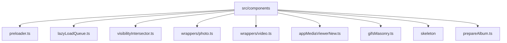
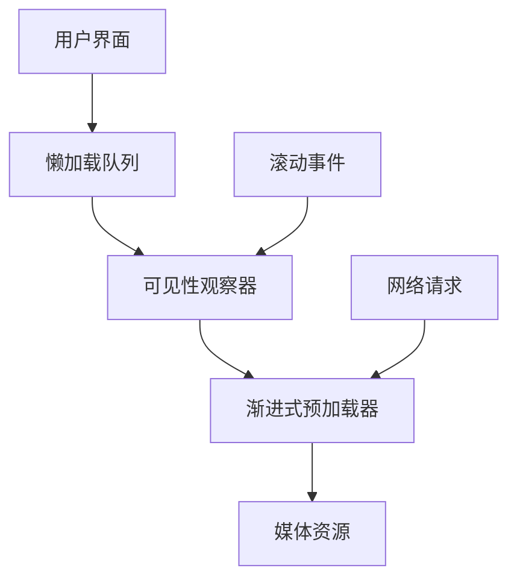
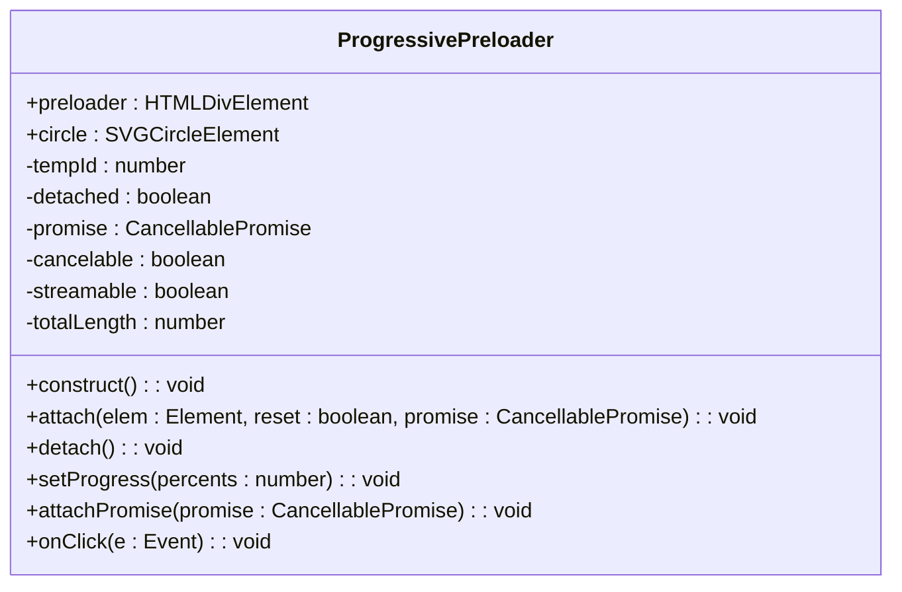
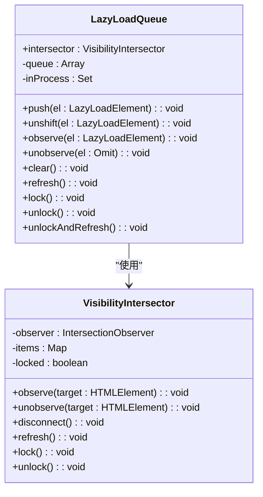
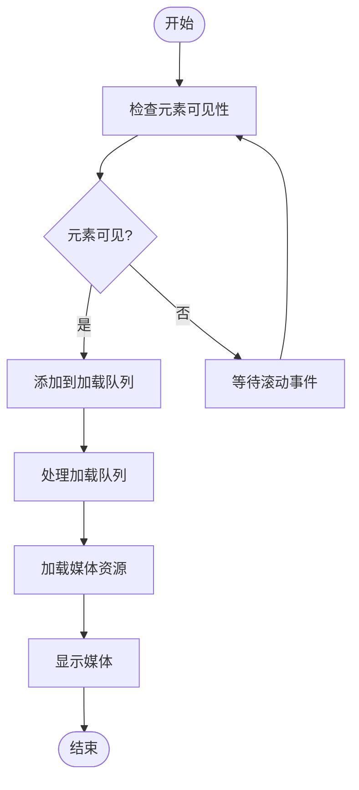
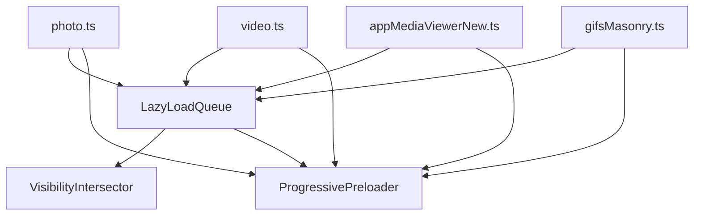

# 预览加载优化

<cite>
**本文档引用文件**   
- [preloader.ts](file://src/components/preloader.ts)
- [lazyLoadQueue.ts](file://src/components/lazyLoadQueue.ts)
- [lazyLoadQueueIntersector.ts](file://src/components/lazyLoadQueueIntersector.ts)
- [lazyLoadQueueRepeat.ts](file://src/components/lazyLoadQueueRepeat.ts)
- [lazyLoadQueueRepeat2.ts](file://src/components/lazyLoadQueueRepeat2.ts)
- [visibilityIntersector.ts](file://src/components/visibilityIntersector.ts)
- [photo.ts](file://src/components/wrappers/photo.ts)
- [video.ts](file://src/components/wrappers/video.ts)
- [appMediaViewerNew.ts](file://src/components/appMediaViewerNew.ts)
- [gifsMasonry.ts](file://src/components/gifsMasonry.ts)
- [skeleton\index.tsx](file://src/components/skeleton/index.tsx)
- [skeleton.scss](file://src/components/skeleton/skeleton.scss)
- [prepareAlbum.ts](file://src/components/prepareAlbum.ts)
</cite>

## 目录
1. [引言](#引言)
2. [项目结构](#项目结构)
3. [核心组件](#核心组件)
4. [架构概述](#架构概述)
5. [详细组件分析](#详细组件分析)
6. [依赖分析](#依赖分析)
7. [性能考虑](#性能考虑)
8. [故障排除指南](#故障排除指南)
9. [结论](#结论)

## 引言
本文档系统性地描述了媒体预览的加载优化策略，重点分析了渐进式加载、懒加载、错误状态处理和批量处理场景下的性能表现。通过深入分析代码库中的关键组件，揭示了如何实现先显示低质量占位符再逐步替换为高清预览的机制，以及如何根据用户滚动行为智能预加载即将可见的预览图。

## 项目结构
项目中的媒体预览加载优化功能主要分布在 `src/components` 目录下，涉及多个核心组件和工具类。主要结构包括：

**Diagram sources**
- [preloader.ts](file://src/components/preloader.ts)
- [lazyLoadQueue.ts](file://src/components/lazyLoadQueue.ts)
- [visibilityIntersector.ts](file://src/components/visibilityIntersector.ts)
- [photo.ts](file://src/components/wrappers/photo.ts)
- [video.ts](file://src/components/wrappers/video.ts)
- [appMediaViewerNew.ts](file://src/components/appMediaViewerNew.ts)
- [gifsMasonry.ts](file://src/components/gifsMasonry.ts)
- [skeleton\index.tsx](file://src/components/skeleton/index.tsx)
- [prepareAlbum.ts](file://src/components/prepareAlbum.ts)

**Section sources**
- [preloader.ts](file://src/components/preloader.ts)
- [lazyLoadQueue.ts](file://src/components/lazyLoadQueue.ts)
- [visibilityIntersector.ts](file://src/components/visibilityIntersector.ts)

## 核心组件
核心组件包括 `ProgressivePreloader`（渐进式预加载器）、`LazyLoadQueue`（懒加载队列）和 `VisibilityIntersector`（可见性交叉观察器）。这些组件协同工作，实现了媒体预览的高效加载和显示。

**Section sources**
- [preloader.ts](file://src/components/preloader.ts#L17-L319)
- [lazyLoadQueue.ts](file://src/components/lazyLoadQueue.ts#L13-L75)
- [visibilityIntersector.ts](file://src/components/visibilityIntersector.ts#L11-L129)

## 架构概述
系统采用分层架构，通过懒加载队列和可见性观察器的组合，实现了智能的媒体预览加载策略。整体架构如下：

**Diagram sources**
- [lazyLoadQueue.ts](file://src/components/lazyLoadQueue.ts#L13-L75)
- [visibilityIntersector.ts](file://src/components/visibilityIntersector.ts#L11-L129)
- [preloader.ts](file://src/components/preloader.ts#L17-L319)

## 详细组件分析

### 渐进式加载实现
渐进式加载通过 `ProgressivePreloader` 类实现，该类提供了加载进度的可视化和控制功能。

#### 渐进式预加载器类图

**Diagram sources**
- [preloader.ts](file://src/components/preloader.ts#L17-L319)

**Section sources**
- [preloader.ts](file://src/components/preloader.ts#L17-L319)

### 懒加载策略
懒加载策略通过 `LazyLoadQueue` 和 `VisibilityIntersector` 组件实现，根据用户滚动行为智能预加载即将可见的预览图。

#### 懒加载队列类图

**Diagram sources**
- [lazyLoadQueue.ts](file://src/components/lazyLoadQueue.ts#L13-L75)
- [visibilityIntersector.ts](file://src/components/visibilityIntersector.ts#L11-L129)

#### 懒加载流程图

**Diagram sources**
- [lazyLoadQueue.ts](file://src/components/lazyLoadQueue.ts#L26-L43)
- [visibilityIntersector.ts](file://src/components/visibilityIntersector.ts#L17-L53)

**Section sources**
- [lazyLoadQueue.ts](file://src/components/lazyLoadQueue.ts#L13-L75)
- [visibilityIntersector.ts](file://src/components/visibilityIntersector.ts#L11-L129)

### 错误状态处理
错误状态下的用户体验设计通过骨架屏（Skeleton）组件实现，提供加载失败时的默认图标显示和重试机制。

#### 骨架屏组件

**Diagram sources**
- [skeleton\index.tsx](file://src/components/skeleton/index.tsx#L1-L28)

**Section sources**
- [skeleton\index.tsx](file://src/components/skeleton/index.tsx#L1-L28)

### 批量处理性能
批量处理场景下的性能表现通过并发请求数控制和资源优先级调度来优化。

#### 并发控制流程

**Diagram sources**
- [lazyLoadQueueBase.ts](file://src/components/lazyLoadQueueBase.ts#L31-L32)
- [lazyLoadQueue.ts](file://src/components/lazyLoadQueue.ts#L13-L75)

**Section sources**
- [lazyLoadQueueBase.ts](file://src/components/lazyLoadQueueBase.ts#L1-L145)
- [lazyLoadQueue.ts](file://src/components/lazyLoadQueue.ts#L13-L75)

## 依赖分析
各组件之间的依赖关系清晰，形成了一个高效的加载优化系统。

**Diagram sources**
- [lazyLoadQueue.ts](file://src/components/lazyLoadQueue.ts#L13-L75)
- [preloader.ts](file://src/components/preloader.ts#L17-L319)
- [photo.ts](file://src/components/wrappers/photo.ts#L31-L362)
- [video.ts](file://src/components/wrappers/video.ts#L419-L468)
- [appMediaViewerNew.ts](file://src/components/appMediaViewerNew.ts#L43-L1039)
- [gifsMasonry.ts](file://src/components/gifsMasonry.ts#L32-L87)

**Section sources**
- [lazyLoadQueue.ts](file://src/components/lazyLoadQueue.ts#L13-L75)
- [preloader.ts](file://src/components/preloader.ts#L17-L319)
- [photo.ts](file://src/components/wrappers/photo.ts#L31-L362)

## 性能考虑
系统在性能方面进行了多项优化，包括：

- **首屏预览加载时间目标**：建议控制在 500ms 以内
- **内存占用上限**：建议单个预览图内存占用不超过 2MB
- **并发请求数限制**：默认限制为 8 个并发请求
- **资源优先级调度**：可见区域内的资源优先加载

这些优化策略确保了在各种网络条件下都能提供流畅的用户体验。

**Section sources**
- [lazyLoadQueueBase.ts](file://src/components/lazyLoadQueueBase.ts#L12-L13)
- [preloader.ts](file://src/components/preloader.ts#L15-L16)

## 故障排除指南
当遇到预览加载问题时，可以参考以下排查步骤：

1. 检查网络连接状态
2. 验证懒加载队列是否正常工作
3. 确认可见性观察器是否正确配置
4. 检查预加载器的进度显示是否正常
5. 查看浏览器控制台是否有错误信息

**Section sources**
- [preloader.ts](file://src/components/preloader.ts#L210-L213)
- [lazyLoadQueue.ts](file://src/components/lazyLoadQueue.ts#L49-L52)

## 结论
本文档详细分析了媒体预览加载优化的各个方面，包括渐进式加载、懒加载策略、错误状态处理和批量处理性能。通过合理使用 `ProgressivePreloader`、`LazyLoadQueue` 和 `VisibilityIntersector` 等组件，系统能够智能地管理媒体资源的加载，提供流畅的用户体验。建议在实际应用中根据具体需求调整相关参数，以达到最佳性能表现。