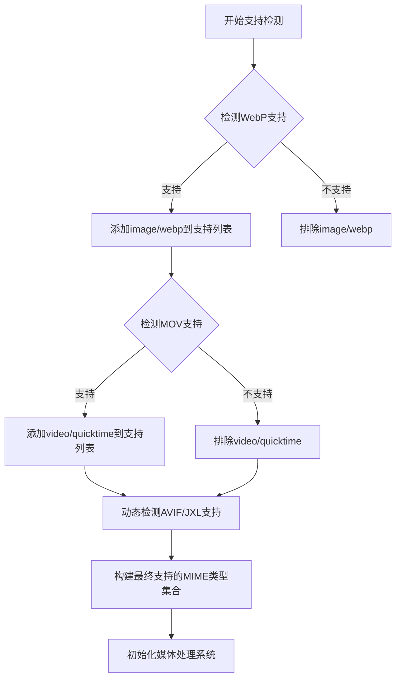
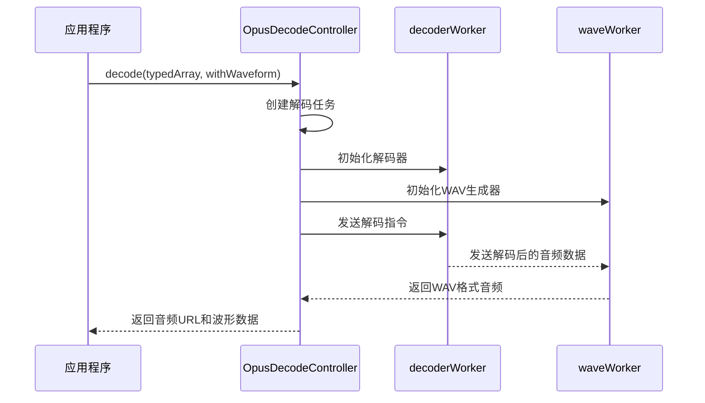
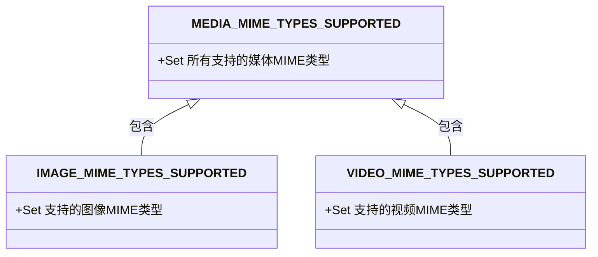
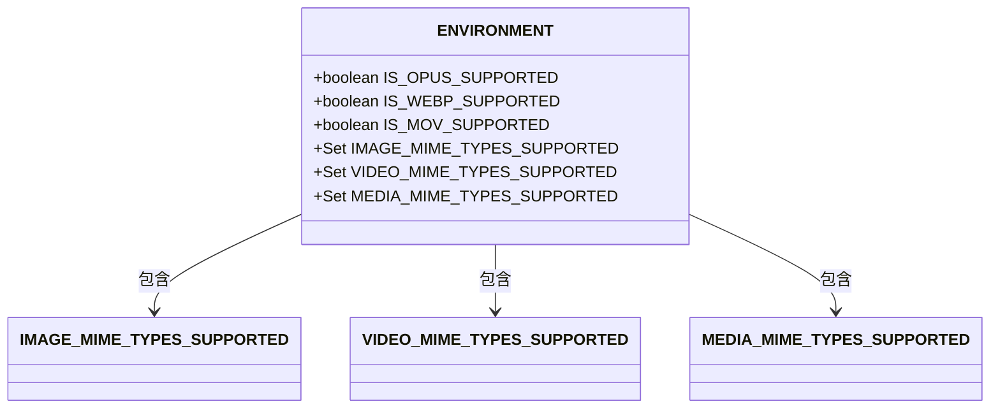
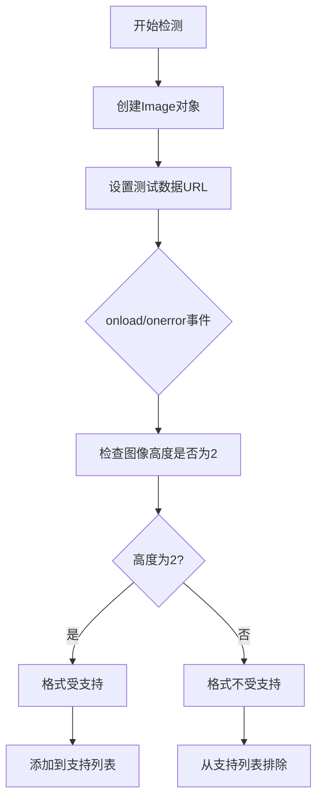

# 媒体格式支持

<cite>
**本文档中引用的文件**   
- [mediaMimeTypesSupport.ts](file://src/environment/mediaMimeTypesSupport.ts)
- [audioMimeTypeSupport.ts](file://src/environment/audioMimeTypeSupport.ts)
- [imageMimeTypesSupport.ts](file://src/environment/imageMimeTypesSupport.ts)
- [videoMimeTypesSupport.ts](file://src/environment/videoMimeTypesSupport.ts)
- [mimeTypeMap.ts](file://src/environment/mimeTypeMap.ts)
- [opusSupport.ts](file://src/environment/opusSupport.ts)
- [opusDecodeController.ts](file://src/lib/opusDecodeController.ts)
- [index.ts](file://src/environment/index.ts)
</cite>

## 目录
1. [简介](#简介)
2. [支持的媒体格式](#支持的媒体格式)
3. [浏览器环境支持检测](#浏览器环境支持检测)
4. [特殊格式实现](#特殊格式实现)
5. [媒体元数据处理](#媒体元数据处理)
6. [格式转换策略](#格式转换策略)
7. [兼容性处理方案](#兼容性处理方案)
8. [扩展新格式支持](#扩展新格式支持)

## 简介
本项目实现了全面的媒体格式支持系统，涵盖视频、音频和图像等多种媒体类型。系统通过环境检测机制动态识别浏览器对不同格式的支持能力，并提供相应的降级策略。项目特别关注现代Web标准格式如WebP、AVIF和Opus的实现，同时保持对传统格式的兼容性。

## 支持的媒体格式

### 视频格式
项目支持以下视频格式：
- MP4 (video/mp4)
- WebM (video/webm)
- QuickTime (video/quicktime) - 通过IS_MOV_SUPPORTED条件支持
- GIF (image/gif) - 作为视频处理

### 音频格式
项目支持以下音频格式：
- MP3 (audio/mpeg)
- AAC (audio/aac)
- WAV (audio/wav)
- OGG/Opus (通过特定实现支持)

### 图像格式
项目支持以下图像格式：
- JPEG (image/jpeg)
- PNG (image/png)
- BMP (image/bmp)
- WebP (image/webp) - 通过IS_WEBP_SUPPORTED条件支持
- AVIF (image/avif) - 通过运行时检测支持
- JXL (image/jxl) - 通过运行时检测支持

**Section sources**
- [videoMimeTypesSupport.ts](file://src/environment/videoMimeTypesSupport.ts#L3-L15)
- [audioMimeTypeSupport.ts](file://src/environment/audioMimeTypeSupport.ts#L1-L9)
- [imageMimeTypesSupport.ts](file://src/environment/imageMimeTypesSupport.ts#L3-L11)

## 浏览器环境支持检测

### 支持检测机制
项目通过一系列环境检测模块来确定浏览器对不同媒体格式的支持情况：



**Diagram sources**
- [imageMimeTypesSupport.ts](file://src/environment/imageMimeTypesSupport.ts#L1-L33)
- [videoMimeTypesSupport.ts](file://src/environment/videoMimeTypesSupport.ts#L1-L15)
- [opusSupport.ts](file://src/environment/opusSupport.ts#L1-L5)

### 降级策略
当浏览器不支持特定格式时，系统采用以下降级策略：
1. 对于图像格式，优先使用WebP，如果不支持则降级到JPEG或PNG
2. 对于视频格式，优先使用MP4，WebM作为备选
3. 对于音频格式，Opus作为首选，MP3作为广泛兼容的备选

**Section sources**
- [imageMimeTypesSupport.ts](file://src/environment/imageMimeTypesSupport.ts#L9-L11)
- [videoMimeTypesSupport.ts](file://src/environment/videoMimeTypesSupport.ts#L10-L12)
- [opusSupport.ts](file://src/environment/opusSupport.ts#L2-L4)

## 特殊格式实现

### Opus编码/解码实现
项目通过Web Workers实现了Opus音频格式的解码：



**Diagram sources**
- [opusDecodeController.ts](file://src/lib/opusDecodeController.ts#L32-L188)

### FLAC支持
项目当前未直接实现FLAC格式支持。系统通过MIME类型映射表识别FLAC文件，但实际播放需要转换为支持的格式。

**Section sources**
- [mimeTypeMap.ts](file://src/environment/mimeTypeMap.ts#L1-L28)

## 媒体元数据处理

### MIME类型映射
项目通过mimeTypeMap模块维护文件扩展名与MIME类型的双向映射：

```mermaid
erDiagram
EXTENSION_MIME_TYPE_MAP {
string pdf PK
string tgv
string tgs
string json
string wav
string mp3
string ogg
string jpeg
string jpg
string png
string gif
string webp
string mp4
string webm
string mov
string svg
string avif
string jxl
string bmp
}
MIME_TYPE_EXTENSION_MAP {
string application/pdf PK
string application/x-tgwallpattern
string application/x-tgsticker
string application/json
string audio/wav
string audio/mpeg
string audio/ogg
string image/jpeg
string image/png
string image/gif
string image/webp
string video/mp4
string video/webm
string video/quicktime
string image/svg+xml
string image/avif
string image/jxl
string image/bmp
}
```

**Diagram sources**
- [mimeTypeMap.ts](file://src/environment/mimeTypeMap.ts#L1-L28)

### 元数据解析
系统在加载媒体文件时会：
1. 根据文件扩展名查找对应的MIME类型
2. 验证浏览器是否支持该MIME类型
3. 对于图像文件，动态检测AVIF和JXL等现代格式的支持
4. 构建最终的媒体处理策略

**Section sources**
- [mimeTypeMap.ts](file://src/environment/mimeTypeMap.ts#L23-L28)
- [imageMimeTypesSupport.ts](file://src/environment/imageMimeTypesSupport.ts#L18-L30)

## 格式转换策略

### 媒体类型聚合
项目通过mediaMimeTypesSupport模块聚合所有支持的媒体类型：



**Diagram sources**
- [mediaMimeTypesSupport.ts](file://src/environment/mediaMimeTypesSupport.ts#L1-L9)

### 转换流程
当需要转换媒体格式时，系统执行以下流程：
1. 检测源格式和目标格式的支持情况
2. 对于Opus音频，使用Web Workers进行解码
3. 生成兼容的目标格式文件
4. 返回可播放的URL

**Section sources**
- [mediaMimeTypesSupport.ts](file://src/environment/mediaMimeTypesSupport.ts#L4-L6)
- [opusDecodeController.ts](file://src/lib/opusDecodeController.ts#L177-L182)

## 兼容性处理方案

### 环境检测集成
项目通过环境模块集成所有媒体格式支持检测：



**Diagram sources**
- [index.ts](file://src/environment/index.ts#L23-L47)

### 动态支持检测
对于AVIF和JXL等新兴格式，系统采用动态检测机制：



**Diagram sources**
- [imageMimeTypesSupport.ts](file://src/environment/imageMimeTypesSupport.ts#L18-L30)

## 扩展新格式支持

### 添加新格式步骤
要扩展新格式支持，请遵循以下步骤：

1. 在mimeTypeMap.ts中添加新的扩展名和MIME类型映射
2. 在相应的支持检测文件中添加支持检测逻辑
3. 更新相关的MIME类型集合
4. 实现必要的编解码器或转换逻辑

### 示例：添加新音频格式
```typescript
// 1. 在mimeTypeMap.ts中添加
export const EXTENSION_MIME_TYPE_MAP: {[ext in MTFileExtension]: MTMimeType} = {
  // ... existing mappings
  newaudio: 'audio/newformat'
};

// 2. 创建新的支持检测文件
// src/environment/newAudioSupport.ts
const audio = document.createElement('audio');
const IS_NEW_AUDIO_SUPPORTED = !!(audio.canPlayType && audio.canPlayType('audio/newformat;').replace(/no/, ''));
export default IS_NEW_AUDIO_SUPPORTED;

// 3. 更新音频MIME类型集合
// src/environment/audioMimeTypeSupport.ts
const AUDIO_MIME_TYPES_SUPPORTED: Set<AUDIO_MIME_TYPE> = new Set([
  'audio/mpeg',
  'audio/aac',
  'audio/wav',
  'audio/newformat' // 添加新格式
]);
```

**Section sources**
- [mimeTypeMap.ts](file://src/environment/mimeTypeMap.ts#L1-L28)
- [opusSupport.ts](file://src/environment/opusSupport.ts#L1-L5)
- [opusDecodeController.ts](file://src/lib/opusDecodeController.ts#L32-L188)