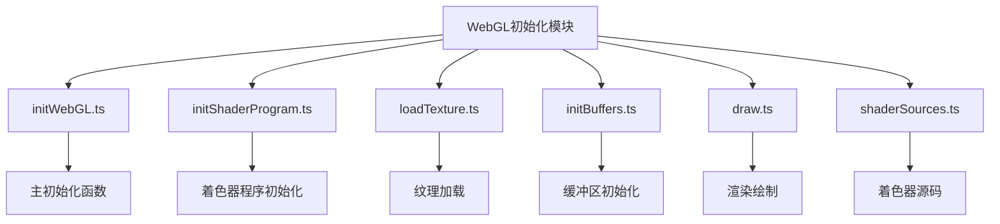
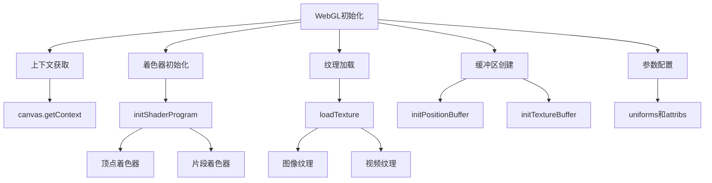
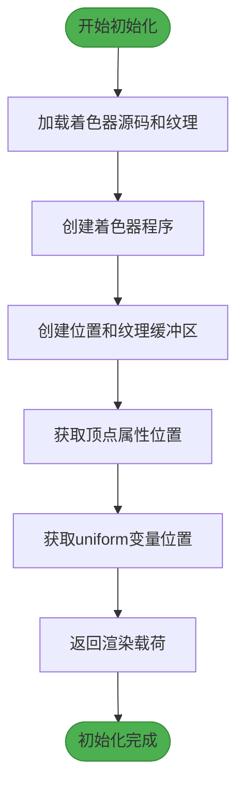
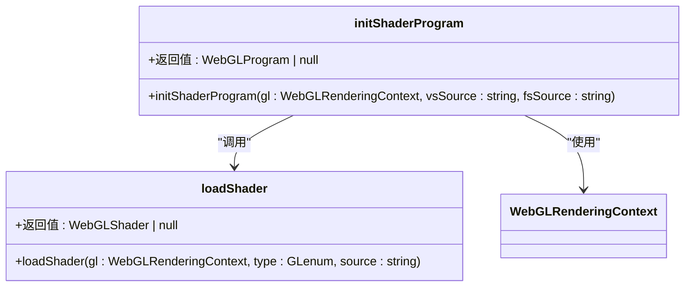
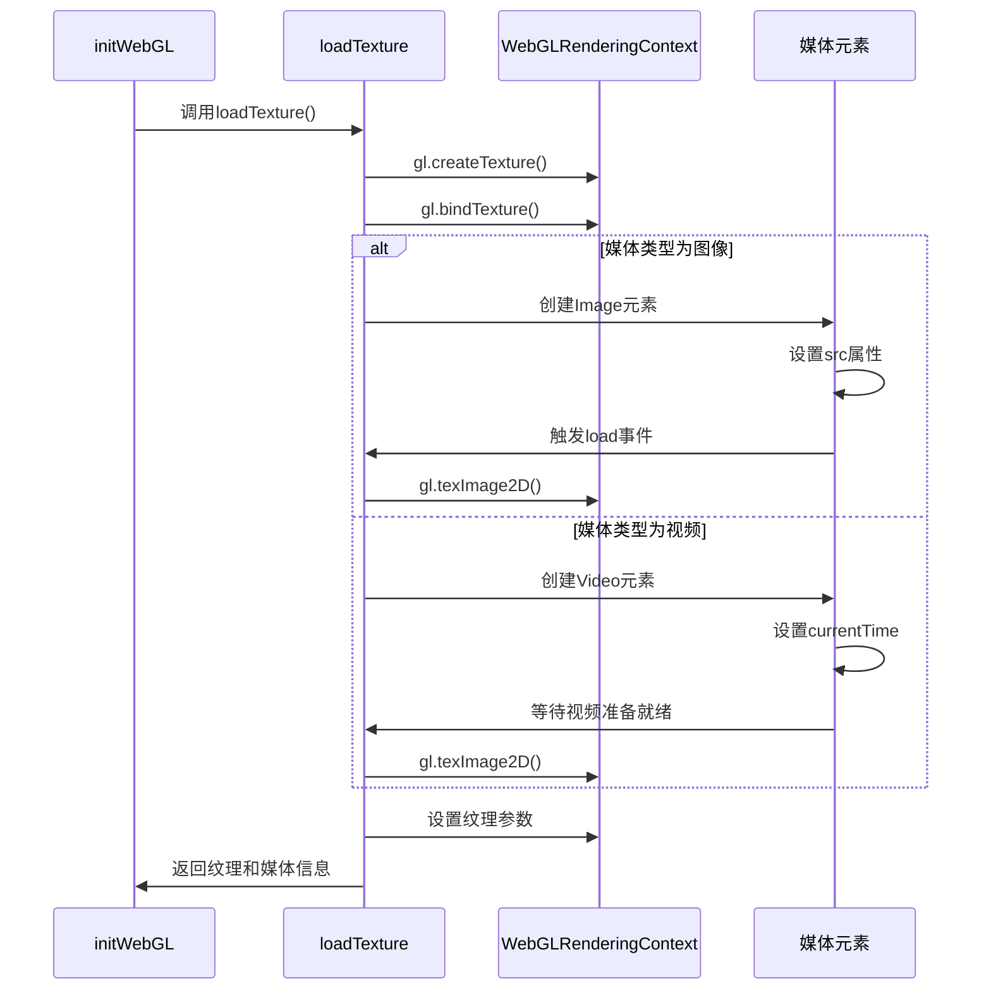
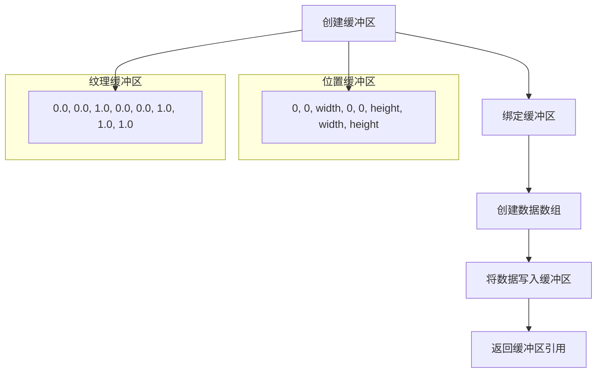
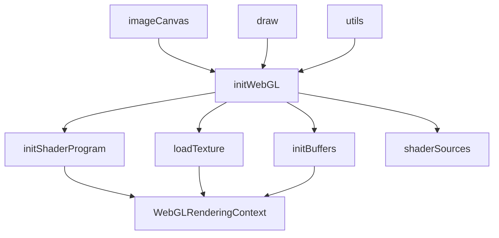
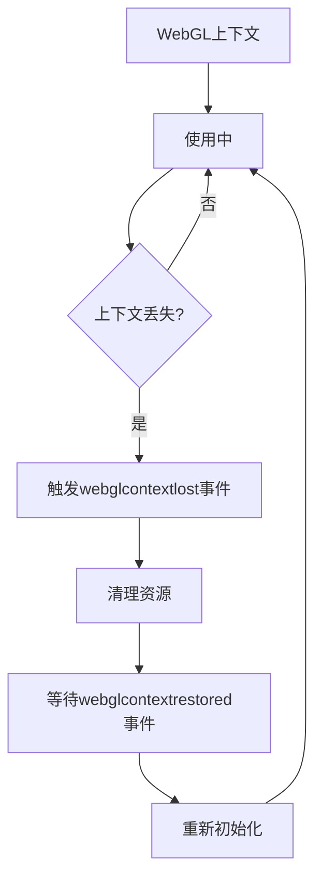

# WebGL上下文初始化

<cite>
**本文档引用的文件**   
- [initWebGL.ts](file://src/components/mediaEditor/webgl/initWebGL.ts)
- [initShaderProgram.ts](file://src/components/mediaEditor/webgl/initShaderProgram.ts)
- [loadTexture.ts](file://src/components/mediaEditor/webgl/loadTexture.ts)
- [initBuffers.ts](file://src/components/mediaEditor/webgl/initBuffers.ts)
- [draw.ts](file://src/components/mediaEditor/webgl/draw.ts)
- [imageCanvas.tsx](file://src/components/mediaEditor/canvas/imageCanvas.tsx)
- [utils.ts](file://src/components/mediaEditor/utils.ts)
- [shaderSources.ts](file://src/components/mediaEditor/webgl/shaderSources.ts)
- [appleMx.ts](file://src/environment/appleMx.ts)
</cite>

## 目录
1. [项目结构](#项目结构)
2. [核心组件](#核心组件)
3. [架构概述](#架构概述)
4. [详细组件分析](#详细组件分析)
5. [依赖分析](#依赖分析)
6. [性能考虑](#性能考虑)
7. [故障排除指南](#故障排除指南)
8. [结论](#结论)

## 项目结构

WebGL上下文初始化模块位于`src/components/mediaEditor/webgl/`目录下，是媒体编辑器功能的核心部分。该模块通过一系列专门的函数和组件来管理WebGL渲染上下文的创建、配置和使用。

**Diagram sources**
- [initWebGL.ts](file://src/components/mediaEditor/webgl/initWebGL.ts)
- [initShaderProgram.ts](file://src/components/mediaEditor/webgl/initShaderProgram.ts)
- [loadTexture.ts](file://src/components/mediaEditor/webgl/loadTexture.ts)
- [initBuffers.ts](file://src/components/mediaEditor/webgl/initBuffers.ts)
- [draw.ts](file://src/components/mediaEditor/webgl/draw.ts)
- [shaderSources.ts](file://src/components/mediaEditor/webgl/shaderSources.ts)

**Section sources**
- [initWebGL.ts](file://src/components/mediaEditor/webgl/initWebGL.ts)
- [initShaderProgram.ts](file://src/components/mediaEditor/webgl/initShaderProgram.ts)
- [loadTexture.ts](file://src/components/mediaEditor/webgl/loadTexture.ts)

## 核心组件

WebGL上下文初始化模块的核心是`initWebGL`函数，它负责协调整个初始化过程。该函数通过异步加载着色器源码和媒体纹理，然后创建和配置WebGL程序、缓冲区和相关参数。初始化完成后，返回一个包含所有必要渲染信息的`RenderingPayload`对象，供后续的绘制操作使用。

**Section sources**
- [initWebGL.ts](file://src/components/mediaEditor/webgl/initWebGL.ts#L21-L56)
- [initShaderProgram.ts](file://src/components/mediaEditor/webgl/initShaderProgram.ts#L3-L17)
- [loadTexture.ts](file://src/components/mediaEditor/webgl/loadTexture.ts#L29-L66)

## 架构概述

WebGL上下文初始化模块采用分层架构，将不同的功能分离到独立的文件中，以提高代码的可维护性和可测试性。该模块的架构设计遵循单一职责原则，每个组件都有明确的职责范围。

**Diagram sources**
- [initWebGL.ts](file://src/components/mediaEditor/webgl/initWebGL.ts)
- [initShaderProgram.ts](file://src/components/mediaEditor/webgl/initShaderProgram.ts)
- [loadTexture.ts](file://src/components/mediaEditor/webgl/loadTexture.ts)
- [initBuffers.ts](file://src/components/mediaEditor/webgl/initBuffers.ts)

## 详细组件分析

### initWebGL函数分析

`initWebGL`函数是整个WebGL初始化过程的入口点，它协调着色器程序的创建、纹理的加载以及各种缓冲区和参数的配置。

#### 初始化流程

**Diagram sources**
- [initWebGL.ts](file://src/components/mediaEditor/webgl/initWebGL.ts#L21-L56)

**Section sources**
- [initWebGL.ts](file://src/components/mediaEditor/webgl/initWebGL.ts#L21-L56)

### 着色器程序初始化

着色器程序的初始化由`initShaderProgram`函数负责，该函数处理顶点着色器和片段着色器的编译和链接过程。

#### 着色器初始化类图

**Diagram sources**
- [initShaderProgram.ts](file://src/components/mediaEditor/webgl/initShaderProgram.ts#L3-L32)

**Section sources**
- [initShaderProgram.ts](file://src/components/mediaEditor/webgl/initShaderProgram.ts#L3-L32)

### 纹理加载机制

纹理加载是WebGL初始化的关键步骤，`loadTexture`函数负责根据媒体类型（图像或视频）加载相应的纹理数据。

#### 纹理加载序列图

**Diagram sources**
- [loadTexture.ts](file://src/components/mediaEditor/webgl/loadTexture.ts#L29-L66)

**Section sources**
- [loadTexture.ts](file://src/components/mediaEditor/webgl/loadTexture.ts#L29-L66)

### 缓冲区初始化

缓冲区初始化由`initPositionBuffer`和`initTextureBuffer`两个函数完成，它们分别创建用于存储顶点位置和纹理坐标的缓冲区。

#### 缓冲区初始化流程

**Diagram sources**
- [initBuffers.ts](file://src/components/mediaEditor/webgl/initBuffers.ts#L1-L19)

**Section sources**
- [initBuffers.ts](file://src/components/mediaEditor/webgl/initBuffers.ts#L1-L19)

## 依赖分析

WebGL上下文初始化模块与其他组件有明确的依赖关系，这些依赖关系确保了模块的可维护性和可测试性。

**Diagram sources**
- [initWebGL.ts](file://src/components/mediaEditor/webgl/initWebGL.ts)
- [imageCanvas.tsx](file://src/components/mediaEditor/canvas/imageCanvas.tsx)
- [draw.ts](file://src/components/mediaEditor/webgl/draw.ts)

**Section sources**
- [initWebGL.ts](file://src/components/mediaEditor/webgl/initWebGL.ts)
- [imageCanvas.tsx](file://src/components/mediaEditor/canvas/imageCanvas.tsx)
- [draw.ts](file://src/components/mediaEditor/webgl/draw.ts)

## 性能考虑

WebGL上下文初始化模块在设计时考虑了多个性能因素，包括资源管理和内存使用效率。

### 上下文丢失和恢复机制

模块实现了上下文丢失和恢复机制，通过`cleanupWebGl`函数主动释放WebGL上下文资源，防止内存泄漏。

**Diagram sources**
- [utils.ts](file://src/components/mediaEditor/utils.ts#L159-L161)
- [imageCanvas.tsx](file://src/components/mediaEditor/canvas/imageCanvas.tsx#L83-L85)

**Section sources**
- [utils.ts](file://src/components/mediaEditor/utils.ts#L159-L161)
- [imageCanvas.tsx](file://src/components/mediaEditor/canvas/imageCanvas.tsx#L83-L85)

## 故障排除指南

### 初始化错误处理

当WebGL初始化过程中发生错误时，系统会通过日志记录详细的错误信息，帮助开发者诊断问题。

**Section sources**
- [initShaderProgram.ts](file://src/components/mediaEditor/webgl/initShaderProgram.ts#L12-L14)
- [initShaderProgram.ts](file://src/components/mediaEditor/webgl/initShaderProgram.ts#L26-L28)

### 浏览器兼容性处理

系统通过环境检测模块处理不同浏览器的兼容性问题，特别是针对Apple M1芯片的特殊处理。

**Section sources**
- [appleMx.ts](file://src/environment/appleMx.ts#L1-L16)

## 结论

WebGL上下文初始化模块通过清晰的分层架构和职责分离，实现了高效、可靠的WebGL渲染上下文管理。该模块不仅处理了WebGL的基本初始化流程，还考虑了上下文丢失恢复、性能优化和浏览器兼容性等高级特性，为媒体编辑器提供了强大的图形渲染能力。