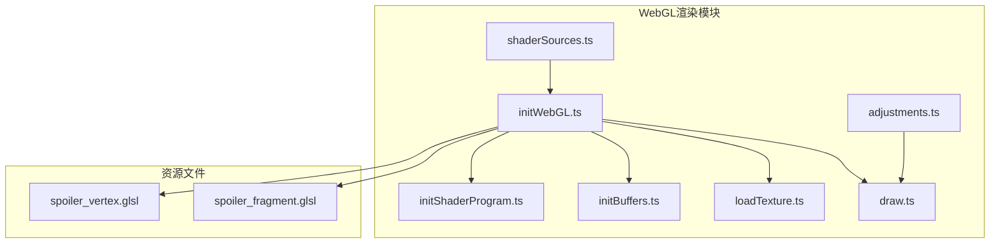
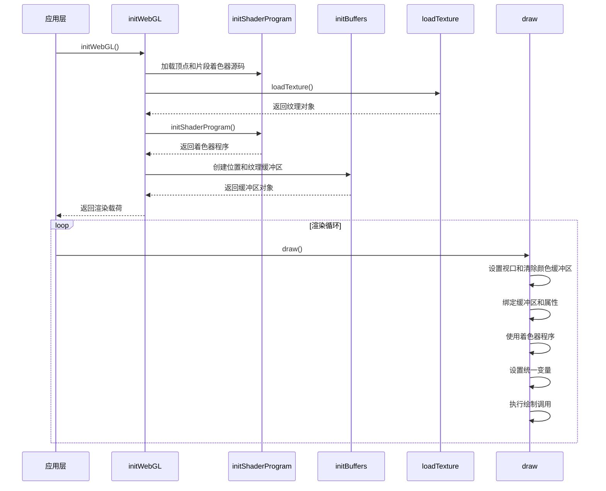
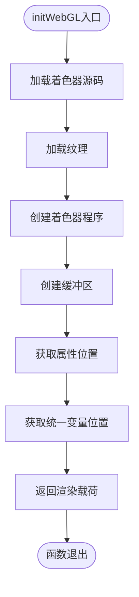
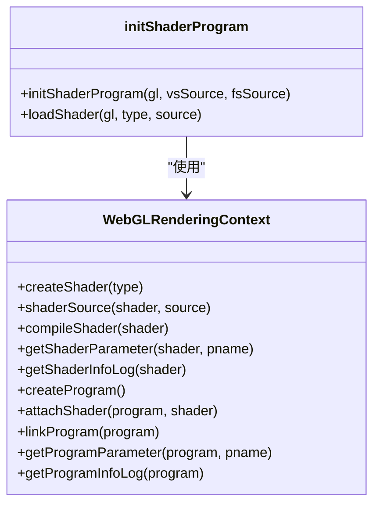
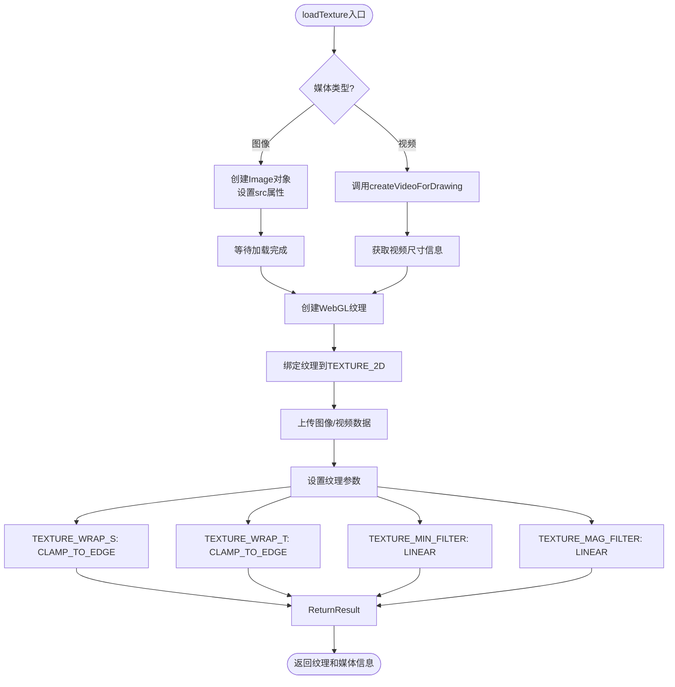
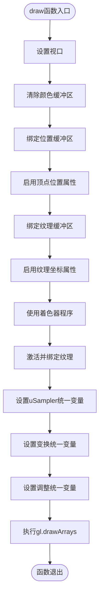
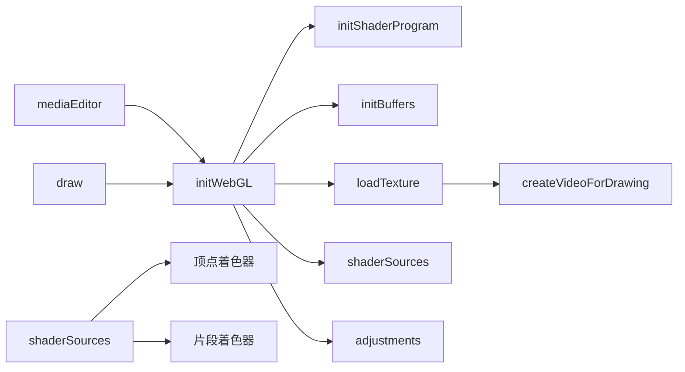

# WebGL渲染

<cite>
**本文档引用的文件**
- [initWebGL.ts](file://src/components/mediaEditor/webgl/initWebGL.ts)
- [initShaderProgram.ts](file://src/components/mediaEditor/webgl/initShaderProgram.ts)
- [initBuffers.ts](file://src/components/mediaEditor/webgl/initBuffers.ts)
- [loadTexture.ts](file://src/components/mediaEditor/webgl/loadTexture.ts)
- [draw.ts](file://src/components/mediaEditor/webgl/draw.ts)
- [shaderSources.ts](file://src/components/mediaEditor/webgl/shaderSources.ts)
- [adjustments.ts](file://src/components/mediaEditor/adjustments.ts)
- [spoiler_vertex.glsl](file://public/assets/img/spoiler_vertex.glsl)
- [spoiler_fragment.glsl](file://public/assets/img/spoiler_fragment.glsl)
</cite>

## 目录
1. [简介](#简介)
2. [项目结构](#项目结构)
3. [核心组件](#核心组件)
4. [架构概述](#架构概述)
5. [详细组件分析](#详细组件分析)
6. [依赖分析](#依赖分析)
7. [性能考虑](#性能考虑)
8. [故障排除指南](#故障排除指南)
9. [结论](#结论)

## 简介
本文档详细说明了媒体编辑器中WebGL渲染系统的实现。该系统为实时预览和滤镜效果提供了高性能的图形渲染能力，支持图像和视频的编辑操作。文档涵盖了WebGL上下文初始化、着色器程序编译、缓冲区管理、纹理加载等关键流程，以及渲染循环的实现和性能优化策略。

## 项目结构
媒体编辑器的WebGL渲染系统位于`src/components/mediaEditor/webgl`目录下，由多个模块化文件组成，每个文件负责特定的功能。系统与主媒体编辑器组件紧密集成，通过清晰的接口进行通信。



**Diagram sources**
- [initWebGL.ts](file://src/components/mediaEditor/webgl/initWebGL.ts)
- [initShaderProgram.ts](file://src/components/mediaEditor/webgl/initShaderProgram.ts)
- [initBuffers.ts](file://src/components/mediaEditor/webgl/initBuffers.ts)
- [loadTexture.ts](file://src/components/mediaEditor/webgl/loadTexture.ts)
- [draw.ts](file://src/components/mediaEditor/webgl/draw.ts)
- [shaderSources.ts](file://src/components/mediaEditor/webgl/shaderSources.ts)
- [adjustments.ts](file://src/components/mediaEditor/adjustments.ts)
- [spoiler_vertex.glsl](file://public/assets/img/spoiler_vertex.glsl)
- [spoiler_fragment.glsl](file://public/assets/img/spoiler_fragment.glsl)

**Section sources**
- [initWebGL.ts](file://src/components/mediaEditor/webgl/initWebGL.ts)
- [initShaderProgram.ts](file://src/components/mediaEditor/webgl/initShaderProgram.ts)
- [initBuffers.ts](file://src/components/mediaEditor/webgl/initBuffers.ts)

## 核心组件
WebGL渲染系统由几个核心组件构成：WebGL上下文初始化、着色器程序编译与链接、缓冲区创建与管理、纹理加载以及渲染循环。这些组件协同工作，实现了高效的图形渲染管道。

**Section sources**
- [initWebGL.ts](file://src/components/mediaEditor/webgl/initWebGL.ts)
- [draw.ts](file://src/components/mediaEditor/webgl/draw.ts)
- [shaderSources.ts](file://src/components/mediaEditor/webgl/shaderSources.ts)

## 架构概述
WebGL渲染系统采用模块化架构，各组件职责分明。系统首先初始化WebGL上下文，然后加载和编译着色器程序，创建必要的缓冲区和纹理，最后通过渲染循环持续更新画面。



**Diagram sources**
- [initWebGL.ts](file://src/components/mediaEditor/webgl/initWebGL.ts)
- [initShaderProgram.ts](file://src/components/mediaEditor/webgl/initShaderProgram.ts)
- [initBuffers.ts](file://src/components/mediaEditor/webgl/initBuffers.ts)
- [loadTexture.ts](file://src/components/mediaEditor/webgl/loadTexture.ts)
- [draw.ts](file://src/components/mediaEditor/webgl/draw.ts)

## 详细组件分析

### WebGL上下文初始化
WebGL上下文的初始化是渲染流程的第一步，由`initWebGL`函数负责。该函数协调各个子系统的初始化，创建完整的渲染环境。



**Diagram sources**
- [initWebGL.ts](file://src/components/mediaEditor/webgl/initWebGL.ts)

**Section sources**
- [initWebGL.ts](file://src/components/mediaEditor/webgl/initWebGL.ts)

### 着色器程序编译与链接
着色器程序的编译和链接过程由`initShaderProgram`函数实现，包括顶点着色器和片段着色器的独立编译以及最终的程序链接。



**Diagram sources**
- [initShaderProgram.ts](file://src/components/mediaEditor/webgl/initShaderProgram.ts)

**Section sources**
- [initShaderProgram.ts](file://src/components/mediaEditor/webgl/initShaderProgram.ts)

### 缓冲区创建与管理
缓冲区管理由`initBuffers`模块负责，创建用于存储顶点位置和纹理坐标的缓冲区对象。

```mermaid
flowchart TD
A([创建位置缓冲区]) --> B[gl.createBuffer()]
B --> C[gl.bindBuffer(ARRAY_BUFFER)]
C --> D[定义顶点位置数组]
D --> E[gl.bufferData(STATIC_DRAW)]
E --> F[返回缓冲区对象]
G([创建纹理缓冲区]) --> H[gl.createBuffer()]
H --> I[gl.bindBuffer(ARRAY_BUFFER)]
I --> J[定义纹理坐标数组]
J --> K[gl.bufferData(STATIC_DRAW)]
K --> L[返回缓冲区对象]
```

**Diagram sources**
- [initBuffers.ts](file://src/components/mediaEditor/webgl/initBuffers.ts)

**Section sources**
- [initBuffers.ts](file://src/components/mediaEditor/webgl/initBuffers.ts)

### 纹理加载机制
纹理加载功能由`loadTexture`函数实现，支持图像和视频两种媒体类型，确保纹理正确加载到GPU内存中。



**Diagram sources**
- [loadTexture.ts](file://src/components/mediaEditor/webgl/loadTexture.ts)

**Section sources**
- [loadTexture.ts](file://src/components/mediaEditor/webgl/loadTexture.ts)

### 渲染循环与性能优化
渲染循环由`draw`函数实现，负责每一帧的绘制操作，包括状态设置、统一变量更新和绘制调用。



**Diagram sources**
- [draw.ts](file://src/components/mediaEditor/webgl/draw.ts)

**Section sources**
- [draw.ts](file://src/components/mediaEditor/webgl/draw.ts)

## 依赖分析
WebGL渲染系统依赖于多个内部和外部模块，形成了清晰的依赖关系网络。



**Diagram sources**
- [initWebGL.ts](file://src/components/mediaEditor/webgl/initWebGL.ts)
- [loadTexture.ts](file://src/components/mediaEditor/webgl/loadTexture.ts)
- [adjustments.ts](file://src/components/mediaEditor/adjustments.ts)

**Section sources**
- [initWebGL.ts](file://src/components/mediaEditor/webgl/initWebGL.ts)
- [loadTexture.ts](file://src/components/mediaEditor/webgl/loadTexture.ts)
- [adjustments.ts](file://src/components/mediaEditor/adjustments.ts)

## 性能考虑
WebGL渲染系统在设计时充分考虑了性能因素，采用了多种优化策略来确保流畅的实时预览体验。

1. **缓冲区优化**：使用`gl.STATIC_DRAW`提示表明数据不会频繁更改，允许驱动程序进行优化。
2. **纹理参数优化**：设置合适的纹理包装和过滤参数，平衡质量和性能。
3. **异步加载**：纹理加载采用异步方式，避免阻塞主线程。
4. **批量操作**：将相关的WebGL调用分组，减少API调用开销。
5. **资源复用**：着色器程序、缓冲区和纹理在编辑会话期间保持创建状态，避免重复初始化。

## 故障排除指南
WebGL渲染系统包含完善的错误处理机制，帮助诊断和解决常见问题。

**Section sources**
- [initShaderProgram.ts](file://src/components/mediaEditor/webgl/initShaderProgram.ts)
- [loadTexture.ts](file://src/components/mediaEditor/webgl/loadTexture.ts)

## 结论
WebGL渲染系统为媒体编辑器提供了强大而高效的图形渲染能力。通过模块化设计和清晰的接口，系统实现了高性能的实时预览和滤镜效果。着色器程序的灵活性支持多种图像调整功能，而优化的渲染循环确保了流畅的用户体验。该系统展示了如何在Web环境中有效利用WebGL技术实现复杂的图形处理任务。