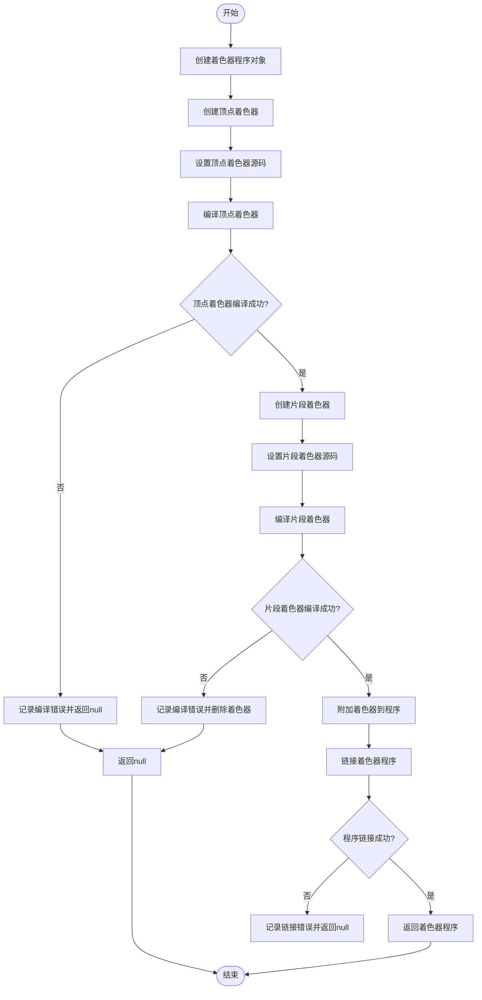
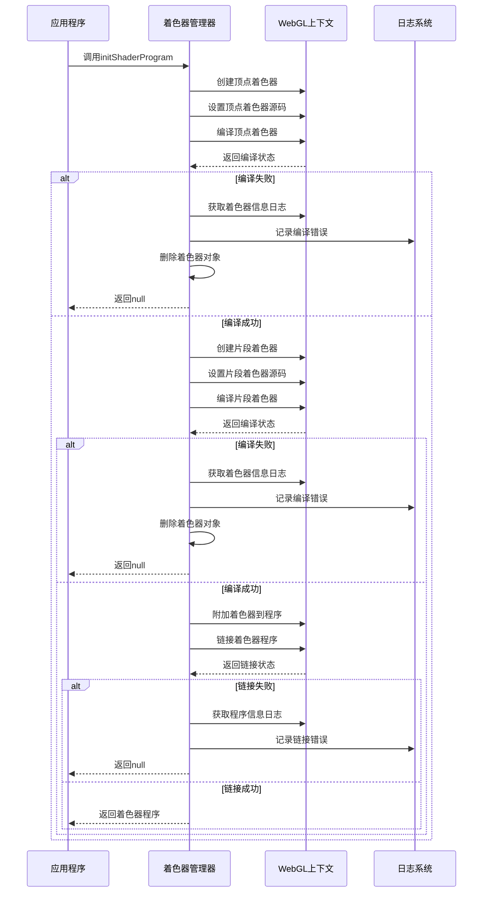
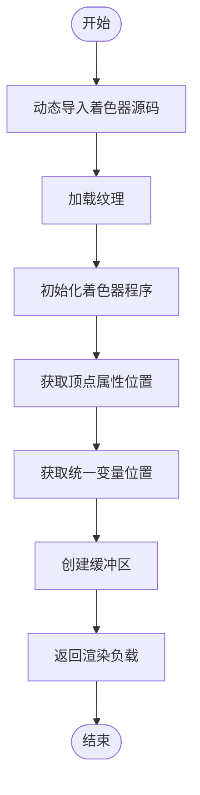
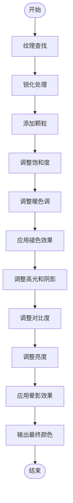

# 着色器程序管理

<cite>
**本文档中引用的文件**  
- [initShaderProgram.ts](file://src/components/mediaEditor/webgl/initShaderProgram.ts)
- [shaderSources.ts](file://src/components/mediaEditor/webgl/shaderSources.ts)
- [initWebGL.ts](file://src/components/mediaEditor/webgl/initWebGL.ts)
- [draw.ts](file://src/components/mediaEditor/webgl/draw.ts)
</cite>

## 目录
1. [简介](#简介)
2. [着色器程序初始化](#着色器程序初始化)
3. [着色器源码组织结构](#着色器源码组织结构)
4. [着色器编译与链接流程](#着色器编译与链接流程)
5. [错误捕获与调试机制](#错误捕获与调试机制)
6. [动态着色器切换机制](#动态着色器切换机制)
7. [着色器优化技巧](#着色器优化技巧)
8. [跨平台兼容性处理](#跨平台兼容性处理)

## 简介
本文档详细说明了着色器程序管理模块的实现机制，重点介绍 `initShaderProgram` 函数如何编译顶点和片段着色器、链接着色器程序以及验证程序状态。文档还解释了 `shaderSources.ts` 中预定义着色器代码的组织结构和用途，包括顶点着色器和片段着色器的GLSL代码实现。此外，文档描述了着色器编译错误的捕获和调试方法，以及动态着色器切换机制。最后，提供了着色器优化技巧和跨平台兼容性处理方案。

## 着色器程序初始化

`initShaderProgram` 函数是着色器程序管理的核心，负责创建和初始化WebGL着色器程序。该函数接收WebGL上下文、顶点着色器源码和片段着色器源码作为参数，返回一个已链接的着色器程序对象。

**Section sources**
- [initShaderProgram.ts](file://src/components/mediaEditor/webgl/initShaderProgram.ts#L3-L18)

## 着色器源码组织结构

`shaderSources.ts` 文件定义了顶点着色器和片段着色器的GLSL源码。顶点着色器负责处理顶点位置变换，包括旋转、缩放、翻转和归一化。片段着色器实现了多种图像调整效果，如饱和度、亮度、对比度、暖色调、褪色、阴影、高光、晕影、颗粒和锐化。

**Section sources**
- [shaderSources.ts](file://src/components/mediaEditor/webgl/shaderSources.ts#L1-L330)

## 着色器编译与链接流程

**Diagram sources**
- [initShaderProgram.ts](file://src/components/mediaEditor/webgl/initShaderProgram.ts#L3-L18)

**Section sources**
- [initShaderProgram.ts](file://src/components/mediaEditor/webgl/initShaderProgram.ts#L3-L33)

## 错误捕获与调试机制

着色器编译和链接过程中会进行状态检查，如果编译或链接失败，会通过 `gl.getShaderInfoLog` 和 `gl.getProgramInfoLog` 获取详细的错误信息，并使用日志系统记录错误。这种机制有助于开发者快速定位和修复着色器代码中的问题。

**Diagram sources**
- [initShaderProgram.ts](file://src/components/mediaEditor/webgl/initShaderProgram.ts#L26-L30)
- [initShaderProgram.ts](file://src/components/mediaEditor/webgl/initShaderProgram.ts#L12-L14)

**Section sources**
- [initShaderProgram.ts](file://src/components/mediaEditor/webgl/initShaderProgram.ts#L26-L30)
- [initShaderProgram.ts](file://src/components/mediaEditor/webgl/initShaderProgram.ts#L12-L14)

## 动态着色器切换机制

系统通过 `initWebGL` 函数实现动态着色器切换。该函数使用动态导入（`import('./shaderSources')`）加载着色器源码，然后调用 `initShaderProgram` 创建着色器程序。这种设计允许在运行时根据需要加载不同的着色器配置，支持灵活的图像处理效果切换。

**Diagram sources**
- [initWebGL.ts](file://src/components/mediaEditor/webgl/initWebGL.ts#L22-L26)

**Section sources**
- [initWebGL.ts](file://src/components/mediaEditor/webgl/initWebGL.ts#L21-L56)

## 着色器优化技巧

着色器代码采用了多种优化技术：
1. 使用 `highp` 精度保证计算精度
2. 合理组织代码结构，将常用功能封装为函数
3. 在片段着色器中按特定顺序应用调整效果，优化性能
4. 使用预计算常量减少运行时计算
5. 通过统一变量（uniforms）传递动态参数，提高灵活性

**Diagram sources**
- [shaderSources.ts](file://src/components/mediaEditor/webgl/shaderSources.ts#L315-L328)

**Section sources**
- [shaderSources.ts](file://src/components/mediaEditor/webgl/shaderSources.ts#L315-L328)
- [draw.ts](file://src/components/mediaEditor/webgl/draw.ts#L42-L52)

## 跨平台兼容性处理

系统通过以下方式确保跨平台兼容性：
1. 使用标准WebGL API，避免平台特定扩展
2. 在着色器代码中声明 `precision highp float` 确保精度一致性
3. 通过条件编译和特性检测处理不同设备的差异
4. 使用TypeScript类型系统确保API使用正确性
5. 在初始化过程中进行错误处理，优雅降级

**Section sources**
- [initShaderProgram.ts](file://src/components/mediaEditor/webgl/initShaderProgram.ts)
- [shaderSources.ts](file://src/components/mediaEditor/webgl/shaderSources.ts)
- [initWebGL.ts](file://src/components/mediaEditor/webgl/initWebGL.ts)