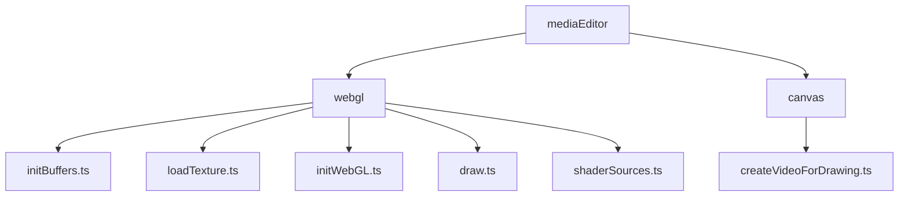
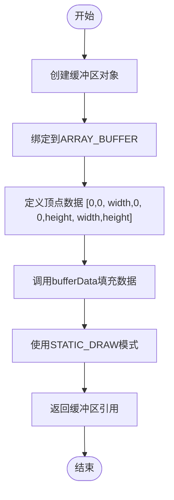
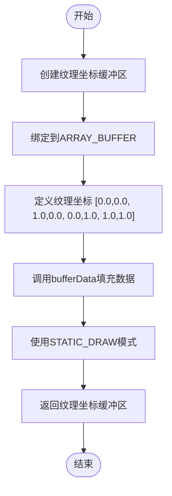
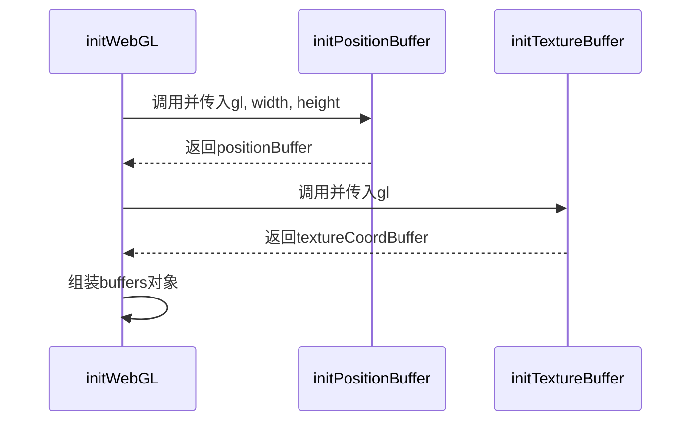
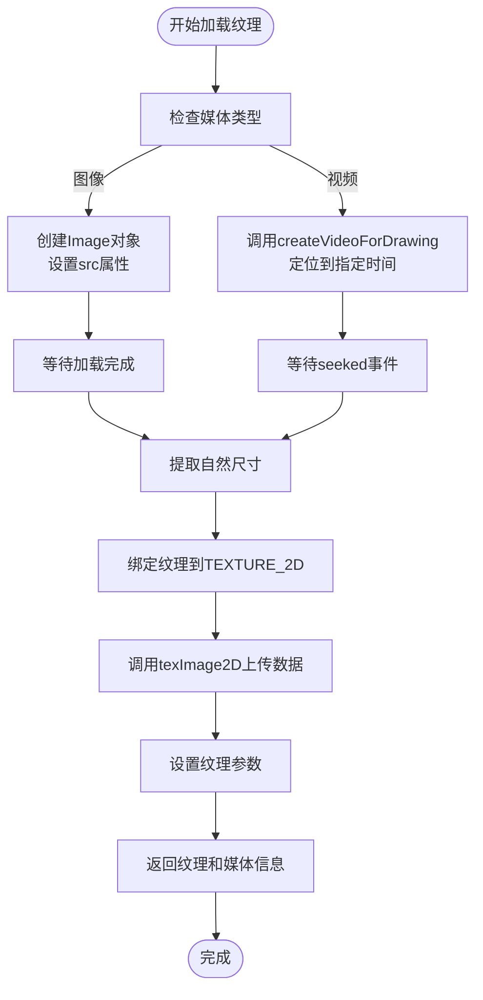
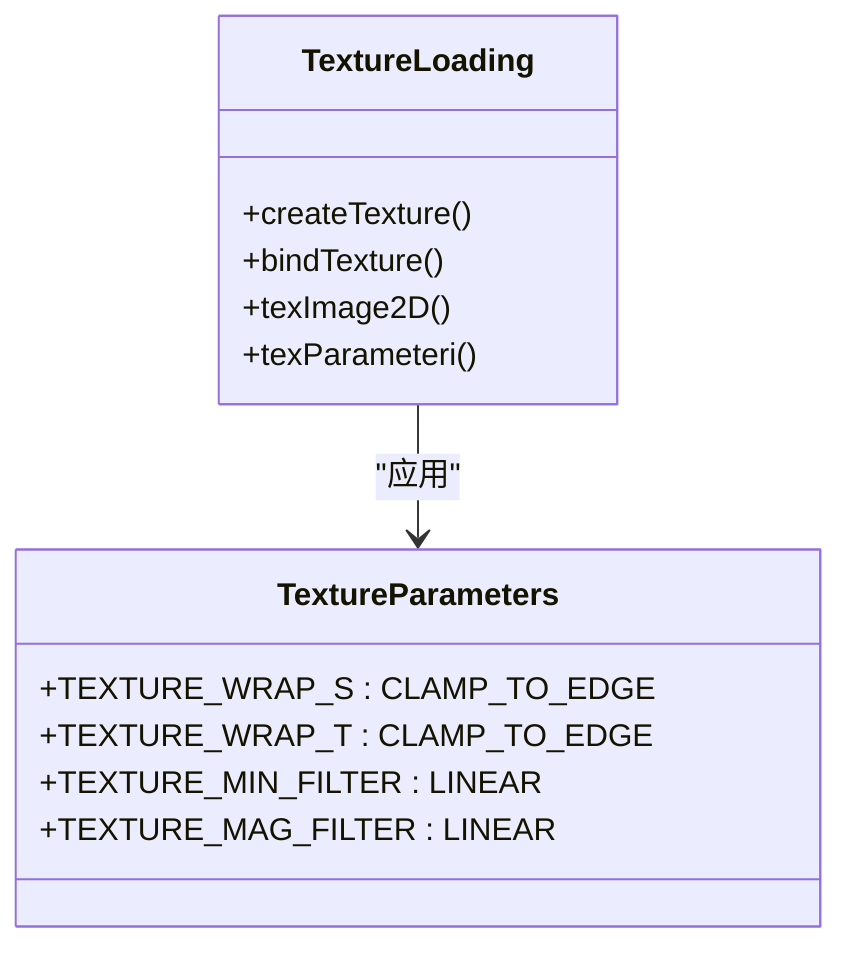
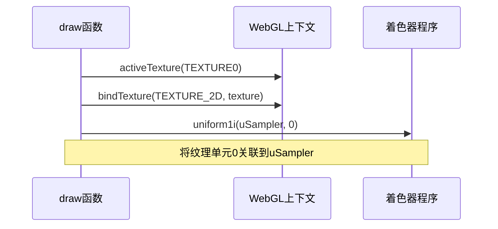
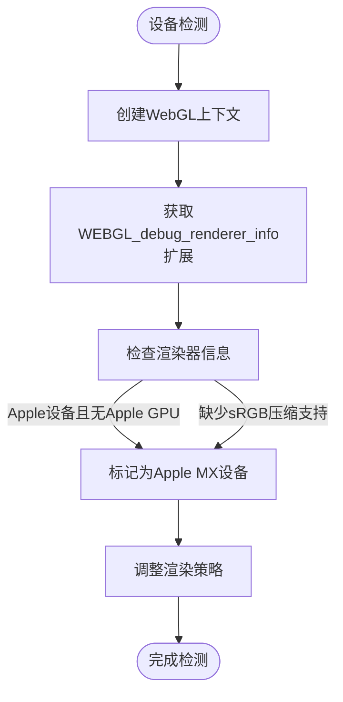
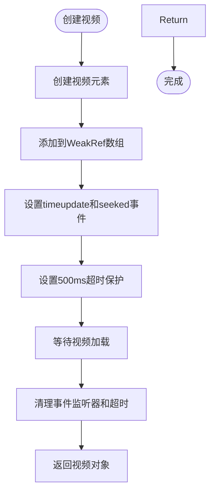
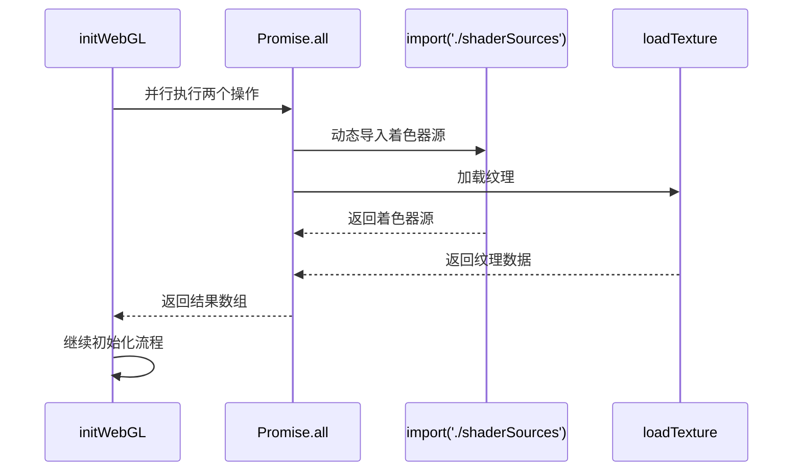

# 缓冲区与纹理管理

<cite>
**本文档引用的文件**  
- [initBuffers.ts](file://src/components/mediaEditor/webgl/initBuffers.ts)
- [loadTexture.ts](file://src/components/mediaEditor/webgl/loadTexture.ts)
- [initWebGL.ts](file://src/components/mediaEditor/webgl/initWebGL.ts)
- [draw.ts](file://src/components/mediaEditor/webgl/draw.ts)
- [shaderSources.ts](file://src/components/mediaEditor/webgl/shaderSources.ts)
- [createVideoForDrawing.ts](file://src/components/mediaEditor/canvas/createVideoForDrawing.ts)
</cite>

## 目录
1. [项目结构](#项目结构)
2. [核心组件](#核心组件)
3. [缓冲区初始化](#缓冲区初始化)
4. [纹理加载流程](#纹理加载流程)
5. [数据更新与纹理压缩](#数据更新与纹理压缩)
6. [内存管理与资源泄漏预防](#内存管理与资源泄漏预防)

## 项目结构

根据项目结构分析，缓冲区与纹理管理功能主要集中在 `src/components/mediaEditor/webgl` 目录下。该模块为媒体编辑器提供WebGL渲染支持，包含缓冲区初始化、纹理加载、着色器管理等功能。

**图示来源**  
- [initBuffers.ts](file://src/components/mediaEditor/webgl/initBuffers.ts)
- [loadTexture.ts](file://src/components/mediaEditor/webgl/loadTexture.ts)
- [createVideoForDrawing.ts](file://src/components/mediaEditor/canvas/createVideoForDrawing.ts)

**本节来源**  
- [src/components/mediaEditor/webgl](file://src/components/mediaEditor/webgl)
- [src/components/mediaEditor/canvas](file://src/components/mediaEditor/canvas)

## 核心组件

媒体编辑器的WebGL渲染系统由多个核心组件构成，包括缓冲区管理、纹理加载、着色器程序和渲染流程。这些组件协同工作，实现高效的图形渲染。

**本节来源**  
- [initWebGL.ts](file://src/components/mediaEditor/webgl/initWebGL.ts)
- [draw.ts](file://src/components/mediaEditor/webgl/draw.ts)

## 缓冲区初始化

### 顶点缓冲区对象(VBO)创建

`initPositionBuffer` 函数负责创建和配置顶点缓冲区对象(VBO)。该函数接收WebGL上下文和画布尺寸作为参数，创建一个包含四个顶点坐标(对应矩形的四个角点)的缓冲区。

**图示来源**  
- [initBuffers.ts](file://src/components/mediaEditor/webgl/initBuffers.ts#L1-L9)

### 纹理缓冲区对象创建

`initTextureBuffer` 函数创建纹理坐标缓冲区，用于映射纹理到几何图形。该缓冲区包含标准化的纹理坐标(0.0-1.0范围)，对应矩形的四个角点。

**图示来源**  
- [initBuffers.ts](file://src/components/mediaEditor/webgl/initBuffers.ts#L11-L19)

### 顶点数组对象(VAO)配置

在 `initWebGL` 函数中，通过调用 `initPositionBuffer` 和 `initTextureBuffer` 来创建和配置顶点数组对象(VAO)的相关缓冲区。VAO本身在WebGL中是隐式管理的，通过绑定和配置各个属性缓冲区来实现。

**图示来源**  
- [initWebGL.ts](file://src/components/mediaEditor/webgl/initWebGL.ts#L29-L32)
- [initBuffers.ts](file://src/components/mediaEditor/webgl/initBuffers.ts)

**本节来源**  
- [initBuffers.ts](file://src/components/mediaEditor/webgl/initBuffers.ts)
- [initWebGL.ts](file://src/components/mediaEditor/webgl/initWebGL.ts#L29-L32)

## 纹理加载流程

### 图像数据处理

`loadTexture` 函数是纹理加载的核心，它根据媒体类型(图像或视频)采用不同的处理流程。对于图像，创建Image对象并等待加载完成；对于视频，使用 `createVideoForDrawing` 创建视频元素并定位到指定时间点。

**图示来源**  
- [loadTexture.ts](file://src/components/mediaEditor/webgl/loadTexture.ts#L29-L66)

### 纹理参数设置

在纹理数据上传后，`loadTexture` 函数会设置一系列纹理参数，确保正确的渲染效果：

- **包装模式**: `CLAMP_TO_EDGE` 防止纹理边缘采样时的重复
- **过滤模式**: `LINEAR` 用于放大和缩小过滤，提供平滑的插值效果

**图示来源**  
- [loadTexture.ts](file://src/components/mediaEditor/webgl/loadTexture.ts#L61-L64)

### 纹理单元分配

在 `draw` 函数中，通过 `gl.activeTexture(gl.TEXTURE0)` 激活纹理单元0，然后将纹理绑定到 `TEXTURE_2D` 目标。最后通过 `gl.uniform1i(payload.uniforms.uSampler, 0)` 将纹理单元0关联到着色器中的采样器uniform。

**图示来源**  
- [draw.ts](file://src/components/mediaEditor/webgl/draw.ts#L31-L33)

### Mipmap生成

当前实现中未显式生成Mipmap，而是使用 `LINEAR` 过滤模式进行线性插值。Mipmap的生成通常通过 `gl.generateMipmap(gl.TEXTURE_2D)` 实现，但在此项目中未采用。

**本节来源**  
- [loadTexture.ts](file://src/components/mediaEditor/webgl/loadTexture.ts)
- [draw.ts](file://src/components/mediaEditor/webgl/draw.ts)

## 数据更新与纹理压缩

### 缓冲区数据更新策略

该系统采用静态绘制模式(`STATIC_DRAW`)，意味着缓冲区数据在初始化后通常不会频繁更新。当需要更新时，会重新调用 `bufferData` 方法填充新的数据。

对于顶点位置和纹理坐标，由于它们在媒体编辑场景中相对稳定，因此使用静态模式是合适的。如果需要频繁更新(如动画效果)，可以考虑使用 `DYNAMIC_DRAW` 或 `STREAM_DRAW` 模式。

### 纹理压缩技术应用

虽然代码中没有直接实现纹理压缩，但在 `environment/appleMx.ts` 中检测了WebGL扩展支持情况，特别是 `WEBGL_compressed_texture_s3tc_srgb` 扩展，这表明系统考虑了不同设备的纹理压缩支持。

**图示来源**  
- [appleMx.ts](file://src/environment/appleMx.ts)

**本节来源**  
- [loadTexture.ts](file://src/components/mediaEditor/webgl/loadTexture.ts)
- [appleMx.ts](file://src/environment/appleMx.ts)

## 内存管理与资源泄漏预防

### 资源泄漏预防措施

系统采用了多种措施来预防资源泄漏：

1. **弱引用管理**: 在 `createVideoForDrawing.ts` 中使用 `WeakRef` 来跟踪视频元素，便于调试和内存分析
2. **事件清理**: 使用 `{once: true}` 选项确保事件监听器只执行一次后自动移除
3. **超时保护**: 为异步操作设置超时，防止无限等待
4. **资源清理**: 通过 `handleVideoLeak` 工具函数确保视频资源正确释放

**图示来源**  
- [createVideoForDrawing.ts](file://src/components/mediaEditor/canvas/createVideoForDrawing.ts)

### 内存管理最佳实践

1. **异步资源加载**: 使用 `async/await` 模式处理异步资源加载，避免阻塞主线程
2. **Promise管理**: 使用 `deferredPromise` 工具创建可取消的Promise，便于资源管理
3. **中间件支持**: 通过 `middleware` 参数支持操作取消，提高资源使用的灵活性
4. **批量操作**: 在 `initWebGL` 中使用 `Promise.all` 并行加载着色器源和纹理，提高效率

**图示来源**  
- [initWebGL.ts](file://src/components/mediaEditor/webgl/initWebGL.ts#L22-L25)

**本节来源**  
- [createVideoForDrawing.ts](file://src/components/mediaEditor/canvas/createVideoForDrawing.ts)
- [initWebGL.ts](file://src/components/mediaEditor/webgl/initWebGL.ts)
- [loadTexture.ts](file://src/components/mediaEditor/webgl/loadTexture.ts)