# 媒体编辑器

<cite>
**本文档中引用的文件**  
- [mediaEditor.tsx](file://src/components/mediaEditor/mediaEditor.tsx)
- [context.ts](file://src/components/mediaEditor/context.ts)
- [mainCanvas.tsx](file://src/components/mediaEditor/canvas/mainCanvas.tsx)
- [imageCanvas.tsx](file://src/components/mediaEditor/canvas/imageCanvas.tsx)
- [initWebGL.ts](file://src/components/mediaEditor/webgl/initWebGL.ts)
- [draw.ts](file://src/components/mediaEditor/webgl/draw.ts)
- [shaderSources.ts](file://src/components/mediaEditor/webgl/shaderSources.ts)
- [createFinalResult.ts](file://src/components/mediaEditor/finalRender/createFinalResult.ts)
- [adjustmentsTab.tsx](file://src/components/mediaEditor/tabs/adjustmentsTab.tsx)
- [brushTab.tsx](file://src/components/mediaEditor/tabs/brushTab.tsx)
- [cropTab.tsx](file://src/components/mediaEditor/tabs/cropTab.tsx)
- [stickersTab.tsx](file://src/components/mediaEditor/tabs/stickersTab.tsx)
- [textTab.tsx](file://src/components/mediaEditor/tabs/textTab.tsx)
- [utils.ts](file://src/components/mediaEditor/utils.ts)
</cite>

## 目录
1. [简介](#简介)
2. [项目结构](#项目结构)
3. [核心组件](#核心组件)
4. [架构概述](#架构概述)
5. [详细组件分析](#详细组件分析)
6. [依赖分析](#依赖分析)
7. [性能考虑](#性能考虑)
8. [故障排除指南](#故障排除指南)
9. [结论](#结论)

## 简介
媒体编辑器组件提供了一套完整的图像和视频编辑功能，支持裁剪、旋转、滤镜调整、贴纸添加和文字叠加等操作。该组件利用WebGL进行高性能渲染，实现实时预览效果，并通过SolidJS框架管理复杂的用户交互和状态。编辑操作支持撤销/重做机制，最终结果通过离屏渲染生成，确保高质量输出。组件设计考虑了不同媒体格式和分辨率的适配，提供了优化的用户体验。

## 项目结构
媒体编辑器组件位于`src/components/mediaEditor`目录下，采用模块化设计，各功能分离清晰。主要包含canvas、finalRender、tabs、webgl等子目录，分别处理画布渲染、最终结果生成、编辑选项卡和WebGL渲染管道。核心文件包括mediaEditor.tsx（主组件）、context.ts（状态管理）、webgl目录（WebGL相关实现）和finalRender目录（结果生成逻辑）。

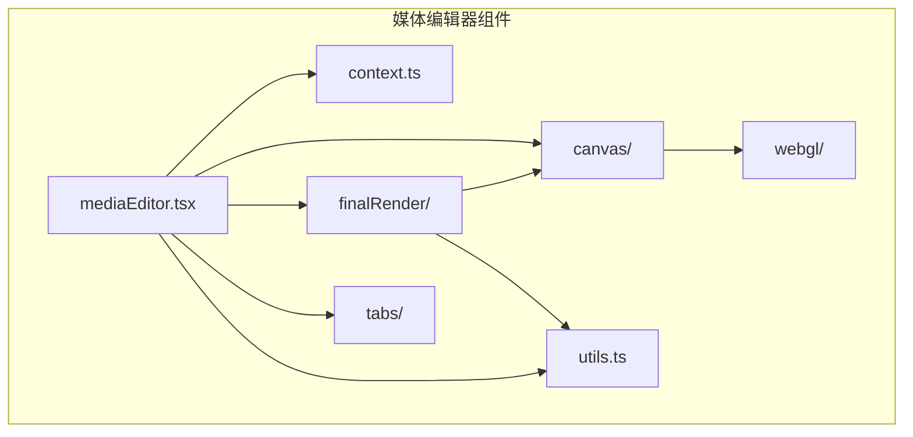

**图源**  
- [mediaEditor.tsx](file://src/components/mediaEditor/mediaEditor.tsx)
- [context.ts](file://src/components/mediaEditor/context.ts)

**本节来源**  
- [mediaEditor.tsx](file://src/components/mediaEditor/mediaEditor.tsx)
- [context.ts](file://src/components/mediaEditor/context.ts)

## 核心组件
媒体编辑器的核心组件包括主编辑器组件、状态管理上下文、画布渲染系统、WebGL渲染管道和最终结果生成器。这些组件协同工作，提供完整的编辑功能。主组件负责整体布局和用户交互，状态管理上下文维护编辑状态，画布渲染系统处理实时预览，WebGL渲染管道实现高性能图像处理，最终结果生成器负责输出编辑后的媒体文件。

**本节来源**  
- [mediaEditor.tsx](file://src/components/mediaEditor/mediaEditor.tsx)
- [context.ts](file://src/components/mediaEditor/context.ts)

## 架构概述
媒体编辑器采用分层架构，从上到下分为用户界面层、状态管理层、渲染层和数据处理层。用户界面层处理用户交互，状态管理层维护编辑状态并提供撤销/重做功能，渲染层利用WebGL实现高性能实时预览，数据处理层负责最终结果的生成和优化。各层之间通过清晰的接口通信，确保系统的可维护性和可扩展性。

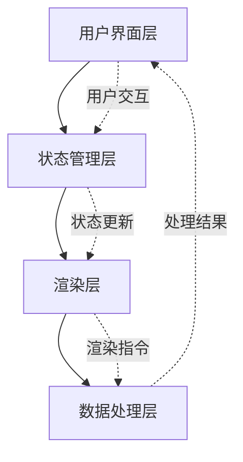

**图源**  
- [mediaEditor.tsx](file://src/components/mediaEditor/mediaEditor.tsx)
- [context.ts](file://src/components/mediaEditor/context.ts)

## 详细组件分析

### 主编辑器组件分析
主编辑器组件是整个系统的入口点，负责协调各个子组件的工作。它通过SolidJS的context机制提供全局状态，管理编辑器的生命周期，并处理用户关闭编辑器时的逻辑。组件支持热重载，确保开发过程中的流畅体验。

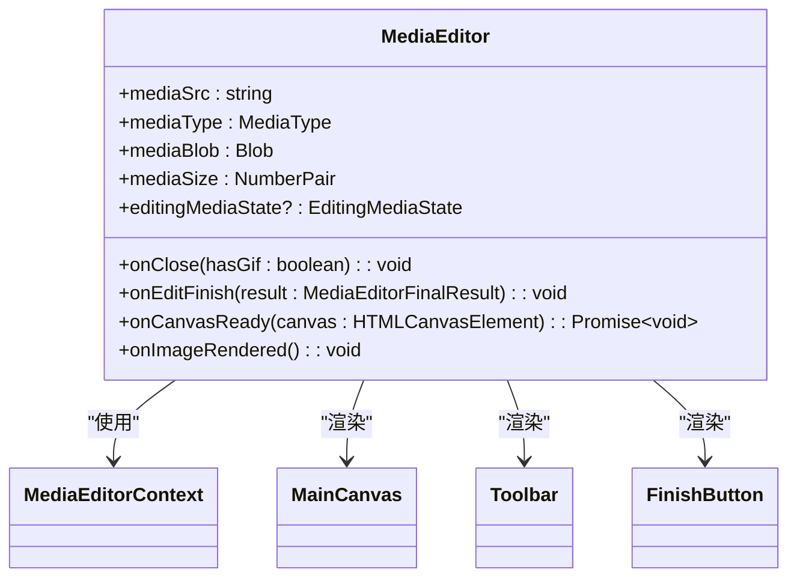

**图源**  
- [mediaEditor.tsx](file://src/components/mediaEditor/mediaEditor.tsx)

**本节来源**  
- [mediaEditor.tsx](file://src/components/mediaEditor/mediaEditor.tsx)

### 状态管理分析
状态管理是媒体编辑器的核心，通过SolidJS的store机制实现响应式状态管理。系统维护两个主要状态：编辑媒体状态（EditingMediaState）和编辑器状态（MediaEditorState）。编辑媒体状态包含所有可编辑的属性，如缩放、旋转、调整参数等，并支持撤销/重做功能。编辑器状态包含UI相关的状态，如当前选项卡、画布大小等。

```mermaid
classDiagram
class EditingMediaState {
+scale : number
+rotation : number
+translation : NumberPair
+flip : NumberPair
+currentImageRatio : number
+currentVideoTime : number
+videoCropStart : number
+videoCropLength : number
+videoThumbnailPosition : number
+videoMuted : boolean
+videoQuality : number
+adjustments : Record~AdjustmentKey, number~
+resizableLayers : ResizableLayer[]
+brushDrawnLines : BrushDrawnLine[]
+history : HistoryItem[]
+redoHistory : HistoryItem[]
}
class MediaEditorState {
+isReady : boolean
+pixelRatio : number
+renderingPayload? : RenderingPayload
+currentTab : string
+imageSize? : NumberPair
+canvasSize? : NumberPair
+fixedImageRatioKey? : string
+finalTransform : FinalTransform
+currentTextLayerInfo : TextLayerInfo
+selectedResizableLayer? : number
+stickersLayersInfo : Record~number, StickerRenderingInfo~
+imageCanvas? : HTMLCanvasElement
+brushCanvas? : HTMLCanvasElement
+currentBrush : {color : string, size : number, brush : string}
+previewBrushSize? : number
+resizeHandlesContainer? : HTMLDivElement
+isAdjusting : boolean
+isMoving : boolean
+isPlaying : boolean
}
class HistoryItem {
+path : KeyofEditingMediaState
+newValue : any
+oldValue : any
+findBy? : {id : any}
}
EditingMediaState --> HistoryItem : "包含"
```

**图源**  
- [context.ts](file://src/components/mediaEditor/context.ts)

**本节来源**  
- [context.ts](file://src/components/mediaEditor/context.ts)

### 画布渲染系统分析
画布渲染系统负责实现实时预览功能，由多个子组件协同工作。MainCanvas组件作为容器，协调各个渲染层的显示。ImageCanvas组件使用WebGL渲染基础图像，应用各种调整效果。BrushCanvas组件处理画笔绘制，ResizableLayers组件管理可调整大小的图层（如贴纸和文字），其他组件如CropHandles和RotationWheel提供交互式控件。

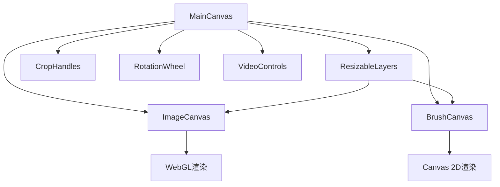

**图源**  
- [mainCanvas.tsx](file://src/components/mediaEditor/canvas/mainCanvas.tsx)
- [imageCanvas.tsx](file://src/components/mediaEditor/canvas/imageCanvas.tsx)

**本节来源**  
- [mainCanvas.tsx](file://src/components/mediaEditor/canvas/mainCanvas.tsx)
- [imageCanvas.tsx](file://src/components/mediaEditor/canvas/imageCanvas.tsx)

### WebGL渲染管道分析
WebGL渲染管道是媒体编辑器性能的关键，负责高效处理图像和视频的渲染。系统通过initWebGL函数初始化WebGL环境，加载着色器程序，创建缓冲区，并设置纹理。draw函数负责执行实际的渲染操作，应用各种调整效果。着色器代码包含顶点着色器和片段着色器，分别处理几何变换和像素处理。

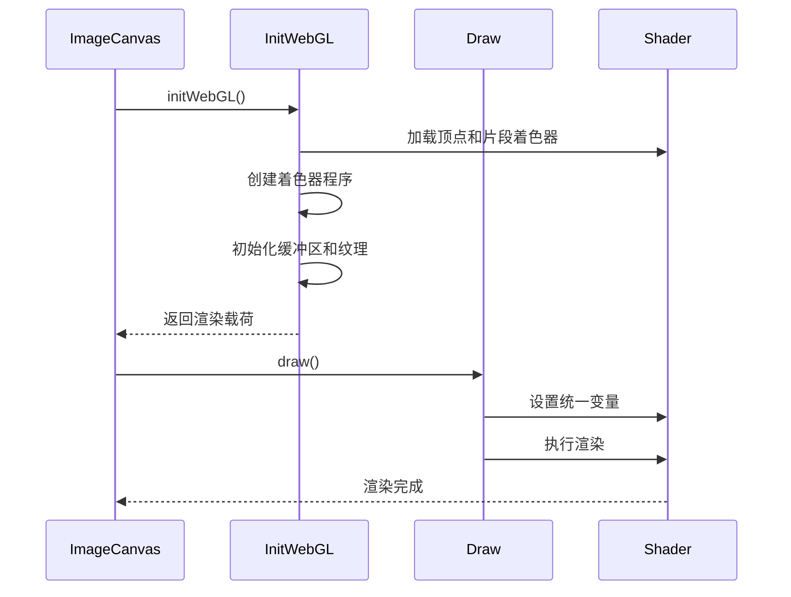

**图源**  
- [imageCanvas.tsx](file://src/components/mediaEditor/canvas/imageCanvas.tsx)
- [initWebGL.ts](file://src/components/mediaEditor/webgl/initWebGL.ts)
- [draw.ts](file://src/components/mediaEditor/webgl/draw.ts)

**本节来源**  
- [imageCanvas.tsx](file://src/components/mediaEditor/canvas/imageCanvas.tsx)
- [initWebGL.ts](file://src/components/mediaEditor/webgl/initWebGL.ts)
- [draw.ts](file://src/components/mediaEditor/webgl/draw.ts)

### 最终结果生成分析
最终结果生成器负责将编辑后的媒体输出为最终文件。系统根据媒体类型和编辑内容决定输出格式（图像、视频或GIF）。对于视频和包含动画贴纸的媒体，使用renderToActualVideo函数生成视频文件；对于静态图像，使用renderToImage函数生成图像文件。生成过程使用离屏渲染，确保高质量输出，并在完成后清理WebGL资源。

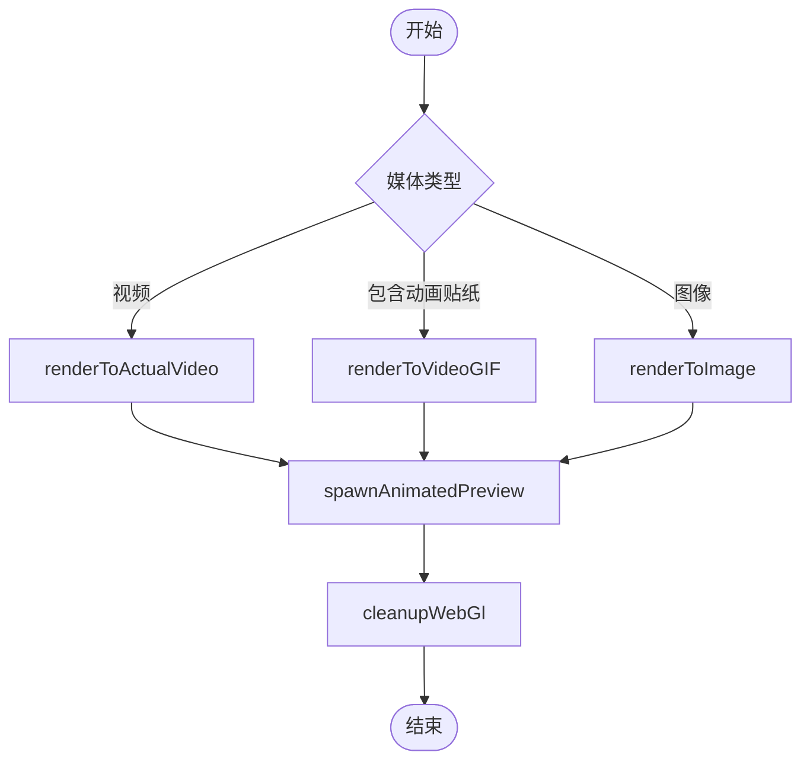

**图源**  
- [createFinalResult.ts](file://src/components/mediaEditor/finalRender/createFinalResult.ts)

**本节来源**  
- [createFinalResult.ts](file://src/components/mediaEditor/finalRender/createFinalResult.ts)

### 编辑选项卡分析
编辑选项卡系统提供用户友好的界面，支持多种编辑功能。每个选项卡（调整、画笔、裁剪、贴纸、文字）都有独立的组件，处理特定的编辑功能。系统通过状态管理上下文共享数据，确保各选项卡之间的协调一致。选项卡之间的切换通过修改currentTab状态实现，提供流畅的用户体验。

#### 调整选项卡
调整选项卡提供亮度、对比度、饱和度等图像调整功能。每个调整参数都有对应的范围输入控件，用户可以通过滑动条实时调整效果。系统使用防抖机制优化性能，避免频繁的渲染操作。

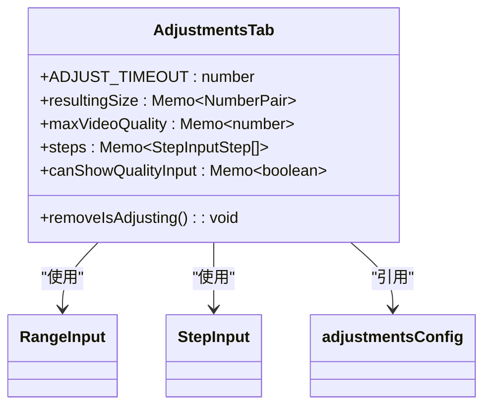

**图源**  
- [adjustmentsTab.tsx](file://src/components/mediaEditor/tabs/adjustmentsTab.tsx)

**本节来源**  
- [adjustmentsTab.tsx](file://src/components/mediaEditor/tabs/adjustmentsTab.tsx)

#### 画笔选项卡
画笔选项卡提供多种画笔工具，包括钢笔、箭头、画笔、霓虹笔、模糊和橡皮擦。用户可以选择画笔颜色、大小和类型。系统使用createStoredColor函数持久化用户的颜色选择，提供一致的用户体验。

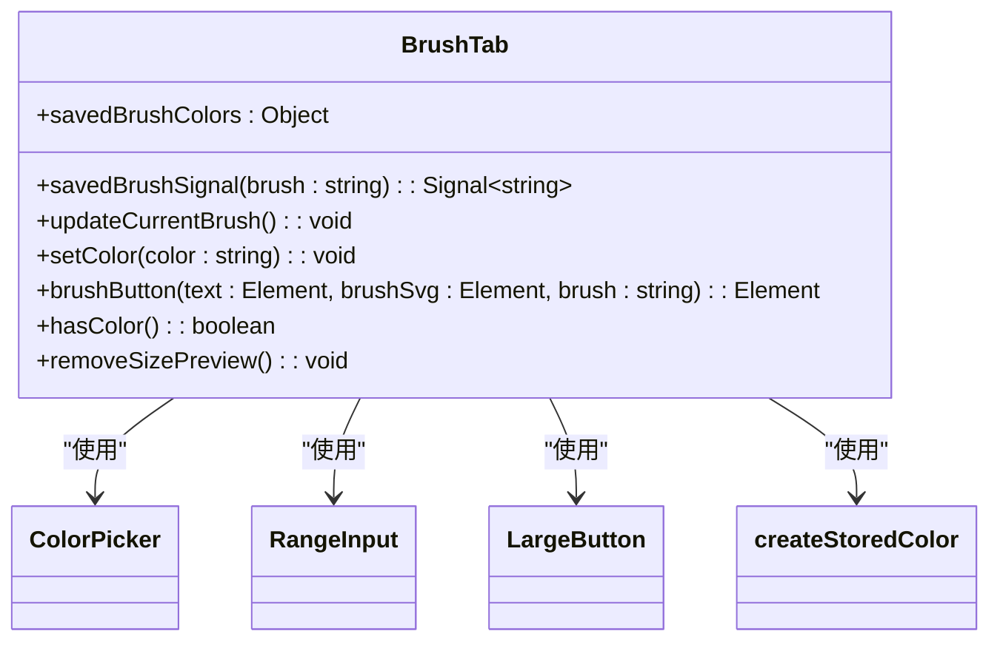

**图源**  
- [brushTab.tsx](file://src/components/mediaEditor/tabs/brushTab.tsx)

**本节来源**  
- [brushTab.tsx](file://src/components/mediaEditor/tabs/brushTab.tsx)

#### 裁剪选项卡
裁剪选项卡提供多种预设宽高比选项，包括1:1、3:2、4:3、5:4、7:5和16:9。用户可以选择自由裁剪或原始比例。系统使用SVG图标直观显示各种宽高比，提供良好的视觉反馈。

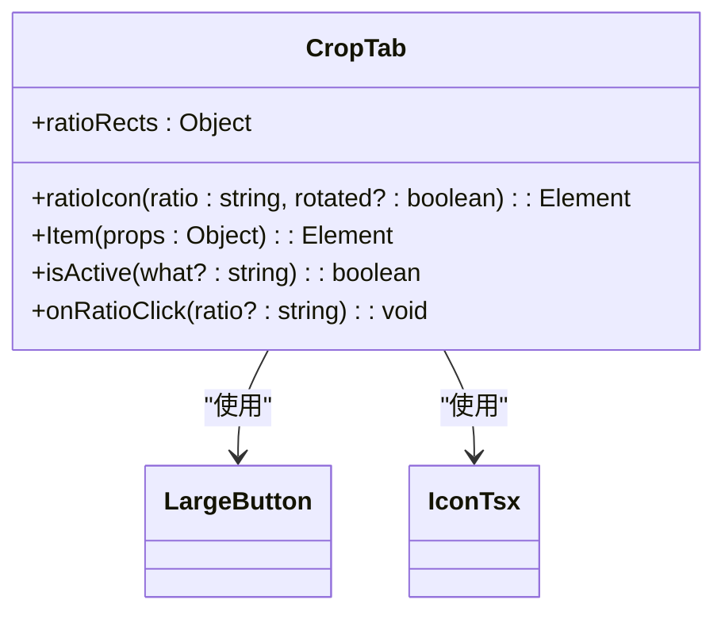

**图源**  
- [cropTab.tsx](file://src/components/mediaEditor/tabs/cropTab.tsx)

**本节来源**  
- [cropTab.tsx](file://src/components/mediaEditor/tabs/cropTab.tsx)

#### 贴纸选项卡
贴纸选项卡提供丰富的贴纸选择，包括最近使用、表情包集合和搜索功能。系统使用懒加载技术优化性能，只在需要时加载贴纸资源。用户可以通过点击贴纸将其添加到编辑画布中，系统会自动创建新的可调整图层。

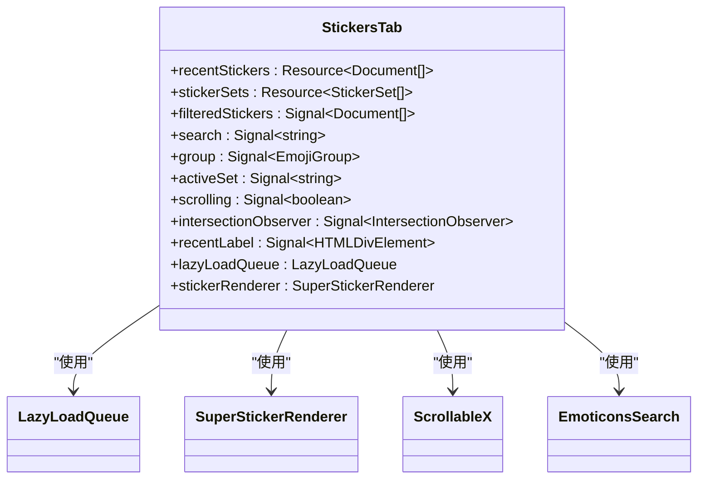

**图源**  
- [stickersTab.tsx](file://src/components/mediaEditor/tabs/stickersTab.tsx)

**本节来源**  
- [stickersTab.tsx](file://src/components/mediaEditor/tabs/stickersTab.tsx)

#### 文字选项卡
文字选项卡提供文字叠加功能，支持多种字体、对齐方式、样式和颜色。用户可以调整文字大小，并选择轮廓或背景样式。系统使用fontInfoMap对象管理字体信息，确保正确的字体渲染。

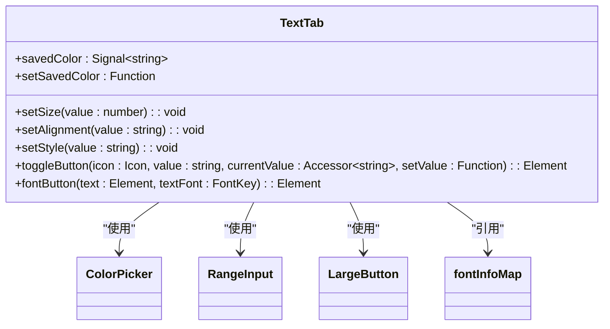

**图源**  
- [textTab.tsx](file://src/components/mediaEditor/tabs/textTab.tsx)

**本节来源**  
- [textTab.tsx](file://src/components/mediaEditor/tabs/textTab.tsx)

## 依赖分析
媒体编辑器组件依赖于多个外部库和内部模块。主要依赖包括SolidJS框架（用于UI和状态管理）、WebGL（用于高性能渲染）、以及项目内部的辅助函数库。系统通过清晰的模块化设计，降低了组件间的耦合度，提高了代码的可维护性。

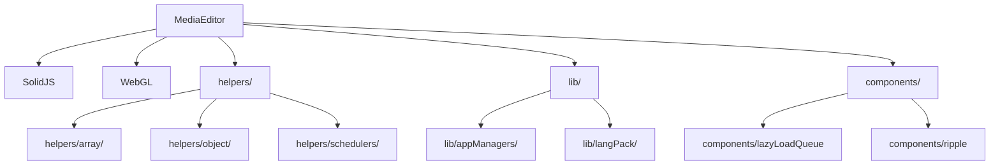

**图源**  
- [mediaEditor.tsx](file://src/components/mediaEditor/mediaEditor.tsx)
- [context.ts](file://src/components/mediaEditor/context.ts)

**本节来源**  
- [mediaEditor.tsx](file://src/components/mediaEditor/mediaEditor.tsx)
- [context.ts](file://src/components/mediaEditor/context.ts)

## 性能考虑
媒体编辑器在设计时充分考虑了性能优化。系统使用WebGL进行硬件加速渲染，确保实时预览的流畅性。通过离屏渲染技术，避免了主UI线程的阻塞。懒加载和资源释放机制有效管理内存使用，防止内存泄漏。防抖和节流技术优化了频繁的状态更新，提高了整体性能。

## 故障排除指南
当遇到媒体编辑器问题时，可以按照以下步骤进行排查：
1. 检查浏览器是否支持WebGL
2. 确认媒体文件格式是否受支持
3. 检查控制台是否有JavaScript错误
4. 验证网络连接是否稳定
5. 尝试清除浏览器缓存
6. 检查系统资源是否充足

## 结论
媒体编辑器组件提供了一套完整、高性能的图像和视频编辑解决方案。通过合理的架构设计和性能优化，系统能够处理复杂的编辑任务，同时保持流畅的用户体验。组件的模块化设计使其易于维护和扩展，为未来的功能添加提供了良好的基础。