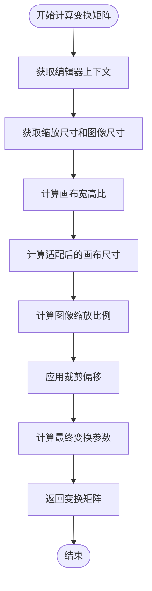
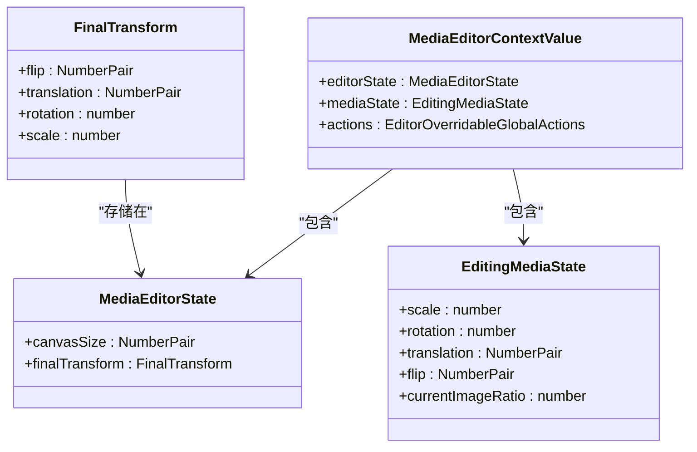
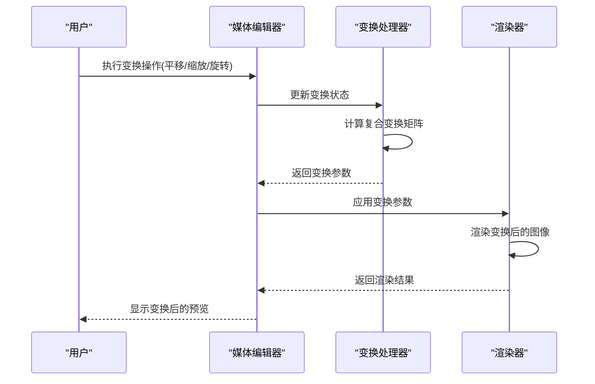
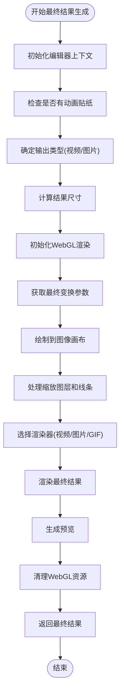
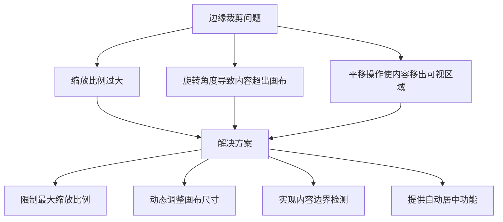
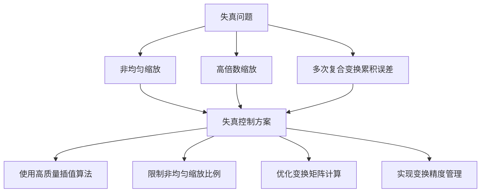

# 变换应用

<cite>
**本文档中引用的文件**  
- [getResultTransform.ts](file://src/components/mediaEditor/finalRender/getResultTransform.ts)
- [createFinalResult.ts](file://src/components/mediaEditor/finalRender/createFinalResult.ts)
- [useFinalTransform.ts](file://src/components/mediaEditor/canvas/useFinalTransform.ts)
- [useCropOffset.ts](file://src/components/mediaEditor/canvas/useCropOffset.ts)
- [draw.ts](file://src/components/mediaEditor/webgl/draw.ts)
- [renderToImage.ts](file://src/components/mediaEditor/finalRender/renderToImage.ts)
- [renderToActualVideo.ts](file://src/components/mediaEditor/finalRender/renderToActualVideo.ts)
- [getScaledLayersAndLines.ts](file://src/components/mediaEditor/finalRender/getScaledLayersAndLines.ts)
- [context.ts](file://src/components/mediaEditor/context.ts)
- [utils.ts](file://src/components/mediaEditor/utils.ts)
- [shaderSources.ts](file://src/components/mediaEditor/webgl/shaderSources.ts)
- [adjustments.ts](file://src/components/mediaEditor/adjustments.ts)
</cite>

## 目录
1. [简介](#简介)
2. [变换矩阵计算](#变换矩阵计算)
3. [复合变换处理](#复合变换处理)
4. [最终结果集成](#最终结果集成)
5. [常见问题解决方案](#常见问题解决方案)
6. [结论](#结论)

## 简介
媒体编辑器变换应用功能允许用户对媒体内容进行平移、缩放、旋转和翻转等变换操作。本文档详细说明了`getResultTransform`函数如何将用户的编辑变换应用于最终渲染，解释了变换矩阵的计算和应用过程，以及如何处理复合变换。同时，文档描述了`createFinalResult`中变换集成的实现细节，并提供了常见变换问题的解决方案。

## 变换矩阵计算

变换矩阵的计算是媒体编辑器核心功能之一，它将用户的编辑操作（平移、缩放、旋转、翻转）转换为最终渲染所需的变换参数。`getResultTransform`函数负责计算这些变换参数。



**变换矩阵计算流程图**

**Diagram sources**
- [getResultTransform.ts](file://src/components/mediaEditor/finalRender/getResultTransform.ts#L15-L68)

**变换矩阵计算**
- [getResultTransform.ts](file://src/components/mediaEditor/finalRender/getResultTransform.ts#L15-L68)

## 复合变换处理

复合变换处理涉及多个变换操作的组合应用，包括平移、缩放、旋转和翻转。系统需要正确地组合这些变换以确保最终渲染效果符合用户预期。



**变换数据结构类图**

**Diagram sources**
- [useFinalTransform.ts](file://src/components/mediaEditor/canvas/useFinalTransform.ts#L10-L15)
- [context.ts](file://src/components/mediaEditor/context.ts#L10-L149)

复合变换的处理需要考虑变换的顺序和相互影响。系统通过`useFinalTransform`钩子函数来管理这些变换状态，并在用户操作时实时更新。



**复合变换处理序列图**

**Diagram sources**
- [useFinalTransform.ts](file://src/components/mediaEditor/canvas/useFinalTransform.ts#L17-L183)
- [draw.ts](file://src/components/mediaEditor/webgl/draw.ts#L15-L55)

**复合变换处理**
- [useFinalTransform.ts](file://src/components/mediaEditor/canvas/useFinalTransform.ts#L17-L183)
- [draw.ts](file://src/components/mediaEditor/webgl/draw.ts#L15-L55)

## 最终结果集成

最终结果集成是将所有变换应用到媒体内容并生成最终输出的过程。`createFinalResult`函数负责协调整个集成过程，包括变换应用、渲染和输出生成。



**最终结果集成流程图**

**Diagram sources**
- [createFinalResult.ts](file://src/components/mediaEditor/finalRender/createFinalResult.ts#L48-L194)

最终结果集成过程涉及多个步骤的协调，包括：

1. **上下文初始化**：获取媒体编辑器的当前状态和配置
2. **输出类型确定**：根据媒体类型和内容特征确定输出格式
3. **尺寸计算**：计算最终输出的尺寸和质量参数
4. **变换应用**：将用户的编辑变换应用到媒体内容
5. **渲染执行**：使用适当的渲染器生成最终输出
6. **资源清理**：释放WebGL等资源以避免内存泄漏

```mermaid
classDiagram
class MediaEditorFinalResult {
+preview : Blob
+getResult : () => Promise<MediaEditorFinalResultPayload>
+cancel : () => void
+isVideo : boolean
+width : number
+height : number
+originalSrc : string
+creationProgress : StandaloneSignal<number>
}
class MediaEditorFinalResultPayload {
+blob : Blob
+hasSound : boolean
+thumb : {blob : Blob, size : MediaSize}
}
class RenderingPayload {
+media : {width : number, height : number, video? : HTMLVideoElement}
+texture : WebGLTexture
+program : WebGLProgram
+buffers : {position : WebGLBuffer, texture : WebGLBuffer}
+attribs : {vertexPosition : number, textureCoord : number}
+uniforms : Record<string, WebGLUniformLocation>
}
MediaEditorFinalResult --> MediaEditorFinalResultPayload : "包含"
createFinalResult --> MediaEditorFinalResult : "生成"
initWebGL --> RenderingPayload : "生成"
```

**最终结果数据结构类图**

**Diagram sources**
- [createFinalResult.ts](file://src/components/mediaEditor/finalRender/createFinalResult.ts#L23-L44)
- [initWebGL.ts](file://src/components/mediaEditor/webgl/initWebGL.ts)

**最终结果集成**
- [createFinalResult.ts](file://src/components/mediaEditor/finalRender/createFinalResult.ts#L48-L194)
- [getScaledLayersAndLines.ts](file://src/components/mediaEditor/finalRender/getScaledLayersAndLines.ts#L9-L47)

## 常见问题解决方案

在媒体编辑器变换应用中，可能会遇到一些常见问题，如边缘裁剪、失真控制等。本节提供这些问题的解决方案。

### 边缘裁剪问题

边缘裁剪问题通常发生在用户进行大幅度缩放或旋转操作时，导致图像内容被裁剪掉。



**边缘裁剪问题分析图**

**Diagram sources**
- [useFinalTransform.ts](file://src/components/mediaEditor/canvas/useFinalTransform.ts#L17-L183)
- [utils.ts](file://src/components/mediaEditor/utils.ts#L35-L40)

解决方案包括：
- 限制最大缩放比例，防止过度缩放导致内容丢失
- 动态调整画布尺寸以适应变换后的内容
- 实现内容边界检测，确保所有内容都在可视区域内
- 提供自动居中功能，帮助用户快速定位内容

### 失真控制

失真控制是确保变换后图像质量的关键，特别是在处理非均匀缩放和复杂变换时。



**失真控制方案图**

**Diagram sources**
- [draw.ts](file://src/components/mediaEditor/webgl/draw.ts#L15-L55)
- [shaderSources.ts](file://src/components/mediaEditor/webgl/shaderSources.ts)

失真控制的具体措施包括：
- 使用WebGL进行高质量渲染，利用GPU的插值能力
- 在着色器中实现精确的变换计算，减少累积误差
- 优化变换矩阵的计算过程，确保数值稳定性
- 实现变换精度管理，平衡性能和质量

**常见问题解决方案**
- [useFinalTransform.ts](file://src/components/mediaEditor/canvas/useFinalTransform.ts#L17-L183)
- [draw.ts](file://src/components/mediaEditor/webgl/draw.ts#L15-L55)
- [utils.ts](file://src/components/mediaEditor/utils.ts#L35-L40)

## 结论
媒体编辑器变换应用功能通过精确的变换矩阵计算和复合变换处理，实现了用户友好的媒体编辑体验。系统通过`getResultTransform`函数计算最终的变换参数，并在`createFinalResult`中集成这些变换以生成最终输出。针对常见的边缘裁剪和失真问题，系统提供了相应的解决方案，确保变换效果的质量和可靠性。整体架构设计合理，代码结构清晰，为媒体编辑功能提供了坚实的基础。