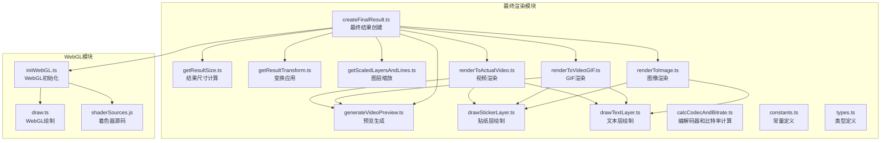
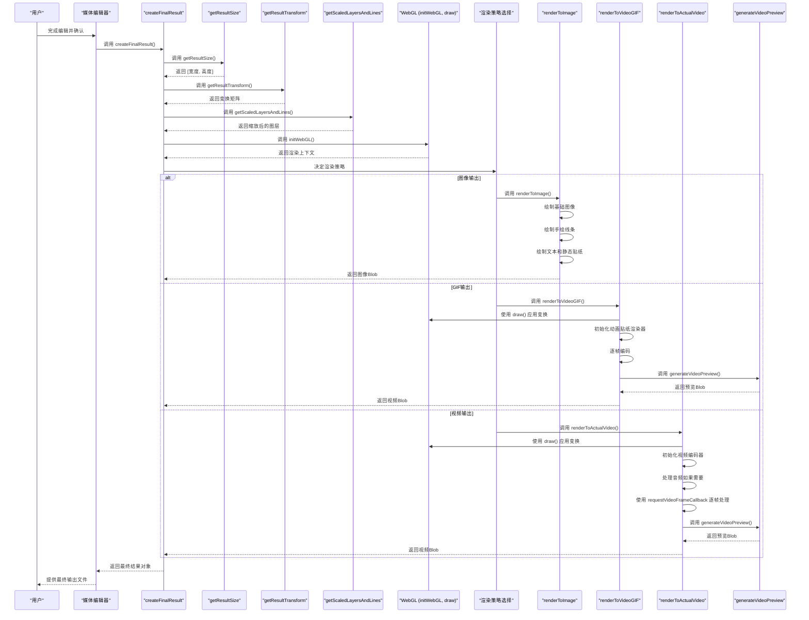
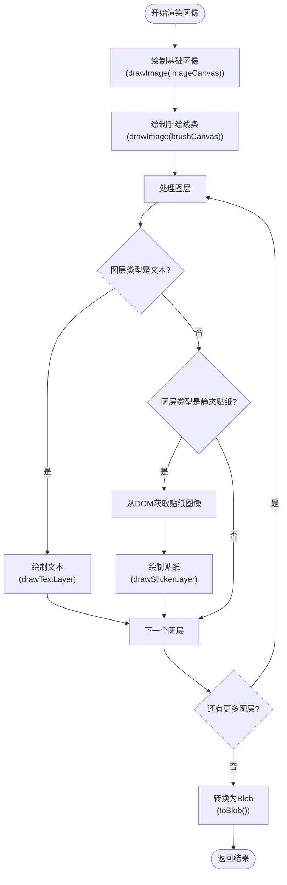
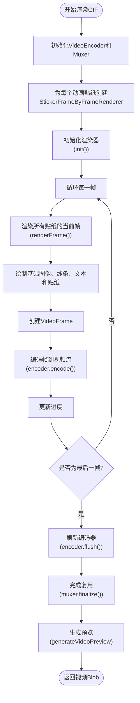
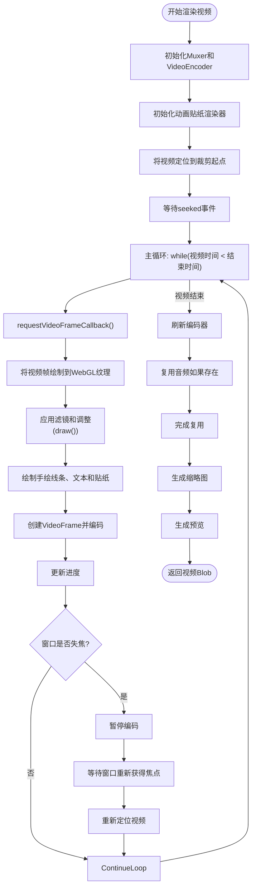

# 最终渲染

<cite>
**本文档中引用的文件**   
- [createFinalResult.ts](file://src/components/mediaEditor/finalRender/createFinalResult.ts)
- [renderToImage.ts](file://src/components/mediaEditor/finalRender/renderToImage.ts)
- [renderToVideoGIF.ts](file://src/components/mediaEditor/finalRender/renderToVideoGIF.ts)
- [renderToActualVideo.ts](file://src/components/mediaEditor/finalRender/renderToActualVideo.ts)
- [getResultSize.ts](file://src/components/mediaEditor/finalRender/getResultSize.ts)
- [getResultTransform.ts](file://src/components/mediaEditor/finalRender/getResultTransform.ts)
- [getScaledLayersAndLines.ts](file://src/components/mediaEditor/finalRender/getScaledLayersAndLines.ts)
- [generateVideoPreview.ts](file://src/components/mediaEditor/finalRender/generateVideoPreview.ts)
- [draw.ts](file://src/components/mediaEditor/webgl/draw.ts)
- [initWebGL.ts](file://src/components/mediaEditor/webgl/initWebGL.ts)
- [constants.ts](file://src/components/mediaEditor/finalRender/constants.ts)
- [types.ts](file://src/components/mediaEditor/finalRender/types.ts)
- [imageStickerFrameByFrameRenderer.ts](file://src/components/mediaEditor/finalRender/imageStickerFrameByFrameRenderer.ts)
- [lottieStickerFrameByFrameRenderer.ts](file://src/components/mediaEditor/finalRender/lottieStickerFrameByFrameRenderer.ts)
- [videoStickerFrameByFrameRenderer.ts](file://src/components/mediaEditor/finalRender/videoStickerFrameByFrameRenderer.ts)
</cite>

## 目录
1. [项目结构](#项目结构)
2. [核心组件](#核心组件)
3. [架构概述](#架构概述)
4. [详细组件分析](#详细组件分析)
5. [依赖分析](#依赖分析)
6. [性能考虑](#性能考虑)
7. [故障排除指南](#故障排除指南)
8. [结论](#结论)

## 项目结构

媒体编辑器的最终渲染功能位于 `src/components/mediaEditor/finalRender` 目录中，该目录包含实现最终输出文件生成的核心模块。这些模块协同工作，处理从编辑状态到最终输出的完整流程，包括结果尺寸计算、变换应用、图层缩放和最终渲染。

**图源**
- [getResultSize.ts](file://src/components/mediaEditor/finalRender/getResultSize.ts)
- [getResultTransform.ts](file://src/components/mediaEditor/finalRender/getResultTransform.ts)
- [getScaledLayersAndLines.ts](file://src/components/mediaEditor/finalRender/getScaledLayersAndLines.ts)
- [generateVideoPreview.ts](file://src/components/mediaEditor/finalRender/generateVideoPreview.ts)
- [createFinalResult.ts](file://src/components/mediaEditor/finalRender/createFinalResult.ts)
- [renderToImage.ts](file://src/components/mediaEditor/finalRender/renderToImage.ts)
- [renderToVideoGIF.ts](file://src/components/mediaEditor/finalRender/renderToVideoGIF.ts)
- [renderToActualVideo.ts](file://src/components/mediaEditor/finalRender/renderToActualVideo.ts)
- [draw.ts](file://src/components/mediaEditor/webgl/draw.ts)
- [initWebGL.ts](file://src/components/mediaEditor/webgl/initWebGL.ts)
- [constants.ts](file://src/components/mediaEditor/finalRender/constants.ts)
- [types.ts](file://src/components/mediaEditor/finalRender/types.ts)

## 核心组件

媒体编辑器的最终渲染功能由多个核心组件构成，这些组件共同实现了从编辑状态生成最终输出文件的完整流程。`createFinalResult.ts` 是整个渲染流程的入口点，它协调各个子模块的工作，根据输入媒体类型和编辑状态决定渲染策略。对于静态图像，系统使用 `renderToImage.ts` 进行渲染；对于包含动画贴纸的媒体或视频，则分别使用 `renderToVideoGIF.ts` 和 `renderToActualVideo.ts` 进行处理。`getResultSize.ts` 负责计算最终输出的尺寸，确保符合平台限制和质量要求，而 `getResultTransform.ts` 则处理所有变换操作，包括旋转、缩放和裁剪偏移。`getScaledLayersAndLines.ts` 负责将用户在画布上创建的图层和线条按正确的比例和位置进行缩放，确保它们在最终输出中正确呈现。

**节源**
- [createFinalResult.ts](file://src/components/mediaEditor/finalRender/createFinalResult.ts)
- [renderToImage.ts](file://src/components/mediaEditor/finalRender/renderToImage.ts)
- [renderToVideoGIF.ts](file://src/components/mediaEditor/finalRender/renderToVideoGIF.ts)
- [renderToActualVideo.ts](file://src/components/mediaEditor/finalRender/renderToActualVideo.ts)
- [getResultSize.ts](file://src/components/mediaEditor/finalRender/getResultSize.ts)
- [getResultTransform.ts](file://src/components/mediaEditor/finalRender/getResultTransform.ts)
- [getScaledLayersAndLines.ts](file://src/components/mediaEditor/finalRender/getScaledLayersAndLines.ts)

## 架构概述

媒体编辑器的最终渲染架构采用分层设计，将复杂的渲染任务分解为一系列可管理的步骤。整个流程始于 `createFinalResult` 函数，该函数作为协调者，根据媒体类型和编辑状态初始化渲染过程。首先，系统通过 `getResultSize` 计算最终输出的尺寸，这一步骤考虑了媒体类型（图像、GIF、视频）、原始尺寸、用户应用的缩放以及平台的质量限制。接着，`getResultTransform` 计算应用于原始媒体的变换矩阵，包括旋转、缩放、平移和翻转，确保所有编辑操作都能正确应用。然后，`getScaledLayersAndLines` 将用户添加的文本、贴纸和手绘线条等图层元素转换到最终画布的坐标系中。对于视频和GIF渲染，系统使用WebGL进行高效的GPU加速处理，通过 `initWebGL` 初始化渲染上下文，并使用 `draw` 函数应用滤镜和调整。最终，根据输出类型，系统调用相应的渲染函数（`renderToImage`、`renderToVideoGIF` 或 `renderToActualVideo`）生成最终的Blob输出。

**图源**
- [createFinalResult.ts](file://src/components/mediaEditor/finalRender/createFinalResult.ts)
- [getResultSize.ts](file://src/components/mediaEditor/finalRender/getResultSize.ts)
- [getResultTransform.ts](file://src/components/mediaEditor/finalRender/getResultTransform.ts)
- [getScaledLayersAndLines.ts](file://src/components/mediaEditor/finalRender/getScaledLayersAndLines.ts)
- [initWebGL.ts](file://src/components/mediaEditor/webgl/initWebGL.ts)
- [draw.ts](file://src/components/mediaEditor/webgl/draw.ts)
- [renderToImage.ts](file://src/components/mediaEditor/finalRender/renderToImage.ts)
- [renderToVideoGIF.ts](file://src/components/mediaEditor/finalRender/renderToVideoGIF.ts)
- [renderToActualVideo.ts](file://src/components/mediaEditor/finalRender/renderToActualVideo.ts)
- [generateVideoPreview.ts](file://src/components/mediaEditor/finalRender/generateVideoPreview.ts)

## 详细组件分析

### 最终结果创建分析

`createFinalResult.ts` 是整个渲染流程的中枢，它负责协调所有子组件以生成最终输出。该函数首先从媒体编辑器上下文中获取当前的编辑状态，包括图层、调整参数和媒体信息。然后，它通过 `checkIfHasAnimatedStickers` 检查是否存在动画贴纸，这决定了最终输出是静态图像、GIF还是视频。系统调用 `getResultSize` 两次：第一次确定最大可能的高度以选择合适的质量等级，第二次根据选定的质量计算最终的尺寸。`initWebGL` 被调用以创建一个用于应用滤镜和调整的WebGL上下文。`getResultTransform` 计算出将原始媒体正确放置在最终画布上的变换。`getScaledLayersAndLines` 将所有用户创建的图层转换到最终的坐标系。最后，根据媒体类型和是否存在动画贴纸，函数选择调用 `renderToImage`、`renderToVideoGIF` 或 `renderToActualVideo` 来执行具体的渲染任务。渲染完成后，`spawnAnimatedPreview` 会生成一个预览图，供用户在文件完全生成前查看。

```mermaid
classDiagram
class createFinalResult {
+createFinalResult() : Promise~MediaEditorFinalResult~
-context : MediaEditorContextValue
-hasAnimatedStickers : boolean
-willResultInVideo : boolean
-maxHeight : number
-maxQuality : number
-scaledWidth : number
-scaledHeight : number
-gl : WebGLRenderingContext
-payload : RenderingPayload
-finalTransform : FinalTransform
-scaledLayers : ScaledLayersAndLines['scaledLayers']
-brushPainter : BrushPainter
}
class getResultSize {
+getResultSize(args) : NumberPair
}
class getResultTransform {
+getResultTransform(args) : FinalTransform
}
class getScaledLayersAndLines {
+getScaledLayersAndLines(context, transform, width, height) : ScaledLayersAndLines
}
class initWebGL {
+initWebGL(args) : Promise~RenderingPayload~
}
class renderToImage {
+renderToImage(args) : Promise~MediaEditorFinalResultPayload~
}
class renderToVideoGIF {
+renderToVideoGIF(args) : Promise~MediaEditorFinalResultPayload~
}
class renderToActualVideo {
+renderToActualVideo(args) : Promise~MediaEditorFinalResultPayload~
}
class spawnAnimatedPreview {
+spawnAnimatedPreview(args) : Promise~Blob~
}
createFinalResult --> getResultSize : "调用"
createFinalResult --> getResultTransform : "调用"
createFinalResult --> getScaledLayersAndLines : "调用"
createFinalResult --> initWebGL : "调用"
createFinalResult --> renderToImage : "调用"
createFinalResult --> renderToVideoGIF : "调用"
createFinalResult --> renderToActualVideo : "调用"
createFinalResult --> spawnAnimatedPreview : "调用"
```

**图源**
- [createFinalResult.ts](file://src/components/mediaEditor/finalRender/createFinalResult.ts)
- [getResultSize.ts](file://src/components/mediaEditor/finalRender/getResultSize.ts)
- [getResultTransform.ts](file://src/components/mediaEditor/finalRender/getResultTransform.ts)
- [getScaledLayersAndLines.ts](file://src/components/mediaEditor/finalRender/getScaledLayersAndLines.ts)
- [initWebGL.ts](file://src/components/mediaEditor/webgl/initWebGL.ts)
- [renderToImage.ts](file://src/components/mediaEditor/finalRender/renderToImage.ts)
- [renderToVideoGIF.ts](file://src/components/mediaEditor/finalRender/renderToVideoGIF.ts)
- [renderToActualVideo.ts](file://src/components/mediaEditor/finalRender/renderToActualVideo.ts)
- [spawnAnimatedPreview.ts](file://src/components/mediaEditor/finalRender/spawnAnimatedPreview.ts)

**节源**
- [createFinalResult.ts](file://src/components/mediaEditor/finalRender/createFinalResult.ts)

### 渲染策略分析

媒体编辑器根据输入媒体的类型和用户的编辑操作，采用不同的渲染策略来生成最终输出。这些策略确保了高质量的输出，同时优化了性能和资源使用。

#### 图像渲染策略

对于静态图像输出，系统使用 `renderToImage.ts` 进行渲染。该策略首先将经过WebGL处理的基础图像（已应用滤镜和调整）绘制到结果画布上，然后将用户的手绘线条叠加其上。接着，系统遍历所有图层，对于文本图层调用 `drawTextLayer` 进行绘制，对于静态贴纸图层，则从DOM中获取对应的图像元素并调用 `drawStickerLayer` 进行绘制。最后，使用 `HTMLCanvasElement.toBlob()` 方法将整个画布转换为Blob对象。这种策略简单高效，适用于不需要动画的场景。

**图源**
- [renderToImage.ts](file://src/components/mediaEditor/finalRender/renderToImage.ts)
- [drawTextLayer.ts](file://src/components/mediaEditor/finalRender/drawTextLayer.ts)
- [drawStickerLayer.ts](file://src/components/mediaEditor/finalRender/drawStickerLayer.ts)

#### GIF渲染策略

当编辑的图像包含动画贴纸时，系统必须生成一个GIF或视频文件来保留动画效果。`renderToVideoGIF.ts` 实现了这一策略。它首先初始化一个 `VideoEncoder` 和 `mp4-muxer` 来创建MP4视频文件（尽管名为GIF，但实际输出为MP4以保证质量）。系统为每个动画贴纸创建一个 `StickerFrameByFrameRenderer` 实例（如 `LottieStickerFrameByFrameRenderer`），这些渲染器负责在每一帧生成贴纸的正确状态。渲染循环从0到最大帧数迭代，每一帧都调用所有贴纸渲染器的 `renderFrame` 方法，然后将基础图像、手绘线条、文本和当前帧的贴纸绘制到结果画布上。最后，将画布内容封装为 `VideoFrame` 并编码到视频流中。这种策略通过离屏渲染和帧间复用实现了高质量的动画输出。

**图源**
- [renderToVideoGIF.ts](file://src/components/mediaEditor/finalRender/renderToVideoGIF.ts)
- [lottieStickerFrameByFrameRenderer.ts](file://src/components/mediaEditor/finalRender/lottieStickerFrameByFrameRenderer.ts)
- [videoStickerFrameByFrameRenderer.ts](file://src/components/mediaEditor/finalRender/videoStickerFrameByFrameRenderer.ts)
- [generateVideoPreview.ts](file://src/components/mediaEditor/finalRender/generateVideoPreview.ts)

#### 视频渲染策略

对于原始视频的编辑，`renderToActualVideo.ts` 实现了最复杂的渲染策略。它利用 `HTMLVideoElement.requestVideoFrameCallback()` API 来精确地在每个视频帧到达时进行处理，确保了与原始视频帧率的完美同步。系统同样使用 `VideoEncoder` 进行编码，但处理流程更为精细。它首先将视频裁剪到用户指定的时间范围，然后逐帧处理。在每一帧，它使用WebGL将当前视频帧绘制到纹理上，应用所有变换和滤镜，然后将图层叠加其上。如果用户未静音，系统还会提取并编码原始音频。此外，该策略包含了对窗口失焦的处理，当用户切换到其他标签页时，编码会暂停并在返回时恢复，这是一项重要的性能优化。最后，它还会生成一个视频缩略图。

**图源**
- [renderToActualVideo.ts](file://src/components/mediaEditor/finalRender/renderToActualVideo.ts)
- [initWebGL.ts](file://src/components/mediaEditor/webgl/initWebGL.ts)
- [draw.ts](file://src/components/mediaEditor/webgl/draw.ts)
- [generateVideoPreview.ts](file://src/components/mediaEditor/finalRender/generateVideoPreview.ts)

**节源**
- [renderToImage.ts](file://src/components/mediaEditor/finalRender/renderToImage.ts)
- [renderToVideoGIF.ts](file://src/components/mediaEditor/finalRender/renderToVideoGIF.ts)
- [renderToActualVideo.ts](file://src/components/mediaEditor/finalRender/renderToActualVideo.ts)

### 变换与缩放分析

`getResultTransform.ts` 和 `getScaledLayersAndLines.ts` 是负责将用户在编辑画布上的操作正确映射到最终输出的关键组件。

#### 变换计算

`getResultTransform.ts` 计算一个变换矩阵，该矩阵描述了如何将原始媒体放置在最终的渲染画布上。这个计算过程考虑了多个因素：原始媒体的宽高比、画布的宽高比、用户应用的缩放和旋转、以及裁剪操作的偏移。函数首先计算出一个“裁剪比例”（toCropScale），它决定了原始媒体在裁剪区域内的缩放程度，然后计算一个“从裁剪比例”（fromCroppedScale），用于将画布坐标转换回裁剪前的坐标系。最终的变换矩阵包含了翻转、旋转、综合缩放和经过调整的平移，确保了所有编辑操作都能在最终输出中精确再现。

**节源**
- [getResultTransform.ts](file://src/components/mediaEditor/finalRender/getResultTransform.ts)

#### 图层缩放

`getScaledLayersAndLines.ts` 负责处理用户创建的所有图层元素。它接收一个 `FinalTransform` 对象，并将其应用到每个图层的位置、旋转和缩放上。对于手绘线条，它遍历每个点，应用旋转和缩放变换。对于文本图层，除了应用通用变换外，还会根据像素比调整字体大小。这个函数确保了无论用户如何缩放或旋转画布，所有图层都能在最终输出中保持正确的相对位置和大小。

**节源**
- [getScaledLayersAndLines.ts](file://src/components/mediaEditor/finalRender/getScaledLayersAndLines.ts)

## 依赖分析

最终渲染模块依赖于多个内部和外部组件来完成其功能。在内部，它与媒体编辑器的其他部分（如画布、上下文、调整模块）紧密耦合。`createFinalResult` 依赖于 `context` 来获取编辑状态，依赖于 `adjustments` 来应用滤镜效果，并依赖于 `utils` 中的辅助函数。WebGL相关的模块（`initWebGL` 和 `draw`）依赖于着色器源码（`shaderSources.js`）来编译和链接着色器程序。对于动画贴纸的渲染，系统依赖于 `lottie-web` 或类似的库来处理Lottie动画，尽管这些依赖在提供的代码片段中未直接显示，但可以从 `LottieStickerFrameByFrameRenderer` 的存在推断出来。外部依赖方面，`renderToVideoGIF` 和 `renderToActualVideo` 依赖于 `mp4-muxer` 库来创建MP4容器，这在代码中通过动态导入 `import('mp4-muxer')` 得以体现。此外，视频渲染还依赖于现代浏览器的 `VideoEncoder` 和 `AudioEncoder` WebCodecs API 来进行高效的媒体编码。

```mermaid
graph TD
subgraph "最终渲染模块"
createFinalResult
renderToImage
renderToVideoGIF
renderToActualVideo
getResultSize
getResultTransform
getScaledLayersAndLines
generateVideoPreview
drawStickerLayer
drawTextLayer
calcCodecAndBitrate
constants
types
end
subgraph "WebGL模块"
initWebGL
draw
shaderSources
end
subgraph "媒体编辑器其他模块"
context["context.ts<br/>(上下文)"]
adjustments["adjustments.ts<br/>(调整)"]
canvas["canvas/<br/>(画布工具)"]
utils["utils.ts<br/>(工具函数)"]
support["support.ts<br/>(功能支持检测)"]
end
subgraph "外部依赖"
mp4Muxer["mp4-muxer<br/>(外部NPM包)"]
webCodecs["WebCodecs API<br/>(VideoEncoder, AudioEncoder)"]
lottieWeb["lottie-web<br/>(外部NPM包)"]
end
createFinalResult --> context
createFinalResult --> adjustments
createFinalResult --> utils
createFinalResult --> canvas
createFinalResult --> support
renderToImage --> drawStickerLayer
renderToImage --> drawTextLayer
renderToVideoGIF --> drawStickerLayer
renderToVideoGIF --> drawTextLayer
renderToVideoGIF --> mp4Muxer
renderToVideoGIF --> webCodecs
renderToVideoGIF --> lottieWeb
renderToActualVideo --> drawStickerLayer
renderToActualVideo --> drawTextLayer
renderToActualVideo --> mp4Muxer
renderToActualVideo --> webCodecs
renderToActualVideo --> lottieWeb
initWebGL --> shaderSources
initWebGL --> webCodecs
getResultSize --> constants
getResultSize --> calcCodecAndBitrate
getScaledLayersAndLines --> types
getScaledLayersAndLines --> canvas
```

**图源**
- [createFinalResult.ts](file://src/components/mediaEditor/finalRender/createFinalResult.ts)
- [renderToImage.ts](file://src/components/mediaEditor/finalRender/renderToImage.ts)
- [renderToVideoGIF.ts](file://src/components/mediaEditor/finalRender/renderToVideoGIF.ts)
- [renderToActualVideo.ts](file://src/components/mediaEditor/finalRender/renderToActualVideo.ts)
- [getResultSize.ts](file://src/components/mediaEditor/finalRender/getResultSize.ts)
- [getResultTransform.ts](file://src/components/mediaEditor/finalRender/getResultTransform.ts)
- [getScaledLayersAndLines.ts](file://src/components/mediaEditor/finalRender/getScaledLayersAndLines.ts)
- [generateVideoPreview.ts](file://src/components/mediaEditor/finalRender/generateVideoPreview.ts)
- [drawStickerLayer.ts](file://src/components/mediaEditor/finalRender/drawStickerLayer.ts)
- [drawTextLayer.ts](file://src/components/mediaEditor/finalRender/drawTextLayer.ts)
- [calcCodecAndBitrate.ts](file://src/components/mediaEditor/finalRender/calcCodecAndBitrate.ts)
- [constants.ts](file://src/components/mediaEditor/finalRender/constants.ts)
- [types.ts](file://src/components/mediaEditor/finalRender/types.ts)
- [initWebGL.ts](file://src/components/mediaEditor/webgl/initWebGL.ts)
- [draw.ts](file://src/components/mediaEditor/webgl/draw.ts)
- [shaderSources.js](file://src/components/mediaEditor/webgl/shaderSources.js)
- [context.ts](file://src/components/mediaEditor/context.ts)
- [adjustments.ts](file://src/components/mediaEditor/adjustments.ts)
- [utils.ts](file://src/components/mediaEditor/utils.ts)
- [support.ts](file://src/components/mediaEditor/support.ts)

## 性能考虑

媒体编辑器的最终渲染功能在设计时充分考虑了性能优化，以确保在各种设备上都能提供流畅的用户体验。

### 离屏渲染与资源复用

系统广泛使用离屏渲染技术来提高性能。`renderToActualVideo` 利用 `requestVideoFrameCallback` 在视频帧实际显示之前对其进行处理，这避免了在主线程上进行昂贵的图像处理操作。WebGL的使用是另一个关键的性能优化，它将滤镜和颜色调整的计算从CPU卸载到GPU，极大地提高了处理速度。此外，系统通过复用 `imageCanvas` 和 `brushCanvas` 等中间画布来减少内存分配和垃圾回收的压力。在GIF和视频渲染中，动画贴纸的渲染器（`StickerFrameByFrameRenderer`）被设计为可复用的对象，它们在初始化时加载资源，并在渲染循环中重复使用，避免了每帧都重新加载的开销。

### 错误处理与输出质量控制

系统实现了健壮的错误处理机制。`renderToActualVideo` 监听窗口的 `focus` 和 `blur` 事件，当用户切换到其他标签页时，编码过程会暂停，防止在后台消耗过多资源。如果编码被中断，系统会妥善清理WebGL上下文和事件监听器，防止内存泄漏。在 `createFinalResult` 的末尾，有一个 `Promise.resolve(renderResult.getResult())?.catch(noop)?.finally()` 块，确保无论渲染成功与否，WebGL资源都会被正确释放。对于输出质量，`getResultSize` 函数通过 `snapToAvailableQuality` 函数将输出尺寸限制在预定义的高质量等级内（如720p、1080p），并根据媒体类型（GIF或视频）应用不同的最大尺寸限制，确保输出文件既高质量又不会过大。

## 故障排除指南

在使用媒体编辑器的最终渲染功能时，可能会遇到一些常见问题。

### 渲染失败

如果渲染过程失败，首先检查浏览器控制台是否有JavaScript错误。常见的错误包括 `VideoEncoder` 不受支持（在较旧的浏览器中），或 `mp4-muxer` 库加载失败。确保浏览器是最新版本，并且支持WebCodecs API。如果问题与特定的媒体文件有关，尝试使用不同的文件进行测试。

### 输出质量不佳

如果输出的图像或视频质量低于预期，请检查 `getResultSize` 的计算逻辑。确保 `maxQuality` 变量正确地从 `snapToAvailableQuality` 函数获取了合适的质量等级。同时，确认原始媒体文件本身具有足够的分辨率。

### 动画贴纸不显示或不动画

如果动画贴纸在最终输出中不显示或没有动画效果，请检查 `renderToVideoGIF` 或 `renderToActualVideo` 是否被正确调用。确认 `checkIfHasAnimatedStickers` 函数能够正确识别动画贴纸。此外，确保 `LottieStickerFrameByFrameRenderer` 或 `VideoStickerFrameByFrameRenderer` 的初始化没有失败，这通常与网络问题或资源加载失败有关。

**节源**
- [createFinalResult.ts](file://src/components/mediaEditor/finalRender/createFinalResult.ts)
- [renderToVideoGIF.ts](file://src/components/mediaEditor/finalRender/renderToVideoGIF.ts)
- [renderToActualVideo.ts](file://src/components/mediaEditor/finalRender/renderToActualVideo.ts)
- [getResultSize.ts](file://src/components/mediaEditor/finalRender/getResultSize.ts)

## 结论

媒体编辑器的最终渲染功能是一个复杂而精密的系统，它成功地将用户在画布上的各种编辑操作（裁剪、旋转、滤镜、添加文本和贴纸等）整合并应用到原始媒体上，生成高质量的最终输出文件。该系统通过清晰的模块化设计，将尺寸计算、变换应用、图层处理和最终编码等任务分离，提高了代码的可维护性和可扩展性。对于不同的输出需求，系统采用了三种不同的渲染策略：简单的 `renderToImage` 用于静态图像，基于帧的 `renderToVideoGIF` 用于包含动画贴纸的输出，以及利用 `requestVideoFrameCallback` 的 `renderToActualVideo` 用于精确的视频编辑。性能优化贯穿整个设计，从WebGL的GPU加速到离屏渲染和资源复用，确保了即使在处理高分辨率媒体时也能保持流畅。健壮的错误处理和资源清理机制保证了系统的稳定性。总体而言，这是一个高效、可靠且功能丰富的最终渲染解决方案。