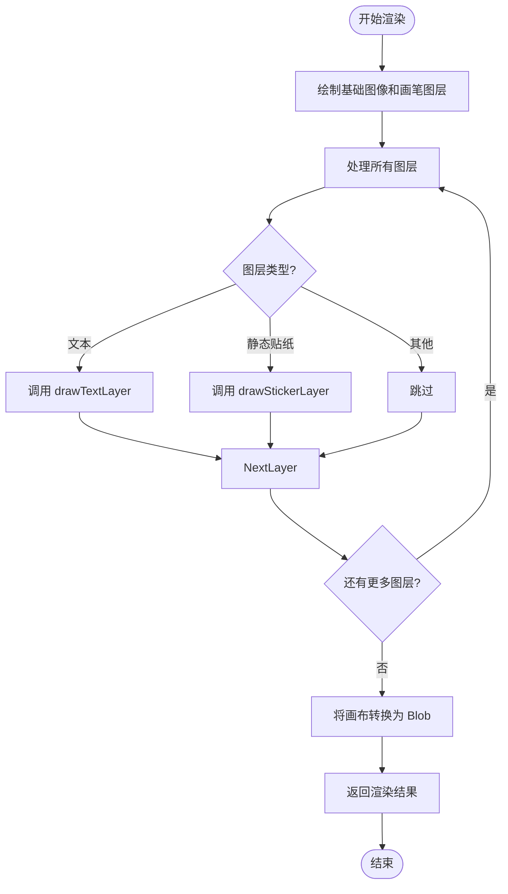
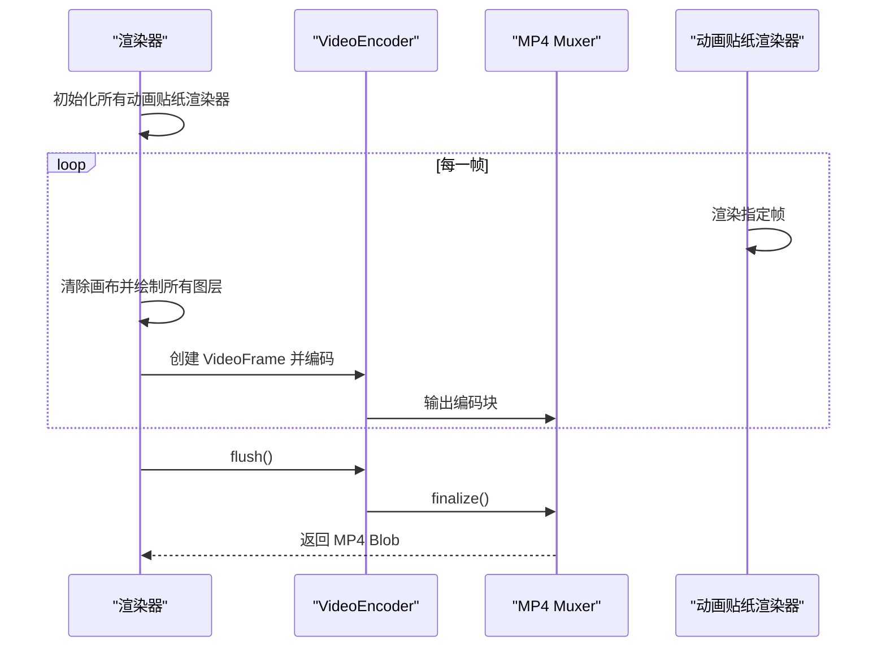
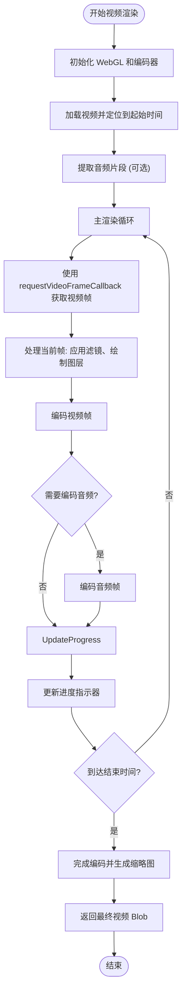
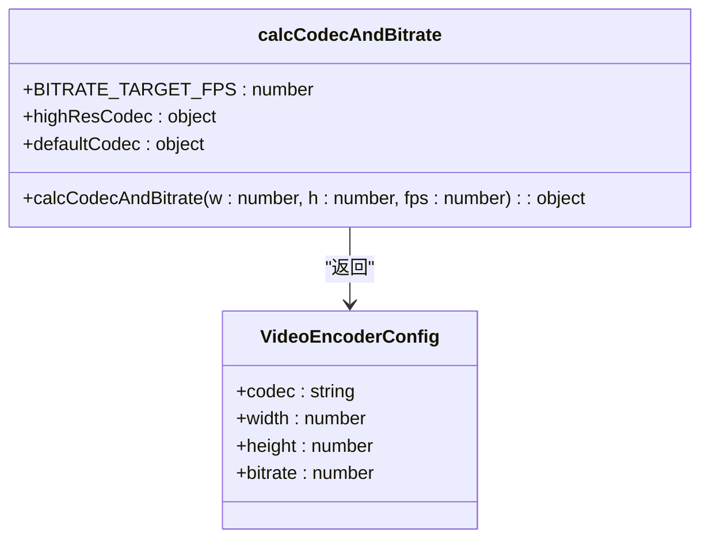
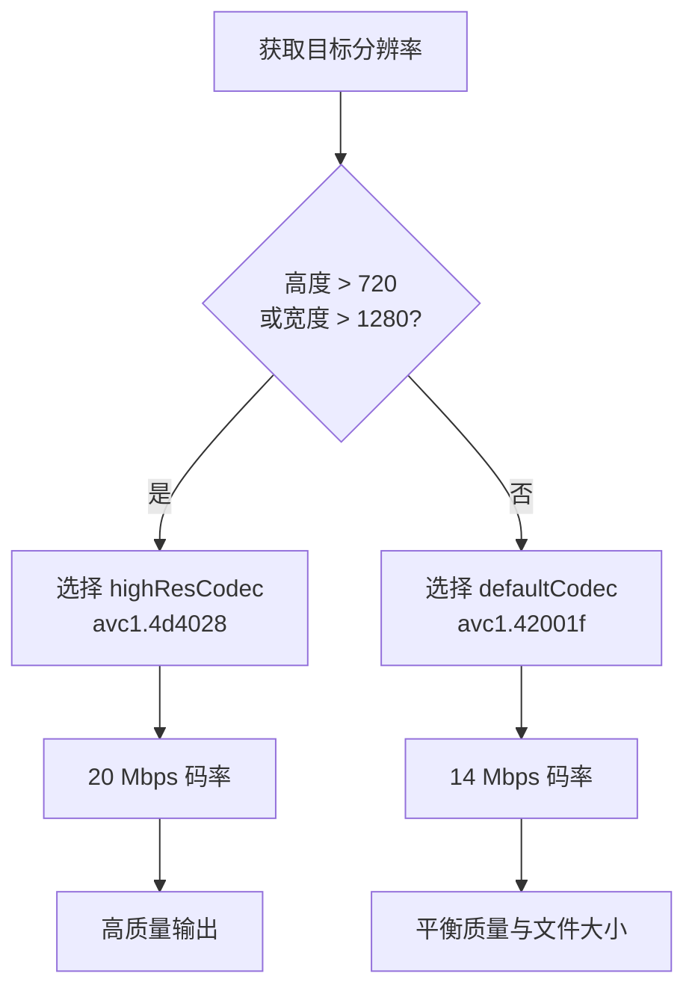

# 格式渲染

<cite>
**本文档中引用的文件**  
- [renderToImage.ts](file://src/components/mediaEditor/finalRender/renderToImage.ts)
- [renderToVideoGIF.ts](file://src/components/mediaEditor/finalRender/renderToVideoGIF.ts)
- [renderToActualVideo.ts](file://src/components/mediaEditor/finalRender/renderToActualVideo.ts)
- [createFinalResult.ts](file://src/components/mediaEditor/finalRender/createFinalResult.ts)
- [calcCodecAndBitrate.ts](file://src/components/mediaEditor/finalRender/calcCodecAndBitrate.ts)
- [constants.ts](file://src/components/mediaEditor/finalRender/constants.ts)
- [types.ts](file://src/components/mediaEditor/finalRender/types.ts)
- [imageStickerFrameByFrameRenderer.ts](file://src/components/mediaEditor/finalRender/imageStickerFrameByFrameRenderer.ts)
- [lottieStickerFrameByFrameRenderer.ts](file://src/components/mediaEditor/finalRender/lottieStickerFrameByFrameRenderer.ts)
- [videoStickerFrameByFrameRenderer.ts](file://src/components/mediaEditor/finalRender/videoStickerFrameByFrameRenderer.ts)
- [drawStickerLayer.ts](file://src/components/mediaEditor/finalRender/drawStickerLayer.ts)
- [drawTextLayer.ts](file://src/components/mediaEditor/finalRender/drawTextLayer.ts)
</cite>

## 目录
1. [简介](#简介)
2. [核心渲染函数概述](#核心渲染函数概述)
3. [renderToImage 实现细节](#rendertoimage-实现细节)
4. [renderToVideoGIF 实现细节](#rendertovideogif-实现细节)
5. [renderToActualVideo 实现细节](#rendertoactualvideo-实现细节)
6. [技术栈选择与编码参数配置](#技术栈选择与编码参数配置)
7. [性能特征分析](#性能特征分析)
8. [不同格式的适用场景](#不同格式的适用场景)
9. [质量控制机制](#质量控制机制)
10. [GIF 渲染的帧率优化](#gif-渲染的帧率优化)
11. [视频渲染的编解码器选择策略](#视频渲染的编解码器选择策略)
12. [格式转换最佳实践](#格式转换最佳实践)
13. [常见问题解决方案](#常见问题解决方案)

## 简介
本文档详细说明了媒体编辑器中多格式渲染功能的实现，重点分析 `renderToImage`、`renderToVideoGIF` 和 `renderToActualVideo` 三个核心函数的技术实现。文档涵盖了技术栈选择、编码参数配置、性能特征、适用场景、质量控制机制、帧率优化和编解码器策略等方面，并提供格式转换的最佳实践和常见问题解决方案。

## 核心渲染函数概述
媒体编辑器根据输入媒体类型和编辑内容动态选择渲染路径。`createFinalResult` 函数作为入口点，根据是否存在动画贴纸或视频内容决定调用哪个渲染函数：
- 静态图像：调用 `renderToImage`
- 包含动画贴纸的图像：调用 `renderToVideoGIF`
- 视频内容：调用 `renderToActualVideo`

**Section sources**
- [createFinalResult.ts](file://src/components/mediaEditor/finalRender/createFinalResult.ts#L133-L168)

## renderToImage 实现细节
`renderToImage` 函数负责将编辑后的静态内容渲染为单帧图像。该函数执行以下步骤：
1. 将基础图像和画笔图层绘制到结果画布
2. 遍历所有图层，绘制文本和静态贴纸
3. 使用 `drawTextLayer` 和 `drawStickerLayer` 辅助函数处理特定图层类型
4. 将最终画布转换为 Blob 并返回结果

该函数适用于没有动画元素的纯静态编辑场景，具有最高的渲染效率和最低的资源消耗。



**Diagram sources**
- [renderToImage.ts](file://src/components/mediaEditor/finalRender/renderToImage.ts#L18-L54)
- [drawTextLayer.ts](file://src/components/mediaEditor/finalRender/drawTextLayer.ts#L5)
- [drawStickerLayer.ts](file://src/components/mediaEditor/finalRender/drawStickerLayer.ts#L7)

**Section sources**
- [renderToImage.ts](file://src/components/mediaEditor/finalRender/renderToImage.ts#L18-L54)

## renderToVideoGIF 实现细节
`renderToVideoGIF` 函数将包含动画贴纸的编辑内容渲染为视频格式（实际为 MP4，但逻辑上等同于 GIF）。该函数的关键特性包括：
1. 使用 `VideoEncoder` API 进行高效视频编码
2. 通过 `mp4-muxer` 库将编码后的帧打包为 MP4 容器
3. 支持多种动画贴纸类型（Lottie、WebM）的逐帧渲染
4. 固定 60 FPS 的帧率以确保流畅动画

渲染流程：
- 初始化所有动画贴纸渲染器（Lottie、WebM）
- 为每一帧创建 `VideoFrame` 并编码
- 使用 `requestVideoFrameCallback` 确保帧同步
- 支持渲染进度跟踪和取消操作



**Diagram sources**
- [renderToVideoGIF.ts](file://src/components/mediaEditor/finalRender/renderToVideoGIF.ts#L31-L185)
- [lottieStickerFrameByFrameRenderer.ts](file://src/components/mediaEditor/finalRender/lottieStickerFrameByFrameRenderer.ts#L9)
- [videoStickerFrameByFrameRenderer.ts](file://src/components/mediaEditor/finalRender/videoStickerFrameByFrameRenderer.ts#L16)

**Section sources**
- [renderToVideoGIF.ts](file://src/components/mediaEditor/finalRender/renderToVideoGIF.ts#L31-L185)

## renderToActualVideo 实现细节
`renderToActualVideo` 函数处理原始视频内容的编辑和渲染，支持视频剪辑、滤镜应用和音轨处理。其主要特性包括：
1. 使用 WebGL 进行高性能视频处理
2. 支持音频编码（Opus 编解码器）
3. 精确的视频时间控制和帧提取
4. 缩略图生成和质量控制

关键实现细节：
- 使用 `requestVideoFrameCallback` API 精确提取视频帧
- 通过 `AudioContext` 提取和处理音频片段
- 支持窗口失焦时暂停编码以节省资源
- 实现平滑的进度更新动画



**Diagram sources**
- [renderToActualVideo.ts](file://src/components/mediaEditor/finalRender/renderToActualVideo.ts#L48-L530)
- [extractAudioFragment](file://src/components/mediaEditor/finalRender/renderToActualVideo.ts#L466-L486)
- [encodeAndMuxAudio](file://src/components/mediaEditor/finalRender/renderToActualVideo.ts#L488-L529)

**Section sources**
- [renderToActualVideo.ts](file://src/components/mediaEditor/finalRender/renderToActualVideo.ts#L48-L530)

## 技术栈选择与编码参数配置
### 技术栈选择
- **WebCodecs API**: 用于 `VideoEncoder` 和 `AudioEncoder`，提供高效的媒体编码能力
- **WebGL**: 用于视频帧的高性能处理和滤镜应用
- **mp4-muxer**: 将编码后的音视频帧打包为 MP4 容器
- **Solid.js**: 响应式框架，用于管理渲染状态和进度

### 编码参数配置
通过 `calcCodecAndBitrate` 函数动态计算编码参数：
- **分辨率 ≤ 1280×720**: 使用 `avc1.42001f` 编解码器，14 Mbps 码率
- **分辨率 > 1280×720**: 使用 `avc1.4d4028` 编解码器，20 Mbps 码率
- **帧率**: 固定为 60 FPS（GIF）或 30 FPS（视频）

码率根据目标分辨率和帧率动态调整，确保在不同设备上保持一致的视觉质量。



**Diagram sources**
- [calcCodecAndBitrate.ts](file://src/components/mediaEditor/finalRender/calcCodecAndBitrate.ts#L1-L25)
- [renderToVideoGIF.ts](file://src/components/mediaEditor/finalRender/renderToVideoGIF.ts#L126-L130)
- [renderToActualVideo.ts](file://src/components/mediaEditor/finalRender/renderToActualVideo.ts#L145-L149)

**Section sources**
- [calcCodecAndBitrate.ts](file://src/components/mediaEditor/finalRender/calcCodecAndBitrate.ts#L1-L25)

## 性能特征分析
### 内存使用
- **renderToImage**: 内存占用最低，仅需一个画布上下文
- **renderToVideoGIF**: 中等内存占用，需要维护动画状态和编码缓冲区
- **renderToActualVideo**: 最高内存占用，需要 WebGL 上下文、音频缓冲区和视频帧缓冲

### CPU 使用
- **renderToImage**: CPU 使用率低，主要为画布绘制操作
- **renderToVideoGIF**: CPU 使用率中等，涉及动画渲染和视频编码
- **renderToActualVideo**: CPU 使用率高，特别是音频处理和复杂滤镜应用

### 渲染时间
- **renderToImage**: < 100ms，几乎即时完成
- **renderToVideoGIF**: 与动画时长成正比，约 2-3 倍实时速度
- **renderToActualVideo**: 与视频时长成正比，约 1.5-2 倍实时速度

## 不同格式的适用场景
### renderToImage
- **适用场景**: 静态图片编辑、添加文本和静态贴纸
- **优点**: 快速、低资源消耗、兼容性好
- **缺点**: 不支持任何动画效果

### renderToVideoGIF
- **适用场景**: 包含 Lottie 或 WebM 动画贴纸的图片编辑
- **优点**: 支持丰富动画效果、文件大小相对较小
- **缺点**: 无音频支持、仅限 60 FPS

### renderToActualVideo
- **适用场景**: 视频剪辑、滤镜应用、音频处理
- **优点**: 完整的音视频支持、高质量输出
- **缺点**: 资源消耗大、渲染时间长

## 质量控制机制
### 分辨率控制
通过 `getResultSize` 和 `snapToAvailableQuality` 函数实现：
- 根据设备能力和网络状况自动选择最佳质量
- 支持手动质量设置（低、中、高）
- 视频质量限制在用户设置的范围内

### 码率控制
动态码率调整算法：
```javascript
bitrate = (w * h * fps) / (baseWidth * baseHeight * baseFps) * baseBitrate
```
确保在不同分辨率下保持一致的视觉质量密度。

### 缓冲区管理
- 使用 `preserveDrawingBuffer: true` 确保 WebGL 帧可读
- 及时释放不再需要的资源（视频、音频缓冲区）
- 实现编码暂停和恢复机制以应对系统资源紧张

## GIF 渲染的帧率优化
### 固定 60 FPS 帧率


### 帧同步策略
- 使用 `VideoFrame` 的 timestamp 和 duration 属性精确控制帧时序
- 通过 `frameNo % getTotalFrames()` 实现循环动画的无缝衔接
- 预加载所有动画资源以避免渲染过程中的延迟

### 性能优化
- 批量处理动画贴纸的帧渲染
- 使用 `Promise.all` 并行处理多个动画元素
- 在渲染循环外初始化所有资源，减少每帧开销

**Section sources**
- [renderToVideoGIF.ts](file://src/components/mediaEditor/finalRender/renderToVideoGIF.ts#L74-L77)
- [constants.ts](file://src/components/mediaEditor/finalRender/constants.ts#L1)
- [types.ts](file://src/components/mediaEditor/finalRender/types.ts#L3-L10)

## 视频渲染的编解码器选择策略
### 编解码器选择逻辑


### 音频编码策略
- **支持检测**: 通过 `supportsAudioEncoding` 检查浏览器音频编码能力
- **编解码器**: 使用 Opus 编解码器（`codec: 'opus'`）
- **参数**: 128 kbps 码率，保持原始采样率和声道数
- **条件编码**: 仅在视频未静音且支持音频编码时启用

### 自适应码率
根据目标分辨率动态调整码率，确保：
- 小尺寸视频不会过度编码
- 大尺寸视频保持足够细节
- 不同设备上的一致视觉体验

**Section sources**
- [calcCodecAndBitrate.ts](file://src/components/mediaEditor/finalRender/calcCodecAndBitrate.ts#L3-L15)
- [renderToActualVideo.ts](file://src/components/mediaEditor/finalRender/renderToActualVideo.ts#L121-L136)
- [renderToActualVideo.ts](file://src/components/mediaEditor/finalRender/renderToActualVideo.ts#L508-L513)

## 格式转换最佳实践
### 选择合适的渲染路径
1. **评估内容类型**: 检查是否存在动画贴纸或视频源
2. **考虑性能需求**: 在移动设备上优先选择轻量级渲染
3. **平衡质量与大小**: 根据使用场景选择适当的分辨率和码率

### 资源管理
- 及时释放 WebGL 上下文和视频资源
- 使用 `cleanup` 函数确保资源完全释放
- 实现渲染取消机制以响应用户操作

### 错误处理
- 捕获并处理编码过程中的异常
- 提供有意义的错误信息给用户
- 实现优雅降级策略（如编码失败时尝试其他格式）

## 常见问题解决方案
### 渲染卡顿或失败
- **检查**: 确认浏览器是否支持 WebCodecs API
- **解决方案**: 降级到 Canvas2D 渲染或提示用户更新浏览器
- **调试**: 启用详细的日志记录以定位问题

### 音频丢失
- **检查**: 确认 `supportsAudioEncoding` 返回 true
- **解决方案**: 如果不支持，提示用户音频将被静音
- **验证**: 检查视频源是否包含音频轨道

### 文件过大
- **检查**: 分析输出文件的分辨率和码率
- **解决方案**: 降低质量设置或使用更高效的编解码器
- **优化**: 移除不必要的动画元素或缩短视频长度

### 动画不同步
- **检查**: 验证 `requestVideoFrameCallback` 的时间戳
- **解决方案**: 调整帧率匹配源视频的帧率
- **调试**: 使用性能分析工具检查帧生成时间