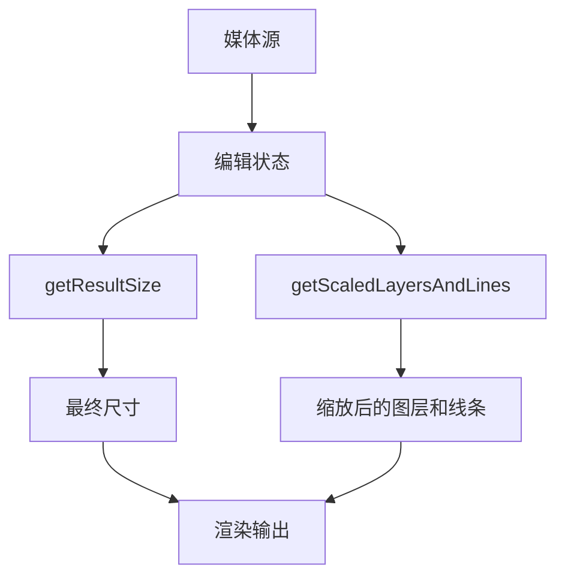
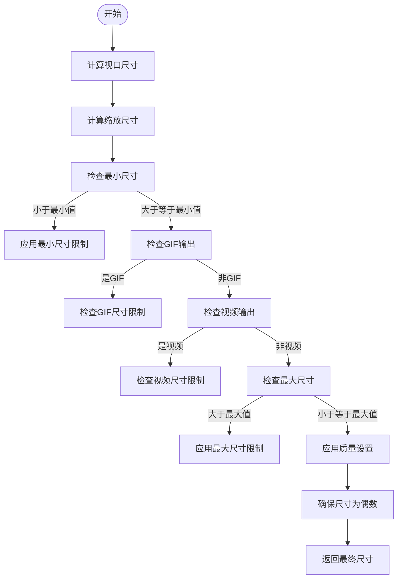
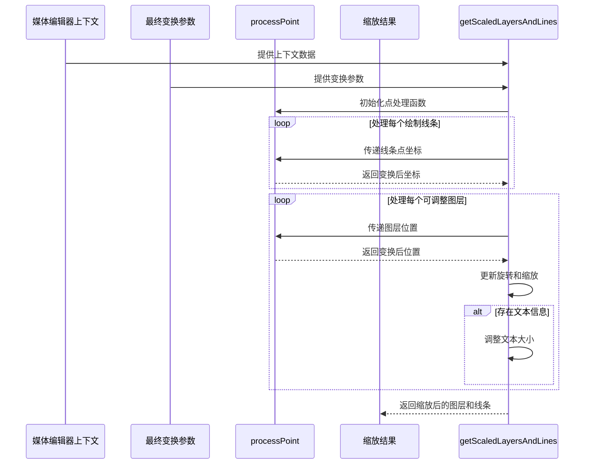
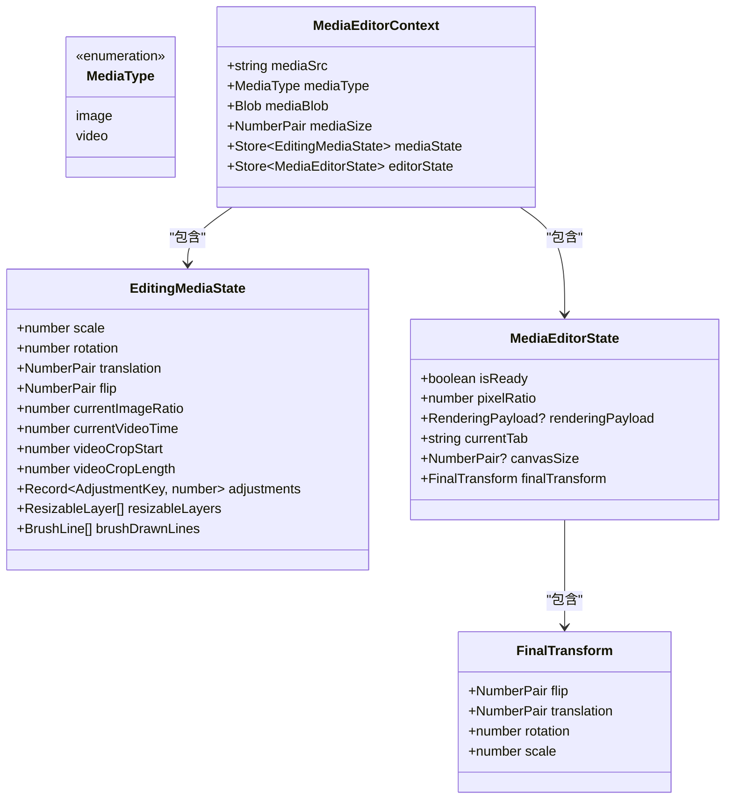
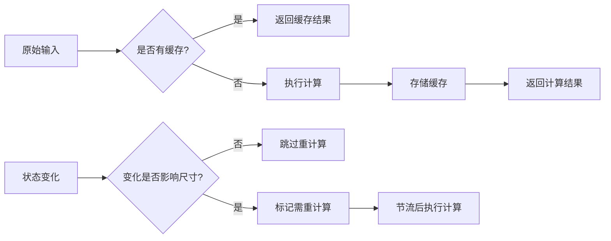

# 结果尺寸计算

<cite>
**本文档中引用的文件**  
- [getResultSize.ts](file://src/components/mediaEditor/finalRender/getResultSize.ts)
- [getScaledLayersAndLines.ts](file://src/components/mediaEditor/finalRender/getScaledLayersAndLines.ts)
- [calcCodecAndBitrate.ts](file://src/components/mediaEditor/finalRender/calcCodecAndBitrate.ts)
- [utils.ts](file://src/components/mediaEditor/utils.ts)
- [useFinalTransform.ts](file://src/components/mediaEditor/canvas/useFinalTransform.ts)
- [useCropOffset.ts](file://src/components/mediaEditor/canvas/useCropOffset.ts)
- [context.ts](file://src/components/mediaEditor/context.ts)
- [types.ts](file://src/components/mediaEditor/types.ts)
</cite>

## 目录
1. [简介](#简介)
2. [核心组件](#核心组件)
3. [结果尺寸计算逻辑](#结果尺寸计算逻辑)
4. [响应式尺寸调整与比例保持机制](#响应式尺寸调整与比例保持机制)
5. [不同媒体类型的尺寸处理差异](#不同媒体类型的尺寸处理差异)
6. [性能优化建议](#性能优化建议)
7. [结论](#结论)

## 简介
本文档详细说明媒体编辑器中最终渲染尺寸的计算机制，重点分析`getResultSize`和`getScaledLayersAndLines`两个核心函数的实现逻辑。文档涵盖原始媒体尺寸、用户编辑操作（裁剪、旋转）以及输出需求对最终结果尺寸的影响，并解释响应式尺寸调整算法和比例保持机制。

## 核心组件

本节分析媒体编辑器中与尺寸计算相关的核心组件及其交互关系。

**图源**  
- [getResultSize.ts](file://src/components/mediaEditor/finalRender/getResultSize.ts)
- [getScaledLayersAndLines.ts](file://src/components/mediaEditor/finalRender/getScaledLayersAndLines.ts)

**节源**  
- [getResultSize.ts](file://src/components/mediaEditor/finalRender/getResultSize.ts)
- [getScaledLayersAndLines.ts](file://src/components/mediaEditor/finalRender/getScaledLayersAndLines.ts)

## 结果尺寸计算逻辑

`getResultSize`函数负责根据多种输入参数计算最终渲染尺寸。该函数考虑了原始图像宽度、裁剪偏移、图像比例、新比例、缩放因子、视频类型和质量等参数。

函数首先通过`snapToViewport`函数计算裁剪区域的视口尺寸，然后基于这些尺寸和缩放因子计算缩放后的宽度和高度。算法会根据是否生成视频、GIF或静态图像应用不同的尺寸限制。

对于视频输出，尺寸受到`highResCodec`和`defaultCodec`定义的分辨率限制；对于GIF输出，受限于`defaultCodec`的尺寸；对于静态图像，则有最大和最小尺寸限制（SIDE_MAX和SIDE_MIN）。

**图源**  
- [getResultSize.ts](file://src/components/mediaEditor/finalRender/getResultSize.ts)
- [utils.ts](file://src/components/mediaEditor/utils.ts)

**节源**  
- [getResultSize.ts](file://src/components/mediaEditor/finalRender/getResultSize.ts)

## 响应式尺寸调整与比例保持机制

`getScaledLayersAndLines`函数实现了图层和绘制线条的坐标变换，确保在最终渲染时保持正确的相对位置和比例。

该函数接收媒体编辑器上下文、最终变换参数以及目标宽度和高度作为输入。它通过一个`processPoint`辅助函数来处理每个点的坐标变换，包括旋转、缩放和平移操作。

坐标变换过程首先应用逆向旋转，然后应用缩放和平移，确保所有图层元素在最终画布上正确对齐。文本图层的字体大小还会额外乘以像素比率，以保证在高DPI设备上的清晰度。

**图源**  
- [getScaledLayersAndLines.ts](file://src/components/mediaEditor/finalRender/getScaledLayersAndLines.ts)
- [useFinalTransform.ts](file://src/components/mediaEditor/canvas/useFinalTransform.ts)

**节源**  
- [getScaledLayersAndLines.ts](file://src/components/mediaEditor/finalRender/getScaledLayersAndLines.ts)

## 不同媒体类型的尺寸处理差异

媒体编辑器对不同媒体类型（图像、视频）采用差异化的尺寸处理策略。这些差异主要体现在编解码器选择、比特率计算和尺寸限制上。

对于视频媒体，系统会根据输出分辨率选择合适的编解码器配置（`highResCodec`或`defaultCodec`），并相应调整比特率。视频还支持时间裁剪功能，允许用户选择视频片段进行编辑。

对于包含动画贴纸的媒体，即使原始媒体是图像，也会被处理为GIF格式输出。系统通过`checkIfHasAnimatedStickers`函数检测是否存在动画贴纸，并据此决定输出格式。

图像媒体的处理相对简单，主要关注尺寸限制和质量保持，最大尺寸限制为2560像素，最小为240像素。

**图源**  
- [context.ts](file://src/components/mediaEditor/context.ts)
- [types.ts](file://src/components/mediaEditor/types.ts)

**节源**  
- [context.ts](file://src/components/mediaEditor/context.ts)
- [types.ts](file://src/components/mediaEditor/types.ts)

## 性能优化建议

为提高尺寸计算的性能，建议采用以下优化策略：

1. **缓存尺寸计算结果**：对于相同的输入参数组合，缓存`getResultSize`的计算结果，避免重复计算。
2. **批量处理变换操作**：在`getScaledLayersAndLines`中，将多个图层的变换操作合并处理，减少函数调用开销。
3. **使用信号机制**：利用SolidJS的响应式系统，仅在相关状态变化时重新计算尺寸，避免不必要的重新渲染。
4. **预计算常用值**：对于频繁使用的计算值（如视口比例、缩放因子等），在初始化阶段预计算并存储。
5. **限制重计算频率**：使用节流（throttle）技术限制尺寸计算的频率，特别是在用户进行连续编辑操作时。

**图源**  
- [utils.ts](file://src/components/mediaEditor/utils.ts)
- [context.ts](file://src/components/mediaEditor/context.ts)

**节源**  
- [utils.ts](file://src/components/mediaEditor/utils.ts)

## 结论
媒体编辑器的结果尺寸计算系统通过`getResultSize`和`getScaledLayersAndLines`两个核心函数实现了精确的尺寸控制和坐标变换。系统能够根据原始媒体尺寸、用户编辑操作和输出需求智能计算最终渲染尺寸，同时保持正确的比例和相对位置。通过合理的性能优化策略，可以进一步提升系统的响应速度和用户体验。