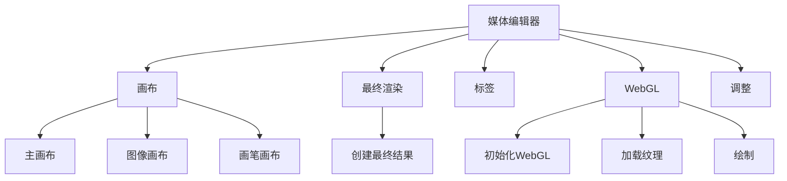
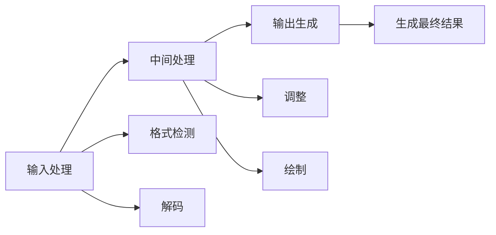
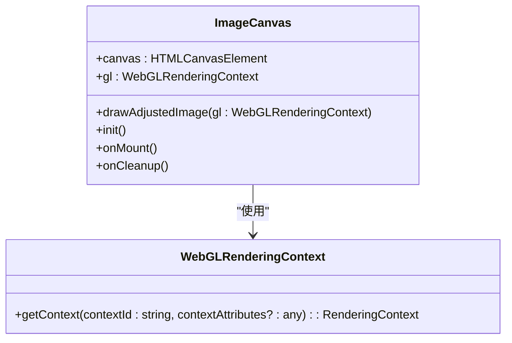
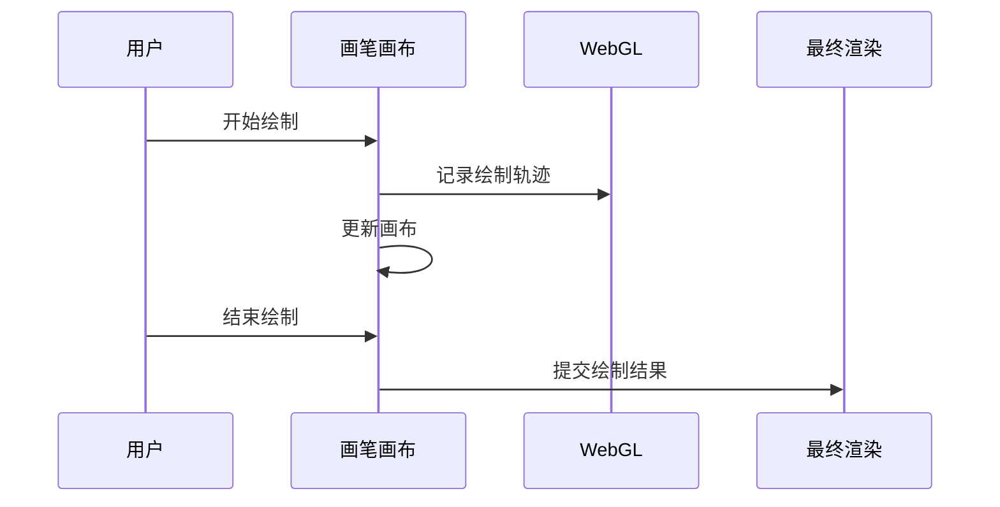
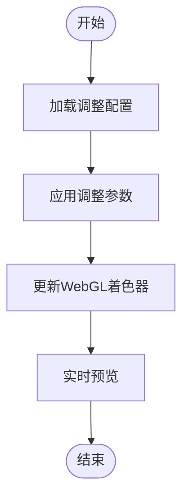
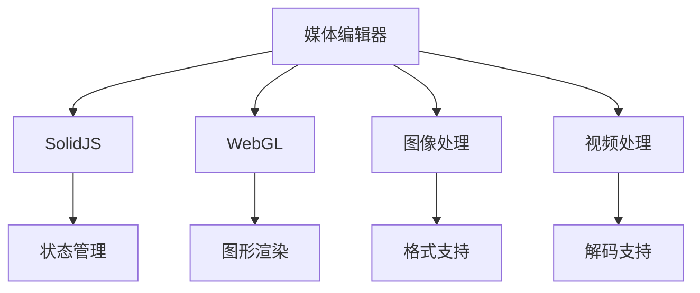

# 媒体处理

<cite>
**本文档中引用的文件**  
- [mediaEditor.tsx](file://src/components/mediaEditor/mediaEditor.tsx)
- [context.ts](file://src/components/mediaEditor/context.ts)
- [types.ts](file://src/components/mediaEditor/types.ts)
- [imageCanvas.tsx](file://src/components/mediaEditor/canvas/imageCanvas.tsx)
- [brushCanvas.tsx](file://src/components/mediaEditor/canvas/brushCanvas.tsx)
- [mainCanvas.tsx](file://src/components/mediaEditor/canvas/mainCanvas.tsx)
- [initWebGL.ts](file://src/components/mediaEditor/webgl/initWebGL.ts)
- [loadTexture.ts](file://src/components/mediaEditor/webgl/loadTexture.ts)
- [draw.ts](file://src/components/mediaEditor/webgl/draw.ts)
- [createFinalResult.ts](file://src/components/mediaEditor/finalRender/createFinalResult.ts)
- [adjustments.ts](file://src/components/mediaEditor/adjustments.ts)
- [videoMimeTypesSupport.ts](file://src/environment/videoMimeTypesSupport.ts)
- [imageMimeTypesSupport.ts](file://src/environment/imageMimeTypesSupport.ts)
- [mediaMimeTypesSupport.ts](file://src/environment/mediaMimeTypesSupport.ts)
</cite>

## 目录
1. [简介](#简介)
2. [项目结构](#项目结构)
3. [核心组件](#核心组件)
4. [架构概述](#架构概述)
5. [详细组件分析](#详细组件分析)
6. [依赖分析](#依赖分析)
7. [性能考虑](#性能考虑)
8. [故障排除指南](#故障排除指南)
9. [结论](#结论)

## 简介
本文档详细说明了媒体编辑器中媒体处理功能的实现，包括对不同类型的媒体输入（图片、视频）的处理流程。文档涵盖了格式检测、解码、预处理、统一接口设计、抽象层实现、媒体渲染和显示机制、错误处理策略以及兼容性解决方案。

## 项目结构
媒体编辑器功能主要位于 `src/components/mediaEditor` 目录下，包含多个子模块，分别负责画布管理、最终渲染、标签管理、WebGL集成等。核心功能通过SolidJS框架实现，利用WebGL进行高性能图形处理。

**图示来源**
- [imageCanvas.tsx](file://src/components/mediaEditor/canvas/imageCanvas.tsx)
- [brushCanvas.tsx](file://src/components/mediaEditor/canvas/brushCanvas.tsx)
- [mainCanvas.tsx](file://src/components/mediaEditor/canvas/mainCanvas.tsx)
- [createFinalResult.ts](file://src/components/mediaEditor/finalRender/createFinalResult.ts)
- [initWebGL.ts](file://src/components/mediaEditor/webgl/initWebGL.ts)
- [loadTexture.ts](file://src/components/mediaEditor/webgl/loadTexture.ts)
- [draw.ts](file://src/components/mediaEditor/webgl/draw.ts)

**章节来源**
- [mediaEditor.tsx](file://src/components/mediaEditor/mediaEditor.tsx)
- [context.ts](file://src/components/mediaEditor/context.ts)

## 核心组件
媒体编辑器的核心组件包括媒体状态管理、画布渲染、调整功能和最终结果生成。这些组件通过上下文（Context）进行通信，确保状态的一致性和可维护性。

**章节来源**
- [context.ts](file://src/components/mediaEditor/context.ts)
- [types.ts](file://src/components/mediaEditor/types.ts)
- [mediaEditor.tsx](file://src/components/mediaEditor/mediaEditor.tsx)

## 架构概述
媒体编辑器采用分层架构，将媒体处理流程分为输入处理、中间处理和输出生成三个阶段。输入处理负责格式检测和解码，中间处理包括调整和绘制，输出生成则负责最终的媒体文件生成。

**图示来源**
- [imageMimeTypesSupport.ts](file://src/environment/imageMimeTypesSupport.ts)
- [videoMimeTypesSupport.ts](file://src/environment/videoMimeTypesSupport.ts)
- [mediaMimeTypesSupport.ts](file://src/environment/mediaMimeTypesSupport.ts)
- [initWebGL.ts](file://src/components/mediaEditor/webgl/initWebGL.ts)
- [loadTexture.ts](file://src/components/mediaEditor/webgl/loadTexture.ts)
- [draw.ts](file://src/components/mediaEditor/webgl/draw.ts)
- [createFinalResult.ts](file://src/components/mediaEditor/finalRender/createFinalResult.ts)

## 详细组件分析
### 图像画布分析
图像画布组件负责加载和显示图像或视频，通过WebGL进行渲染。它根据媒体类型选择合适的加载方式，并将媒体数据上传到GPU进行处理。

**图示来源**
- [imageCanvas.tsx](file://src/components/mediaEditor/canvas/imageCanvas.tsx)

**章节来源**
- [imageCanvas.tsx](file://src/components/mediaEditor/canvas/imageCanvas.tsx)
- [initWebGL.ts](file://src/components/mediaEditor/webgl/initWebGL.ts)
- [loadTexture.ts](file://src/components/mediaEditor/webgl/loadTexture.ts)

### 画笔画布分析
画笔画布组件允许用户在媒体上绘制，支持多种画笔样式和颜色。它通过监听鼠标和触摸事件来记录用户的绘制轨迹，并将这些轨迹应用到最终的渲染结果中。

**图示来源**
- [brushCanvas.tsx](file://src/components/mediaEditor/canvas/brushCanvas.tsx)

**章节来源**
- [brushCanvas.tsx](file://src/components/mediaEditor/canvas/brushCanvas.tsx)
- [createFinalResult.ts](file://src/components/mediaEditor/finalRender/createFinalResult.ts)

### 调整功能分析
调整功能允许用户对媒体进行亮度、对比度、饱和度等参数的调整。这些调整通过WebGL着色器实现，确保实时预览和高性能处理。

**图示来源**
- [adjustments.ts](file://src/components/mediaEditor/adjustments.ts)
- [draw.ts](file://src/components/mediaEditor/webgl/draw.ts)

**章节来源**
- [adjustments.ts](file://src/components/mediaEditor/adjustments.ts)
- [draw.ts](file://src/components/mediaEditor/webgl/draw.ts)

## 依赖分析
媒体编辑器依赖于多个外部库和内部模块，包括SolidJS、WebGL、图像和视频处理库等。这些依赖通过模块化的方式进行管理，确保代码的可维护性和可扩展性。

**图示来源**
- [mediaEditor.tsx](file://src/components/mediaEditor/mediaEditor.tsx)
- [context.ts](file://src/components/mediaEditor/context.ts)
- [initWebGL.ts](file://src/components/mediaEditor/webgl/initWebGL.ts)
- [imageMimeTypesSupport.ts](file://src/environment/imageMimeTypesSupport.ts)
- [videoMimeTypesSupport.ts](file://src/environment/videoMimeTypesSupport.ts)

**章节来源**
- [mediaEditor.tsx](file://src/components/mediaEditor/mediaEditor.tsx)
- [context.ts](file://src/components/mediaEditor/context.ts)
- [initWebGL.ts](file://src/components/mediaEditor/webgl/initWebGL.ts)
- [imageMimeTypesSupport.ts](file://src/environment/imageMimeTypesSupport.ts)
- [videoMimeTypesSupport.ts](file://src/environment/videoMimeTypesSupport.ts)

## 性能考虑
媒体编辑器在设计时充分考虑了性能优化，通过WebGL进行硬件加速，减少CPU负担。同时，采用异步加载和缓存机制，提高媒体处理的响应速度。

**章节来源**
- [initWebGL.ts](file://src/components/mediaEditor/webgl/initWebGL.ts)
- [loadTexture.ts](file://src/components/mediaEditor/webgl/loadTexture.ts)
- [draw.ts](file://src/components/mediaEditor/webgl/draw.ts)

## 故障排除指南
在使用媒体编辑器时，可能会遇到格式不支持、性能问题等。建议检查媒体文件的格式是否在支持列表中，确保浏览器支持WebGL，并优化媒体文件的大小和分辨率。

**章节来源**
- [imageMimeTypesSupport.ts](file://src/environment/imageMimeTypesSupport.ts)
- [videoMimeTypesSupport.ts](file://src/environment/videoMimeTypesSupport.ts)
- [mediaMimeTypesSupport.ts](file://src/environment/mediaMimeTypesSupport.ts)

## 结论
媒体编辑器通过分层架构和模块化设计，实现了高效、灵活的媒体处理功能。通过WebGL和SolidJS的结合，提供了高性能的图形处理和实时预览能力，确保在不同设备和浏览器上的稳定运行。