# 核心功能

<cite>
**本文档中引用的文件**  
- [mediaEditor.tsx](file://src/components/mediaEditor/mediaEditor.tsx)
- [context.ts](file://src/components/mediaEditor/context.ts)
- [types.ts](file://src/components/mediaEditor/types.ts)
- [utils.ts](file://src/components/mediaEditor/utils.ts)
- [adjustments.ts](file://src/components/mediaEditor/adjustments.ts)
- [createFinalResult.ts](file://src/components/mediaEditor/finalRender/createFinalResult.ts)
- [mainCanvas.tsx](file://src/components/mediaEditor/canvas/mainCanvas.tsx)
- [imageCanvas.tsx](file://src/components/mediaEditor/canvas/imageCanvas.tsx)
- [toolbar.tsx](file://src/components/mediaEditor/toolbar.tsx)
- [initWebGL.ts](file://src/components/mediaEditor/webgl/initWebGL.ts)
- [renderToImage.ts](file://src/components/mediaEditor/finalRender/renderToImage.ts)
- [renderToVideoGIF.ts](file://src/components/mediaEditor/finalRender/renderToVideoGIF.ts)
</cite>

## 目录
1. [简介](#简介)
2. [项目结构](#项目结构)
3. [核心组件](#核心组件)
4. [架构概述](#架构概述)
5. [详细组件分析](#详细组件分析)
6. [依赖分析](#依赖分析)
7. [性能考虑](#性能考虑)
8. [故障排除指南](#故障排除指南)
9. [结论](#结论)

## 简介
本文档详细说明了媒体编辑器的核心功能，包括组件的初始化流程、状态管理机制、整体架构设计以及各编辑模块的协调工作。文档还解释了编辑上下文的结构和作用、核心类型定义的设计理念、组件生命周期管理的实现细节、不同媒体输入类型的处理方式、错误处理机制和边界情况应对方案。

## 项目结构
媒体编辑器功能位于 `src/components/mediaEditor` 目录下，采用模块化设计，各功能组件分离清晰。主要目录结构包括：
- `canvas`：处理画布相关的渲染和交互
- `finalRender`：处理最终结果的生成和导出
- `tabs`：实现不同编辑功能的标签页
- `webgl`：基于WebGL的图形渲染功能
- 核心文件：`mediaEditor.tsx`、`context.ts`、`types.ts`、`utils.ts`

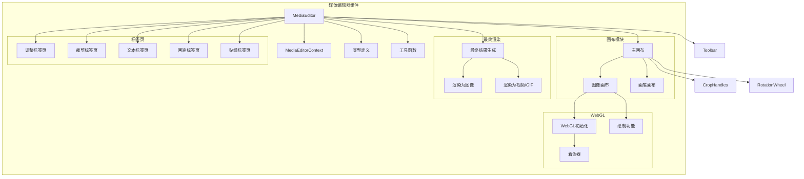

**图表来源**
- [mediaEditor.tsx](file://src/components/mediaEditor/mediaEditor.tsx#L1-L149)
- [context.ts](file://src/components/mediaEditor/context.ts#L1-L266)
- [types.ts](file://src/components/mediaEditor/types.ts#L1-L65)

**章节来源**
- [mediaEditor.tsx](file://src/components/mediaEditor/mediaEditor.tsx#L1-L149)
- [context.ts](file://src/components/mediaEditor/context.ts#L1-L266)

## 核心组件
媒体编辑器的核心组件包括MediaEditor主组件、上下文管理、类型定义和工具函数。这些组件共同协作，实现了完整的媒体编辑功能。

**章节来源**
- [mediaEditor.tsx](file://src/components/mediaEditor/mediaEditor.tsx#L1-L149)
- [context.ts](file://src/components/mediaEditor/context.ts#L1-L266)
- [types.ts](file://src/components/mediaEditor/types.ts#L1-L65)
- [utils.ts](file://src/components/mediaEditor/utils.ts#L1-L234)

## 架构概述
媒体编辑器采用基于SolidJS的响应式架构，通过Context实现状态管理，使用WebGL进行高性能图形渲染。整体架构分为四个主要层次：UI层、状态管理层、渲染层和工具层。

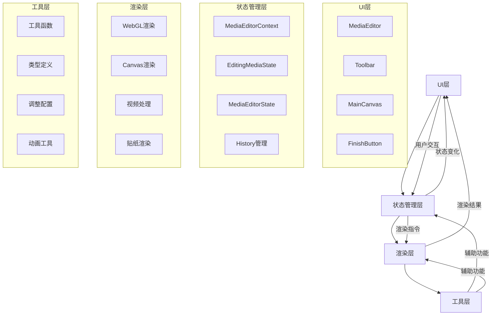

**图表来源**
- [mediaEditor.tsx](file://src/components/mediaEditor/mediaEditor.tsx#L1-L149)
- [context.ts](file://src/components/mediaEditor/context.ts#L1-L266)
- [webgl/initWebGL.ts](file://src/components/mediaEditor/webgl/initWebGL.ts#L1-L57)

## 详细组件分析

### 组件初始化流程
媒体编辑器的初始化流程从`openMediaEditor`函数开始，通过SolidJS的render函数创建编辑器实例。初始化过程中，首先创建上下文值，然后设置导航项，最后处理画布准备和图像渲染的回调。

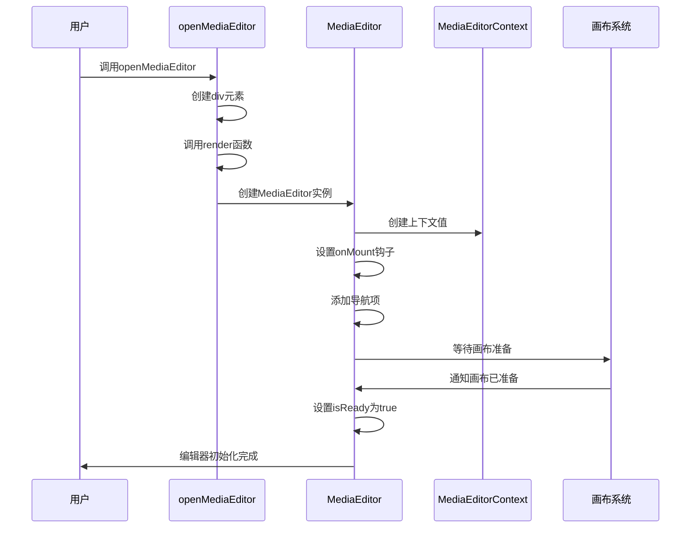

**图表来源**
- [mediaEditor.tsx](file://src/components/mediaEditor/mediaEditor.tsx#L133-L148)
- [index.ts](file://src/components/mediaEditor/index.ts#L29-L110)

**章节来源**
- [mediaEditor.tsx](file://src/components/mediaEditor/mediaEditor.tsx#L1-L149)
- [index.ts](file://src/components/mediaEditor/index.ts#L1-L111)

### 状态管理机制
媒体编辑器使用SolidJS的store系统进行状态管理，通过MediaEditorContext提供全局状态访问。状态分为编辑媒体状态和编辑器状态两部分，分别管理媒体的编辑属性和编辑器的UI状态。

```mermaid
classDiagram
class MediaEditorContextValue {
+managers : AppManagers
+mediaSrc : string
+mediaType : MediaType
+mediaBlob : Blob
+mediaSize : NumberPair
+mediaState : Store~EditingMediaState~
+editorState : Store~MediaEditorState~
+actions : EditorOverridableGlobalActions
+hasModifications : Accessor~boolean~
+imageRatio : number
+resizableLayersSeed : number
}
class EditingMediaState {
+scale : number
+rotation : number
+translation : NumberPair
+flip : NumberPair
+currentImageRatio : number
+currentVideoTime : number
+videoCropStart : number
+videoCropLength : number
+videoThumbnailPosition : number
+videoMuted : boolean
+videoQuality : number
+adjustments : Record~AdjustmentKey, number~
+resizableLayers : ResizableLayer[]
+brushDrawnLines : BrushDrawnLine[]
+history : HistoryItem[]
+redoHistory : HistoryItem[]
}
class MediaEditorState {
+isReady : boolean
+pixelRatio : number
+renderingPayload : RenderingPayload
+currentTab : string
+imageSize : NumberPair
+canvasSize : NumberPair
+fixedImageRatioKey : string
+finalTransform : FinalTransform
+currentTextLayerInfo : TextLayerInfo
+selectedResizableLayer : number
+stickersLayersInfo : Record~number, StickerRenderingInfo~
+imageCanvas : HTMLCanvasElement
+brushCanvas : HTMLCanvasElement
+currentBrush : {color : string, size : number, brush : string}
+previewBrushSize : number
+resizeHandlesContainer : HTMLDivElement
+isAdjusting : boolean
+isMoving : boolean
+isPlaying : boolean
}
MediaEditorContextValue --> EditingMediaState : "包含"
MediaEditorContextValue --> MediaEditorState : "包含"
```

**图表来源**
- [context.ts](file://src/components/mediaEditor/context.ts#L1-L266)
- [types.ts](file://src/components/mediaEditor/types.ts#L1-L65)

**章节来源**
- [context.ts](file://src/components/mediaEditor/context.ts#L1-L266)
- [types.ts](file://src/components/mediaEditor/types.ts#L1-L65)

### 编辑模块协调
媒体编辑器通过Toolbar组件协调各个编辑模块的工作。每个编辑功能（裁剪、调整、贴纸等）都有对应的标签页组件，通过Context共享状态，实现模块间的无缝协作。

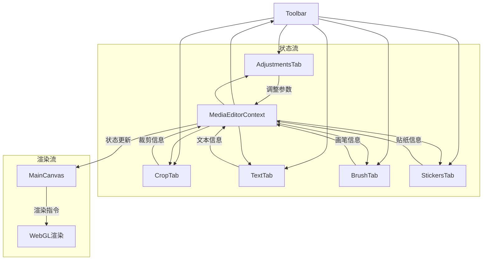

**图表来源**
- [toolbar.tsx](file://src/components/mediaEditor/toolbar.tsx#L1-L181)
- [tabs/*.tsx](file://src/components/mediaEditor/tabs/)

**章节来源**
- [toolbar.tsx](file://src/components/mediaEditor/toolbar.tsx#L1-L181)
- [context.ts](file://src/components/mediaEditor/context.ts#L1-L266)

### 媒体资源管理
媒体编辑器通过WebGL和Canvas技术管理媒体资源的加载和释放。使用`initWebGL`函数初始化渲染环境，通过`cleanupWebGl`函数在组件销毁时释放资源，确保内存使用效率。

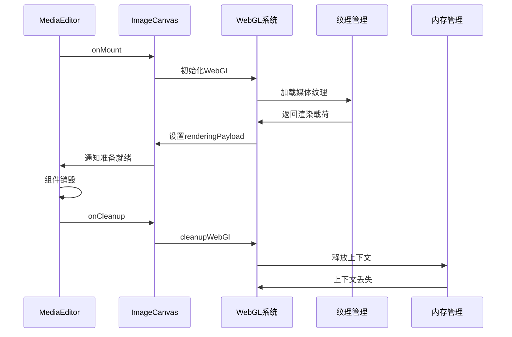

**图表来源**
- [imageCanvas.tsx](file://src/components/mediaEditor/canvas/imageCanvas.tsx#L1-L89)
- [utils.ts](file://src/components/mediaEditor/utils.ts#L159-L161)
- [initWebGL.ts](file://src/components/mediaEditor/webgl/initWebGL.ts#L1-L57)

**章节来源**
- [imageCanvas.tsx](file://src/components/mediaEditor/canvas/imageCanvas.tsx#L1-L89)
- [utils.ts](file://src/components/mediaEditor/utils.ts#L1-L234)

### 编辑上下文结构
编辑上下文（MediaEditorContext）是媒体编辑器的核心，它封装了所有必要的状态和操作，为各个组件提供统一的访问接口。上下文值通过`createContextValue`函数创建，包含媒体信息、状态存储、操作方法等。

```mermaid
classDiagram
class MediaEditorContextValue {
+managers : AppManagers
+mediaSrc : string
+mediaType : MediaType
+mediaBlob : Blob
+mediaSize : NumberPair
+mediaState : Store~EditingMediaState~
+editorState : Store~MediaEditorState~
+actions : EditorOverridableGlobalActions
+hasModifications : Accessor~boolean~
+imageRatio : number
+resizableLayersSeed : number
}
class EditorOverridableGlobalActions {
+pushToHistory : (item : HistoryItem) => void
+setInitialImageRatio : (ratio : number) => void
+redrawBrushes : () => void
+abortDrawerSlide : () => void
+resetRotationWheel : () => void
+setVideoTime : (time : number, flags? : SetVideoTimeFlags) => void
}
class HistoryItem {
+path : KeyofEditingMediaState
+newValue : any
+oldValue : any
+findBy? : {id : any}
}
MediaEditorContextValue --> EditorOverridableGlobalActions : "包含"
MediaEditorContextValue --> HistoryItem : "历史管理"
```

**图表来源**
- [context.ts](file://src/components/mediaEditor/context.ts#L1-L266)
- [mediaEditor.tsx](file://src/components/mediaEditor/mediaEditor.tsx#L1-L149)

**章节来源**
- [context.ts](file://src/components/mediaEditor/context.ts#L1-L266)

### 核心类型定义
核心类型定义文件（types.ts）定义了媒体编辑器所需的所有类型，包括数字对、媒体类型、可调整图层、文本渲染信息等。这些类型为代码提供了类型安全和清晰的接口定义。

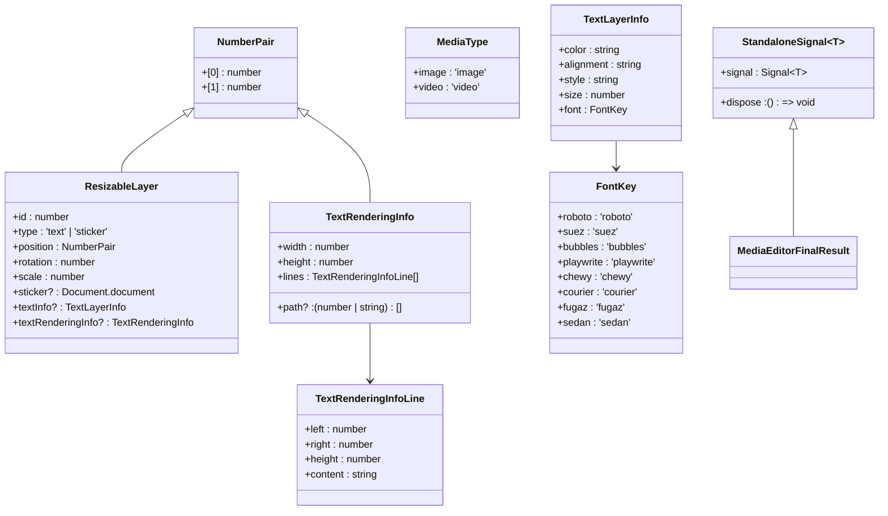

**图表来源**
- [types.ts](file://src/components/mediaEditor/types.ts#L1-L65)

**章节来源**
- [types.ts](file://src/components/mediaEditor/types.ts#L1-L65)

### 组件生命周期管理
媒体编辑器的生命周期管理通过SolidJS的onMount和onCleanup钩子实现。在组件挂载时初始化状态和事件监听器，在组件卸载时清理资源和移除监听器，确保组件的完整生命周期管理。

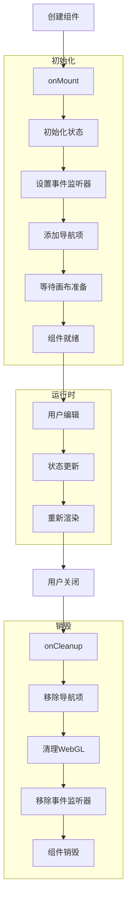

**图表来源**
- [mediaEditor.tsx](file://src/components/mediaEditor/mediaEditor.tsx#L43-L61)
- [imageCanvas.tsx](file://src/components/mediaEditor/canvas/imageCanvas.tsx#L68-L85)
- [utils.ts](file://src/components/mediaEditor/utils.ts#L159-L161)

**章节来源**
- [mediaEditor.tsx](file://src/components/mediaEditor/mediaEditor.tsx#L1-L149)
- [imageCanvas.tsx](file://src/components/mediaEditor/canvas/imageCanvas.tsx#L1-L89)

### 资源清理与内存优化
媒体编辑器通过多种策略实现资源清理和内存优化，包括WebGL上下文丢失、事件监听器清理、异步操作取消等。这些策略确保在编辑器关闭时释放所有占用的资源，避免内存泄漏。

```mermaid
flowchart TD
A[组件销毁] --> B[onCleanup]
B --> C[移除导航项]
C --> D[清理WebGL上下文]
D --> E[移除事件监听器]
E --> F[取消异步操作]
F --> G[释放画布资源]
G --> H[组件完全销毁]
subgraph "WebGL清理"
D
D1[getExtension('WEBGL_lose_context')]
D2[loseContext()]
D1 --> D2
end
subgraph "事件清理"
E
E1[removeEventListener]
E2[resize]
E3[touchstart]
E4[touchmove]
E5[touchend]
E6[mousedown]
E7[mousemove]
E8[mouseup]
E9[mouseout]
E1 --> E2
E1 --> E3
E1 --> E4
E1 --> E5
E1 --> E6
E1 --> E7
E1 --> E8
E1 --> E9
end
subgraph "异步清理"
F
F1[取消pending的Promise]
F2[清理动画帧]
F3[取消定时器]
end
```

**图表来源**
- [mediaEditor.tsx](file://src/components/mediaEditor/mediaEditor.tsx#L58-L60)
- [imageCanvas.tsx](file://src/components/mediaEditor/canvas/imageCanvas.tsx#L83-L85)
- [utils.ts](file://src/components/mediaEditor/utils.ts#L159-L161)

**章节来源**
- [mediaEditor.tsx](file://src/components/mediaEditor/mediaEditor.tsx#L1-L149)
- [imageCanvas.tsx](file://src/components/mediaEditor/canvas/imageCanvas.tsx#L1-L89)
- [utils.ts](file://src/components/mediaEditor/utils.ts#L1-L234)

### 媒体输入处理
媒体编辑器通过统一的接口处理不同类型的媒体输入（图片、视频）。通过MediaType枚举定义媒体类型，使用不同的渲染策略处理每种类型，同时保持一致的编辑体验。

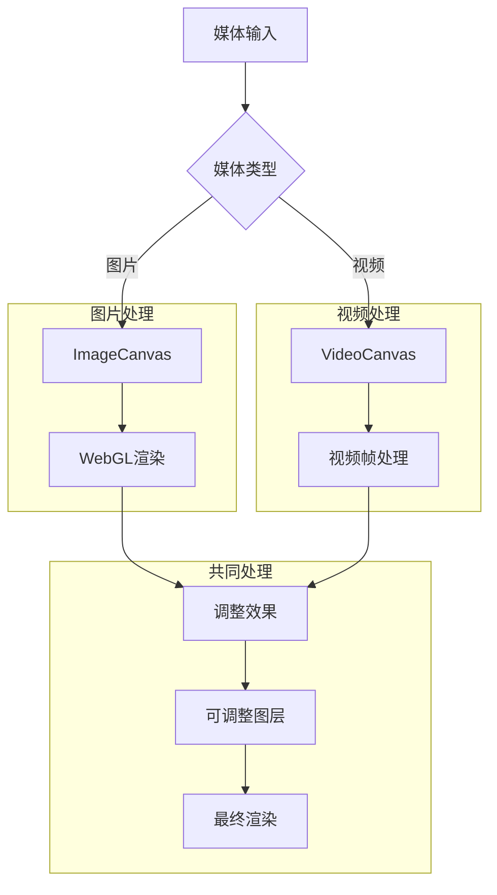

**图表来源**
- [mediaEditor.tsx](file://src/components/mediaEditor/mediaEditor.tsx#L30-L31)
- [context.ts](file://src/components/mediaEditor/context.ts#L7-L8)
- [imageCanvas.tsx](file://src/components/mediaEditor/canvas/imageCanvas.tsx#L31-L32)
- [mainCanvas.tsx](file://src/components/mediaEditor/canvas/mainCanvas.tsx#L46-L48)

**章节来源**
- [mediaEditor.tsx](file://src/components/mediaEditor/mediaEditor.tsx#L1-L149)
- [context.ts](file://src/components/mediaEditor/context.ts#L1-L266)

### 错误处理机制
媒体编辑器实现了完善的错误处理机制，包括用户操作确认、异步操作错误捕获、资源加载失败处理等。通过confirmationPopup处理用户可能丢失修改的场景，通过Promise.catch处理异步操作中的错误。

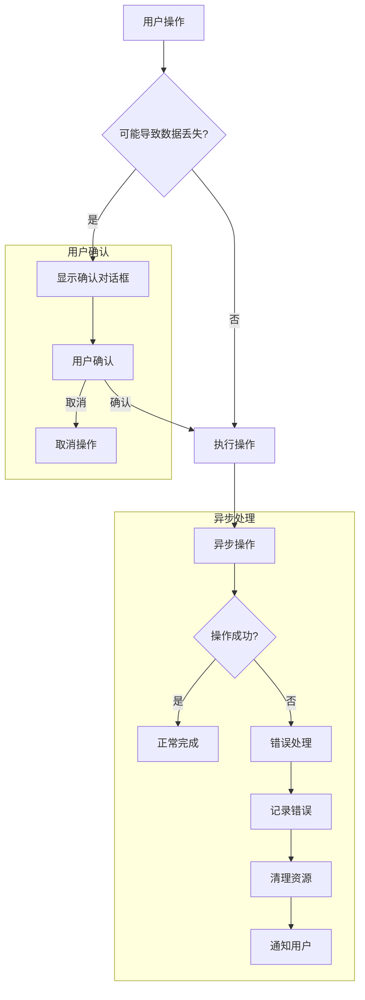

**图表来源**
- [mediaEditor.tsx](file://src/components/mediaEditor/mediaEditor.tsx#L89-L96)
- [createFinalResult.ts](file://src/components/mediaEditor/finalRender/createFinalResult.ts#L180-L183)
- [utils.ts](file://src/components/mediaEditor/utils.ts#L5-L6)

**章节来源**
- [mediaEditor.tsx](file://src/components/mediaEditor/mediaEditor.tsx#L1-L149)
- [createFinalResult.ts](file://src/components/mediaEditor/finalRender/createFinalResult.ts#L1-L195)

## 依赖分析
媒体编辑器依赖于多个内部和外部模块，形成了复杂的依赖关系网络。主要依赖包括SolidJS框架、WebGL渲染系统、媒体处理工具和UI组件库。

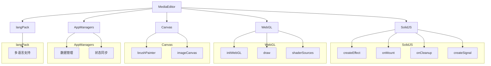

**图表来源**
- [mediaEditor.tsx](file://src/components/mediaEditor/mediaEditor.tsx#L1-L149)
- [context.ts](file://src/components/mediaEditor/context.ts#L1-L266)
- [webgl/initWebGL.ts](file://src/components/mediaEditor/webgl/initWebGL.ts#L1-L57)

**章节来源**
- [mediaEditor.tsx](file://src/components/mediaEditor/mediaEditor.tsx#L1-L149)
- [context.ts](file://src/components/mediaEditor/context.ts#L1-L266)

## 性能考虑
媒体编辑器在设计时充分考虑了性能优化，采用了多种策略来确保流畅的用户体验。这些策略包括WebGL硬件加速、响应式更新、资源预加载和内存管理。

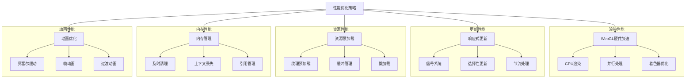

**图表来源**
- [webgl/initWebGL.ts](file://src/components/mediaEditor/webgl/initWebGL.ts#L1-L57)
- [utils.ts](file://src/components/mediaEditor/utils.ts#L88-L125)
- [context.ts](file://src/components/mediaEditor/context.ts#L227-L234)

## 故障排除指南
当媒体编辑器出现问题时，可以参考以下常见问题的解决方案：

**章节来源**
- [mediaEditor.tsx](file://src/components/mediaEditor/mediaEditor.tsx#L1-L149)
- [context.ts](file://src/components/mediaEditor/context.ts#L1-L266)
- [utils.ts](file://src/components/mediaEditor/utils.ts#L1-L234)

### 常见问题及解决方案
1. **编辑器无法打开**
   - 检查媒体源是否有效
   - 确认媒体类型是否支持
   - 验证必要的props是否完整传递

2. **渲染卡顿或性能低下**
   - 检查WebGL是否正常初始化
   - 确认没有内存泄漏
   - 验证动画是否过度频繁更新

3. **编辑修改未保存**
   - 检查hasModifications信号是否正确计算
   - 确认history管理是否正常工作
   - 验证onEditFinish回调是否正确调用

4. **资源未正确释放**
   - 确认onCleanup钩子是否执行
   - 检查WebGL上下文是否丢失
   - 验证事件监听器是否移除

## 结论
媒体编辑器通过精心设计的架构和实现，提供了强大而灵活的媒体编辑功能。其基于SolidJS的响应式状态管理、WebGL硬件加速渲染、模块化组件设计和完善的生命周期管理，共同构成了一个高性能、易维护的编辑系统。通过统一的接口处理不同类型的媒体输入，为用户提供了无缝的编辑体验。系统的错误处理机制和资源管理策略确保了稳定性和可靠性，而各种性能优化技术则保证了流畅的用户体验。