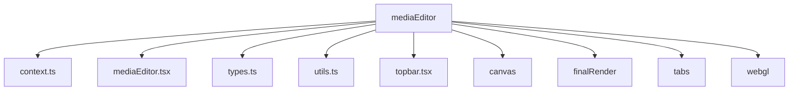
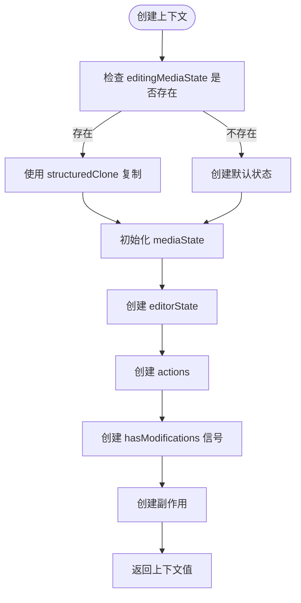
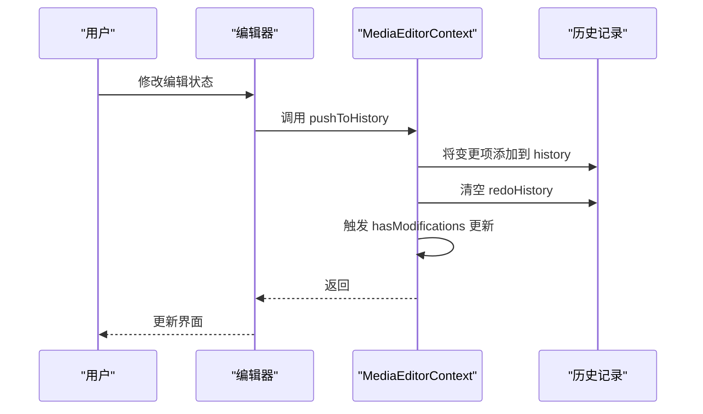
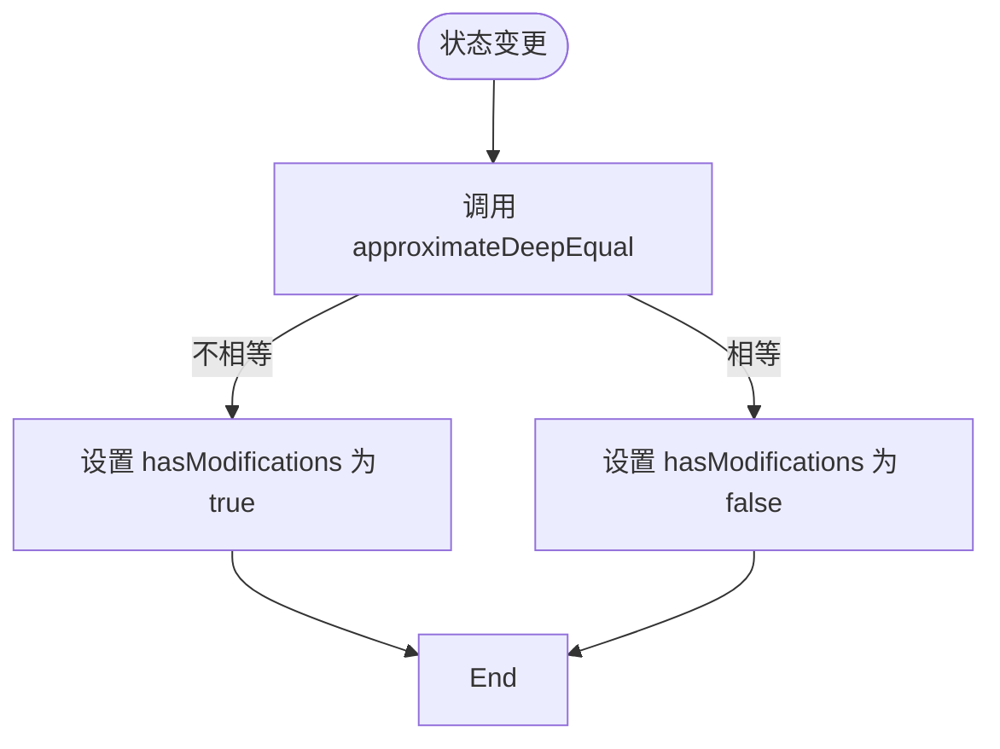
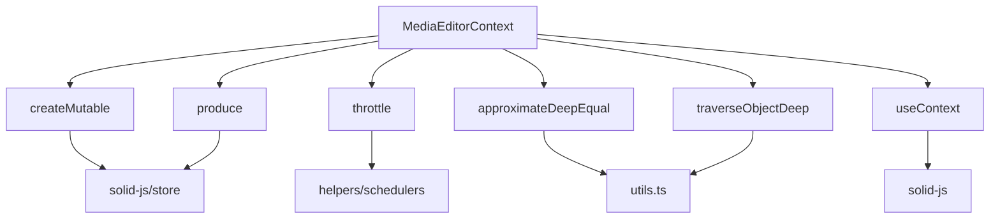

# 状态管理

<cite>
**本文档中引用的文件**  
- [context.ts](file://src/components/mediaEditor/context.ts)
- [mediaEditor.tsx](file://src/components/mediaEditor/mediaEditor.tsx)
- [types.ts](file://src/components/mediaEditor/types.ts)
- [utils.ts](file://src/components/mediaEditor/utils.ts)
- [topbar.tsx](file://src/components/mediaEditor/topbar.tsx)
- [useFinalTransform.ts](file://src/components/mediaEditor/canvas/useFinalTransform.ts)
- [adjustments.ts](file://src/components/mediaEditor/adjustments.ts)
</cite>

## 目录
1. [简介](#简介)
2. [项目结构](#项目结构)
3. [核心组件](#核心组件)
4. [架构概述](#架构概述)
5. [详细组件分析](#详细组件分析)
6. [依赖分析](#依赖分析)
7. [性能考虑](#性能考虑)
8. [故障排除指南](#故障排除指南)
9. [结论](#结论)

## 简介
本文档详细说明了媒体编辑器的状态管理机制，重点介绍 `MediaEditorContext` 的结构设计和状态管理策略。文档涵盖了当前编辑状态、工具状态、图层信息等核心数据的存储与更新方式，解释了自定义 Hook `useMediaEditorContext` 的实现原理和使用方法。同时，文档描述了状态变更的触发条件和响应机制，以及如何保证状态的一致性和同步性，并提供了状态管理的最佳实践和常见问题解决方案。

## 项目结构
媒体编辑器的状态管理主要集中在 `src/components/mediaEditor` 目录下，该目录包含了状态定义、上下文管理、工具和辅助函数等核心文件。



**Diagram sources**
- [context.ts](file://src/components/mediaEditor/context.ts)
- [mediaEditor.tsx](file://src/components/mediaEditor/mediaEditor.tsx)

**Section sources**
- [context.ts](file://src/components/mediaEditor/context.ts)
- [mediaEditor.tsx](file://src/components/mediaEditor/mediaEditor.tsx)

## 核心组件
媒体编辑器的核心状态管理由 `MediaEditorContext` 提供，该上下文包含了媒体状态、编辑器状态、动作和访问器等关键属性。`MediaEditorState` 和 `EditingMediaState` 定义了编辑器的完整状态结构，包括图像变换、图层信息、画笔设置等。

**Section sources**
- [context.ts](file://src/components/mediaEditor/context.ts)
- [types.ts](file://src/components/mediaEditor/types.ts)

## 架构概述
媒体编辑器采用基于 SolidJS 的响应式状态管理架构，通过 `createMutable` 创建可变状态，并使用 `createContext` 提供全局上下文。状态管理分为两个主要部分：`mediaState` 用于存储媒体编辑的核心数据，`editorState` 用于存储编辑器界面的状态。

```mermaid
classDiagram
class MediaEditorContextValue {
+managers : AppManagers
+mediaSrc : string
+mediaType : MediaType
+mediaBlob : Blob
+mediaSize : NumberPair
+mediaState : Store~EditingMediaState~
+editorState : Store~MediaEditorState~
+actions : EditorOverridableGlobalActions
+hasModifications : Accessor~boolean~
+imageRatio : number
+resizableLayersSeed : number
}
class EditingMediaState {
+scale : number
+rotation : number
+translation : NumberPair
+flip : NumberPair
+currentImageRatio : number
+currentVideoTime : number
+videoCropStart : number
+videoCropLength : number
+videoThumbnailPosition : number
+videoMuted : boolean
+videoQuality : number
+adjustments : Record~AdjustmentKey, number~
+resizableLayers : ResizableLayer[]
+brushDrawnLines : BrushDrawnLine[]
+history : HistoryItem[]
+redoHistory : HistoryItem[]
}
class MediaEditorState {
+isReady : boolean
+pixelRatio : number
+renderingPayload? : RenderingPayload
+currentTab : string
+imageSize? : NumberPair
+canvasSize? : NumberPair
+fixedImageRatioKey? : string
+finalTransform : FinalTransform
+currentTextLayerInfo : TextLayerInfo
+selectedResizableLayer? : number
+stickersLayersInfo : Record~number, StickerRenderingInfo~
+imageCanvas? : HTMLCanvasElement
+brushCanvas? : HTMLCanvasElement
+currentBrush : {color : string, size : number, brush : string}
+previewBrushSize? : number
+resizeHandlesContainer? : HTMLDivElement
+isAdjusting : boolean
+isMoving : boolean
+isPlaying : boolean
}
MediaEditorContextValue --> EditingMediaState : "包含"
MediaEditorContextValue --> MediaEditorState : "包含"
```

**Diagram sources**
- [context.ts](file://src/components/mediaEditor/context.ts)
- [types.ts](file://src/components/mediaEditor/types.ts)

## 详细组件分析
### MediaEditorContext 分析
`MediaEditorContext` 是媒体编辑器状态管理的核心，它通过 `createContextValue` 函数创建上下文值，该函数接收 `MediaEditorProps` 作为参数并返回 `MediaEditorContextValue` 对象。

#### 状态初始化


**Diagram sources**
- [context.ts](file://src/components/mediaEditor/context.ts#L196-L260)

**Section sources**
- [context.ts](file://src/components/mediaEditor/context.ts#L196-L260)

### 状态变更机制
媒体编辑器通过 `pushToHistory` 动作来管理状态变更历史，每次状态变更都会被记录在 `history` 数组中，同时清空 `redoHistory` 数组。



**Diagram sources**
- [context.ts](file://src/components/mediaEditor/context.ts#L208-L212)
- [topbar.tsx](file://src/components/mediaEditor/topbar.tsx#L35-L41)

**Section sources**
- [context.ts](file://src/components/mediaEditor/context.ts#L208-L212)
- [topbar.tsx](file://src/components/mediaEditor/topbar.tsx#L17-L33)

### 状态一致性保证
媒体编辑器通过 `hasModifications` 信号来跟踪状态是否被修改，该信号通过 `throttle` 函数进行节流处理，避免频繁更新。



**Diagram sources**
- [context.ts](file://src/components/mediaEditor/context.ts#L227-L238)
- [utils.ts](file://src/components/mediaEditor/utils.ts#L60-L76)

**Section sources**
- [context.ts](file://src/components/mediaEditor/context.ts#L227-L238)

## 依赖分析
媒体编辑器的状态管理依赖于多个核心模块和工具函数，这些依赖关系确保了状态管理的完整性和一致性。



**Diagram sources**
- [context.ts](file://src/components/mediaEditor/context.ts)
- [utils.ts](file://src/components/mediaEditor/utils.ts)

**Section sources**
- [context.ts](file://src/components/mediaEditor/context.ts)
- [utils.ts](file://src/components/mediaEditor/utils.ts)

## 性能考虑
媒体编辑器在状态管理方面进行了多项性能优化，包括使用 `throttle` 函数节流状态变更检测、使用 `createEffect` 和 `on` 函数优化副作用执行等。

## 故障排除指南
### 状态未更新问题
如果发现状态变更后界面未更新，可能是由于以下原因：
- 确保使用 `modifyMutable` 或 `produce` 来修改可变状态
- 检查是否正确使用了 `createEffect` 来监听状态变化
- 确认 `hasModifications` 信号是否正确更新

### 历史记录问题
如果历史记录功能不正常，可能是由于：
- 检查 `pushToHistory` 动作是否被正确调用
- 确认 `history` 和 `redoHistory` 数组是否正确维护
- 验证 `processHistoryItem` 函数是否正确处理历史项

**Section sources**
- [context.ts](file://src/components/mediaEditor/context.ts#L208-L212)
- [topbar.tsx](file://src/components/mediaEditor/topbar.tsx#L17-L33)
- [utils.ts](file://src/components/mediaEditor/utils.ts#L127-L152)

## 结论
媒体编辑器的状态管理机制设计精良，通过 SolidJS 的响应式系统实现了高效的状态管理。`MediaEditorContext` 提供了完整的状态管理解决方案，包括状态定义、变更跟踪、历史记录等功能。通过合理使用可变状态、副作用和访问器，确保了状态的一致性和同步性。同时，文档中提到的最佳实践和故障排除指南为开发者提供了有价值的参考。