# 生命周期管理

<cite>
**本文档中引用的文件**  
- [index.ts](file://src/components/mediaEditor/index.ts)
- [mediaEditor.tsx](file://src/components/mediaEditor/mediaEditor.tsx)
- [context.ts](file://src/components/mediaEditor/context.ts)
- [types.ts](file://src/components/mediaEditor/types.ts)
- [utils.ts](file://src/components/mediaEditor/utils.ts)
- [createFinalResult.ts](file://src/components/mediaEditor/finalRender/createFinalResult.ts)
- [initWebGL.ts](file://src/components/mediaEditor/webgl/initWebGL.ts)
- [renderToImage.ts](file://src/components/mediaEditor/finalRender/renderToImage.ts)
- [renderToVideoGIF.ts](file://src/components/mediaEditor/finalRender/renderToVideoGIF.ts)
- [renderToActualVideo.ts](file://src/components/mediaEditor/finalRender/renderToActualVideo.ts)
- [spawnAnimatedPreview.ts](file://src/components/mediaEditor/finalRender/spawnAnimatedPreview.ts)
- [loadTexture.ts](file://src/components/mediaEditor/webgl/loadTexture.ts)
- [mainCanvas.tsx](file://src/components/mediaEditor/canvas/mainCanvas.tsx)
</cite>

## 目录
1. [简介](#简介)
2. [项目结构](#项目结构)
3. [核心组件](#核心组件)
4. [架构概述](#架构概述)
5. [详细组件分析](#详细组件分析)
6. [依赖分析](#依赖分析)
7. [性能考虑](#性能考虑)
8. [故障排除指南](#故障排除指南)
9. [结论](#结论)

## 简介
本文档详细描述了媒体编辑器的生命周期管理，包括组件的初始化流程、挂载和卸载过程，以及资源管理策略。文档还解释了组件如何处理媒体资源的加载、解码和释放，包括内存管理和性能优化措施。此外，文档描述了错误处理和异常恢复机制，以及如何应对资源加载失败等边界情况。最后，文档提供了组件性能监控和优化建议，包括渲染性能、内存使用和响应速度的优化策略。

## 项目结构
媒体编辑器组件位于 `src/components/mediaEditor` 目录下，包含多个子目录和文件，用于处理不同的功能模块。主要目录包括 `canvas`、`finalRender`、`tabs`、`webgl` 等，分别负责画布操作、最终渲染、标签页管理和 WebGL 渲染。

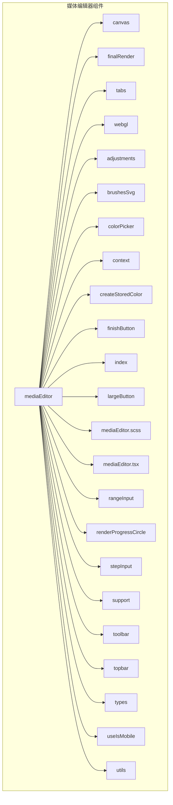

**Diagram sources**
- [mediaEditor.tsx](file://src/components/mediaEditor/mediaEditor.tsx#L1-L149)

**Section sources**
- [mediaEditor.tsx](file://src/components/mediaEditor/mediaEditor.tsx#L1-L149)

## 核心组件
媒体编辑器的核心组件包括 `MediaEditor` 组件、`MediaEditorContext` 上下文、`createFinalResult` 函数等。这些组件共同协作，实现了媒体编辑器的完整功能。

**Section sources**
- [mediaEditor.tsx](file://src/components/mediaEditor/mediaEditor.tsx#L23-L149)
- [context.ts](file://src/components/mediaEditor/context.ts#L1-L266)
- [createFinalResult.ts](file://src/components/mediaEditor/finalRender/createFinalResult.ts#L1-L195)

## 架构概述
媒体编辑器的架构基于 SolidJS 框架，使用了上下文（Context）来管理组件的状态和行为。组件通过 `MediaEditorContext` 提供的状态和行为来实现各种功能，如调整、裁剪、添加贴纸等。

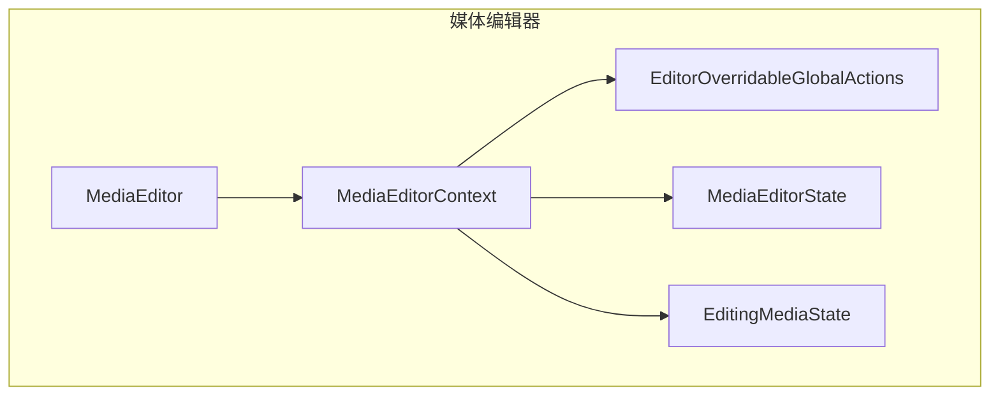

**Diagram sources**
- [context.ts](file://src/components/mediaEditor/context.ts#L1-L266)

## 详细组件分析

### 组件初始化流程
媒体编辑器的初始化流程从 `openMediaEditorFromMedia` 函数开始，该函数创建一个动画画布并将其添加到文档中。然后调用 `openMediaEditor` 函数，该函数创建一个新的 `div` 元素并将其添加到文档中，然后使用 `render` 函数将 `MediaEditor` 组件渲染到该 `div` 中。

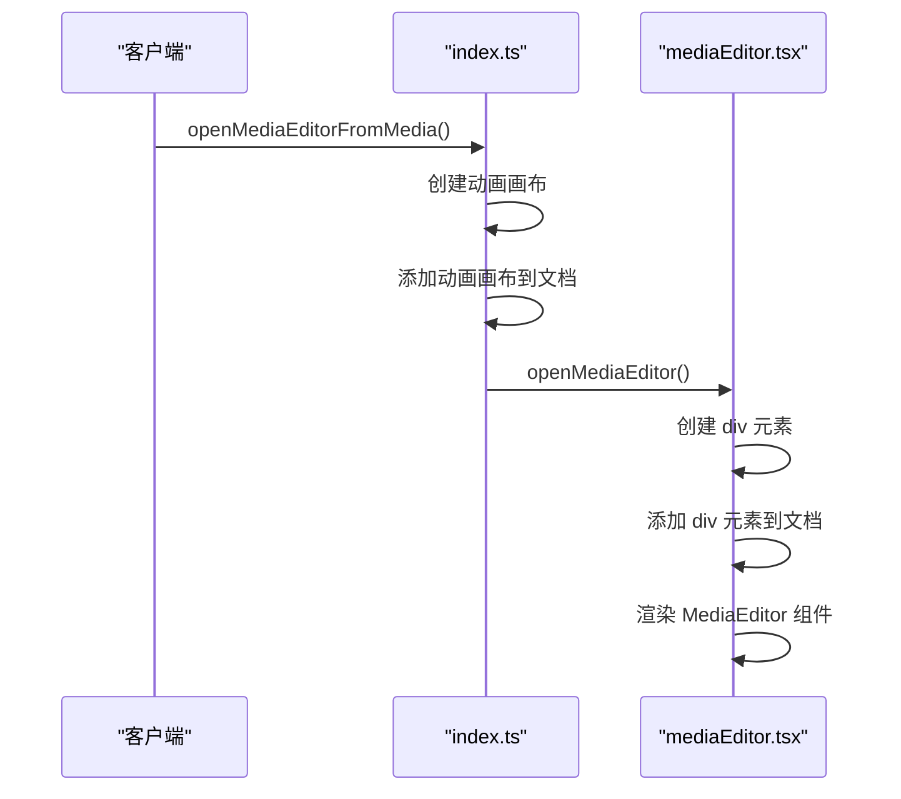

**Diagram sources**
- [index.ts](file://src/components/mediaEditor/index.ts#L1-L111)
- [mediaEditor.tsx](file://src/components/mediaEditor/mediaEditor.tsx#L133-L148)

### 挂载和卸载过程
媒体编辑器的挂载过程在 `MediaEditor` 组件的 `onMount` 钩子中实现。该钩子函数首先将 `overlay` 元素添加到导航控制器中，然后聚焦到 `overlay` 元素。卸载过程在 `onCleanup` 钩子中实现，该钩子函数从导航控制器中移除 `navigationItem`。

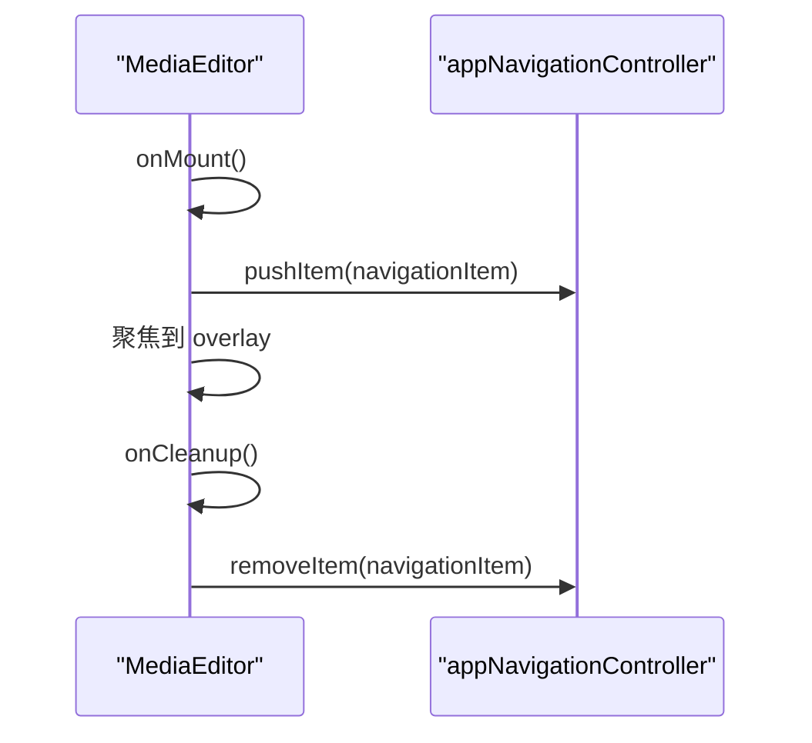

**Diagram sources**
- [mediaEditor.tsx](file://src/components/mediaEditor/mediaEditor.tsx#L43-L61)

### 资源管理策略
媒体编辑器使用 WebGL 进行渲染，通过 `initWebGL` 函数初始化 WebGL 上下文，并加载纹理。`loadTexture` 函数负责加载图像或视频资源，并将其绑定到 WebGL 纹理。

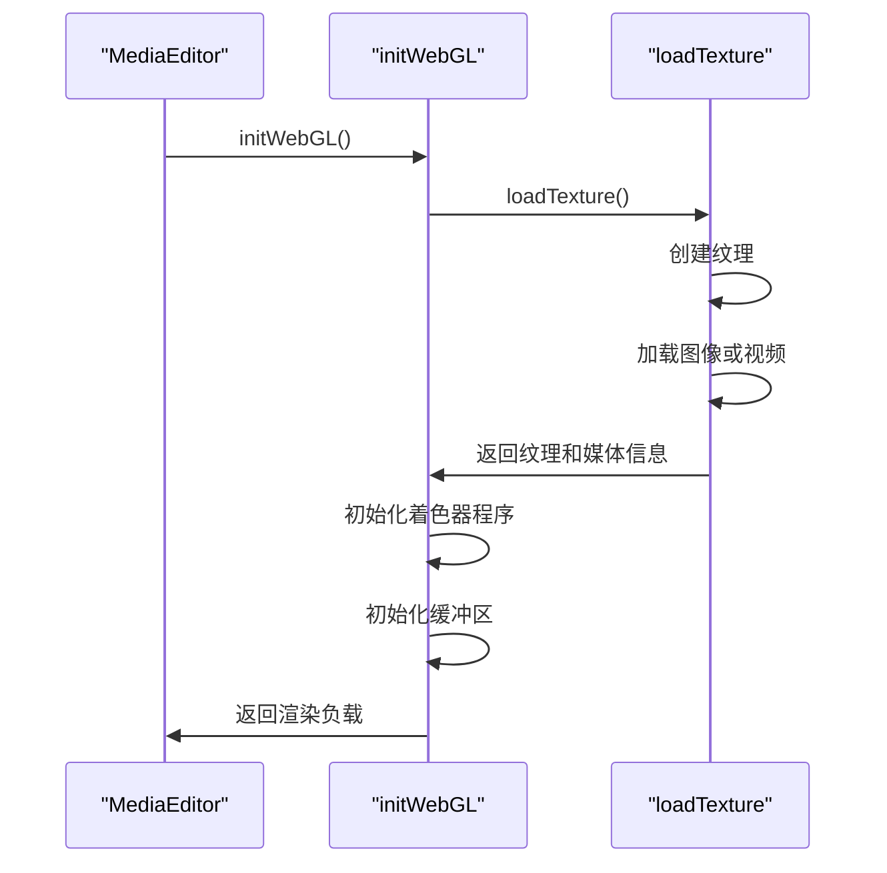

**Diagram sources**
- [initWebGL.ts](file://src/components/mediaEditor/webgl/initWebGL.ts#L1-L57)
- [loadTexture.ts](file://src/components/mediaEditor/webgl/loadTexture.ts#L1-L68)

### 媒体资源的加载、解码和释放
媒体编辑器通过 `createFinalResult` 函数处理媒体资源的最终渲染。该函数根据媒体类型（图像或视频）和是否有动画贴纸，选择不同的渲染路径。对于图像，使用 `renderToImage` 函数；对于视频，使用 `renderToActualVideo` 函数；对于包含动画贴纸的图像，使用 `renderToVideoGIF` 函数。

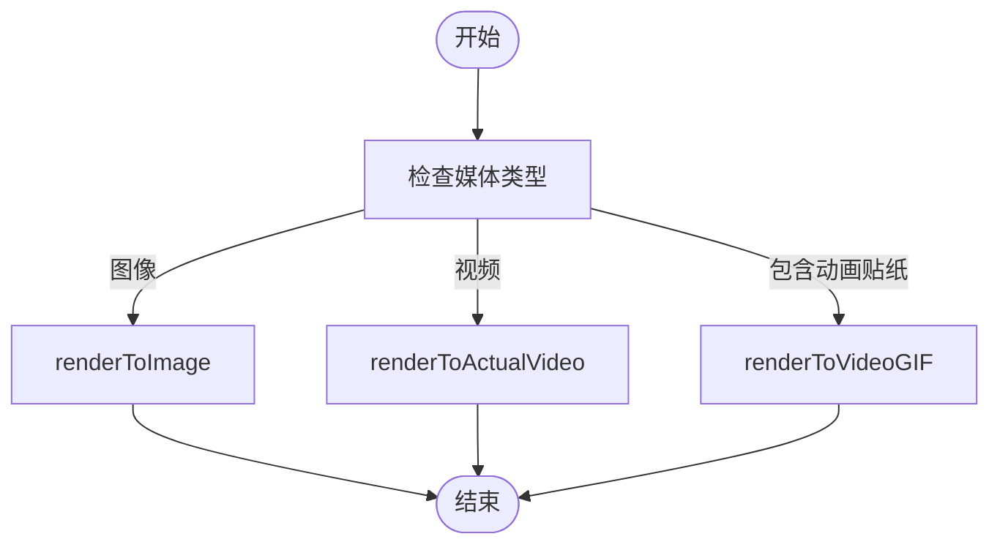

**Diagram sources**
- [createFinalResult.ts](file://src/components/mediaEditor/finalRender/createFinalResult.ts#L1-L195)
- [renderToImage.ts](file://src/components/mediaEditor/finalRender/renderToImage.ts#L1-L55)
- [renderToActualVideo.ts](file://src/components/mediaEditor/finalRender/renderToActualVideo.ts#L1-L530)
- [renderToVideoGIF.ts](file://src/components/mediaEditor/finalRender/renderToVideoGIF.ts#L1-L185)

### 内存管理和性能优化措施
媒体编辑器通过 `cleanupWebGl` 函数清理 WebGL 上下文，释放相关资源。此外，通过 `throttle` 函数节流 `hasModifications` 的更新，减少不必要的计算。

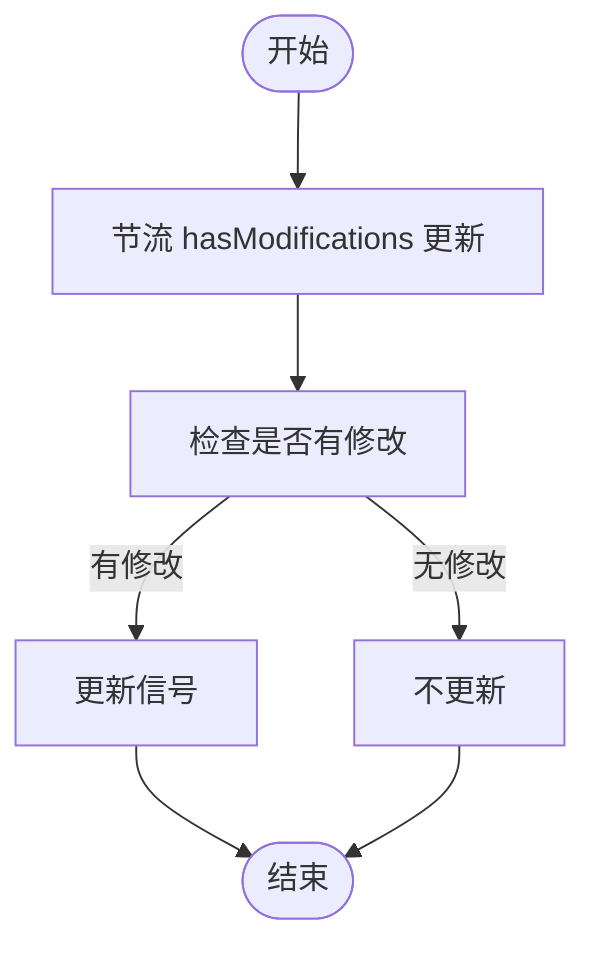

**Diagram sources**
- [utils.ts](file://src/components/mediaEditor/utils.ts#L227-L238)
- [context.ts](file://src/components/mediaEditor/context.ts#L227-L238)

### 错误处理和异常恢复机制
媒体编辑器通过 `confirmationPopup` 函数处理用户关闭编辑器时的确认对话框。如果用户有未保存的修改，会弹出确认对话框，询问用户是否放弃更改。

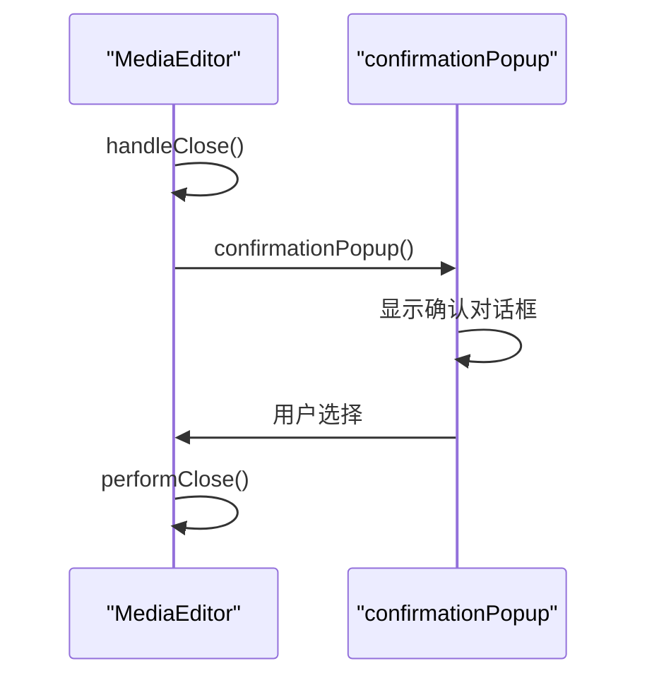

**Diagram sources**
- [mediaEditor.tsx](file://src/components/mediaEditor/mediaEditor.tsx#L83-L97)

### 边界情况处理
媒体编辑器通过 `spawnAnimatedPreview` 函数生成动画预览，该函数在生成预览时会处理各种边界情况，如预览加载失败等。

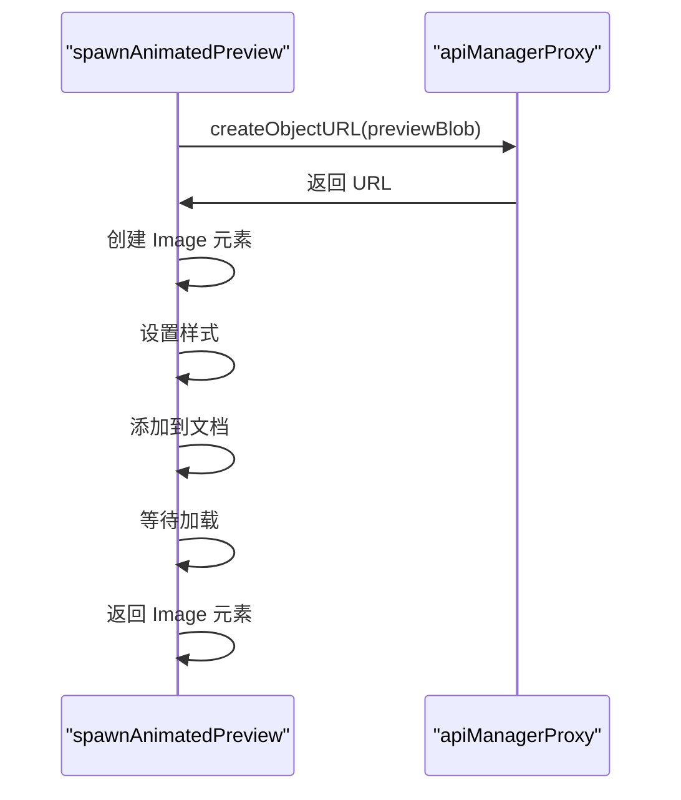

**Diagram sources**
- [spawnAnimatedPreview.ts](file://src/components/mediaEditor/finalRender/spawnAnimatedPreview.ts#L1-L58)

## 依赖分析
媒体编辑器依赖于多个外部库和内部模块，如 `solid-js`、`mp4-muxer`、`AudioEncoder` 等。这些依赖项通过 `import` 语句引入，并在相应的功能模块中使用。

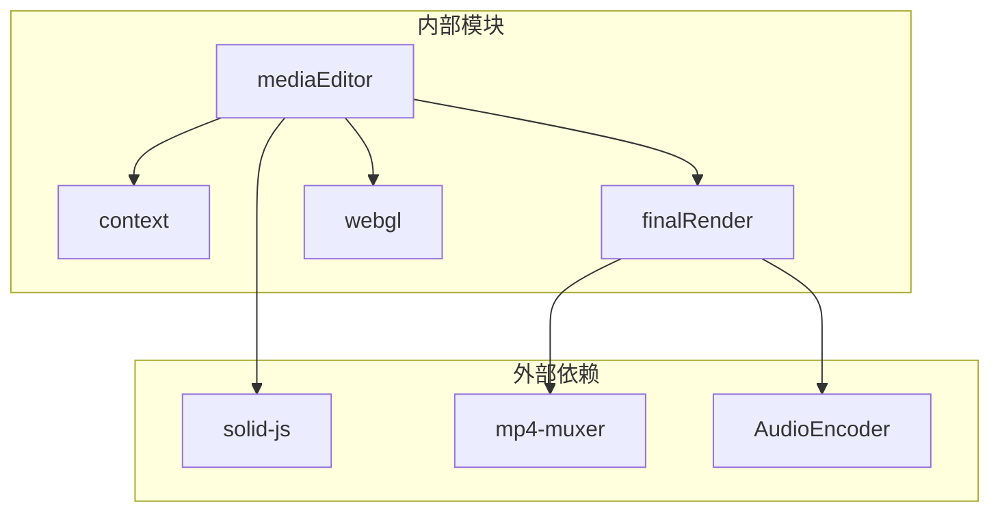

**Diagram sources**
- [mediaEditor.tsx](file://src/components/mediaEditor/mediaEditor.tsx#L1-L149)
- [createFinalResult.ts](file://src/components/mediaEditor/finalRender/createFinalResult.ts#L1-L195)
- [renderToActualVideo.ts](file://src/components/mediaEditor/finalRender/renderToActualVideo.ts#L1-L530)

## 性能考虑
媒体编辑器通过多种方式优化性能，包括使用 WebGL 进行高效渲染、节流状态更新、异步处理资源加载等。此外，通过 `requestVideoFrameCallback` API 实现视频帧的精确控制，确保渲染的流畅性。

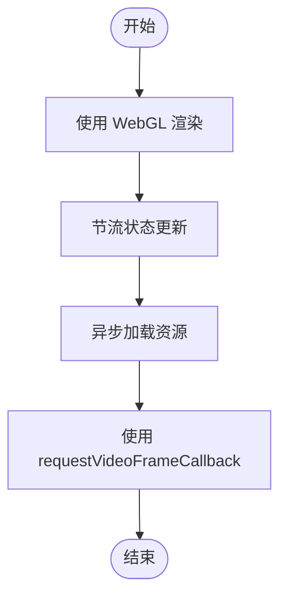

**Diagram sources**
- [initWebGL.ts](file://src/components/mediaEditor/webgl/initWebGL.ts#L1-L57)
- [utils.ts](file://src/components/mediaEditor/utils.ts#L227-L238)
- [renderToActualVideo.ts](file://src/components/mediaEditor/finalRender/renderToActualVideo.ts#L1-L530)

## 故障排除指南
### 资源加载失败
如果资源加载失败，可以检查网络连接、资源 URL 是否正确、资源是否存在等问题。此外，可以查看浏览器的开发者工具中的网络面板，查看具体的错误信息。

### 渲染性能问题
如果渲染性能不佳，可以检查是否启用了 WebGL、是否使用了高效的着色器程序、是否进行了不必要的重绘等。此外，可以通过性能分析工具（如 Chrome DevTools 的 Performance 面板）进行详细分析。

### 内存泄漏
如果发现内存泄漏，可以检查是否正确清理了 WebGL 上下文、是否释放了不再使用的资源等。此外，可以使用内存分析工具（如 Chrome DevTools 的 Memory 面板）进行详细分析。

**Section sources**
- [utils.ts](file://src/components/mediaEditor/utils.ts#L159-L161)
- [renderToActualVideo.ts](file://src/components/mediaEditor/finalRender/renderToActualVideo.ts#L304-L311)

## 结论
本文档详细描述了媒体编辑器的生命周期管理，涵盖了组件的初始化流程、挂载和卸载过程，以及资源管理策略。文档还解释了组件如何处理媒体资源的加载、解码和释放，包括内存管理和性能优化措施。此外，文档描述了错误处理和异常恢复机制，以及如何应对资源加载失败等边界情况。最后，文档提供了组件性能监控和优化建议，帮助开发者更好地理解和优化媒体编辑器的性能。