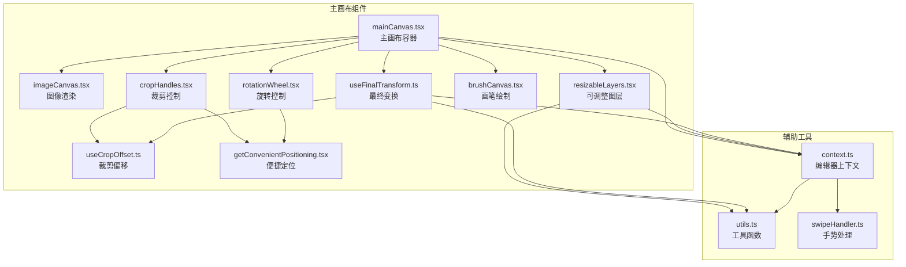
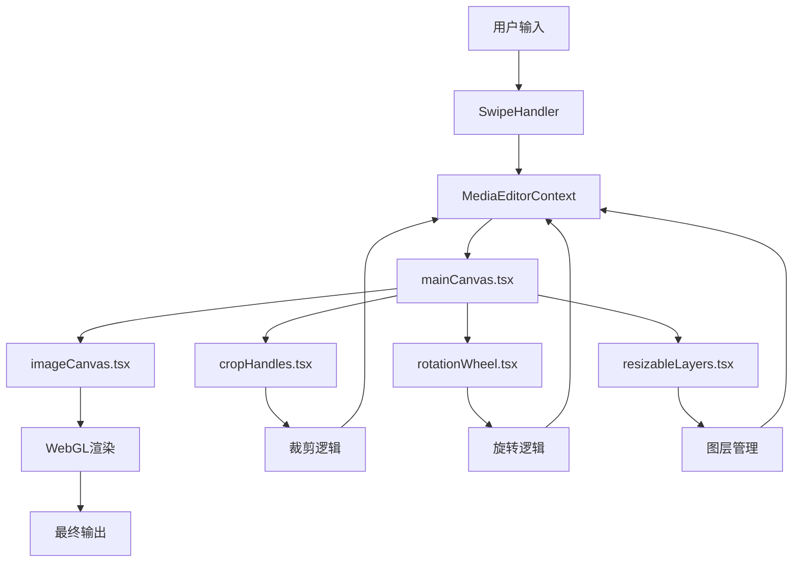
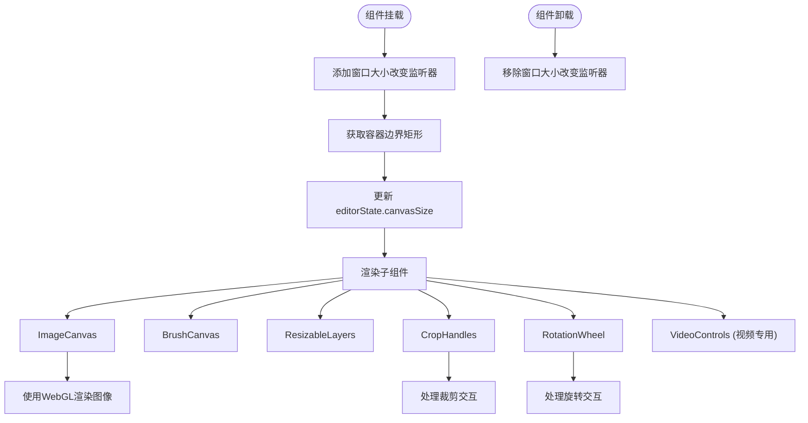
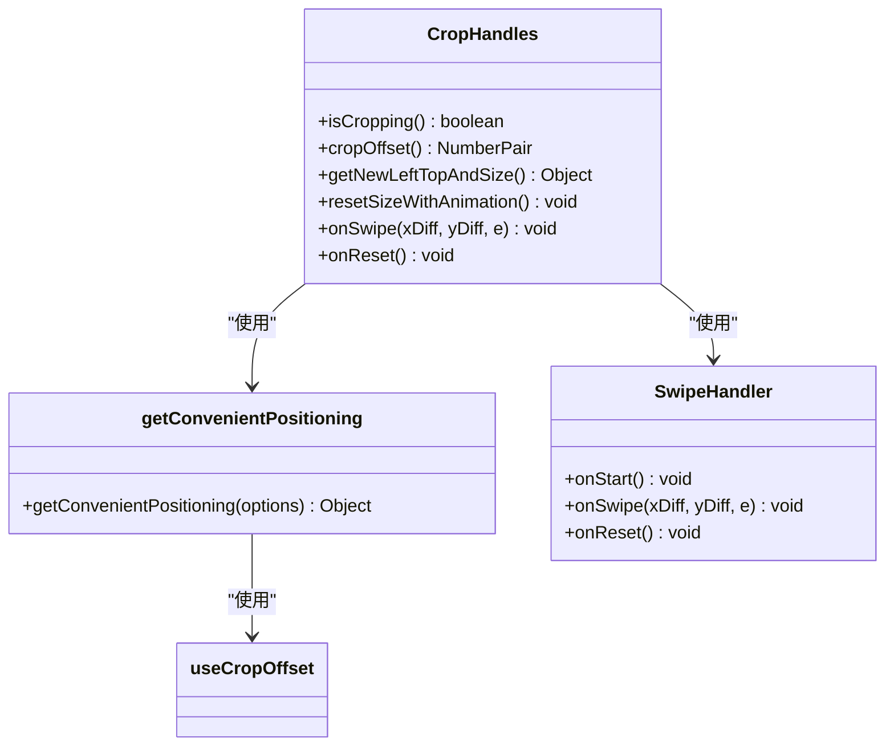
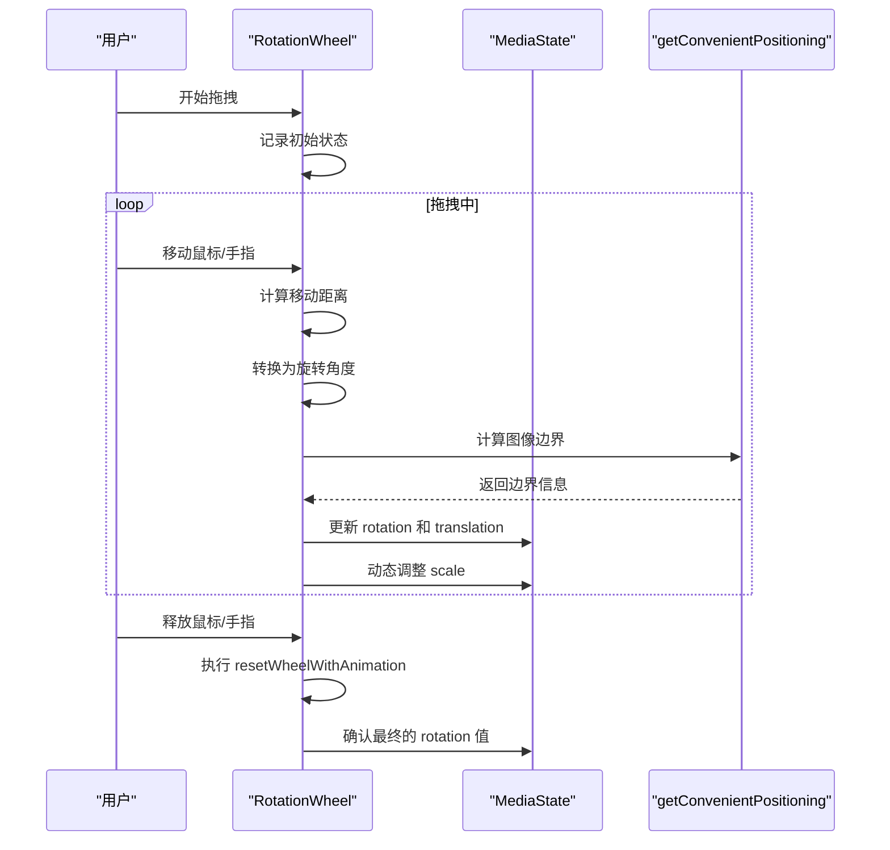
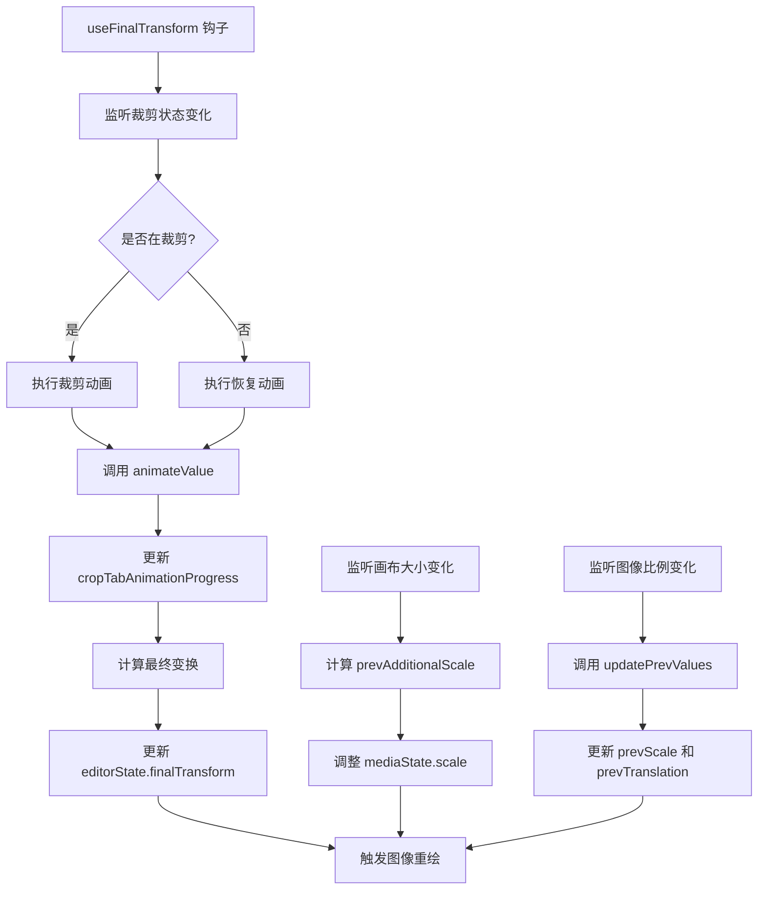
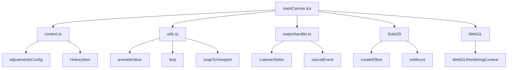

# 主画布实现

<cite>
**本文档引用的文件**
- [mainCanvas.tsx](file://src/components/mediaEditor/canvas/mainCanvas.tsx)
- [cropHandles.tsx](file://src/components/mediaEditor/canvas/cropHandles.tsx)
- [rotationWheel.tsx](file://src/components/mediaEditor/canvas/rotationWheel.tsx)
- [useFinalTransform.ts](file://src/components/mediaEditor/canvas/useFinalTransform.ts)
- [useCropOffset.ts](file://src/components/mediaEditor/canvas/useCropOffset.ts)
- [getConvenientPositioning.tsx](file://src/components/mediaEditor/canvas/getConvenientPositioning.tsx)
- [imageCanvas.tsx](file://src/components/mediaEditor/canvas/imageCanvas.tsx)
- [resizableLayers.tsx](file://src/components/mediaEditor/canvas/resizableLayers.tsx)
- [context.ts](file://src/components/mediaEditor/context.ts)
- [utils.ts](file://src/components/mediaEditor/utils.ts)
- [swipeHandler.ts](file://src/components/swipeHandler.ts)
- [mediaEditor.tsx](file://src/components/mediaEditor/mediaEditor.tsx)
</cite>

## 目录
1. [简介](#简介)
2. [项目结构](#项目结构)
3. [核心组件](#核心组件)
4. [架构概述](#架构概述)
5. [详细组件分析](#详细组件分析)
6. [依赖分析](#依赖分析)
7. [性能考虑](#性能考虑)
8. [故障排除指南](#故障排除指南)
9. [结论](#结论)

## 简介
本文档详细说明了媒体编辑器中主画布组件的实现机制。主画布是媒体编辑器的核心，负责处理图像和视频的渲染、用户交互（如拖拽、缩放、旋转）、裁剪和旋转功能的实现。文档将深入分析 `mainCanvas.tsx` 的实现，包括画布容器的创建、事件监听器的注册、用户交互处理的逻辑，以及与其他组件（如 `cropHandles` 和 `rotationWheel`）的协同工作方式。同时，文档还将探讨画布的响应式设计、性能优化策略以及与其他媒体编辑器组件的集成方式。

## 项目结构
主画布组件位于 `src/components/mediaEditor/canvas/` 目录下，是媒体编辑器功能的核心部分。该目录包含了实现画布功能所需的所有关键组件和工具函数。

**图源**
- [mainCanvas.tsx](file://src/components/mediaEditor/canvas/mainCanvas.tsx)
- [cropHandles.tsx](file://src/components/mediaEditor/canvas/cropHandles.tsx)
- [rotationWheel.tsx](file://src/components/mediaEditor/canvas/rotationWheel.tsx)
- [useFinalTransform.ts](file://src/components/mediaEditor/canvas/useFinalTransform.ts)
- [useCropOffset.ts](file://src/components/mediaEditor/canvas/useCropOffset.ts)
- [getConvenientPositioning.tsx](file://src/components/mediaEditor/canvas/getConvenientPositioning.tsx)
- [imageCanvas.tsx](file://src/components/mediaEditor/canvas/imageCanvas.tsx)
- [resizableLayers.tsx](file://src/components/mediaEditor/canvas/resizableLayers.tsx)
- [context.ts](file://src/components/mediaEditor/context.ts)
- [utils.ts](file://src/components/mediaEditor/utils.ts)
- [swipeHandler.ts](file://src/components/swipeHandler.ts)

**节源**
- [mainCanvas.tsx](file://src/components/mediaEditor/canvas/mainCanvas.tsx)
- [cropHandles.tsx](file://src/components/mediaEditor/canvas/cropHandles.tsx)
- [rotationWheel.tsx](file://src/components/mediaEditor/canvas/rotationWheel.tsx)
- [useFinalTransform.ts](file://src/components/mediaEditor/canvas/useFinalTransform.ts)
- [useCropOffset.ts](file://src/components/mediaEditor/canvas/useCropOffset.ts)
- [getConvenientPositioning.tsx](file://src/components/mediaEditor/canvas/getConvenientPositioning.tsx)
- [imageCanvas.tsx](file://src/components/mediaEditor/canvas/imageCanvas.tsx)
- [resizableLayers.tsx](file://src/components/mediaEditor/canvas/resizableLayers.tsx)
- [context.ts](file://src/components/mediaEditor/context.ts)
- [utils.ts](file://src/components/mediaEditor/utils.ts)
- [swipeHandler.ts](file://src/components/swipeHandler.ts)

## 核心组件
主画布组件由多个核心文件构成，每个文件负责特定的功能。`mainCanvas.tsx` 是主容器，负责协调所有子组件。`cropHandles.tsx` 和 `rotationWheel.tsx` 分别处理裁剪和旋转功能。`useFinalTransform.ts` 计算最终的变换矩阵，`useCropOffset.ts` 确定裁剪区域的偏移量。`imageCanvas.tsx` 负责使用 WebGL 渲染图像，`resizableLayers.tsx` 处理可调整大小的图层（如贴纸和文本）。这些组件通过 `context.ts` 中定义的上下文状态进行通信，确保数据的一致性和同步。

**节源**
- [mainCanvas.tsx](file://src/components/mediaEditor/canvas/mainCanvas.tsx)
- [cropHandles.tsx](file://src/components/mediaEditor/canvas/cropHandles.tsx)
- [rotationWheel.tsx](file://src/components/mediaEditor/canvas/rotationWheel.tsx)
- [useFinalTransform.ts](file://src/components/mediaEditor/canvas/useFinalTransform.ts)
- [useCropOffset.ts](file://src/components/mediaEditor/canvas/useCropOffset.ts)
- [getConvenientPositioning.tsx](file://src/components/mediaEditor/canvas/getConvenientPositioning.tsx)
- [imageCanvas.tsx](file://src/components/mediaEditor/canvas/imageCanvas.tsx)
- [resizableLayers.tsx](file://src/components/mediaEditor/canvas/resizableLayers.tsx)
- [context.ts](file://src/components/mediaEditor/context.ts)

## 架构概述
主画布的架构基于 SolidJS 框架，采用组件化和响应式编程模式。整个系统围绕 `MediaEditorContext` 构建，该上下文提供了共享的状态和动作。主画布通过 `useMediaEditorContext` 钩子访问这些状态和动作。用户交互通过 `SwipeHandler` 类处理，该类封装了鼠标和触摸事件的监听和处理逻辑。图像渲染使用 WebGL 技术，通过 `initWebGL` 函数初始化渲染环境，并使用 `draw` 函数进行绘制。变换计算（如缩放、旋转、平移）通过一系列工具函数（如 `lerp`, `snapToViewport`）实现，确保动画的平滑和精确。

**图源**
- [mainCanvas.tsx](file://src/components/mediaEditor/canvas/mainCanvas.tsx)
- [cropHandles.tsx](file://src/components/mediaEditor/canvas/cropHandles.tsx)
- [rotationWheel.tsx](file://src/components/mediaEditor/canvas/rotationWheel.tsx)
- [imageCanvas.tsx](file://src/components/mediaEditor/canvas/imageCanvas.tsx)
- [resizableLayers.tsx](file://src/components/mediaEditor/canvas/resizableLayers.tsx)
- [context.ts](file://src/components/mediaEditor/context.ts)
- [swipeHandler.ts](file://src/components/swipeHandler.ts)

## 详细组件分析

### 主画布实现分析
`mainCanvas.tsx` 文件是主画布的入口点，它创建了一个包含所有子组件的容器。该组件使用 `onMount` 钩子来监听窗口的 `resize` 事件，从而实现响应式设计。当窗口大小改变时，它会更新 `editorState.canvasSize`，触发重新渲染。主画布通过 `useFinalTransform` 钩子来应用最终的变换，确保图像在裁剪和旋转时正确显示。

**图源**
- [mainCanvas.tsx](file://src/components/mediaEditor/canvas/mainCanvas.tsx#L1-L54)

**节源**
- [mainCanvas.tsx](file://src/components/mediaEditor/canvas/mainCanvas.tsx#L1-L54)

### 裁剪功能分析
`cropHandles.tsx` 组件实现了图像的裁剪功能。它通过 `SwipeHandler` 监听八个方向的拖拽操作（四个角和四条边），并根据用户的拖拽距离动态调整裁剪框的大小和位置。组件使用 `getConvenientPositioning` 函数来计算图像和裁剪框的边界，确保图像在缩放和旋转后不会超出裁剪区域。当用户释放鼠标或手指时，组件会执行 `resetSizeWithAnimation` 函数，平滑地调整图像的缩放比例，使其完全适应新的裁剪框。

**图源**
- [cropHandles.tsx](file://src/components/mediaEditor/canvas/cropHandles.tsx#L1-L444)
- [getConvenientPositioning.tsx](file://src/components/mediaEditor/canvas/getConvenientPositioning.tsx#L1-L72)
- [swipeHandler.ts](file://src/components/swipeHandler.ts#L1-L503)

**节源**
- [cropHandles.tsx](file://src/components/mediaEditor/canvas/cropHandles.tsx#L1-L444)

### 旋转功能分析
`rotationWheel.tsx` 组件实现了图像的旋转功能。它提供了一个类似转盘的UI，用户可以通过水平拖拽来旋转图像。组件使用 `DEGREE_DIST_PX` 和 `DEGREE_STEP` 常量来定义旋转的灵敏度和步长。当用户拖拽时，组件会计算旋转角度的变化，并通过 `onSwipe` 函数更新 `mediaState.rotation`。为了防止图像在旋转后超出画布，组件会动态调整图像的缩放比例。此外，组件还提供了左旋90度和水平翻转的快捷按钮。

**图源**
- [rotationWheel.tsx](file://src/components/mediaEditor/canvas/rotationWheel.tsx#L1-L293)
- [getConvenientPositioning.tsx](file://src/components/mediaEditor/canvas/getConvenientPositioning.tsx#L1-L72)
- [context.ts](file://src/components/mediaEditor/context.ts#L1-L266)

**节源**
- [rotationWheel.tsx](file://src/components/mediaEditor/canvas/rotationWheel.tsx#L1-L293)

### 最终变换计算分析
`useFinalTransform.ts` 钩子负责计算应用于图像的最终变换矩阵。它结合了裁剪、缩放、旋转和平移等多种变换。该钩子使用 `additionalImageScales` 计算器来确定在不同状态下（裁剪前/后）的缩放比例。`cropTranslation` 计算器负责计算裁剪过程中的平移偏移。当用户切换到裁剪标签页时，钩子会通过 `animateValue` 函数执行一个平滑的动画，将图像从原始状态过渡到裁剪状态。

**图源**
- [useFinalTransform.ts](file://src/components/mediaEditor/canvas/useFinalTransform.ts#L1-L183)
- [utils.ts](file://src/components/mediaEditor/utils.ts#L1-L234)
- [context.ts](file://src/components/mediaEditor/context.ts#L1-L266)

**节源**
- [useFinalTransform.ts](file://src/components/mediaEditor/canvas/useFinalTransform.ts#L1-L183)

## 依赖分析
主画布组件依赖于多个内部和外部模块。内部依赖包括 `context.ts` 提供的共享状态、`utils.ts` 中的各种工具函数、`swipeHandler.ts` 提供的手势处理能力。外部依赖包括 SolidJS 框架的核心功能（如 `createEffect`, `onMount`）、WebGL API 用于高性能渲染，以及 `BezierEasing` 库用于实现平滑的动画效果。这些依赖关系确保了主画布功能的完整性和性能。

**图源**
- [mainCanvas.tsx](file://src/components/mediaEditor/canvas/mainCanvas.tsx#L1-L54)
- [context.ts](file://src/components/mediaEditor/context.ts#L1-L266)
- [utils.ts](file://src/components/mediaEditor/utils.ts#L1-L234)
- [swipeHandler.ts](file://src/components/swipeHandler.ts#L1-L503)

**节源**
- [mainCanvas.tsx](file://src/components/mediaEditor/canvas/mainCanvas.tsx#L1-L54)
- [context.ts](file://src/components/mediaEditor/context.ts#L1-L266)
- [utils.ts](file://src/components/mediaEditor/utils.ts#L1-L234)
- [swipeHandler.ts](file://src/components/swipeHandler.ts#L1-L503)

## 性能考虑
主画布组件在设计时充分考虑了性能优化。首先，使用 WebGL 进行图像渲染，利用 GPU 加速，确保在处理高分辨率媒体时的流畅性。其次，通过 `animateValue` 函数实现动画，该函数使用 `requestAnimationFrame` 来确保动画的平滑和高效。此外，组件使用了 SolidJS 的响应式系统，只有在相关状态改变时才会触发重新渲染，避免了不必要的计算。对于复杂的计算（如边界检测），组件通过 `createMemo` 创建记忆化计算，避免重复计算。最后，组件在卸载时会正确清理事件监听器和 WebGL 上下文，防止内存泄漏。

**节源**
- [imageCanvas.tsx](file://src/components/mediaEditor/canvas/imageCanvas.tsx#L1-L89)
- [utils.ts](file://src/components/mediaEditor/utils.ts#L1-L234)
- [swipeHandler.ts](file://src/components/swipeHandler.ts#L1-L503)

## 故障排除指南
如果主画布出现渲染问题，首先检查 `editorState.canvasSize` 是否正确设置。如果图像无法正确显示，确认 `renderingPayload` 是否已成功初始化。对于用户交互问题，检查 `SwipeHandler` 的事件监听器是否正确注册。如果动画不流畅，可能是 `animateValue` 的 `duration` 参数设置过短，或者设备性能不足。在调试时，可以利用 `context.ts` 中的 `log` 函数输出关键状态的变化。

**节源**
- [mainCanvas.tsx](file://src/components/mediaEditor/canvas/mainCanvas.tsx#L1-L54)
- [imageCanvas.tsx](file://src/components/mediaEditor/canvas/imageCanvas.tsx#L1-L89)
- [context.ts](file://src/components/mediaEditor/context.ts#L1-L266)

## 结论
主画布组件是一个复杂而高效的媒体编辑器核心。它通过精心设计的架构和组件化的方式，实现了丰富的图像和视频编辑功能。组件利用现代Web技术（如WebGL和响应式编程）提供了高性能的用户体验。通过 `context` 状态管理和 `SwipeHandler` 事件处理，组件实现了良好的模块化和可维护性。未来可以进一步优化的方向包括支持更多类型的媒体格式、增强动画效果和提高在低端设备上的性能表现。