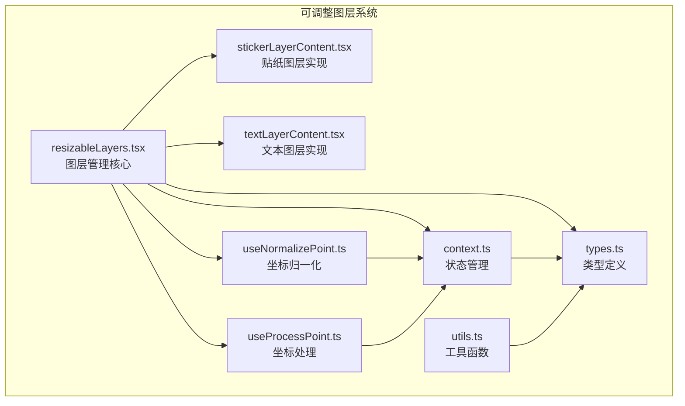
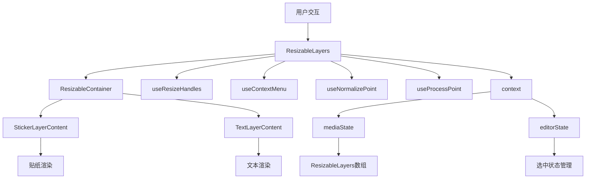
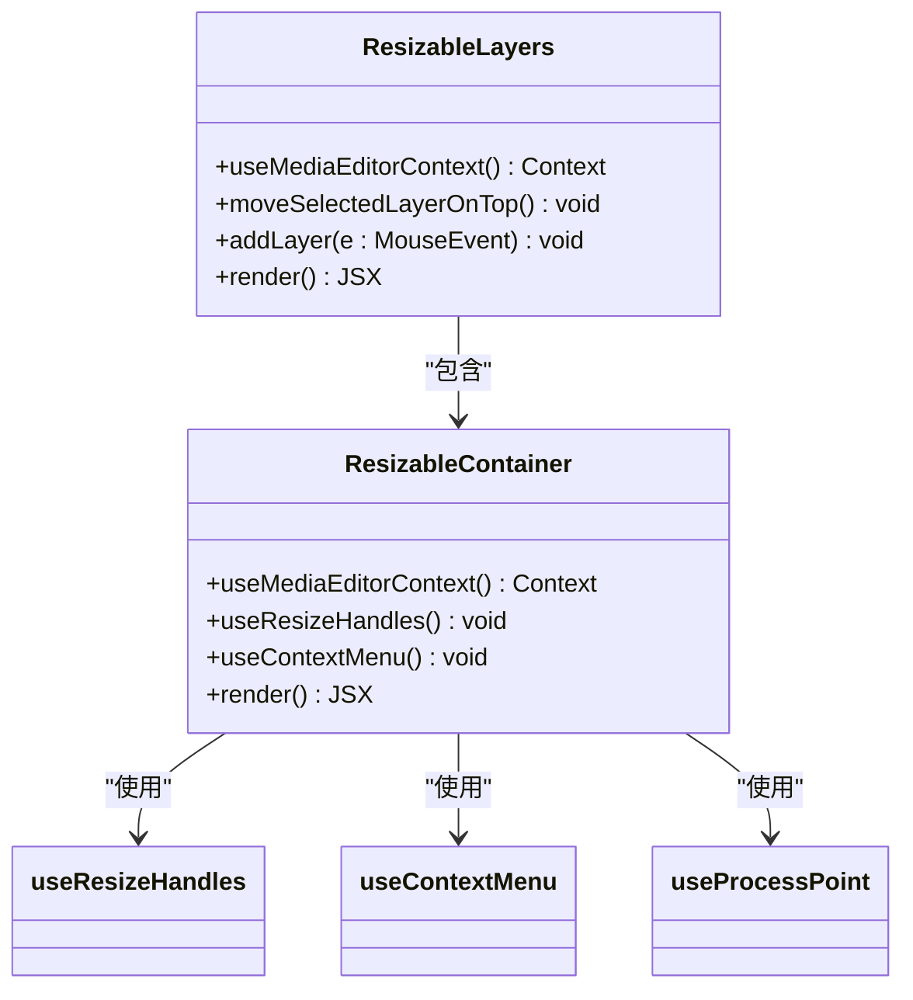
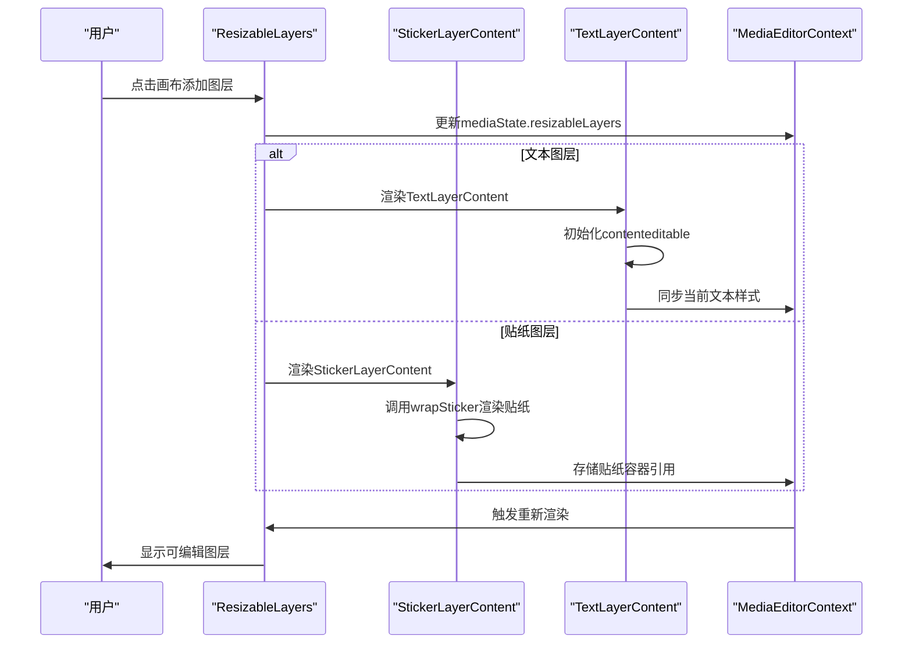
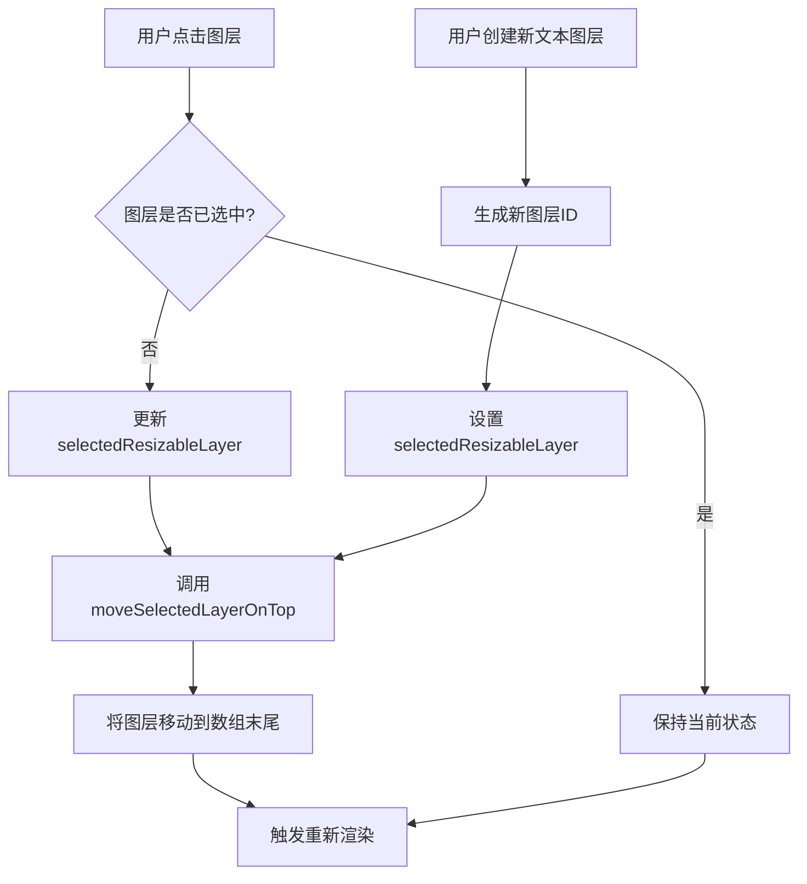
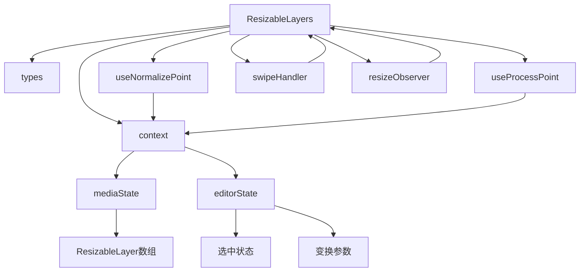

# 可调整图层管理

<cite>
**本文档引用的文件**
- [resizableLayers.tsx](file://src/components/mediaEditor/canvas/resizableLayers.tsx)
- [stickerLayerContent.tsx](file://src/components/mediaEditor/canvas/stickerLayerContent.tsx)
- [textLayerContent.tsx](file://src/components/mediaEditor/canvas/textLayerContent.tsx)
- [types.ts](file://src/components/mediaEditor/types.ts)
- [context.ts](file://src/components/mediaEditor/context.ts)
- [useNormalizePoint.ts](file://src/components/mediaEditor/canvas/useNormalizePoint.ts)
- [useProcessPoint.ts](file://src/components/mediaEditor/canvas/useProcessPoint.ts)
- [utils.ts](file://src/components/mediaEditor/utils.ts)
</cite>

## 目录
1. [项目结构](#项目结构)
2. [核心组件](#核心组件)
3. [架构概述](#架构概述)
4. [详细组件分析](#详细组件分析)
5. [依赖分析](#依赖分析)
6. [性能考虑](#性能考虑)
7. [故障排除指南](#故障排除指南)
8. [结论](#结论)

## 项目结构

可调整图层管理系统位于媒体编辑器组件的canvas子目录中，主要由resizableLayers.tsx作为核心管理组件，配合stickerLayerContent.tsx和textLayerContent.tsx实现具体的图层内容渲染。系统通过context.ts提供全局状态管理，并利用types.ts定义类型结构。



**Diagram sources**
- [resizableLayers.tsx](file://src/components/mediaEditor/canvas/resizableLayers.tsx)
- [stickerLayerContent.tsx](file://src/components/mediaEditor/canvas/stickerLayerContent.tsx)
- [textLayerContent.tsx](file://src/components/mediaEditor/canvas/textLayerContent.tsx)
- [context.ts](file://src/components/mediaEditor/context.ts)
- [types.ts](file://src/components/mediaEditor/types.ts)
- [useNormalizePoint.ts](file://src/components/mediaEditor/canvas/useNormalizePoint.ts)
- [useProcessPoint.ts](file://src/components/mediaEditor/canvas/useProcessPoint.ts)
- [utils.ts](file://src/components/mediaEditor/utils.ts)

**Section sources**
- [resizableLayers.tsx](file://src/components/mediaEditor/canvas/resizableLayers.tsx)
- [stickerLayerContent.tsx](file://src/components/mediaEditor/canvas/stickerLayerContent.tsx)
- [textLayerContent.tsx](file://src/components/mediaEditor/canvas/textLayerContent.tsx)
- [context.ts](file://src/components/mediaEditor/context.ts)
- [types.ts](file://src/components/mediaEditor/types.ts)

## 核心组件

可调整图层管理系统的核心是ResizableLayers组件，它负责管理所有可调整图层的创建、布局、变换和交互处理。系统通过ResizableLayer类型定义图层的基本属性，包括位置、旋转、缩放等变换参数，以及图层类型（贴纸或文本）的区分。

图层系统与画布坐标系统通过useNormalizePoint和useProcessPoint两个工具函数进行集成，前者将屏幕坐标转换为画布坐标，后者将画布坐标转换为屏幕坐标，确保图层在不同缩放和旋转状态下的正确显示。

**Section sources**
- [resizableLayers.tsx](file://src/components/mediaEditor/canvas/resizableLayers.tsx)
- [types.ts](file://src/components/mediaEditor/types.ts)
- [useNormalizePoint.ts](file://src/components/mediaEditor/canvas/useNormalizePoint.ts)
- [useProcessPoint.ts](file://src/components/mediaEditor/canvas/useProcessPoint.ts)

## 架构概述

可调整图层管理系统采用分层架构设计，上层为图层管理组件，中层为图层内容实现组件，底层为状态管理和工具函数。系统通过Solid.js的响应式编程模型实现高效的UI更新，利用createMemo和createEffect等函数确保性能优化。



**Diagram sources**
- [resizableLayers.tsx](file://src/components/mediaEditor/canvas/resizableLayers.tsx)
- [stickerLayerContent.tsx](file://src/components/mediaEditor/canvas/stickerLayerContent.tsx)
- [textLayerContent.tsx](file://src/components/mediaEditor/canvas/textLayerContent.tsx)
- [context.ts](file://src/components/mediaEditor/context.ts)

## 详细组件分析

### ResizableLayers组件分析

ResizableLayers组件作为可调整图层系统的入口，负责管理所有图层的生命周期和交互逻辑。组件通过createEffect监听选中图层的变化，自动将选中的图层移动到堆叠顺序的顶部，确保用户可以正确操作。



**Diagram sources**
- [resizableLayers.tsx](file://src/components/mediaEditor/canvas/resizableLayers.tsx)

**Section sources**
- [resizableLayers.tsx](file://src/components/mediaEditor/canvas/resizableLayers.tsx)

### 贴纸和文本图层实现

stickerLayerContent和textLayerContent组件作为可调整图层的具体实现，分别处理贴纸和文本的编辑操作。贴纸图层通过wrapSticker函数将贴纸文档包装为可渲染的DOM元素，而文本图层则通过contenteditable实现文本编辑功能。



**Diagram sources**
- [stickerLayerContent.tsx](file://src/components/mediaEditor/canvas/stickerLayerContent.tsx)
- [textLayerContent.tsx](file://src/components/mediaEditor/canvas/textLayerContent.tsx)
- [context.ts](file://src/components/mediaEditor/context.ts)

**Section sources**
- [stickerLayerContent.tsx](file://src/components/mediaEditor/canvas/stickerLayerContent.tsx)
- [textLayerContent.tsx](file://src/components/mediaEditor/canvas/textLayerContent.tsx)

### 图层堆叠顺序与选中状态管理

系统通过selectedResizableLayer状态变量管理图层的选中状态，当用户点击或创建新图层时，该变量会被更新为目标图层的ID。同时，系统通过moveSelectedLayerOnTop函数确保选中的图层始终位于堆叠顺序的顶部。



**Diagram sources**
- [resizableLayers.tsx](file://src/components/mediaEditor/canvas/resizableLayers.tsx)

**Section sources**
- [resizableLayers.tsx](file://src/components/mediaEditor/canvas/resizableLayers.tsx)

## 依赖分析

可调整图层系统依赖于多个核心模块，包括状态管理、坐标转换、交互处理等。系统通过Solid.js的context机制提供全局状态访问，确保各组件间的高效通信。



**Diagram sources**
- [resizableLayers.tsx](file://src/components/mediaEditor/canvas/resizableLayers.tsx)
- [context.ts](file://src/components/mediaEditor/context.ts)
- [types.ts](file://src/components/mediaEditor/types.ts)
- [useNormalizePoint.ts](file://src/components/mediaEditor/canvas/useNormalizePoint.ts)
- [useProcessPoint.ts](file://src/components/mediaEditor/canvas/useProcessPoint.ts)

**Section sources**
- [resizableLayers.tsx](file://src/components/mediaEditor/canvas/resizableLayers.tsx)
- [context.ts](file://src/components/mediaEditor/context.ts)

## 性能考虑

可调整图层系统在性能优化方面采取了多项策略，包括图层重绘优化、事件冒泡处理和内存管理。系统通过batch函数批量更新状态，减少不必要的重新渲染；通过onCleanup清理事件监听器和中间件，防止内存泄漏。

```mermaid
flowchart TD
A[性能优化策略] --> B[图层重绘优化]
A --> C[事件冒泡处理]
A --> D[内存管理]
B --> E[使用createMemo缓存计算结果]
B --> F[使用batch批量更新状态]
C --> G[使用stopPropagation阻止事件冒泡]
C --> H[使用capture阶段事件监听]
D --> I[使用onCleanup清理资源]
D --> J[使用middleware.destroy()释放内存]
D --> K[使用requestAnimationFrame优化动画]
```

**Diagram sources**
- [resizableLayers.tsx](file://src/components/mediaEditor/canvas/resizableLayers.tsx)
- [utils.ts](file://src/components/mediaEditor/utils.ts)

**Section sources**
- [resizableLayers.tsx](file://src/components/mediaEditor/canvas/resizableLayers.tsx)
- [utils.ts](file://src/components/mediaEditor/utils.ts)

## 故障排除指南

在使用可调整图层系统时，可能会遇到一些常见问题，如图层无法选中、坐标转换错误、内存泄漏等。以下是一些常见问题的解决方案：

**常见问题及解决方案**

| 问题现象 | 可能原因 | 解决方案 |
|---------|--------|--------|
| 图层无法选中 | 事件监听器未正确绑定 | 检查onClick事件绑定和stopPropagation调用 |
| 坐标转换错误 | 画布尺寸未正确获取 | 确保container.getBoundingClientRect()正确执行 |
| 内存泄漏 | 资源未正确清理 | 确保onCleanup中调用所有资源清理函数 |
| 图层重叠顺序错误 | 堆叠逻辑有误 | 检查moveSelectedLayerOnTop函数的实现 |
| 文本编辑异常 | contenteditable处理不当 | 检查Firefox浏览器的光标重置逻辑 |

**Section sources**
- [resizableLayers.tsx](file://src/components/mediaEditor/canvas/resizableLayers.tsx)
- [textLayerContent.tsx](file://src/components/mediaEditor/canvas/textLayerContent.tsx)
- [utils.ts](file://src/components/mediaEditor/utils.ts)

## 结论

可调整图层管理系统通过精心设计的架构和高效的实现，为媒体编辑器提供了强大的图层管理功能。系统不仅支持贴纸和文本的编辑操作，还通过完善的堆叠顺序管理、选中状态控制和性能优化策略，确保了良好的用户体验。

系统的核心优势在于其响应式架构和模块化设计，使得各组件职责清晰、耦合度低，便于维护和扩展。未来可以考虑增加更多图层类型的支持，如形状图层、滤镜图层等，进一步丰富编辑功能。