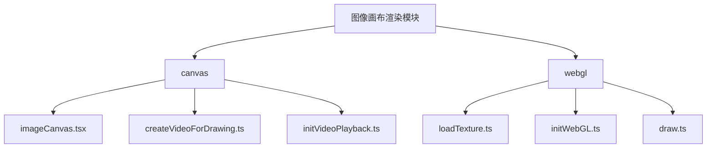
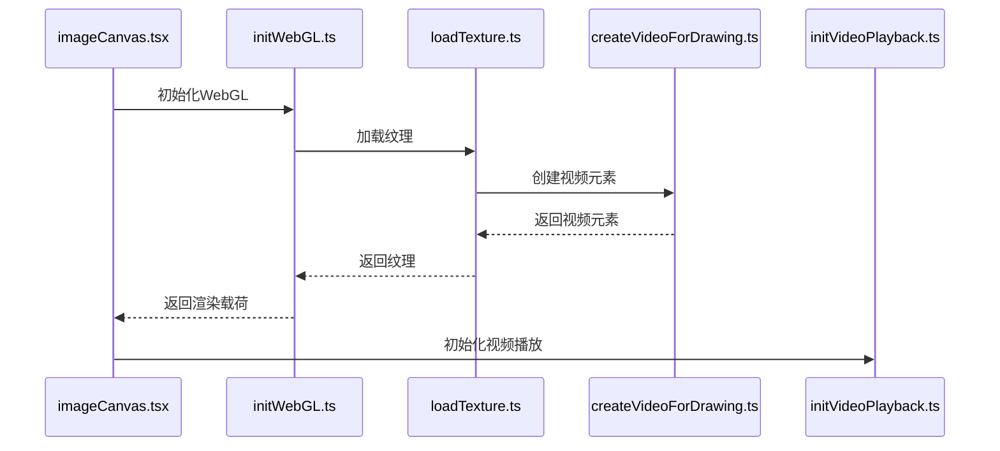
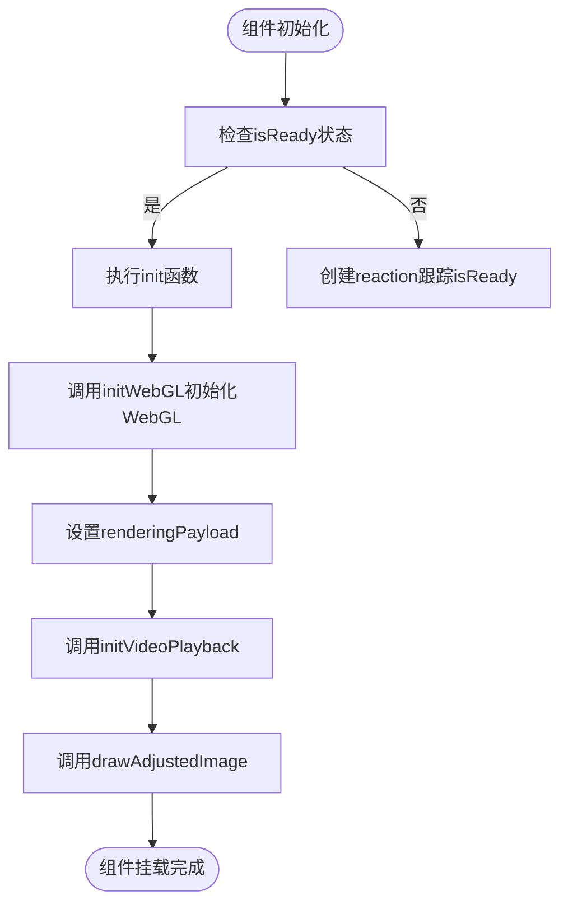
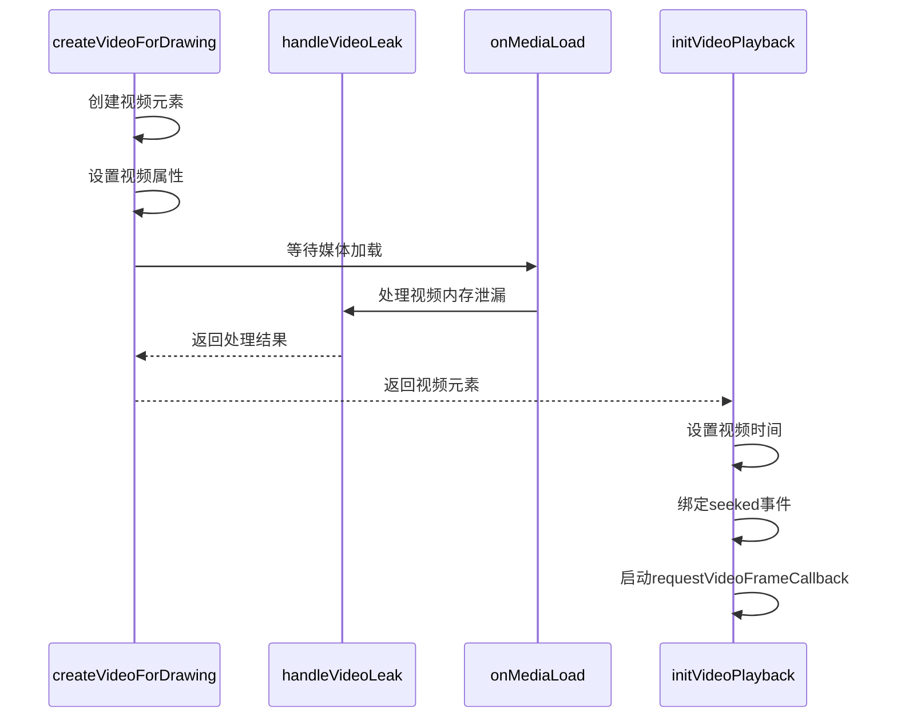
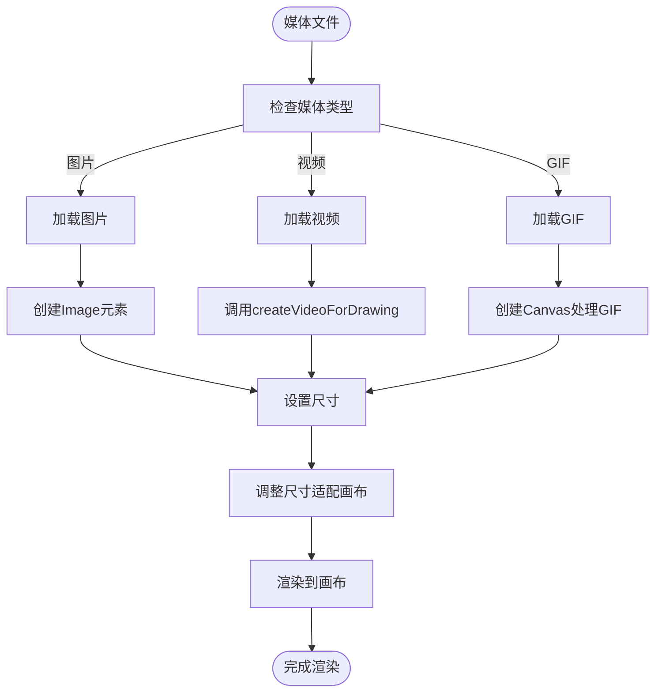
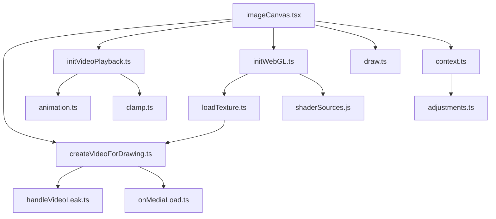
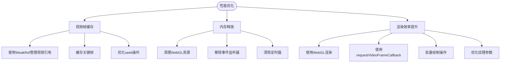
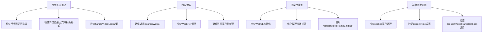

# 图像画布渲染

<cite>
**本文档引用的文件**
- [imageCanvas.tsx](file://src/components/mediaEditor/canvas/imageCanvas.tsx)
- [createVideoForDrawing.ts](file://src/components/mediaEditor/canvas/createVideoForDrawing.ts)
- [initVideoPlayback.ts](file://src/components/mediaEditor/canvas/initVideoPlayback.ts)
- [loadTexture.ts](file://src/components/mediaEditor/webgl/loadTexture.ts)
- [initWebGL.ts](file://src/components/mediaEditor/webgl/initWebGL.ts)
- [draw.ts](file://src/components/mediaEditor/webgl/draw.ts)
- [context.ts](file://src/components/mediaEditor/context.ts)
</cite>

## 目录
1. [项目结构](#项目结构)
2. [核心组件](#核心组件)
3. [架构概述](#架构概述)
4. [详细组件分析](#详细组件分析)
5. [依赖分析](#依赖分析)
6. [性能考虑](#性能考虑)
7. [故障排除指南](#故障排除指南)
8. [结论](#结论)

## 项目结构

图像画布渲染模块位于 `src/components/mediaEditor` 目录下，主要包含 canvas 和 webgl 两个子模块。该模块负责处理图像和视频在画布上的渲染、编辑和播放功能。

**图表来源**
- [imageCanvas.tsx](file://src/components/mediaEditor/canvas/imageCanvas.tsx)
- [createVideoForDrawing.ts](file://src/components/mediaEditor/canvas/createVideoForDrawing.ts)
- [initVideoPlayback.ts](file://src/components/mediaEditor/canvas/initVideoPlayback.ts)
- [loadTexture.ts](file://src/components/mediaEditor/webgl/loadTexture.ts)

**章节来源**
- [imageCanvas.tsx](file://src/components/mediaEditor/canvas/imageCanvas.tsx)
- [createVideoForDrawing.ts](file://src/components/mediaEditor/canvas/createVideoForDrawing.ts)

## 核心组件

图像画布渲染模块的核心组件包括 `imageCanvas.tsx`、`createVideoForDrawing.ts` 和 `initVideoPlayback.ts`。这些组件协同工作，实现了图像和视频在画布上的加载、解码和渲染。

**章节来源**
- [imageCanvas.tsx](file://src/components/mediaEditor/canvas/imageCanvas.tsx)
- [createVideoForDrawing.ts](file://src/components/mediaEditor/canvas/createVideoForDrawing.ts)
- [initVideoPlayback.ts](file://src/components/mediaEditor/canvas/initVideoPlayback.ts)

## 架构概述

图像画布渲染模块采用 WebGL 和 Canvas 2D 结合的方式实现高性能渲染。模块通过 `imageCanvas.tsx` 组件初始化 WebGL 上下文，并使用 `createVideoForDrawing` 函数创建用于绘制的视频元素。

**图表来源**
- [imageCanvas.tsx](file://src/components/mediaEditor/canvas/imageCanvas.tsx)
- [initWebGL.ts](file://src/components/mediaEditor/webgl/initWebGL.ts)
- [loadTexture.ts](file://src/components/mediaEditor/webgl/loadTexture.ts)
- [createVideoForDrawing.ts](file://src/components/mediaEditor/canvas/createVideoForDrawing.ts)
- [initVideoPlayback.ts](file://src/components/mediaEditor/canvas/initVideoPlayback.ts)

## 详细组件分析

### 图像画布组件分析

`imageCanvas.tsx` 是图像画布渲染模块的主组件，负责初始化画布、WebGL 上下文和视频播放。

#### 组件实现机制

**图表来源**
- [imageCanvas.tsx](file://src/components/mediaEditor/canvas/imageCanvas.tsx)

**章节来源**
- [imageCanvas.tsx](file://src/components/mediaEditor/canvas/imageCanvas.tsx)

### 视频绘制工具分析

`createVideoForDrawing.ts` 和 `initVideoPlayback.ts` 是两个关键的工具函数，它们协同工作以实现视频在画布上的流畅播放和编辑。

#### 视频创建与播放流程

**图表来源**
- [createVideoForDrawing.ts](file://src/components/mediaEditor/canvas/createVideoForDrawing.ts)
- [initVideoPlayback.ts](file://src/components/mediaEditor/canvas/initVideoPlayback.ts)

**章节来源**
- [createVideoForDrawing.ts](file://src/components/mediaEditor/canvas/createVideoForDrawing.ts)
- [initVideoPlayback.ts](file://src/components/mediaEditor/canvas/initVideoPlayback.ts)

### 媒体格式适配分析

图像画布渲染模块能够处理不同格式的媒体文件（图片、视频、GIF）在画布上的渲染适配。

#### 媒体格式处理流程

**图表来源**
- [loadTexture.ts](file://src/components/mediaEditor/webgl/loadTexture.ts)
- [createVideoForDrawing.ts](file://src/components/mediaEditor/canvas/createVideoForDrawing.ts)

**章节来源**
- [loadTexture.ts](file://src/components/mediaEditor/webgl/loadTexture.ts)
- [createVideoForDrawing.ts](file://src/components/mediaEditor/canvas/createVideoForDrawing.ts)

## 依赖分析

图像画布渲染模块依赖于多个辅助模块和工具函数，这些依赖关系确保了模块的稳定性和性能。

**图表来源**
- [imageCanvas.tsx](file://src/components/mediaEditor/canvas/imageCanvas.tsx)
- [createVideoForDrawing.ts](file://src/components/mediaEditor/canvas/createVideoForDrawing.ts)
- [initVideoPlayback.ts](file://src/components/mediaEditor/canvas/initVideoPlayback.ts)
- [initWebGL.ts](file://src/components/mediaEditor/webgl/initWebGL.ts)
- [loadTexture.ts](file://src/components/mediaEditor/webgl/loadTexture.ts)
- [context.ts](file://src/components/mediaEditor/context.ts)

**章节来源**
- [imageCanvas.tsx](file://src/components/mediaEditor/canvas/imageCanvas.tsx)
- [createVideoForDrawing.ts](file://src/components/mediaEditor/canvas/createVideoForDrawing.ts)
- [initVideoPlayback.ts](file://src/components/mediaEditor/canvas/initVideoPlayback.ts)
- [initWebGL.ts](file://src/components/mediaEditor/webgl/initWebGL.ts)
- [loadTexture.ts](file://src/components/mediaEditor/webgl/loadTexture.ts)
- [context.ts](file://src/components/mediaEditor/context.ts)

## 性能考虑

图像画布渲染模块采用了多种性能优化策略，包括视频帧缓存、内存释放和渲染效率提升。

### 性能优化策略

**图表来源**
- [imageCanvas.tsx](file://src/components/mediaEditor/canvas/imageCanvas.tsx)
- [createVideoForDrawing.ts](file://src/components/mediaEditor/canvas/createVideoForDrawing.ts)
- [initVideoPlayback.ts](file://src/components/mediaEditor/canvas/initVideoPlayback.ts)
- [loadTexture.ts](file://src/components/mediaEditor/webgl/loadTexture.ts)

**章节来源**
- [imageCanvas.tsx](file://src/components/mediaEditor/canvas/imageCanvas.tsx)
- [createVideoForDrawing.ts](file://src/components/mediaEditor/canvas/createVideoForDrawing.ts)
- [initVideoPlayback.ts](file://src/components/mediaEditor/canvas/initVideoPlayback.ts)
- [loadTexture.ts](file://src/components/mediaEditor/webgl/loadTexture.ts)

## 故障排除指南

图像画布渲染模块在处理媒体文件时可能会遇到各种问题，以下是一些常见问题的解决方案。

### 常见问题及解决方案

**图表来源**
- [imageCanvas.tsx](file://src/components/mediaEditor/canvas/imageCanvas.tsx)
- [createVideoForDrawing.ts](file://src/components/mediaEditor/canvas/createVideoForDrawing.ts)
- [initVideoPlayback.ts](file://src/components/mediaEditor/canvas/initVideoPlayback.ts)
- [loadTexture.ts](file://src/components/mediaEditor/webgl/loadTexture.ts)

**章节来源**
- [imageCanvas.tsx](file://src/components/mediaEditor/canvas/imageCanvas.tsx)
- [createVideoForDrawing.ts](file://src/components/mediaEditor/canvas/createVideoForDrawing.ts)
- [initVideoPlayback.ts](file://src/components/mediaEditor/canvas/initVideoPlayback.ts)
- [loadTexture.ts](file://src/components/mediaEditor/webgl/loadTexture.ts)

## 结论

图像画布渲染模块通过 `imageCanvas.tsx` 组件实现了图像和视频在画布上的高效渲染。模块采用 WebGL 和 Canvas 2D 结合的方式，通过 `createVideoForDrawing` 和 `initVideoPlayback` 工具函数协同工作，实现了视频在画布上的流畅播放和编辑。

模块能够处理不同格式的媒体文件（图片、视频、GIF）在画布上的渲染适配，并采用了多种性能优化策略，包括视频帧缓存、内存释放和渲染效率提升。通过与 WebGL 渲染的集成，模块实现了高效的数据传递和渲染。

该模块的设计充分考虑了性能和稳定性，通过 WeakRef 管理视频引用、及时清理 WebGL 资源和移除事件监听器等方式，有效避免了内存泄漏问题。同时，使用 requestVideoFrameCallback API 确保了视频播放的流畅性和同步性。