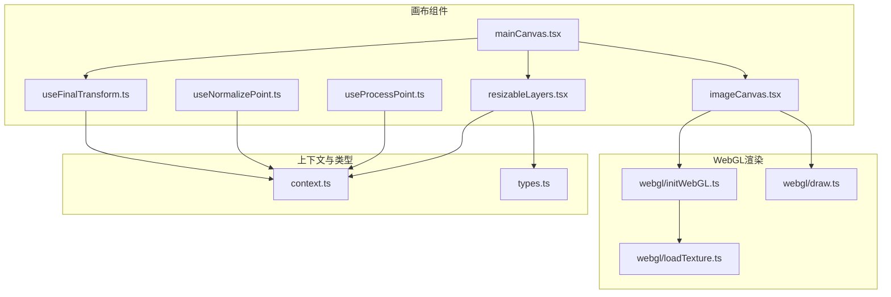
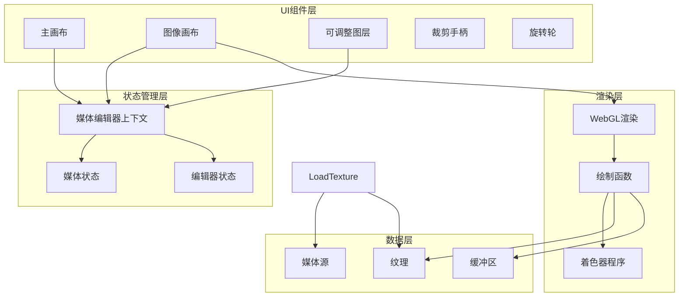
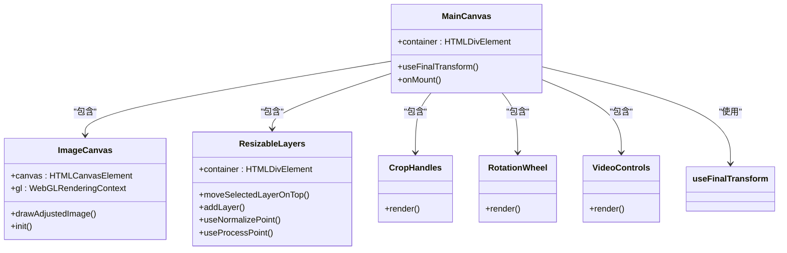
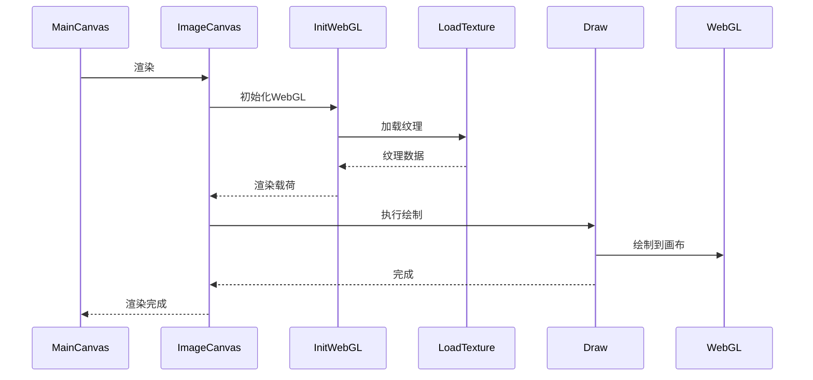
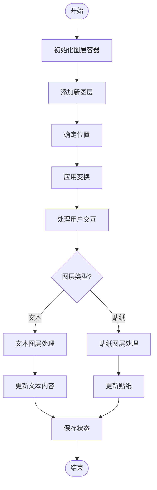
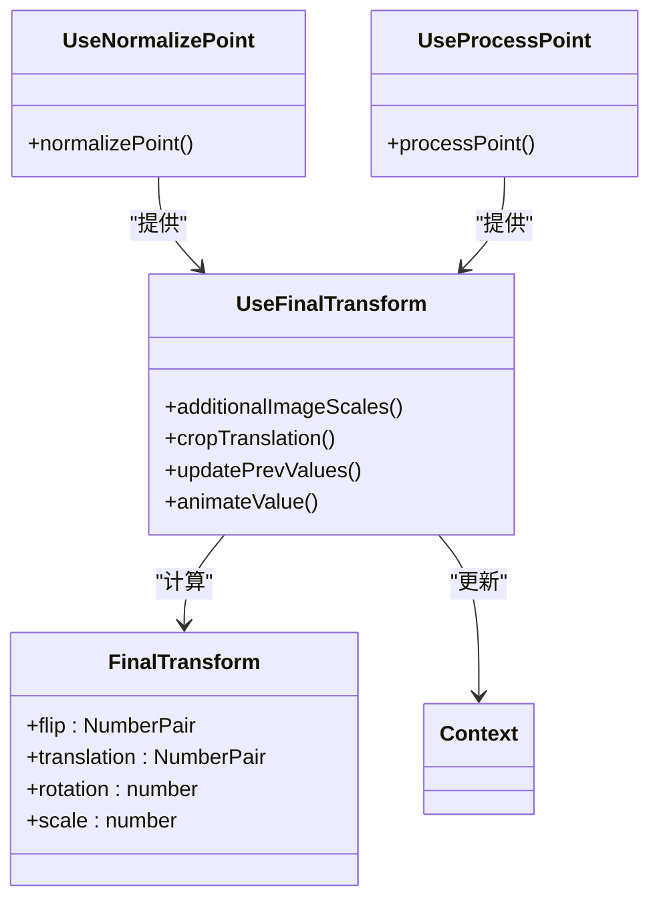
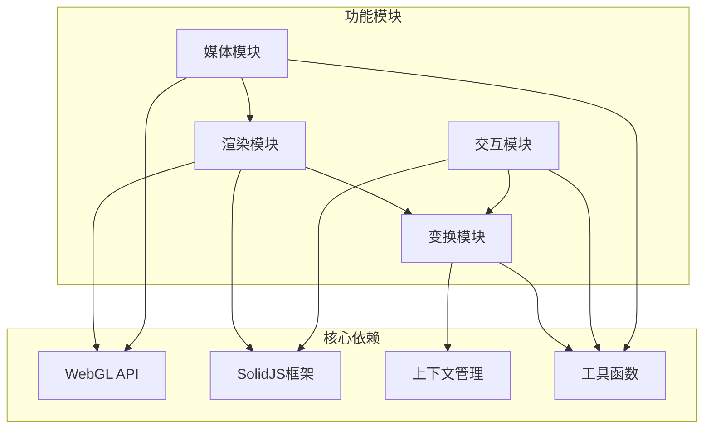

# 画布渲染

<cite>
**本文档中引用的文件**  
- [mainCanvas.tsx](file://src/components/mediaEditor/canvas/mainCanvas.tsx)
- [imageCanvas.tsx](file://src/components/mediaEditor/canvas/imageCanvas.tsx)
- [resizableLayers.tsx](file://src/components/mediaEditor/canvas/resizableLayers.tsx)
- [useFinalTransform.ts](file://src/components/mediaEditor/canvas/useFinalTransform.ts)
- [useNormalizePoint.ts](file://src/components/mediaEditor/canvas/useNormalizePoint.ts)
- [useProcessPoint.ts](file://src/components/mediaEditor/canvas/useProcessPoint.ts)
- [mediaEditor.tsx](file://src/components/mediaEditor/mediaEditor.tsx)
- [context.ts](file://src/components/mediaEditor/context.ts)
- [types.ts](file://src/components/mediaEditor/types.ts)
- [draw.ts](file://src/components/mediaEditor/webgl/draw.ts)
- [initWebGL.ts](file://src/components/mediaEditor/webgl/initWebGL.ts)
- [loadTexture.ts](file://src/components/mediaEditor/webgl/loadTexture.ts)
- [textLayerContent.tsx](file://src/components/mediaEditor/canvas/textLayerContent.tsx)
- [stickerLayerContent.tsx](file://src/components/mediaEditor/canvas/stickerLayerContent.tsx)
</cite>

## 目录
1. [简介](#简介)
2. [项目结构](#项目结构)
3. [核心组件](#核心组件)
4. [架构概述](#架构概述)
5. [详细组件分析](#详细组件分析)
6. [依赖分析](#依赖分析)
7. [性能考虑](#性能考虑)
8. [故障排除指南](#故障排除指南)
9. [结论](#结论)

## 简介
本文档详细说明了媒体编辑器画布渲染系统的实现机制。重点介绍主画布的实现，包括图像画布的渲染流程、可调整图层的管理、元素定位算法和最终变换计算。文档还解释了如何处理媒体元素在画布上的缩放、旋转和定位，以及如何实现用户友好的操作体验。

**Section sources**
- [mediaEditor.tsx](file://src/components/mediaEditor/mediaEditor.tsx#L1-L149)

## 项目结构
媒体编辑器的画布渲染系统位于 `src/components/mediaEditor/canvas` 目录下，该目录包含实现画布功能的核心组件。系统采用模块化设计，将不同的功能分离到独立的文件中，便于维护和扩展。

**Diagram sources**
- [mainCanvas.tsx](file://src/components/mediaEditor/canvas/mainCanvas.tsx#L1-L54)
- [imageCanvas.tsx](file://src/components/mediaEditor/canvas/imageCanvas.tsx#L1-L89)
- [resizableLayers.tsx](file://src/components/mediaEditor/canvas/resizableLayers.tsx#L1-L412)
- [useFinalTransform.ts](file://src/components/mediaEditor/canvas/useFinalTransform.ts#L1-L183)
- [initWebGL.ts](file://src/components/mediaEditor/webgl/initWebGL.ts#L1-L57)
- [draw.ts](file://src/components/mediaEditor/webgl/draw.ts#L1-L56)
- [loadTexture.ts](file://src/components/mediaEditor/webgl/loadTexture.ts#L1-L68)
- [context.ts](file://src/components/mediaEditor/context.ts#L1-L266)
- [types.ts](file://src/components/mediaEditor/types.ts#L1-L65)

**Section sources**
- [mainCanvas.tsx](file://src/components/mediaEditor/canvas/mainCanvas.tsx#L1-L54)
- [imageCanvas.tsx](file://src/components/mediaEditor/canvas/imageCanvas.tsx#L1-L89)
- [resizableLayers.tsx](file://src/components/mediaEditor/canvas/resizableLayers.tsx#L1-L412)

## 核心组件
画布渲染系统的核心组件包括主画布、图像画布、可调整图层和变换计算。这些组件协同工作，提供完整的媒体编辑功能。

**Section sources**
- [mainCanvas.tsx](file://src/components/mediaEditor/canvas/mainCanvas.tsx#L1-L54)
- [imageCanvas.tsx](file://src/components/mediaEditor/canvas/imageCanvas.tsx#L1-L89)
- [resizableLayers.tsx](file://src/components/mediaEditor/canvas/resizableLayers.tsx#L1-L412)
- [useFinalTransform.ts](file://src/components/mediaEditor/canvas/useFinalTransform.ts#L1-L183)

## 架构概述
画布渲染系统采用分层架构，从上到下分为UI组件层、状态管理层、渲染层和数据层。这种架构设计使得系统具有良好的可维护性和可扩展性。

**Diagram sources**
- [mainCanvas.tsx](file://src/components/mediaEditor/canvas/mainCanvas.tsx#L1-L54)
- [imageCanvas.tsx](file://src/components/mediaEditor/canvas/imageCanvas.tsx#L1-L89)
- [context.ts](file://src/components/mediaEditor/context.ts#L1-L266)
- [draw.ts](file://src/components/mediaEditor/webgl/draw.ts#L1-L56)
- [initWebGL.ts](file://src/components/mediaEditor/webgl/initWebGL.ts#L1-L57)

## 详细组件分析

### 主画布分析
主画布组件是整个媒体编辑器的核心容器，负责协调各个子组件的工作。它通过SolidJS的上下文机制共享状态，并管理画布的生命周期。

**Diagram sources**
- [mainCanvas.tsx](file://src/components/mediaEditor/canvas/mainCanvas.tsx#L1-L54)
- [imageCanvas.tsx](file://src/components/mediaEditor/canvas/imageCanvas.tsx#L1-L89)
- [resizableLayers.tsx](file://src/components/mediaEditor/canvas/resizableLayers.tsx#L1-L412)

**Section sources**
- [mainCanvas.tsx](file://src/components/mediaEditor/canvas/mainCanvas.tsx#L1-L54)

### 图像画布分析
图像画布组件负责使用WebGL渲染媒体内容。它初始化WebGL上下文，加载纹理，并执行绘制操作。组件还处理视频播放的特殊需求。

**Diagram sources**
- [imageCanvas.tsx](file://src/components/mediaEditor/canvas/imageCanvas.tsx#L1-L89)
- [initWebGL.ts](file://src/components/mediaEditor/webgl/initWebGL.ts#L1-L57)
- [loadTexture.ts](file://src/components/mediaEditor/webgl/loadTexture.ts#L1-L68)
- [draw.ts](file://src/components/mediaEditor/webgl/draw.ts#L1-L56)

**Section sources**
- [imageCanvas.tsx](file://src/components/mediaEditor/canvas/imageCanvas.tsx#L1-L89)

### 可调整图层分析
可调整图层组件管理文本和贴纸等可编辑元素。它提供缩放、旋转和移动功能，并处理用户交互。

**Diagram sources**
- [resizableLayers.tsx](file://src/components/mediaEditor/canvas/resizableLayers.tsx#L1-L412)
- [textLayerContent.tsx](file://src/components/mediaEditor/canvas/textLayerContent.tsx#L1-L318)
- [stickerLayerContent.tsx](file://src/components/mediaEditor/canvas/stickerLayerContent.tsx#L1-L48)

**Section sources**
- [resizableLayers.tsx](file://src/components/mediaEditor/canvas/resizableLayers.tsx#L1-L412)

### 变换计算分析
变换计算组件负责处理画布的最终变换，包括缩放、旋转、平移和翻转。它还处理裁剪和视口适配。

**Diagram sources**
- [useFinalTransform.ts](file://src/components/mediaEditor/canvas/useFinalTransform.ts#L1-L183)
- [useNormalizePoint.ts](file://src/components/mediaEditor/canvas/useNormalizePoint.ts#L1-L27)
- [useProcessPoint.ts](file://src/components/mediaEditor/canvas/useProcessPoint.ts#L1-L24)
- [context.ts](file://src/components/mediaEditor/context.ts#L1-L266)

**Section sources**
- [useFinalTransform.ts](file://src/components/mediaEditor/canvas/useFinalTransform.ts#L1-L183)

## 依赖分析
画布渲染系统依赖于多个核心模块，包括WebGL渲染、状态管理、用户交互处理和媒体处理。这些依赖关系确保了系统的完整功能。

**Diagram sources**
- [context.ts](file://src/components/mediaEditor/context.ts#L1-L266)
- [utils.ts](file://src/components/mediaEditor/utils.ts#L1-L234)
- [draw.ts](file://src/components/mediaEditor/webgl/draw.ts#L1-L56)
- [initWebGL.ts](file://src/components/mediaEditor/webgl/initWebGL.ts#L1-L57)

**Section sources**
- [context.ts](file://src/components/mediaEditor/context.ts#L1-L266)
- [utils.ts](file://src/components/mediaEditor/utils.ts#L1-L234)

## 性能考虑
画布渲染系统在性能方面进行了多项优化，包括使用WebGL进行硬件加速渲染、合理的状态更新策略和内存管理。

- **WebGL渲染**: 使用WebGL进行硬件加速，提高渲染性能
- **状态更新**: 使用SolidJS的响应式系统，只在必要时更新UI
- **内存管理**: 及时清理WebGL上下文，避免内存泄漏
- **动画优化**: 使用requestAnimationFrame进行平滑动画
- **纹理管理**: 合理管理纹理资源，避免重复加载

**Section sources**
- [imageCanvas.tsx](file://src/components/mediaEditor/canvas/imageCanvas.tsx#L1-L89)
- [draw.ts](file://src/components/mediaEditor/webgl/draw.ts#L1-L56)
- [utils.ts](file://src/components/mediaEditor/utils.ts#L1-L234)

## 故障排除指南
在使用画布渲染系统时可能遇到一些常见问题，以下是一些故障排除建议：

- **画布不显示**: 检查WebGL支持，确保浏览器支持WebGL
- **性能问题**: 检查是否有过多的重绘，优化状态更新
- **交互问题**: 检查事件处理，确保正确的事件绑定
- **内存泄漏**: 确保在组件销毁时清理WebGL上下文
- **兼容性问题**: 测试不同浏览器的兼容性，特别是移动端

**Section sources**
- [imageCanvas.tsx](file://src/components/mediaEditor/canvas/imageCanvas.tsx#L1-L89)
- [resizableLayers.tsx](file://src/components/mediaEditor/canvas/resizableLayers.tsx#L1-L412)
- [utils.ts](file://src/components/mediaEditor/utils.ts#L1-L234)

## 结论
媒体编辑器画布渲染系统是一个功能完整、性能优良的解决方案。通过合理的架构设计和优化策略，系统能够提供流畅的用户体验。未来可以进一步优化WebGL着色器，增加更多编辑功能，并改进移动端的交互体验。