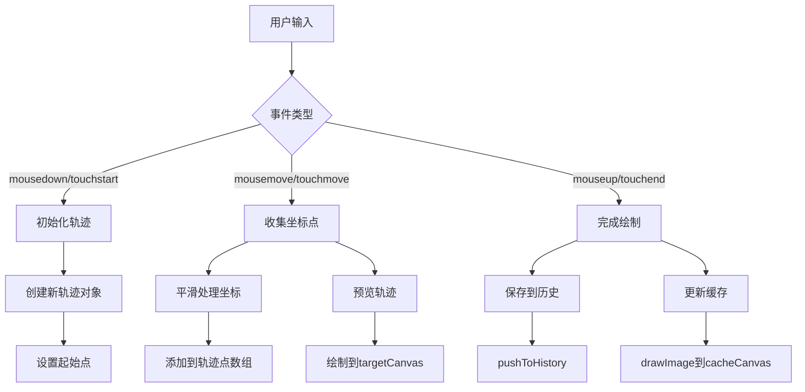
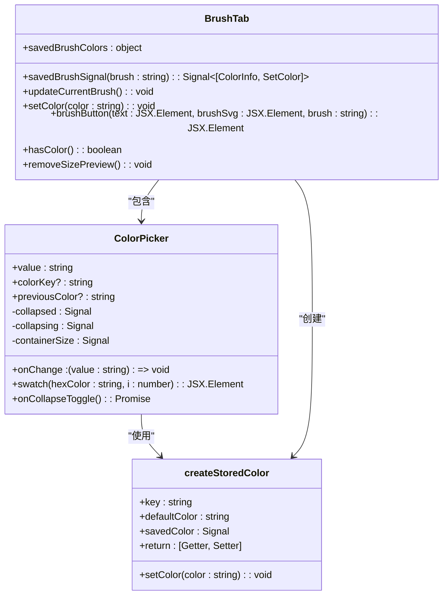
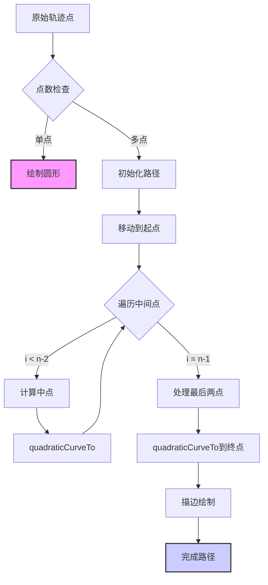

# 画笔选项卡

<cite>
**本文档中引用的文件**  
- [brushTab.tsx](file://src/components/mediaEditor/tabs/brushTab.tsx)
- [brushesSvg.tsx](file://src/components/mediaEditor/brushesSvg.tsx)
- [colorPicker.tsx](file://src/components/mediaEditor/colorPicker.tsx)
- [context.ts](file://src/components/mediaEditor/context.ts)
- [brushCanvas.tsx](file://src/components/mediaEditor/canvas/brushCanvas.tsx)
- [brushPainter.ts](file://src/components/mediaEditor/canvas/brushPainter.ts)
- [createStoredColor.ts](file://src/components/mediaEditor/createStoredColor.ts)
- [rangeInput.tsx](file://src/components/mediaEditor/rangeInput.tsx)
- [useNormalizePoint.ts](file://src/components/mediaEditor/canvas/useNormalizePoint.ts)
- [useProcessPoint.ts](file://src/components/mediaEditor/canvas/useProcessPoint.ts)
</cite>

## 目录
1. [简介](#简介)
2. [画笔功能实现机制](#画笔功能实现机制)
3. [画布交互逻辑](#画布交互逻辑)
4. [画笔颜色选择器与样式UI](#画笔颜色选择器与样式ui)
5. [上下文状态管理](#上下文状态管理)
6. [画笔平滑算法与性能优化](#画笔平滑算法与性能优化)
7. [绘制路径记录与回放](#绘制路径记录与回放)
8. [结论](#结论)

## 简介

画笔选项卡是媒体编辑器中的核心功能模块，提供多种绘图工具供用户在图像或视频帧上进行标注和创作。该模块实现了完整的绘图工具链，包括笔刷选择、颜色选取、画笔大小调整等功能。系统采用基于Canvas的双缓冲绘制架构，结合WebGL进行图像处理，确保绘制操作的流畅性和实时性。画笔功能支持多种笔刷样式，包括普通笔、箭头笔、记号笔、霓虹笔、模糊笔和橡皮擦，并通过上下文管理器统一管理绘图状态。

**Section sources**
- [brushTab.tsx](file://src/components/mediaEditor/tabs/brushTab.tsx)
- [mediaEditor.tsx](file://src/components/mediaEditor/mediaEditor.tsx)

## 画笔功能实现机制

画笔功能的实现基于分层架构设计，包含UI组件、状态管理、绘制引擎三个主要层次。UI组件负责用户交互，状态管理维护绘图上下文，绘制引擎执行实际的图形绘制操作。系统通过`BrushPainter`类封装了所有画笔绘制逻辑，该类提供了`previewLine`、`drawLine`、`saveLastLine`等核心方法，实现了画笔轨迹的预览、绘制和持久化。

画笔类型通过SVG图形表示，每种笔刷都有对应的SVG定义，如`PenBrush`、`ArrowBrush`、`MarkerBrush`等。这些SVG组件不仅用于UI显示，还通过CSS变量`currentColor`继承当前选择的颜色，实现了颜色与图形的动态绑定。画笔大小调整通过`RangeInput`组件实现，范围从2到32像素，调整时会实时更新预览大小。

**Section sources**
- [brushesSvg.tsx](file://src/components/mediaEditor/brushesSvg.tsx)
- [brushPainter.ts](file://src/components/mediaEditor/canvas/brushPainter.ts)
- [rangeInput.tsx](file://src/components/mediaEditor/rangeInput.tsx)

## 画布交互逻辑

画布交互逻辑通过`BrushCanvas`组件实现，该组件监听鼠标和触摸事件，将用户输入转换为画笔轨迹。系统使用`SwipeHandler`类处理滑动手势，通过`mousedown`、`touchstart`、`mouseup`、`touchend`等事件监听用户的绘制动作。当用户开始绘制时，系统记录起始位置并初始化轨迹点数组；在滑动过程中，持续收集坐标点并进行平滑处理；绘制结束时，将完整轨迹保存到历史记录中。

画布采用双缓冲技术，使用`targetCanvas`进行实时预览，`cacheCanvas`存储已完成的绘制内容。这种设计避免了重复绘制历史轨迹，提高了性能。对于图像编辑，系统还维护了一个高分辨率的`fullBrushesCanvas`，用于生成最终输出质量的绘制结果。



**Diagram sources**
- [brushCanvas.tsx](file://src/components/mediaEditor/canvas/brushCanvas.tsx)
- [useNormalizePoint.ts](file://src/components/mediaEditor/canvas/useNormalizePoint.ts)
- [useProcessPoint.ts](file://src/components/mediaEditor/canvas/useProcessPoint.ts)

## 画笔颜色选择器与样式UI

画笔颜色选择器由`ColorPicker`组件实现，提供两种颜色选择模式：色板选择和自定义选择。色板包含8种预设颜色，用户可快速选择常用颜色；自定义模式提供完整的颜色选择器，支持HEX和RGB格式输入。颜色选择器采用响应式设计，可根据容器大小自动调整布局。

画笔样式UI通过`LargeButton`组件实现，每个画笔类型对应一个可点击的按钮。按钮包含SVG图形和文字标签，选中状态通过CSS类`media-editor__brush-button--active`标识。系统使用`createStoredColor`函数管理每种画笔的最近使用颜色，这些颜色存储在`localStorage`中，实现跨会话的颜色记忆功能。



**Diagram sources**
- [colorPicker.tsx](file://src/components/mediaEditor/colorPicker.tsx)
- [brushTab.tsx](file://src/components/mediaEditor/tabs/brushTab.tsx)
- [createStoredColor.ts](file://src/components/mediaEditor/createStoredColor.ts)

## 上下文状态管理

上下文状态管理通过`MediaEditorContext`实现，采用SolidJS的`createContext`和`createMutable`构建响应式状态系统。绘图状态分为`mediaState`和`editorState`两个部分：`mediaState`存储与媒体内容相关的状态，如缩放、旋转、调整参数和绘制轨迹；`editorState`存储编辑器界面状态，如当前选项卡、画笔设置和UI状态。

系统使用`HistoryItem`接口记录状态变更，支持撤销和重做功能。每次画笔操作都会生成一个历史记录项，包含路径、新值和旧值。状态变更通过`pushToHistory`方法提交，系统自动管理历史堆栈。画笔状态存储在`currentBrush`对象中，包含颜色、大小和笔刷类型三个属性，这些属性的变更会触发UI更新。

```mermaid
classDiagram
class MediaEditorContext {
+managers : AppManagers
+mediaSrc : string
+mediaType : MediaType
+mediaBlob : Blob
+mediaSize : NumberPair
+mediaState : Store<EditingMediaState>
+editorState : Store<MediaEditorState>
+actions : EditorOverridableGlobalActions
+hasModifications : Accessor<boolean>
+imageRatio : number
+resizableLayersSeed : number
}
class EditingMediaState {
+scale : number
+rotation : number
+translation : NumberPair
+flip : NumberPair
+currentImageRatio : number
+currentVideoTime : number
+videoCropStart : number
+videoCropLength : number
+videoThumbnailPosition : number
+videoMuted : boolean
+videoQuality : number
+adjustments : Record<AdjustmentKey, number>
+resizableLayers : ResizableLayer[]
+brushDrawnLines : BrushDrawnLine[]
+history : HistoryItem[]
+redoHistory : HistoryItem[]
}
class MediaEditorState {
+isReady : boolean
+pixelRatio : number
+renderingPayload? : RenderingPayload
+currentTab : string
+imageSize? : NumberPair
+canvasSize? : NumberPair
+fixedImageRatioKey? : string
+finalTransform : FinalTransform
+currentTextLayerInfo : TextLayerInfo
+selectedResizableLayer? : number
+stickersLayersInfo : Record<number, StickerRenderingInfo>
+imageCanvas? : HTMLCanvasElement
+brushCanvas? : HTMLCanvasElement
+currentBrush : {color : string, size : number, brush : string}
+previewBrushSize? : number
+resizeHandlesContainer? : HTMLDivElement
+isAdjusting : boolean
+isMoving : boolean
+isPlaying : boolean
}
class HistoryItem {
+path : KeyofEditingMediaState
+newValue : any
+oldValue : any
+findBy? : {id : any}
}
class BrushDrawnLine {
+color : string
+brush : string
+size : number
+points : NumberPair[]
}
MediaEditorContext --> EditingMediaState : "包含"
MediaEditorContext --> MediaEditorState : "包含"
MediaEditorContext --> HistoryItem : "使用"
EditingMediaState --> BrushDrawnLine : "包含"
```

**Diagram sources**
- [context.ts](file://src/components/mediaEditor/context.ts)
- [brushCanvas.tsx](file://src/components/mediaEditor/canvas/brushCanvas.tsx)

## 画笔平滑算法与性能优化

画笔平滑算法通过二次贝塞尔曲线实现，在`drawLinePath`方法中对轨迹点进行平滑处理。算法采用中点插值法，将相邻点的中点作为控制点，生成平滑的曲线路径。为避免过度采样，系统设置了距离阈值，只有当新点与上一点的距离超过画笔大小的一定比例时才添加到轨迹中。

性能优化策略包括：使用`throttle`函数限制状态变更频率，避免频繁的深度比较；采用双缓冲绘制技术，分离实时预览和持久化绘制；利用WebGL进行图像调整处理，提高渲染效率；使用`requestAnimationFrame`进行动画调度，确保60fps的流畅体验。对于箭头笔等特殊效果，系统采用渐进式动画，在绘制完成后以120ms的持续时间动画显示箭头。



**Diagram sources**
- [brushPainter.ts](file://src/components/mediaEditor/canvas/brushPainter.ts)
- [utils.ts](file://src/components/mediaEditor/utils.ts)

## 绘制路径记录与回放

绘制路径记录与回放机制通过`brushDrawnLines`数组实现，该数组存储所有已完成的画笔轨迹。每条轨迹包含颜色、笔刷类型、大小和坐标点数组等信息。当用户完成一次绘制动作时，系统将当前轨迹对象推入数组，并生成历史记录项。回放时，系统遍历`brushDrawnLines`数组，按顺序重绘所有轨迹。

系统支持不同分辨率的路径回放，通过`processLineForFullImage`函数将画布坐标转换为原始图像坐标，确保在高分辨率输出时轨迹位置准确。对于模糊笔等特殊效果，系统维护独立的模糊图像缓存，结合`globalCompositeOperation`实现混合效果。路径记录支持撤销操作，通过`HistoryItem.RemoveArrayItem`标记删除的轨迹，实现精确的历史管理。

**Section sources**
- [brushCanvas.tsx](file://src/components/mediaEditor/canvas/brushCanvas.tsx)
- [brushPainter.ts](file://src/components/mediaEditor/canvas/brushPainter.ts)

## 结论

画笔选项卡实现了功能完整、性能优良的绘图系统，通过分层架构设计将UI、状态和绘制逻辑清晰分离。系统采用现代化的前端技术栈，结合Canvas和WebGL提供高质量的绘图体验。颜色管理、状态持久化和历史记录等功能完善，用户体验流畅。未来可进一步优化的方向包括：增加更多笔刷类型、支持压力感应、实现矢量路径编辑等高级功能。