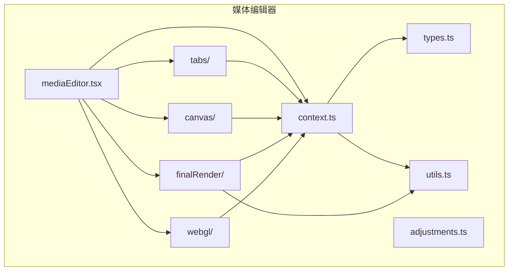
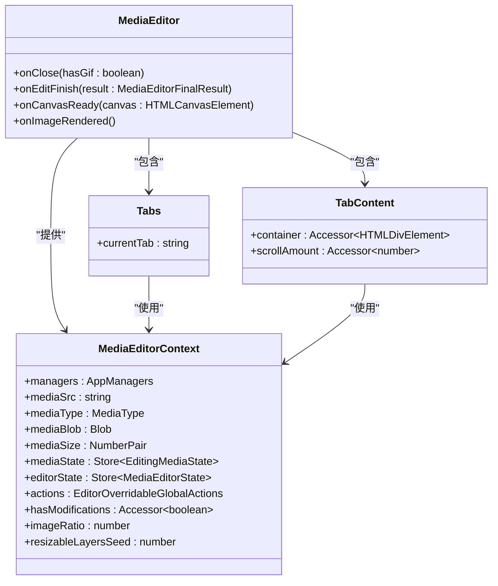
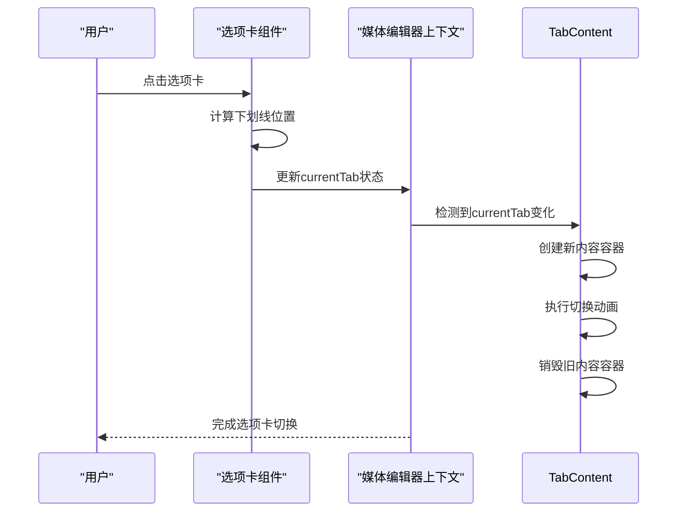
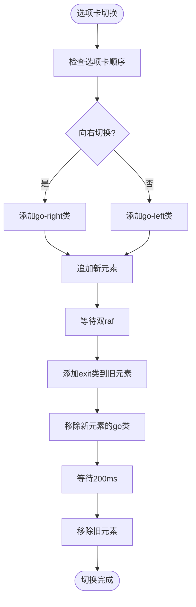
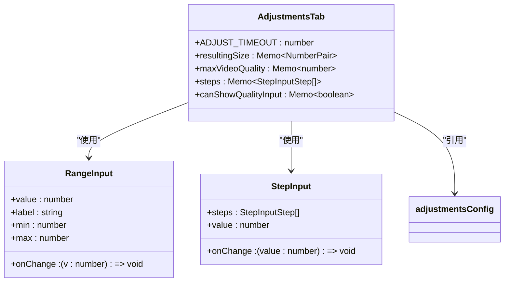
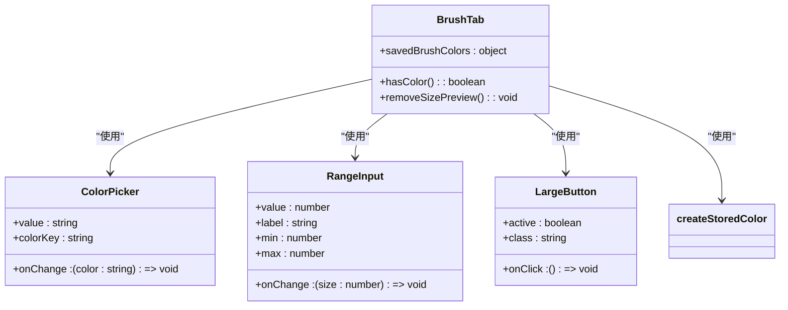
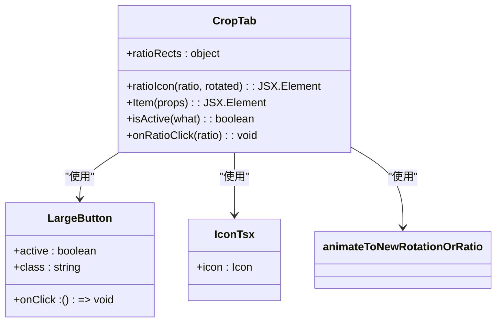
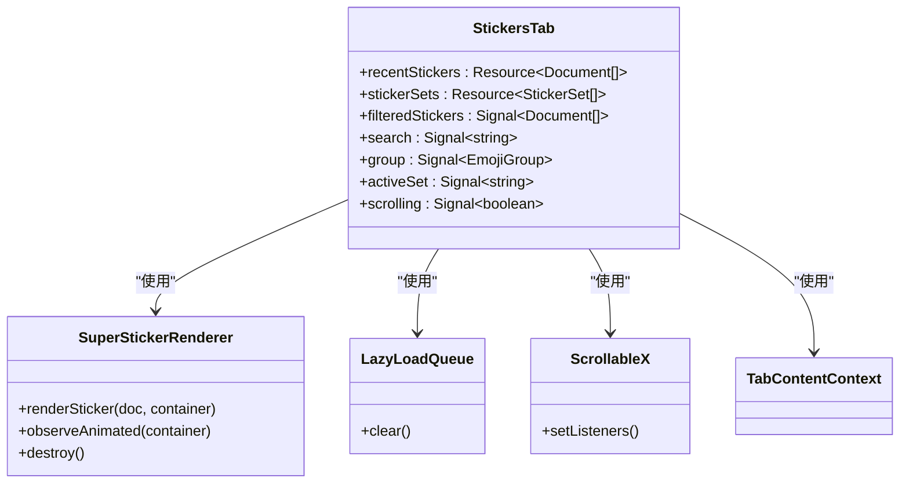
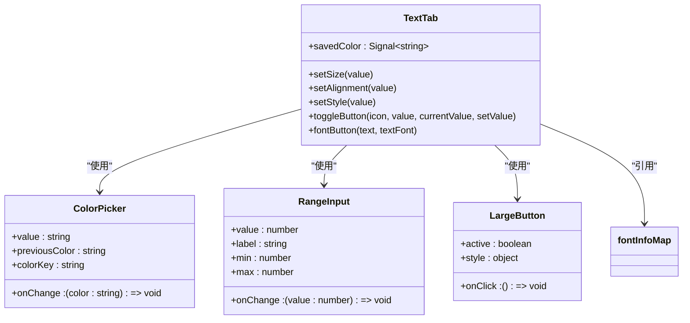
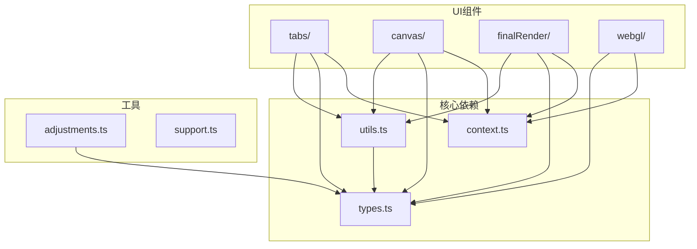

# 编辑选项卡

<cite>
**本文档中引用的文件**  
- [mediaEditor.tsx](file://src/components/mediaEditor/mediaEditor.tsx)
- [context.ts](file://src/components/mediaEditor/context.ts)
- [tabs.tsx](file://src/components/mediaEditor/tabs/tabs.tsx)
- [tabContent.tsx](file://src/components/mediaEditor/tabs/tabContent.tsx)
- [adjustmentsTab.tsx](file://src/components/mediaEditor/tabs/adjustmentsTab.tsx)
- [brushTab.tsx](file://src/components/mediaEditor/tabs/brushTab.tsx)
- [cropTab.tsx](file://src/components/mediaEditor/tabs/cropTab.tsx)
- [stickersTab.tsx](file://src/components/mediaEditor/tabs/stickersTab.tsx)
- [textTab.tsx](file://src/components/mediaEditor/tabs/textTab.tsx)
- [adjustments.ts](file://src/components/mediaEditor/adjustments.ts)
- [types.ts](file://src/components/mediaEditor/types.ts)
- [utils.ts](file://src/components/mediaEditor/utils.ts)
- [mainCanvas.tsx](file://src/components/mediaEditor/canvas/mainCanvas.tsx)
- [createFinalResult.ts](file://src/components/mediaEditor/finalRender/createFinalResult.ts)
</cite>

## 目录
1. [简介](#简介)
2. [项目结构](#项目结构)
3. [核心组件](#核心组件)
4. [架构概述](#架构概述)
5. [详细组件分析](#详细组件分析)
6. [依赖分析](#依赖分析)
7. [性能考虑](#性能考虑)
8. [故障排除指南](#故障排除指南)
9. [结论](#结论)

## 简介
本文档详细说明了媒体编辑器选项卡系统的实现机制和用户交互模式。系统包含五个主要编辑功能选项卡：调整、画笔、裁剪、贴纸和文字。每个选项卡提供特定的编辑功能，用户可以通过点击选项卡图标在不同功能之间切换。系统通过状态管理确保各选项卡之间的独立性和数据一致性，同时支持选项卡间的数据共享和通信。

## 项目结构
媒体编辑器选项卡系统位于 `src/components/mediaEditor` 目录下，采用模块化设计，各功能组件分离清晰。

**Diagram sources**
- [mediaEditor.tsx](file://src/components/mediaEditor/mediaEditor.tsx)
- [context.ts](file://src/components/mediaEditor/context.ts)

**Section sources**
- [mediaEditor.tsx](file://src/components/mediaEditor/mediaEditor.tsx)
- [context.ts](file://src/components/mediaEditor/context.ts)

## 核心组件
媒体编辑器的核心组件包括选项卡系统、状态管理、画布渲染和最终结果生成。选项卡系统通过 `Tabs` 组件实现，状态管理通过 `MediaEditorContext` 提供，画布渲染由 `MainCanvas` 组件负责，最终结果生成由 `createFinalResult` 函数处理。

**Section sources**
- [mediaEditor.tsx](file://src/components/mediaEditor/mediaEditor.tsx)
- [context.ts](file://src/components/mediaEditor/context.ts)
- [tabs.tsx](file://src/components/mediaEditor/tabs/tabs.tsx)
- [mainCanvas.tsx](file://src/components/mediaEditor/canvas/mainCanvas.tsx)
- [createFinalResult.ts](file://src/components/mediaEditor/finalRender/createFinalResult.ts)

## 架构概述
媒体编辑器采用基于 SolidJS 的响应式架构，通过上下文（Context）进行状态管理，各选项卡组件共享同一状态但保持功能独立。

**Diagram sources**
- [mediaEditor.tsx](file://src/components/mediaEditor/mediaEditor.tsx)
- [context.ts](file://src/components/mediaEditor/context.ts)
- [tabs.tsx](file://src/components/mediaEditor/tabs/tabs.tsx)
- [tabContent.tsx](file://src/components/mediaEditor/tabs/tabContent.tsx)

## 详细组件分析
### 选项卡系统分析
媒体编辑器选项卡系统实现了五个主要编辑功能：调整、画笔、裁剪、贴纸和文字。每个选项卡都有特定的UI组件和功能实现。

#### 选项卡切换逻辑

**Diagram sources**
- [tabs.tsx](file://src/components/mediaEditor/tabs/tabs.tsx)
- [tabContent.tsx](file://src/components/mediaEditor/tabs/tabContent.tsx)

#### 状态同步机制

**Diagram sources**
- [tabContent.tsx](file://src/components/mediaEditor/tabs/tabContent.tsx)

### 调整选项卡分析
调整选项卡提供了滤镜控制功能，包括亮度、对比度、饱和度等参数调节。

**Diagram sources**
- [adjustmentsTab.tsx](file://src/components/mediaEditor/tabs/adjustmentsTab.tsx)
- [adjustments.ts](file://src/components/mediaEditor/adjustments.ts)

**Section sources**
- [adjustmentsTab.tsx](file://src/components/mediaEditor/tabs/adjustmentsTab.tsx)
- [adjustments.ts](file://src/components/mediaEditor/adjustments.ts)

### 画笔选项卡分析
画笔选项卡提供了多种绘制工具，包括笔、箭头、画笔、霓虹笔等。

**Diagram sources**
- [brushTab.tsx](file://src/components/mediaEditor/tabs/brushTab.tsx)
- [createStoredColor.ts](file://src/components/mediaEditor/createStoredColor.ts)

**Section sources**
- [brushTab.tsx](file://src/components/mediaEditor/tabs/brushTab.tsx)
- [createStoredColor.ts](file://src/components/mediaEditor/createStoredColor.ts)

### 裁剪选项卡分析
裁剪选项卡提供了缩放和旋转功能，支持多种宽高比选择。

**Diagram sources**
- [cropTab.tsx](file://src/components/mediaEditor/tabs/cropTab.tsx)
- [animateToNewRotationOrRatio.ts](file://src/components/mediaEditor/canvas/animateToNewRotationOrRatio.ts)

**Section sources**
- [cropTab.tsx](file://src/components/mediaEditor/tabs/cropTab.tsx)
- [animateToNewRotationOrRatio.ts](file://src/components/mediaEditor/canvas/animateToNewRotationOrRatio.ts)

### 贴纸选项卡分析
贴纸选项卡提供了贴纸管理和选择功能，支持最近使用、搜索和分类浏览。

**Diagram sources**
- [stickersTab.tsx](file://src/components/mediaEditor/tabs/stickersTab.tsx)
- [SuperStickerRenderer.tsx](file://src/components/emoticonsDropdown/tabs/SuperStickerRenderer.tsx)
- [LazyLoadQueue.tsx](file://src/components/lazyLoadQueue.tsx)
- [Scrollable.ts](file://src/components/scrollable.ts)

**Section sources**
- [stickersTab.tsx](file://src/components/mediaEditor/tabs/stickersTab.tsx)
- [SuperStickerRenderer.tsx](file://src/components/emoticonsDropdown/tabs/SuperStickerRenderer.tsx)

### 文字选项卡分析
文字选项卡提供了文本编辑功能，包括字体、颜色、对齐方式等设置。

**Diagram sources**
- [textTab.tsx](file://src/components/mediaEditor/tabs/textTab.tsx)
- [fontInfoMap.ts](file://src/components/mediaEditor/utils.ts)

**Section sources**
- [textTab.tsx](file://src/components/mediaEditor/tabs/textTab.tsx)
- [utils.ts](file://src/components/mediaEditor/utils.ts)

## 依赖分析
媒体编辑器选项卡系统依赖于多个核心组件和工具函数，形成了清晰的依赖关系。

**Diagram sources**
- [context.ts](file://src/components/mediaEditor/context.ts)
- [types.ts](file://src/components/mediaEditor/types.ts)
- [utils.ts](file://src/components/mediaEditor/utils.ts)

**Section sources**
- [context.ts](file://src/components/mediaEditor/context.ts)
- [types.ts](file://src/components/mediaEditor/types.ts)
- [utils.ts](file://src/components/mediaEditor/utils.ts)

## 性能考虑
媒体编辑器在性能方面进行了多项优化，包括使用WebGL进行图像处理、懒加载贴纸、节流状态更新等。调整操作使用节流函数避免频繁更新，贴纸渲染使用懒加载队列优化性能，最终结果生成使用WebGL加速处理。

## 故障排除指南
当遇到选项卡切换异常时，检查 `currentTab` 状态是否正确更新；当调整效果不显示时，确认 `isAdjusting` 状态是否正确设置；当画笔大小预览不消失时，检查 `previewBrushSize` 的清除逻辑；当贴纸无法选择时，验证 `resizableLayersSeed` 是否正确递增。

**Section sources**
- [context.ts](file://src/components/mediaEditor/context.ts)
- [utils.ts](file://src/components/mediaEditor/utils.ts)

## 结论
媒体编辑器选项卡系统通过清晰的架构设计和模块化实现，提供了完整的媒体编辑功能。系统采用响应式状态管理，确保各选项卡之间的数据一致性和独立性。通过WebGL加速和懒加载等技术，保证了编辑操作的流畅性。各选项卡功能完整，用户交互友好，为用户提供了一流的媒体编辑体验。