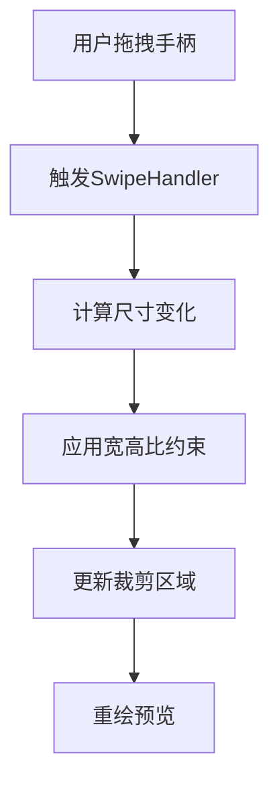
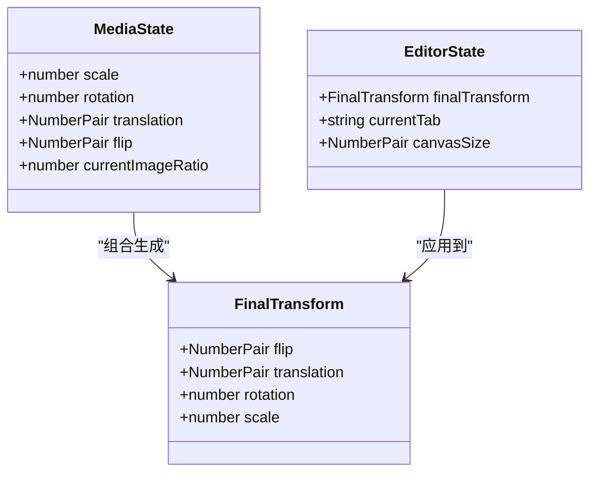
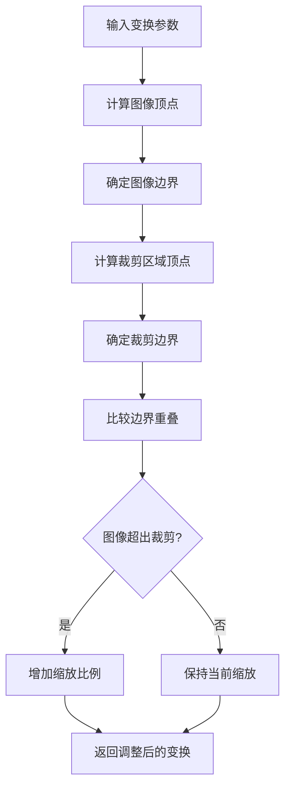
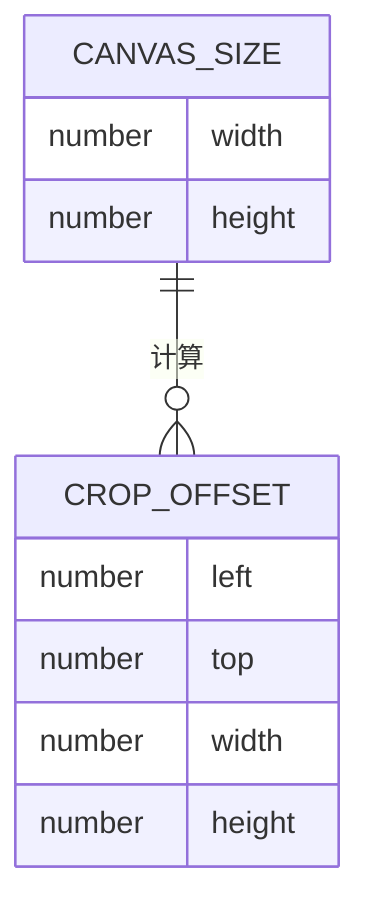
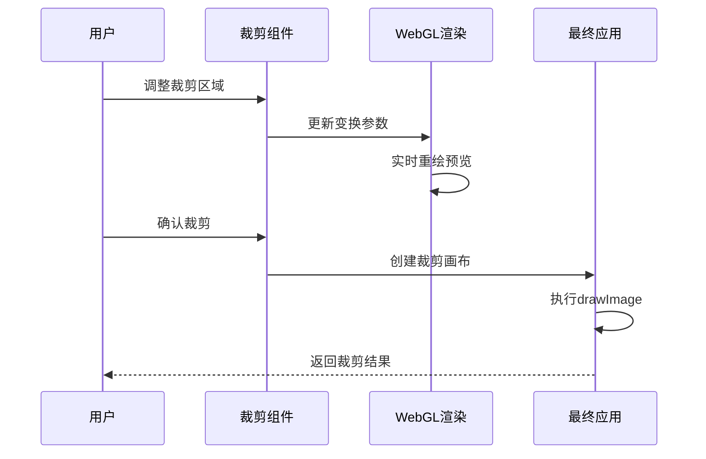

# 裁剪选项卡

<cite>
**本文档中引用的文件**  
- [cropHandles.tsx](file://src/components/mediaEditor/canvas/cropHandles.tsx)
- [cropTab.tsx](file://src/components/mediaEditor/tabs/cropTab.tsx)
- [getConvenientPositioning.tsx](file://src/components/mediaEditor/canvas/getConvenientPositioning.tsx)
- [useCropOffset.ts](file://src/components/mediaEditor/canvas/useCropOffset.ts)
- [animateToNewRotationOrRatio.ts](file://src/components/mediaEditor/canvas/animateToNewRotationOrRatio.ts)
- [rotationWheel.tsx](file://src/components/mediaEditor/canvas/rotationWheel.tsx)
- [context.ts](file://src/components/mediaEditor/context.ts)
- [useFinalTransform.ts](file://src/components/mediaEditor/canvas/useFinalTransform.ts)
- [cropper.ts](file://src/lib/cropper.ts)
</cite>

## 目录
1. [简介](#简介)
2. [裁剪功能实现机制](#裁剪功能实现机制)
3. [旋转与缩放实现细节](#旋转与缩放实现细节)
4. [便捷定位算法](#便捷定位算法)
5. [裁剪偏移状态管理](#裁剪偏移状态管理)
6. [裁剪预览与最终应用](#裁剪预览与最终应用)
7. [用户交互模式](#用户交互模式)

## 简介
裁剪选项卡是媒体编辑器中的核心功能模块，提供图像裁剪、旋转和缩放等基本编辑能力。该功能通过直观的拖拽手柄和旋转控件，允许用户精确调整图像的显示区域和方向。系统采用响应式架构，结合Solid.js的状态管理机制，实现了流畅的用户交互体验。

**Section sources**
- [cropTab.tsx](file://src/components/mediaEditor/tabs/cropTab.tsx#L1-L107)
- [context.ts](file://src/components/mediaEditor/context.ts#L1-L266)

## 裁剪功能实现机制

裁剪功能的核心实现位于`cropHandles.tsx`文件中，通过`CropHandles`组件管理裁剪区域的交互逻辑。组件使用Solid.js的响应式信号系统来跟踪裁剪区域的位置、大小和变换状态。

裁剪手柄（cropHandles）包括八个控制点：四个角点和四个边中点。这些手柄通过`SwipeHandler`类监听用户的拖拽操作，实现对裁剪区域的缩放和移动。每个手柄的拖拽操作都会触发相应的尺寸调整逻辑，同时保持图像的宽高比约束。

裁剪区域的计算基于`useCropOffset`钩子提供的边界偏移量，该偏移量定义了裁剪区域在画布上的安全边界。通过`snapToViewport`工具函数，系统确保裁剪区域始终适应当前视口尺寸。

**Diagram sources**
- [cropHandles.tsx](file://src/components/mediaEditor/canvas/cropHandles.tsx#L16-L444)
- [useCropOffset.ts](file://src/components/mediaEditor/canvas/useCropOffset.ts#L1-L21)

**Section sources**
- [cropHandles.tsx](file://src/components/mediaEditor/canvas/cropHandles.tsx#L16-L444)
- [useCropOffset.ts](file://src/components/mediaEditor/canvas/useCropOffset.ts#L1-L21)

## 旋转与缩放实现细节

旋转功能通过`rotationWheel.tsx`组件实现，提供一个直观的旋转控制条。用户可以通过拖动控制条来调整图像的旋转角度，系统支持15度的增量步进和自动对齐功能。

缩放操作在裁剪手柄的拖拽过程中实现，当用户调整裁剪区域大小时，系统会自动计算适当的缩放比例。`MAX_SCALE`常量定义了最大缩放倍数为20倍，防止过度缩放导致性能问题。

旋转和缩放的变换矩阵通过`FinalTransform`类型定义，包含四个关键参数：翻转（flip）、平移（translation）、旋转（rotation）和缩放（scale）。这些变换参数在`useFinalTransform`钩子中被组合并应用到最终渲染。

**Diagram sources**
- [rotationWheel.tsx](file://src/components/mediaEditor/canvas/rotationWheel.tsx#L1-L293)
- [useFinalTransform.ts](file://src/components/mediaEditor/canvas/useFinalTransform.ts#L1-L183)

**Section sources**
- [rotationWheel.tsx](file://src/components/mediaEditor/canvas/rotationWheel.tsx#L1-L293)
- [useFinalTransform.ts](file://src/components/mediaEditor/canvas/useFinalTransform.ts#L1-L183)

## 便捷定位算法

`getConvenientPositioning`函数实现了核心的便捷定位算法，用于计算图像和裁剪区域在旋转状态下的边界坐标。该算法考虑了旋转、缩放和平移等多种变换的复合效果。

算法首先计算图像在旋转后的四个顶点坐标，然后确定这些顶点的最小和最大边界值。同样地，它也计算裁剪区域在旋转后的边界。通过比较这两个边界，系统可以确定图像是否超出了裁剪区域，并相应地调整缩放比例。

当图像部分超出裁剪区域时，系统会自动增加缩放比例，确保整个图像始终可见。这种"智能缩放"机制提升了用户体验，避免了重要内容被意外裁剪。

**Diagram sources**
- [getConvenientPositioning.tsx](file://src/components/mediaEditor/canvas/getConvenientPositioning.tsx#L1-L72)

**Section sources**
- [getConvenientPositioning.tsx](file://src/components/mediaEditor/canvas/getConvenientPositioning.tsx#L1-L72)

## 裁剪偏移状态管理

`useCropOffset`钩子负责管理裁剪区域的偏移状态，定义了裁剪区域在画布上的安全边界。该钩子返回一个函数，动态计算基于当前画布尺寸的偏移量。

根据代码实现，裁剪区域的偏移量设置为：左侧60px，顶部60px，宽度为画布宽度减去120px，高度为画布高度减去180px。这种设计确保了裁剪区域周围有足够的安全边距，同时为UI控件留出空间。

偏移状态的管理采用函数式模式，每次调用都重新计算当前值，确保与画布尺寸的变化保持同步。这种设计避免了状态不一致的问题，特别是在窗口大小调整时。

**Diagram sources**
- [useCropOffset.ts](file://src/components/mediaEditor/canvas/useCropOffset.ts#L1-L21)

**Section sources**
- [useCropOffset.ts](file://src/components/mediaEditor/canvas/useCropOffset.ts#L1-L21)

## 裁剪预览与最终应用

裁剪预览通过WebGL渲染实现，利用`imageCanvas.tsx`中的`drawAdjustedImage`函数将变换后的图像实时渲染到画布上。系统使用`initWebGL`初始化WebGL上下文，并通过`draw`函数执行着色器程序。

最终应用裁剪结果时，系统通过`cropper.ts`文件中的`resizeableImage`函数创建一个独立的裁剪画布。该函数使用`drawImage`方法将原始图像的指定区域复制到目标画布，生成最终的裁剪结果。

`animateToNewRotationOrRatio`函数负责处理宽高比变更时的动画过渡。当用户选择新的宽高比时，系统会平滑地调整缩放、平移和旋转参数，提供流畅的视觉体验。

**Diagram sources**
- [imageCanvas.tsx](file://src/components/mediaEditor/canvas/imageCanvas.tsx#L1-L89)
- [cropper.ts](file://src/lib/cropper.ts#L1-L249)
- [animateToNewRotationOrRatio.ts](file://src/components/mediaEditor/canvas/animateToNewRotationOrRatio.ts#L1-L64)

**Section sources**
- [imageCanvas.tsx](file://src/components/mediaEditor/canvas/imageCanvas.tsx#L1-L89)
- [cropper.ts](file://src/lib/cropper.ts#L1-L249)
- [animateToNewRotationOrRatio.ts](file://src/components/mediaEditor/canvas/animateToNewRotationOrRatio.ts#L1-L64)

## 用户交互模式

裁剪选项卡提供直观的用户交互模式，主要包括：

1. **手柄拖拽**：用户可以通过拖拽八个控制手柄来调整裁剪区域的大小和位置。角点手柄允许自由缩放，边中点手柄允许单向缩放。

2. **旋转控制**：通过旋转控制条，用户可以拖动来调整图像旋转角度。控制条上的刻度标记15度增量，中心位置对应0度，支持快速对齐。

3. **宽高比选择**：提供多种预设宽高比选项，包括自由裁剪、原始比例和常见比例（1:1, 3:2, 4:3, 16:9等）。用户点击相应按钮即可应用。

4. **翻转功能**：通过翻转按钮实现图像的水平或垂直翻转，特别适用于人像编辑。

5. **动画过渡**：所有参数变更都伴有200毫秒的平滑动画，提升用户体验的流畅性。

系统通过`editorState.isMoving`标志跟踪用户交互状态，在交互过程中禁用其他操作，防止状态冲突。

**Section sources**
- [cropTab.tsx](file://src/components/mediaEditor/tabs/cropTab.tsx#L1-L107)
- [rotationWheel.tsx](file://src/components/mediaEditor/canvas/rotationWheel.tsx#L1-L293)
- [cropHandles.tsx](file://src/components/mediaEditor/canvas/cropHandles.tsx#L16-L444)