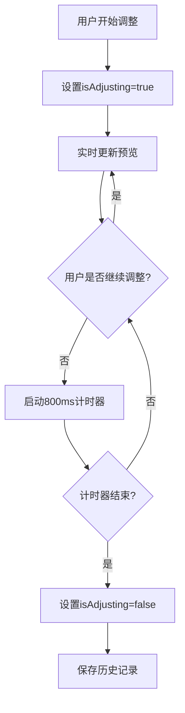

# 调整选项卡

<cite>
**本文档中引用的文件**  
- [adjustmentsTab.tsx](file://src/components/mediaEditor/tabs/adjustmentsTab.tsx)
- [rangeInput.tsx](file://src/components/mediaEditor/rangeInput.tsx)
- [stepInput.tsx](file://src/components/mediaEditor/stepInput.tsx)
- [adjustments.ts](file://src/components/mediaEditor/adjustments.ts)
- [context.ts](file://src/components/mediaEditor/context.ts)
- [draw.ts](file://src/components/mediaEditor/webgl/draw.ts)
- [createFinalResult.ts](file://src/components/mediaEditor/finalRender/createFinalResult.ts)
- [utils.ts](file://src/components/mediaEditor/utils.ts)
</cite>

## 目录
1. [简介](#简介)
2. [调整功能实现机制](#调整功能实现机制)
3. [用户交互模式](#用户交互模式)
4. [滑块与步进控件技术实现](#滑块与步进控件技术实现)
5. [实时预览应用机制](#实时预览应用机制)
6. [数据模型与状态管理](#数据模型与状态管理)
7. [跨选项卡数据共享与同步](#跨选项卡数据共享与同步)
8. [性能优化策略](#性能优化策略)
9. [结论](#结论)

## 简介
调整选项卡是媒体编辑器中的核心功能模块，提供亮度、对比度、饱和度等图像调整功能。该模块通过WebGL技术实现高性能图像处理，支持移动设备上的流畅交互体验。调整选项卡与其他编辑选项卡共享统一的状态管理机制，确保用户编辑操作的连贯性和一致性。

## 调整功能实现机制
调整选项卡通过WebGL着色器实现图像处理功能，将亮度、对比度、饱和度等调整参数作为uniform变量传递给片段着色器。系统使用预定义的调整配置数组`adjustmentsConfig`来管理所有可调整参数，每个参数包含唯一的键名、对应的uniform变量名、用户界面标签和数值范围。

图像处理流程通过`draw`函数实现，该函数将调整参数应用于WebGL渲染上下文。当用户调整滑块时，系统实时更新uniform变量值并重新绘制图像，实现即时预览效果。所有调整操作都遵循非破坏性编辑原则，原始媒体数据始终保持不变。

**调整选项卡**
- [adjustmentsTab.tsx](file://src/components/mediaEditor/tabs/adjustmentsTab.tsx#L1-L157)

## 用户交互模式
调整选项卡采用直观的滑块控件(rangeInput)和步进控件(stepInput)进行参数调整。每个调整参数对应一个独立的滑块，显示参数名称和当前数值。用户可以通过拖动滑块或点击步进来调整参数值。

对于视频质量调整，系统使用步进控件提供离散的质量选项。控件根据输出尺寸自动计算可用的质量等级，并动态更新选项列表。这种设计确保用户只能选择设备支持的合理质量设置，避免性能问题。

**用户交互模式**
- [adjustmentsTab.tsx](file://src/components/mediaEditor/tabs/adjustmentsTab.tsx#L1-L157)
- [rangeInput.tsx](file://src/components/mediaEditor/rangeInput.tsx#L1-L74)
- [stepInput.tsx](file://src/components/mediaEditor/stepInput.tsx#L1-L64)

## 滑块与步进控件技术实现
滑块控件(rangeInput)基于HTML5 range输入元素构建，通过CSS变量实现动态样式更新。控件支持被动标签模式，在无交互时显示简洁的标签和数值。控件的视觉反馈包括渐变进度条、拖动拇指和阴影效果，提升用户操作的直观性。

步进控件(stepInput)将离散选项映射到连续的range输入上，通过JavaScript计算当前选中项的索引。控件在视觉上显示分隔线和指示点，清晰地表示各个选项的位置和选中状态。这种设计在保持触摸友好性的同时，提供了精确的选项选择。

**滑块与步进控件技术实现**
- [rangeInput.tsx](file://src/components/mediaEditor/rangeInput.tsx#L1-L74)
- [stepInput.tsx](file://src/components/mediaEditor/stepInput.tsx#L1-L64)

## 实时预览应用机制
实时预览通过`isAdjusting`状态标志实现优化。当用户开始调整参数时，系统设置`isAdjusting`为true，并启动一个800毫秒的计时器。在此期间，系统持续更新预览但不记录历史操作。当用户停止调整800毫秒后，系统将最终值作为单个历史记录保存。

这种机制平衡了实时反馈和历史管理的需求，避免了因频繁微调产生过多的历史记录。同时，系统通过`pushToHistory`操作确保所有完成的调整都能被撤销或重做，维护了编辑操作的完整性。



**Diagram sources**
- [adjustmentsTab.tsx](file://src/components/mediaEditor/tabs/adjustmentsTab.tsx#L1-L157)
- [context.ts](file://src/components/mediaEditor/context.ts#L1-L266)

## 数据模型与状态管理
调整参数的数据模型定义在`EditingMediaState`接口中，包含一个`adjustments`记录对象，键名为`AdjustmentKey`类型，值为数值。系统通过`adjustmentsConfig`配置数组初始化所有调整参数的默认值。

状态管理采用SolidJS的响应式系统，使用`createMutable`创建可变状态对象。所有状态变更都是可追踪的，系统通过`pushToHistory`方法将重要变更记录到历史栈中。这种设计支持撤销/重做功能，同时保持了高性能的状态更新。

```mermaid
classDiagram
class EditingMediaState {
+scale : number
+rotation : number
+translation : NumberPair
+flip : NumberPair
+currentImageRatio : number
+currentVideoTime : number
+videoCropStart : number
+videoCropLength : number
+videoThumbnailPosition : number
+videoMuted : boolean
+videoQuality : number
+adjustments : Record<AdjustmentKey, number>
+resizableLayers : ResizableLayer[]
+brushDrawnLines : BrushDrawnLine[]
+history : HistoryItem[]
+redoHistory : HistoryItem[]
}
class AdjustmentKey {
+enhance
+brightness
+contrast
+saturation
+warmth
+fade
+highlights
+shadows
+vignette
+grain
+sharpen
}
class HistoryItem {
+path : KeyofEditingMediaState
+newValue : any
+oldValue : any
+findBy? : {id : any}
}
EditingMediaState --> AdjustmentKey : "包含"
EditingMediaState --> HistoryItem : "包含"
```

**Diagram sources**
- [context.ts](file://src/components/mediaEditor/context.ts#L1-L266)
- [adjustments.ts](file://src/components/mediaEditor/adjustments.ts#L1-L75)

## 跨选项卡数据共享与同步
调整选项卡与其他编辑选项卡通过`MediaEditorContext`共享状态。上下文提供统一的`mediaState`和`editorState`存储，确保所有选项卡访问相同的数据源。当用户在不同选项卡间切换时，系统保持状态的连续性。

数据同步通过响应式系统自动完成，任何状态变更都会立即反映在所有订阅的组件中。系统使用`useMediaEditorContext`钩子访问共享状态，避免了props层层传递的复杂性。这种集中式状态管理简化了跨选项卡的交互逻辑。

**跨选项卡数据共享与同步**
- [context.ts](file://src/components/mediaEditor/context.ts#L1-L266)
- [adjustmentsTab.tsx](file://src/components/mediaEditor/tabs/adjustmentsTab.tsx#L1-L157)

## 性能优化策略
为确保移动设备上的流畅体验，系统采用多项性能优化策略。首先，使用WebGL进行硬件加速的图像处理，充分利用GPU的并行计算能力。其次，通过`isAdjusting`标志节流历史记录的创建，减少不必要的状态快照。

对于视频处理，系统根据输出尺寸动态选择最优质量等级，避免过度渲染。在渲染最终结果时，系统使用`VideoEncoder` API进行高效编码，并通过`creationProgress`信号提供进度反馈。这些优化确保了即使在资源受限的设备上也能提供流畅的编辑体验。

**性能优化策略**
- [utils.ts](file://src/components/mediaEditor/utils.ts#L1-L234)
- [createFinalResult.ts](file://src/components/mediaEditor/finalRender/createFinalResult.ts#L1-L195)
- [draw.ts](file://src/components/mediaEditor/webgl/draw.ts#L1-L56)

## 结论
调整选项卡通过先进的WebGL技术和响应式状态管理，提供了强大而直观的图像调整功能。其精心设计的用户界面控件和性能优化策略确保了跨设备的一致体验。模块化的架构和清晰的数据流使得功能扩展和维护变得简单高效，为媒体编辑器的整体用户体验做出了重要贡献。