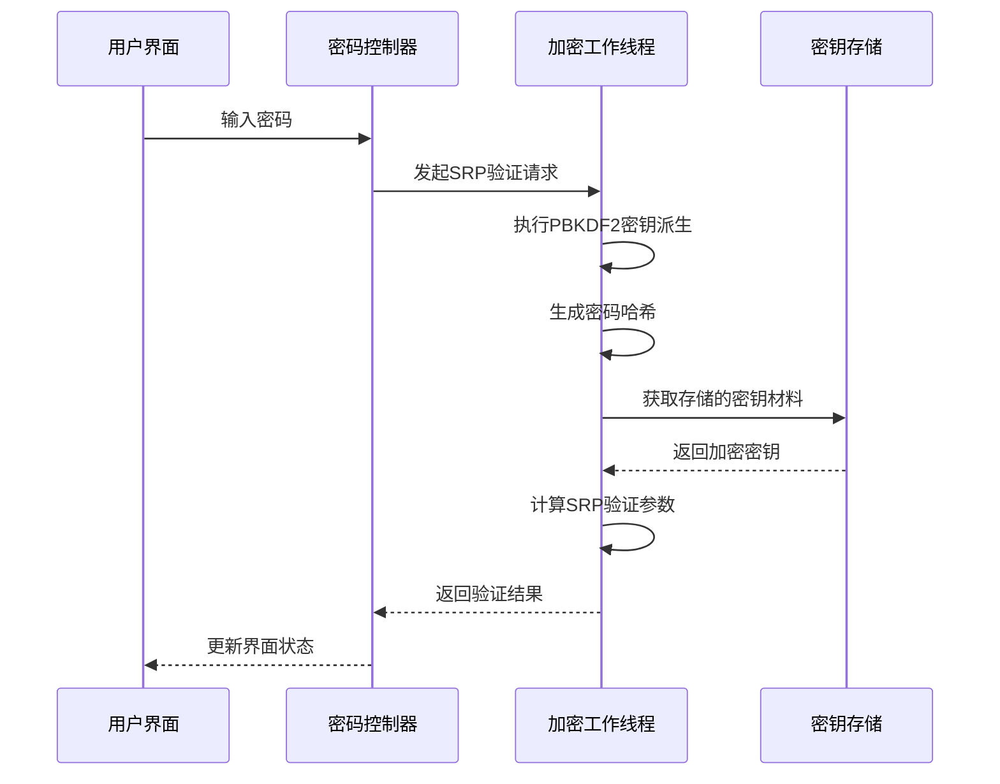
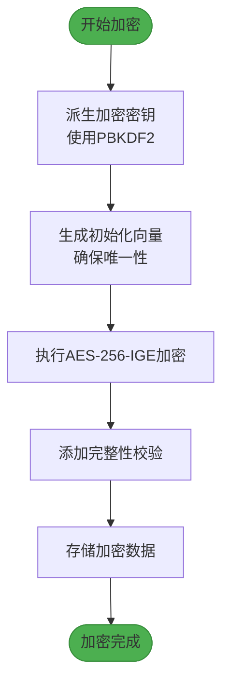
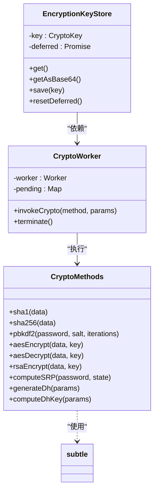
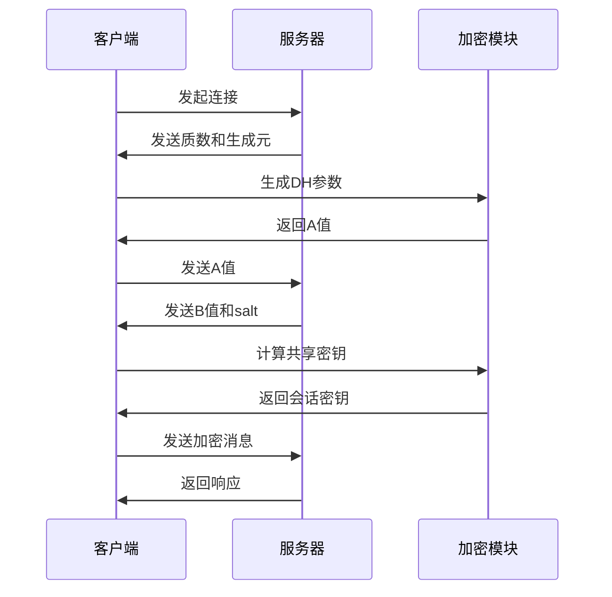

# 安全功能

<cite>
**本文档中引用的文件**  
- [SECURITY.md](file://SECURITY.md)
- [crypto_methods.ts](file://src/lib/crypto/crypto_methods.ts)
- [srp.ts](file://src/lib/crypto/srp.ts)
- [subtle.ts](file://src/lib/crypto/subtle.ts)
- [keyStore.ts](file://src/lib/passcode/keyStore.ts)
- [passwordManager.ts](file://src/lib/mtproto/passwordManager.ts)
- [passcodeLockScreen.tsx](file://src/components/passcodeLock/passcodeLockScreen.tsx)
- [aesLocal.ts](file://src/lib/crypto/utils/aesLocal.ts)
- [mtproto.worker.ts](file://src/lib/mtproto/mtproto.worker.ts)
- [obfuscation.ts](file://src/lib/mtproto/transports/obfuscation.ts)
</cite>

## 目录
1. [简介](#简介)
2. [密码锁实现机制](#密码锁实现机制)
3. [本地数据加密策略](#本地数据加密策略)
4. [加密模块与安全实践](#加密模块与安全实践)
5. [MTProto协议安全特性](#mtproto协议安全特性)
6. [安全审计与漏洞管理](#安全审计与漏洞管理)
7. [用户隐私保护](#用户隐私保护)
8. [安全事件响应](#安全事件响应)

## 简介
本项目实现了一套完整的安全体系，涵盖客户端密码锁、本地数据加密、端到端通信安全等多个层面。系统采用分层安全架构，通过独立的加密工作线程处理敏感操作，确保密钥和敏感数据不会暴露在主执行环境中。安全功能主要由crypto、passcode和mtproto三个核心模块协同实现，分别负责加密算法执行、本地密码管理以及网络通信安全。

**Section sources**
- [SECURITY.md](file://SECURITY.md#L1-L22)

## 密码锁实现机制

### UI交互设计
密码锁界面通过React组件实现，提供数字键盘输入和视觉反馈功能。用户界面包含密码输入区域、错误提示、生物识别集成点以及密码重试计数器。UI组件与底层密码管理系统通过事件驱动架构进行通信，确保用户操作能够安全地传递到加密层进行验证。

### 数据加密流程
当用户设置或验证密码时，系统采用SRP（安全远程密码）协议进行身份验证。该协议通过密码哈希、盐值处理和密钥派生等多层保护机制，确保即使通信被截获，攻击者也无法获取原始密码信息。密码验证过程在独立的Web Worker中执行，防止主进程中的潜在漏洞影响密码安全。

**Diagram sources**
- [passcodeLockScreen.tsx](file://src/components/passcodeLock/passcodeLockScreen.tsx)
- [srp.ts](file://src/lib/crypto/srp.ts#L17-L28)

**Section sources**
- [passcodeLockScreen.tsx](file://src/components/passcodeLock/passcodeLockScreen.tsx)
- [srp.ts](file://src/lib/crypto/srp.ts#L17-L28)

## 本地数据加密策略

### 密钥管理机制
系统采用基于Web Crypto API的密钥管理系统，所有加密密钥均在安全环境中生成和存储。`EncryptionKeyStore`类作为静态工具类，负责管理主加密密钥的生命周期。密钥通过`window.crypto.subtle`接口生成，并以`CryptoKey`对象形式在内存中安全存储，不会以明文形式写入持久化存储。

### 加密算法实现
本地数据加密采用AES-256算法，具体实现位于`aesLocal.ts`文件中。系统使用AES-IGE（Infinite Garble Extension）模式对数据进行加密，这种模式特别适合于需要随机访问的加密数据结构。加密过程包括密钥派生、初始化向量生成和数据块加密三个主要步骤。

**Diagram sources**
- [keyStore.ts](file://src/lib/passcode/keyStore.ts#L5-L38)
- [aesLocal.ts](file://src/lib/crypto/utils/aesLocal.ts)

**Section sources**
- [keyStore.ts](file://src/lib/passcode/keyStore.ts#L5-L38)
- [aesLocal.ts](file://src/lib/crypto/utils/aesLocal.ts)

## 加密模块与安全实践

### 加密算法套件
crypto模块提供了一套完整的加密算法实现，包括：
- 哈希函数：SHA-1、SHA-256
- 对称加密：AES-CTR、AES-IGE
- 非对称加密：RSA
- 密钥派生：PBKDF2
- 大数运算：模幂运算

这些算法通过`CryptoMethods`类型定义进行统一管理，确保接口的一致性和可维护性。所有加密操作都在独立的Web Worker中执行，实现执行环境隔离。

### 安全编码实践
系统遵循多项安全编码最佳实践：
1. **内存安全**：敏感数据在使用后立即清除，避免长时间驻留内存
2. **错误处理**：详细的错误分类和安全的错误信息输出
3. **输入验证**：对所有加密参数进行严格验证
4. **随机数生成**：使用安全的随机数源生成加密材料

**Diagram sources**
- [crypto_methods.ts](file://src/lib/crypto/crypto_methods.ts#L22-L42)
- [subtle.ts](file://src/lib/crypto/subtle.ts)
- [keyStore.ts](file://src/lib/passcode/keyStore.ts)

**Section sources**
- [crypto_methods.ts](file://src/lib/crypto/crypto_methods.ts#L22-L42)
- [subtle.ts](file://src/lib/crypto/subtle.ts)

## MTProto协议安全特性

### 协议栈架构
MTProto协议实现包含多个传输层，支持不同的网络环境和安全需求：
- **Abridged**：轻量级协议，适用于移动网络
- **Intermediate**：标准协议，平衡性能和安全性
- **Padded**：增强安全性，添加随机填充
- **Obfuscated**：混淆传输，绕过网络审查

### 安全通信机制
MTProto协议通过多层加密确保通信安全：
1. **会话密钥**：基于Diffie-Hellman密钥交换建立
2. **消息加密**：使用AES-256-IGE模式
3. **消息认证**：消息摘要验证完整性
4. **序列号管理**：防止重放攻击

**Diagram sources**
- [mtproto.worker.ts](file://src/lib/mtproto/mtproto.worker.ts)
- [obfuscation.ts](file://src/lib/mtproto/transports/obfuscation.ts)

**Section sources**
- [mtproto.worker.ts](file://src/lib/mtproto/mtproto.worker.ts)
- [passwordManager.ts](file://src/lib/mtproto/passwordManager.ts#L16-L121)

## 安全审计与漏洞管理

### 漏洞报告流程
项目建立了明确的漏洞管理政策，定义了受支持的版本和漏洞报告渠道。安全策略文件（SECURITY.md）详细说明了漏洞报告的期望响应时间和处理流程。项目维护者承诺对报告的漏洞进行及时评估和修复。

### 安全测试实践
系统包含专门的安全测试用例，验证关键加密功能的正确性和安全性：
- SRP协议实现验证
- 密钥派生函数测试
- 加密算法正确性验证
- 边界条件和异常处理测试

**Section sources**
- [SECURITY.md](file://SECURITY.md#L1-L22)
- [crypto_methods.test.ts](file://src/tests/crypto_methods.test.ts)

## 用户隐私保护

### 数据最小化原则
系统严格遵守数据最小化原则，仅收集和存储必要的用户数据。本地存储的数据经过加密处理，包括聊天记录、联系人信息和媒体文件缓存。用户可以随时清除本地数据，系统提供完整的数据清除功能。

### 隐私保护措施
- **端到端加密**：敏感消息采用端到端加密
- **本地处理**：用户数据优先在本地处理
- **权限控制**：最小权限原则，按需请求权限
- **匿名化**：统计信息收集时进行匿名化处理

**Section sources**
- [appSettings.ts](file://src/stores/appSettings.ts)
- [localStorage.ts](file://src/lib/localStorage.ts)

## 安全事件响应

### 日志记录策略
系统实施分级日志记录策略，区分安全相关日志和普通操作日志。安全事件日志包含时间戳、事件类型和简要描述，但不记录敏感信息如密码或加密密钥。日志数据在本地存储并定期清理，防止日志文件成为信息泄露源。

### 事件响应机制
- **实时监控**：检测异常登录尝试和安全相关操作
- **自动响应**：多次失败尝试后自动锁定账户
- **用户通知**：重要安全事件及时通知用户
- **恢复流程**：提供安全的账户恢复机制

**Section sources**
- [logger.ts](file://src/lib/logger.ts)
- [connectionStatus.ts](file://src/lib/mtproto/connectionStatus.ts)