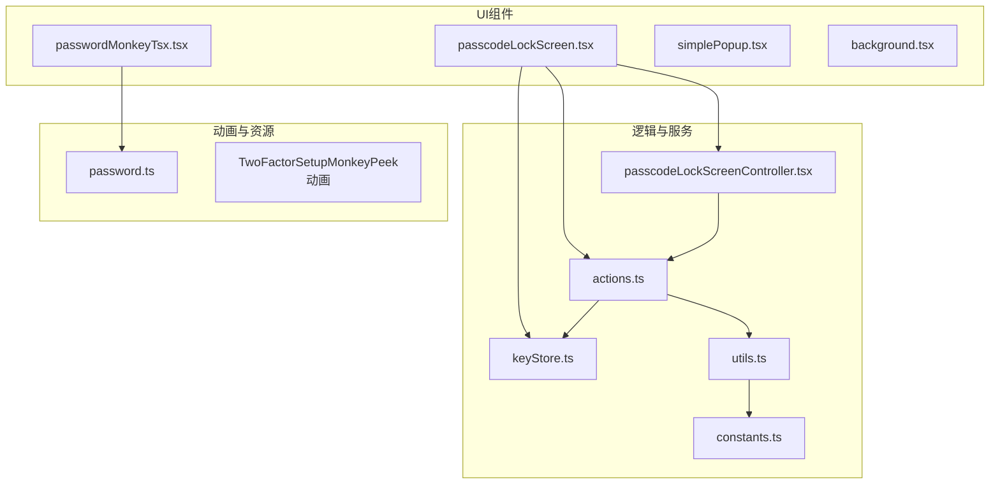
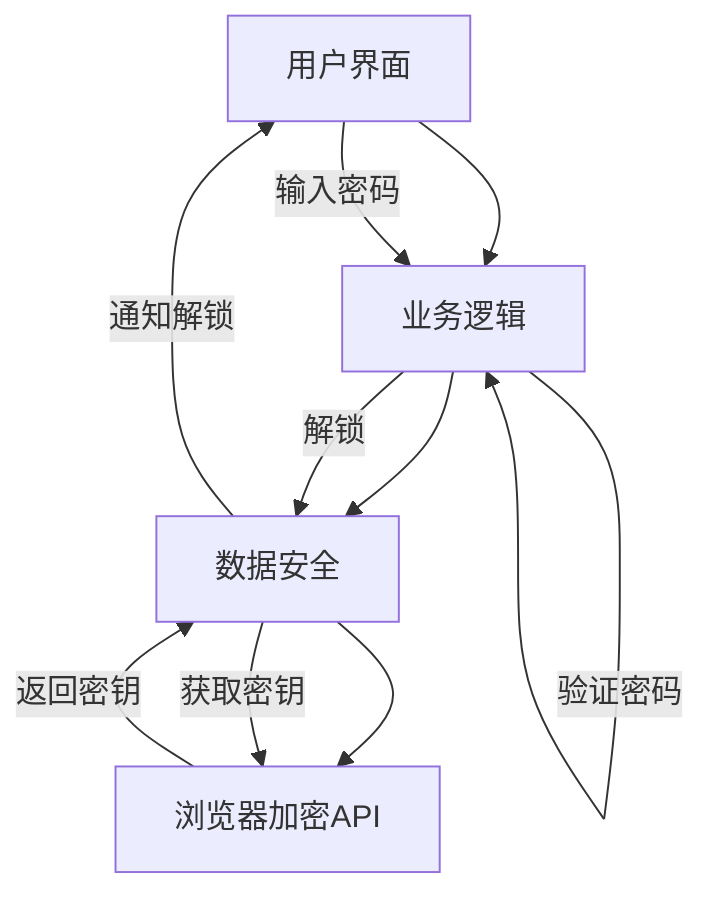
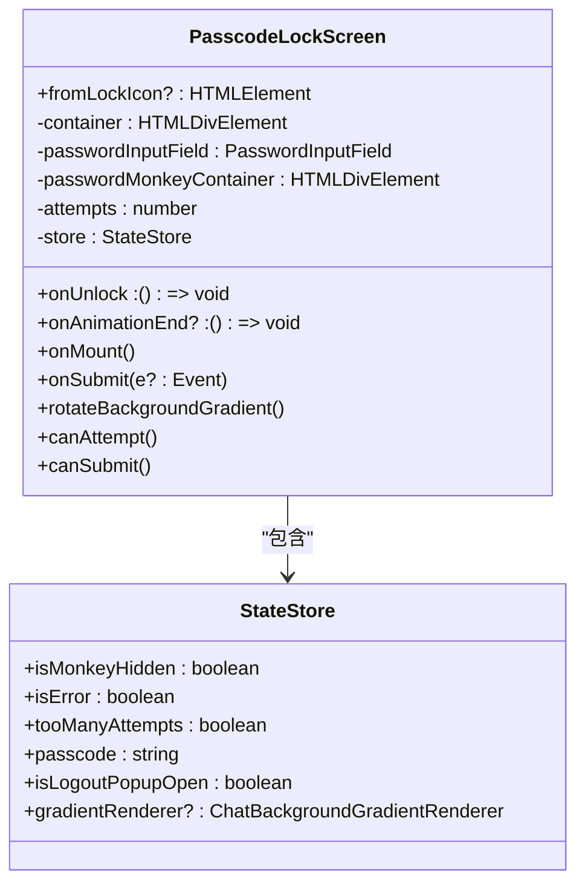
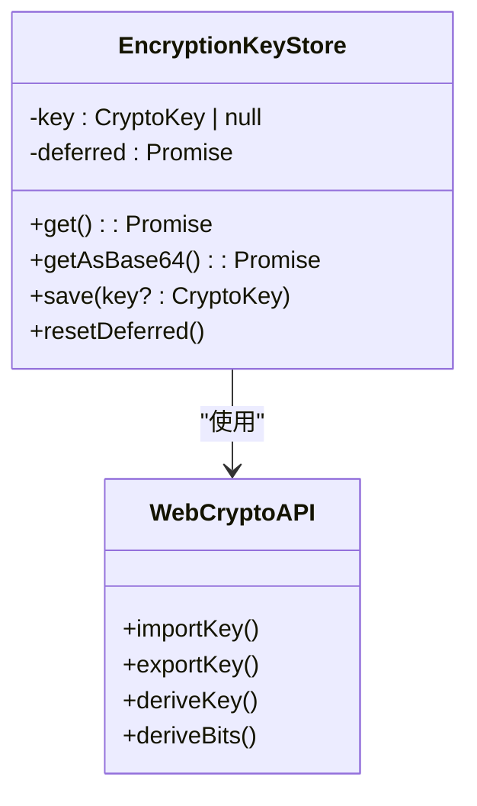
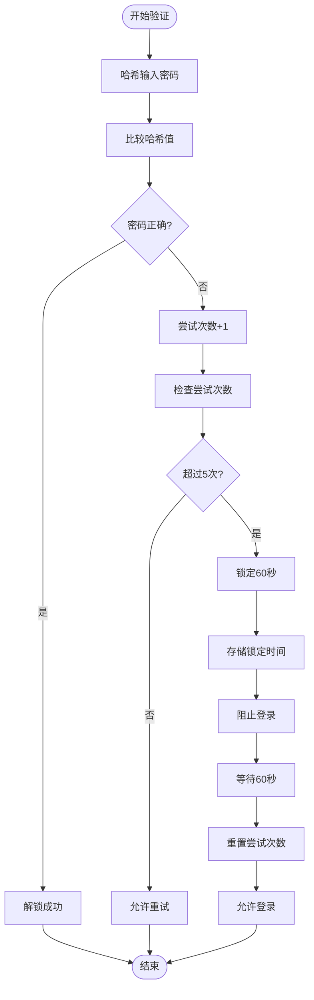
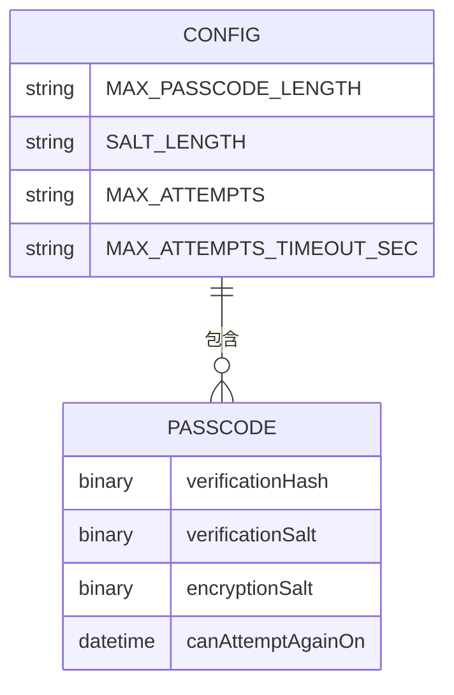
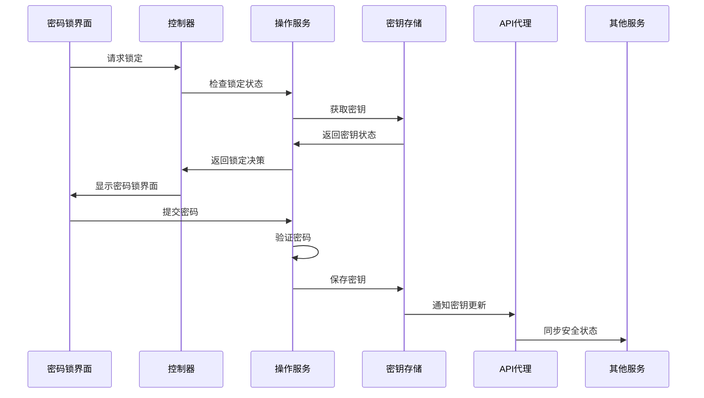

# 密码保护

<cite>
**本文档中引用的文件**  
- [passcodeLockScreen.tsx](file://src/components/passcodeLock/passcodeLockScreen.tsx)
- [passcodeLockScreenController.tsx](file://src/components/passcodeLock/passcodeLockScreenController.tsx)
- [keyStore.ts](file://src/lib/passcode/keyStore.ts)
- [actions.ts](file://src/lib/passcode/actions.ts)
- [constants.ts](file://src/lib/passcode/constants.ts)
- [utils.ts](file://src/lib/passcode/utils.ts)
- [passwordMonkeyTsx.tsx](file://src/components/passcodeLock/passwordMonkeyTsx.tsx)
- [password.ts](file://src/components/monkeys/password.ts)
- [simplePopup.tsx](file://src/components/passcodeLock/simplePopup.tsx)
</cite>

## 目录
1. [简介](#简介)
2. [项目结构](#项目结构)
3. [核心组件](#核心组件)
4. [架构概述](#架构概述)
5. [详细组件分析](#详细组件分析)
6. [依赖分析](#依赖分析)
7. [性能考虑](#性能考虑)
8. [故障排除指南](#故障排除指南)
9. [结论](#结论)

## 简介
本文档详细记录了密码锁功能的实现机制。该功能为应用程序提供了一层安全保护，确保用户数据在设备锁定时得到加密保护。密码锁系统包含UI组件、状态管理、加密逻辑和安全策略等多个方面，通过SolidJS框架实现响应式交互，并结合Web Crypto API进行安全的密钥管理。

## 项目结构
密码锁功能主要位于`src/components/passcodeLock`目录下，相关逻辑分散在多个模块中。该功能依赖于`src/lib/passcode`中的加密和存储机制，并与应用程序的全局状态管理系统集成。



**图源**  
- [passcodeLockScreen.tsx](file://src/components/passcodeLock/passcodeLockScreen.tsx)
- [passcodeLockScreenController.tsx](file://src/components/passcodeLock/passcodeLockScreenController.tsx)
- [keyStore.ts](file://src/lib/passcode/keyStore.ts)

**节源**  
- [passcodeLockScreen.tsx](file://src/components/passcodeLock/passcodeLockScreen.tsx)
- [passcodeLockScreenController.tsx](file://src/components/passcodeLock/passcodeLockScreenController.tsx)

## 核心组件
密码锁功能的核心组件包括密码输入界面、状态控制器、密钥存储服务和用户交互元素。`passcodeLockScreen`组件负责渲染密码输入界面并处理用户输入，`passcodeLockScreenController`管理密码锁的整体生命周期，`keyStore`模块负责加密密钥的安全存储与访问。

**节源**  
- [passcodeLockScreen.tsx](file://src/components/passcodeLock/passcodeLockScreen.tsx)
- [passcodeLockScreenController.tsx](file://src/components/passcodeLock/passcodeLockScreenController.tsx)
- [keyStore.ts](file://src/lib/passcode/keyStore.ts)

## 架构概述
密码锁系统采用分层架构设计，分为UI层、业务逻辑层和数据安全层。UI层负责用户交互和视觉呈现，业务逻辑层处理密码验证和状态转换，数据安全层管理加密密钥的生成、存储和使用。



**图源**  
- [passcodeLockScreen.tsx](file://src/components/passcodeLock/passcodeLockScreen.tsx)
- [actions.ts](file://src/lib/passcode/actions.ts)
- [keyStore.ts](file://src/lib/passcode/keyStore.ts)

## 详细组件分析

### 密码锁屏幕分析
`passcodeLockScreen`组件是密码锁功能的主要UI界面，它实现了密码输入、错误处理和状态反馈等核心功能。

#### 状态管理与动画效果
该组件使用SolidJS的响应式系统管理内部状态，包括密码输入、错误状态和锁定状态。当用户输入密码时，会触发动画效果，通过`animateValue`函数实现背景渐变的平滑过渡。



**图源**  
- [passcodeLockScreen.tsx](file://src/components/passcodeLock/passcodeLockScreen.tsx)

**节源**  
- [passcodeLockScreen.tsx](file://src/components/passcodeLock/passcodeLockScreen.tsx)

### 密钥存储机制分析
`keyStore`模块实现了加密密钥的安全存储和访问控制，使用Web Crypto API进行密钥管理。

#### 密钥存储与加密策略
该模块采用单例模式，通过`EncryptionKeyStore`类管理全局加密密钥。密钥存储在内存中，不会持久化到本地存储，确保安全性。



**图源**  
- [keyStore.ts](file://src/lib/passcode/keyStore.ts)

**节源**  
- [keyStore.ts](file://src/lib/passcode/keyStore.ts)

### 密码验证流程分析
密码验证流程涉及多个安全防护措施，包括尝试次数限制和延迟机制。

#### 验证流程与安全防护
系统通过`actions.ts`中的`usePasscodeActions`钩子提供密码验证功能，实现完整的验证流程和安全策略。



**图源**  
- [actions.ts](file://src/lib/passcode/actions.ts)
- [passcodeLockScreen.tsx](file://src/components/passcodeLock/passcodeLockScreen.tsx)

**节源**  
- [actions.ts](file://src/lib/passcode/actions.ts)
- [passcodeLockScreen.tsx](file://src/components/passcodeLock/passcodeLockScreen.tsx)

### 配置选项与自定义设置
密码锁系统提供了多种配置选项，包括最大密码长度、尝试次数限制和锁定时间等。

#### 配置管理
系统通过常量文件和状态存储实现配置管理，允许灵活调整安全策略。



**图源**  
- [constants.ts](file://src/lib/passcode/constants.ts)
- [actions.ts](file://src/lib/passcode/actions.ts)

**节源**  
- [constants.ts](file://src/lib/passcode/constants.ts)

### 集成分析
密码锁功能与其他安全功能紧密集成，形成完整的安全防护体系。

#### 与其他安全功能的集成
系统通过事件总线和API代理与其他安全组件通信，实现统一的安全管理。



**图源**  
- [passcodeLockScreenController.tsx](file://src/components/passcodeLock/passcodeLockScreenController.tsx)
- [actions.ts](file://src/lib/passcode/actions.ts)
- [keyStore.ts](file://src/lib/passcode/keyStore.ts)

**节源**  
- [passcodeLockScreenController.tsx](file://src/components/passcodeLock/passcodeLockScreenController.tsx)

## 依赖分析
密码锁功能依赖于多个核心模块，包括SolidJS框架、Web Crypto API和应用程序的状态管理系统。

```mermaid
dependencyDiagram
passcodeLockScreen --> passcodeLockScreenController
passcodeLockScreen --> actions
passcodeLockScreen --> keyStore
passcodeLockScreen --> passwordMonkeyTsx
passcodeLockScreenController --> actions
passcodeLockScreenController --> apiManagerProxy
actions --> keyStore
actions --> utils
actions --> commonStateStorage
passwordMonkeyTsx --> password
simplePopup --> ripple
```

**图源**  
- [passcodeLockScreen.tsx](file://src/components/passcodeLock/passcodeLockScreen.tsx)
- [passcodeLockScreenController.tsx](file://src/components/passcodeLock/passcodeLockScreenController.tsx)
- [actions.ts](file://src/lib/passcode/actions.ts)

**节源**  
- [passcodeLockScreen.tsx](file://src/components/passcodeLock/passcodeLockScreen.tsx)
- [passcodeLockScreenController.tsx](file://src/components/passcodeLock/passcodeLockScreenController.tsx)

## 性能考虑
密码锁功能在设计时考虑了性能优化，包括动画流畅性、内存使用和加密操作效率。

- 使用`throttle`函数限制背景动画的触发频率，避免过度渲染
- 采用延迟加载策略，仅在需要时导入密码锁组件
- 使用Web Crypto API的异步操作，避免阻塞主线程
- 通过`deferredPromise`管理异步操作的生命周期，防止内存泄漏

## 故障排除指南
当密码锁功能出现问题时，可以参考以下常见问题的解决方案：

**节源**  
- [passcodeLockScreen.tsx](file://src/components/passcodeLock/passcodeLockScreen.tsx)
- [passcodeLockScreenController.tsx](file://src/components/passcodeLock/passcodeLockScreenController.tsx)
- [keyStore.ts](file://src/lib/passcode/keyStore.ts)

## 结论
密码锁功能通过分层架构设计和模块化实现，提供了安全可靠的用户认证机制。系统结合了现代前端框架的响应式特性与浏览器原生加密API，实现了高性能、高安全性的密码保护方案。通过合理的状态管理、动画效果和安全策略，为用户提供了流畅且安全的使用体验。