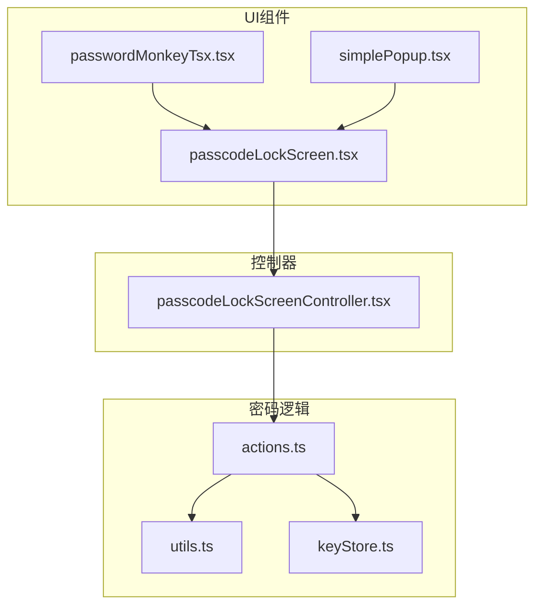
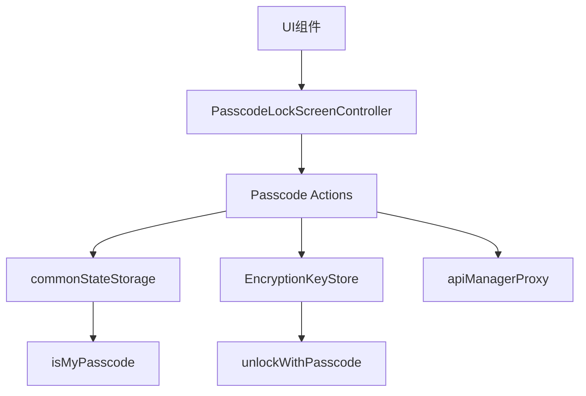
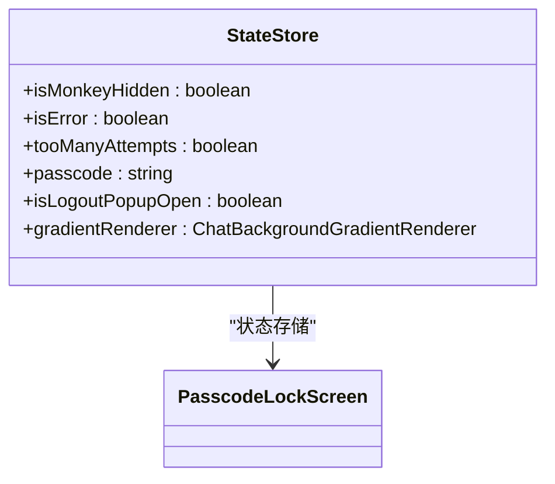
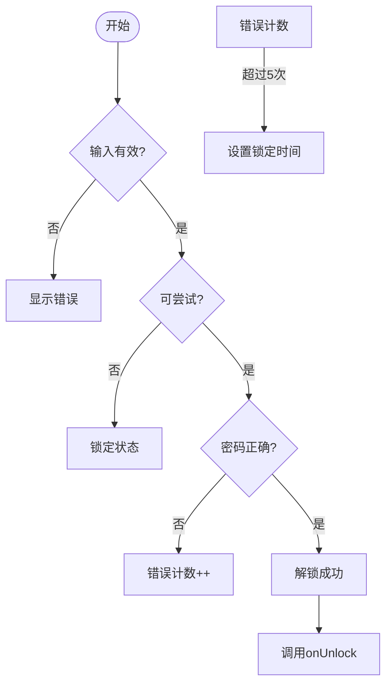
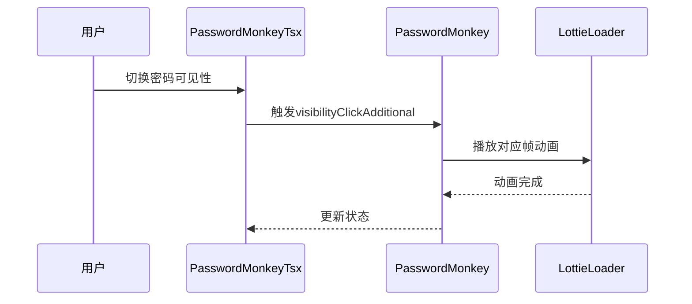
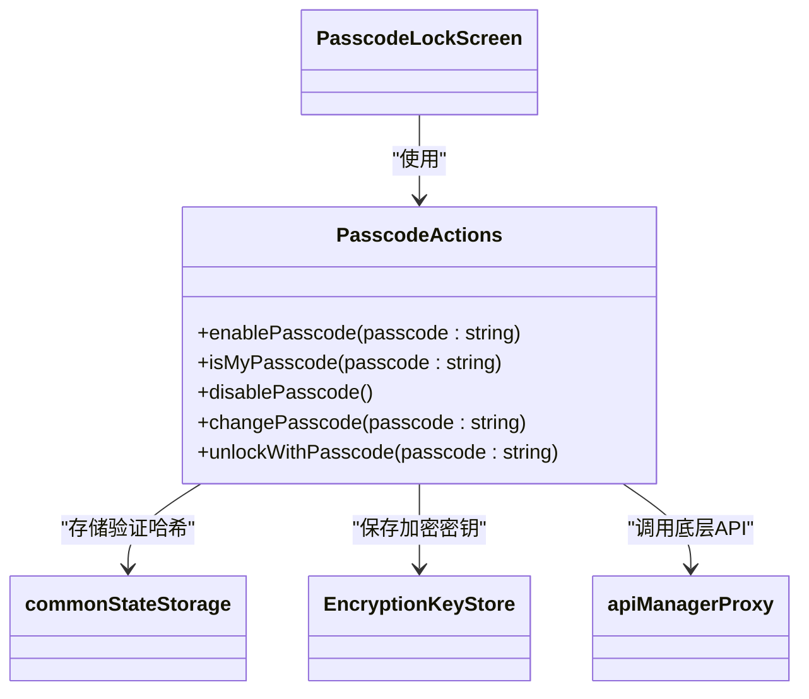
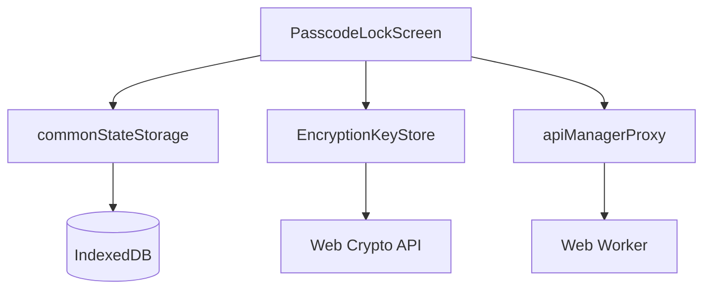

# 交互逻辑与状态管理

<cite>
**本文档中引用的文件**  
- [passcodeLockScreen.tsx](file://src/components/passcodeLock/passcodeLockScreen.tsx)
- [passcodeLockScreenController.tsx](file://src/components/passcodeLock/passcodeLockScreenController.tsx)
- [passwordMonkeyTsx.tsx](file://src/components/passcodeLock/passwordMonkeyTsx.tsx)
- [simplePopup.tsx](file://src/components/passcodeLock/simplePopup.tsx)
- [password.ts](file://src/components/monkeys/password.ts)
- [actions.ts](file://src/lib/passcode/actions.ts)
- [utils.ts](file://src/lib/passcode/utils.ts)
- [constants.ts](file://src/lib/passcode/constants.ts)
- [keyStore.ts](file://src/lib/passcode/keyStore.ts)
- [deferredIsUsingPasscode.ts](file://src/lib/passcode/deferredIsUsingPasscode.ts)
- [inputFieldTsx.tsx](file://src/components/inputFieldTsx.tsx)
</cite>

## 目录
1. [简介](#简介)
2. [项目结构](#项目结构)
3. [核心组件](#核心组件)
4. [架构概述](#架构概述)
5. [详细组件分析](#详细组件分析)
6. [依赖分析](#依赖分析)
7. [性能考虑](#性能考虑)
8. [故障排除指南](#故障排除指南)
9. [结论](#结论)

## 简介
本文档深入解析密码锁的交互逻辑实现，涵盖触摸事件处理、密码验证流程、UI状态管理、服务集成及错误处理机制。系统通过密码锁组件实现安全访问控制，结合动画反馈与状态管理，为用户提供直观且安全的解锁体验。

## 项目结构
密码锁功能主要位于 `src/components/passcodeLock` 目录下，包含核心UI组件与控制器。相关逻辑分散在 `lib/passcode` 模块中，负责密码验证与加密操作。整体结构清晰，职责分离明确。

**图示来源**  
- [passcodeLockScreen.tsx](file://src/components/passcodeLock/passcodeLockScreen.tsx)
- [passcodeLockScreenController.tsx](file://src/components/passcodeLock/passcodeLockScreenController.tsx)
- [actions.ts](file://src/lib/passcode/actions.ts)

## 核心组件
密码锁系统由多个核心组件构成：`PasscodeLockScreen` 为主界面组件，`PasswordMonkeyTsx` 提供动画反馈，`SimplePopup` 处理注销确认，`PasscodeLockScreenController` 管理整体生命周期。这些组件协同工作，实现完整的解锁流程。

**章节来源**  
- [passcodeLockScreen.tsx](file://src/components/passcodeLock/passcodeLockScreen.tsx#L42-L252)
- [passwordMonkeyTsx.tsx](file://src/components/passcodeLock/passwordMonkeyTsx.tsx#L11-L54)
- [simplePopup.tsx](file://src/components/passcodeLock/simplePopup.tsx#L12-L83)
- [passcodeLockScreenController.tsx](file://src/components/passcodeLock/passcodeLockScreenController.tsx#L15-L177)

## 架构概述
系统采用分层架构，UI层负责用户交互，控制层管理状态流转，服务层处理加密验证。组件间通过事件与Promise机制通信，确保异步操作的有序执行。

**图示来源**  
- [passcodeLockScreenController.tsx](file://src/components/passcodeLock/passcodeLockScreenController.tsx)
- [actions.ts](file://src/lib/passcode/actions.ts)

## 详细组件分析

### 密码锁屏幕分析
`PasscodeLockScreen` 组件管理用户输入与验证流程。通过 `store` 对象维护输入状态、错误状态与尝试次数。输入事件触发背景渐变动画，增强交互反馈。

#### 组件状态管理

**图示来源**  
- [passcodeLockScreen.tsx](file://src/components/passcodeLock/passcodeLockScreen.tsx#L28-L35)

#### 输入验证流程

**图示来源**  
- [passcodeLockScreen.tsx](file://src/components/passcodeLock/passcodeLockScreen.tsx#L142-L168)

### 密码猴子动画分析
`PasswordMonkeyTsx` 组件集成Lottie动画，根据密码可见性切换猴子睁眼/闭眼状态，提供直观的视觉反馈。

**图示来源**  
- [passwordMonkeyTsx.tsx](file://src/components/passcodeLock/passwordMonkeyTsx.tsx#L11-L54)
- [password.ts](file://src/components/monkeys/password.ts#L11-L69)

### 密码验证服务集成
系统通过 `usePasscodeActions` 提供密码验证服务，封装了密码验证、解锁、启用/禁用等核心功能。

#### 服务方法调用

**图示来源**  
- [actions.ts](file://src/lib/passcode/actions.ts#L16-L168)
- [passcodeLockScreen.tsx](file://src/components/passcodeLock/passcodeLockScreen.tsx#L53)

## 依赖分析
系统依赖多个核心模块：`commonStateStorage` 用于持久化存储密码验证数据，`EncryptionKeyStore` 管理加密密钥，`apiManagerProxy` 与底层服务通信。

**图示来源**  
- [actions.ts](file://src/lib/passcode/actions.ts)
- [keyStore.ts](file://src/lib/passcode/keyStore.ts)
- [passcodeLockScreenController.tsx](file://src/components/passcodeLock/passcodeLockScreenController.tsx)

## 性能考虑
系统在性能方面进行了多项优化：使用 `throttle` 限制背景动画频率，通过 `deferredPromise` 管理异步依赖，利用 `createResource` 实现账户数量的懒加载。

## 故障排除指南
常见问题包括：密码验证失败、多次尝试后锁定、动画不显示等。解决方案包括检查密码哈希存储、验证时间锁逻辑、确保Lottie资源加载。

**章节来源**  
- [passcodeLockScreen.tsx](file://src/components/passcodeLock/passcodeLockScreen.tsx#L149-L162)
- [passcodeLockScreenController.tsx](file://src/components/passcodeLock/passcodeLockScreenController.tsx#L28-L53)

## 结论
密码锁系统实现了安全、直观的用户认证机制。通过清晰的组件划分与状态管理，结合动画反馈与错误处理，为用户提供流畅的解锁体验。系统设计考虑了安全性、性能与可维护性，是前端安全控制的优秀实践。