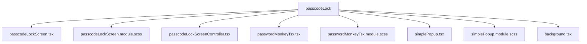
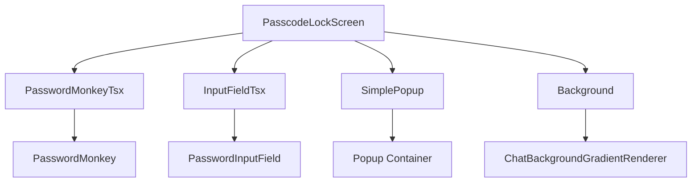
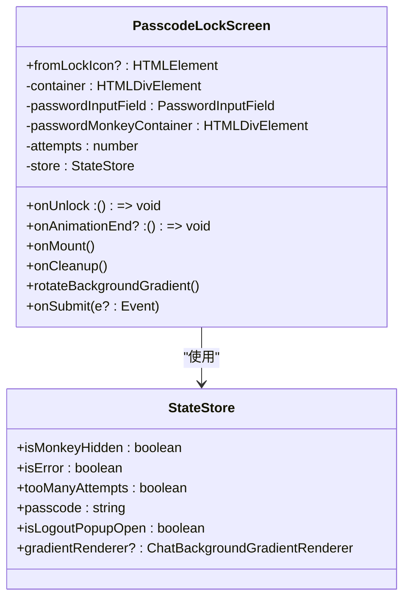
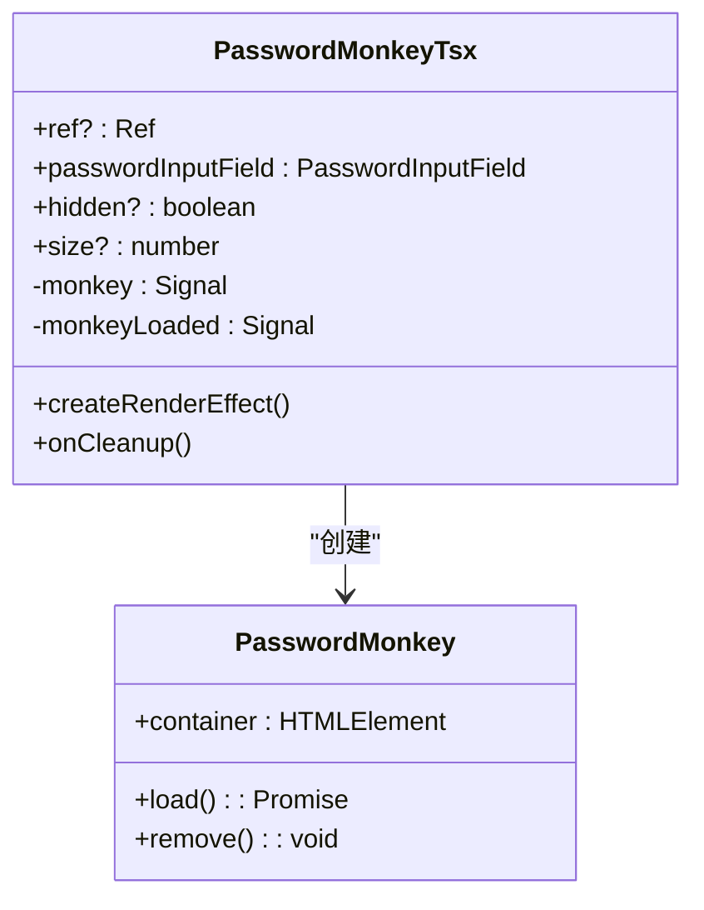
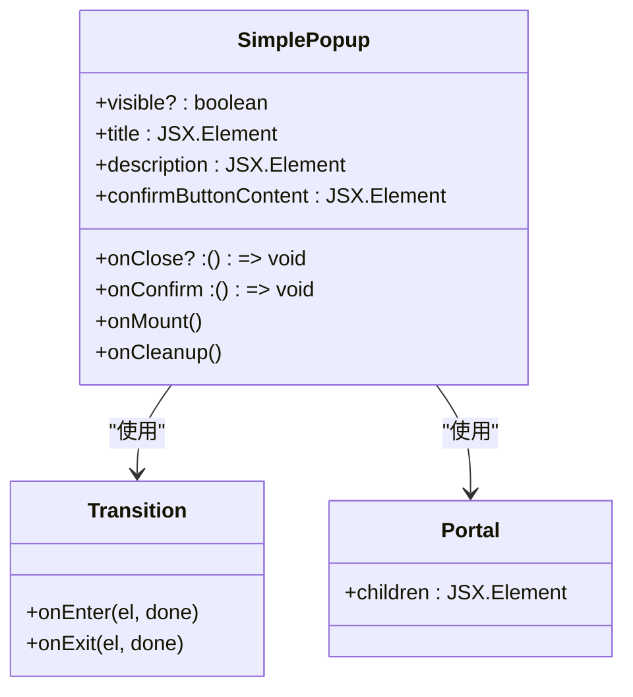
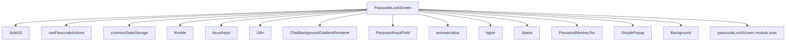

# 密码锁UI实现

<cite>
**本文档引用的文件**
- [passcodeLockScreen.tsx](file://src/components/passcodeLock/passcodeLockScreen.tsx)
- [passcodeLockScreen.module.scss](file://src/components/passcodeLock/passcodeLockScreen.module.scss)
- [passcodeLockScreenController.tsx](file://src/components/passcodeLock/passcodeLockScreenController.tsx)
- [passwordMonkeyTsx.tsx](file://src/components/passcodeLock/passwordMonkeyTsx.tsx)
- [passwordMonkeyTsx.module.scss](file://src/components/passcodeLock/passwordMonkeyTsx.module.scss)
- [simplePopup.tsx](file://src/components/passcodeLock/simplePopup.tsx)
- [simplePopup.module.scss](file://src/components/passcodeLock/simplePopup.module.scss)
- [background.tsx](file://src/components/passcodeLock/background.tsx)
- [actions.ts](file://src/lib/passcode/actions.ts)
- [constants.ts](file://src/lib/passcode/constants.ts)
- [inputFieldTsx.tsx](file://src/components/inputFieldTsx.tsx)
- [inputField.ts](file://src/components/inputField.ts)
</cite>

## 目录
1. [简介](#简介)
2. [项目结构](#项目结构)
3. [核心组件](#核心组件)
4. [架构概述](#架构概述)
5. [详细组件分析](#详细组件分析)
6. [依赖分析](#依赖分析)
7. [性能考虑](#性能考虑)
8. [故障排除指南](#故障排除指南)
9. [结论](#结论)

## 简介
本文档详细记录了密码锁用户界面的实现，重点分析了passcodeLockScreen组件的结构和布局。文档涵盖了数字键盘、密码输入框和状态指示器的设计，描述了UI组件的动画效果和过渡效果，如错误提示动画和解锁动画。同时，文档还说明了用户交互流程，包括触摸事件处理、键盘输入反馈和视觉状态变化，并分析了UI与状态管理的集成方式以及如何响应密码验证结果。最后，提供了UI自定义选项和主题适配方案。

## 项目结构
密码锁UI实现位于`src/components/passcodeLock`目录下，包含多个关键文件。该组件采用模块化设计，将不同的功能分离到独立的文件中，便于维护和扩展。

**Diagram sources**
- [passcodeLockScreen.tsx](file://src/components/passcodeLock/passcodeLockScreen.tsx)
- [passcodeLockScreen.module.scss](file://src/components/passcodeLock/passcodeLockScreen.module.scss)
- [passcodeLockScreenController.tsx](file://src/components/passcodeLock/passcodeLockScreenController.tsx)
- [passwordMonkeyTsx.tsx](file://src/components/passcodeLock/passwordMonkeyTsx.tsx)
- [passwordMonkeyTsx.module.scss](file://src/components/passcodeLock/passwordMonkeyTsx.module.scss)
- [simplePopup.tsx](file://src/components/passcodeLock/simplePopup.tsx)
- [simplePopup.module.scss](file://src/components/passcodeLock/simplePopup.module.scss)
- [background.tsx](file://src/components/passcodeLock/background.tsx)

**Section sources**
- [passcodeLockScreen.tsx](file://src/components/passcodeLock/passcodeLockScreen.tsx)
- [passcodeLockScreen.module.scss](file://src/components/passcodeLock/passcodeLockScreen.module.scss)
- [passcodeLockScreenController.tsx](file://src/components/passcodeLock/passcodeLockScreenController.tsx)
- [passwordMonkeyTsx.tsx](file://src/components/passcodeLock/passwordMonkeyTsx.tsx)
- [passwordMonkeyTsx.module.scss](file://src/components/passcodeLock/passwordMonkeyTsx.module.scss)
- [simplePopup.tsx](file://src/components/passcodeLock/simplePopup.tsx)
- [simplePopup.module.scss](file://src/components/passcodeLock/simplePopup.module.scss)
- [background.tsx](file://src/components/passcodeLock/background.tsx)

## 核心组件
密码锁UI的核心组件包括passcodeLockScreen、passwordMonkeyTsx和simplePopup。这些组件共同构成了密码锁的用户界面，提供了完整的用户交互体验。

**Section sources**
- [passcodeLockScreen.tsx](file://src/components/passcodeLock/passcodeLockScreen.tsx)
- [passwordMonkeyTsx.tsx](file://src/components/passcodeLock/passwordMonkeyTsx.tsx)
- [simplePopup.tsx](file://src/components/passcodeLock/simplePopup.tsx)

## 架构概述
密码锁UI的架构采用分层设计，将UI组件、状态管理和业务逻辑分离。passcodeLockScreen组件作为主容器，负责协调其他组件的工作。

**Diagram sources**
- [passcodeLockScreen.tsx](file://src/components/passcodeLock/passcodeLockScreen.tsx)
- [passwordMonkeyTsx.tsx](file://src/components/passcodeLock/passwordMonkeyTsx.tsx)
- [inputFieldTsx.tsx](file://src/components/inputFieldTsx.tsx)
- [simplePopup.tsx](file://src/components/passcodeLock/simplePopup.tsx)
- [background.tsx](file://src/components/passcodeLock/background.tsx)

## 详细组件分析

### PasscodeLockScreen组件分析
PasscodeLockScreen组件是密码锁UI的主要容器，负责管理整个界面的状态和交互。

#### 组件结构
PasscodeLockScreen组件采用SolidJS框架实现，使用createMutable创建可变状态存储。组件包含以下主要状态：
- isMonkeyHidden: 控制密码猴子的显示状态
- isError: 标记密码输入错误
- tooManyAttempts: 标记尝试次数过多
- passcode: 存储当前输入的密码
- isLogoutPopupOpen: 控制登出弹窗的显示

**Diagram sources**
- [passcodeLockScreen.tsx](file://src/components/passcodeLock/passcodeLockScreen.tsx)

**Section sources**
- [passcodeLockScreen.tsx](file://src/components/passcodeLock/passcodeLockScreen.tsx)

### PasswordMonkeyTsx组件分析
PasswordMonkeyTsx组件实现了密码猴子的显示和动画效果，为用户提供生动的视觉反馈。

#### 组件实现
PasswordMonkeyTsx组件使用SolidJS的createSignal创建响应式状态，通过createRenderEffect在组件渲染时初始化密码猴子。

**Diagram sources**
- [passwordMonkeyTsx.tsx](file://src/components/passcodeLock/passwordMonkeyTsx.tsx)

**Section sources**
- [passwordMonkeyTsx.tsx](file://src/components/passcodeLock/passwordMonkeyTsx.tsx)

### SimplePopup组件分析
SimplePopup组件实现了登出确认弹窗，提供用户确认操作的界面。

#### 组件实现
SimplePopup组件使用SolidJS的Transition组件实现弹窗的进入和退出动画，通过Portal将弹窗渲染到body元素下。

**Diagram sources**
- [simplePopup.tsx](file://src/components/passcodeLock/simplePopup.tsx)

**Section sources**
- [simplePopup.tsx](file://src/components/passcodeLock/simplePopup.tsx)

## 依赖分析
密码锁UI组件依赖于多个核心库和工具，这些依赖关系确保了组件的功能完整性和性能优化。

**Diagram sources**
- [passcodeLockScreen.tsx](file://src/components/passcodeLock/passcodeLockScreen.tsx)
- [passcodeLockScreen.module.scss](file://src/components/passcodeLock/passcodeLockScreen.module.scss)

**Section sources**
- [passcodeLockScreen.tsx](file://src/components/passcodeLock/passcodeLockScreen.tsx)
- [passcodeLockScreen.module.scss](file://src/components/passcodeLock/passcodeLockScreen.module.scss)

## 性能考虑
密码锁UI在设计时考虑了性能优化，通过多种技术手段确保界面的流畅性和响应速度。

1. **动画优化**: 使用throttle函数限制背景渐变动画的执行频率，避免过度渲染。
2. **资源管理**: 在组件卸载时及时清理事件监听器和定时器，防止内存泄漏。
3. **异步处理**: 将耗时操作如密码验证放在异步函数中执行，避免阻塞主线程。
4. **状态管理**: 使用createMutable创建可变状态，减少不必要的重新渲染。

**Section sources**
- [passcodeLockScreen.tsx](file://src/components/passcodeLock/passcodeLockScreen.tsx)
- [passcodeLockScreenController.tsx](file://src/components/passcodeLock/passcodeLockScreenController.tsx)

## 故障排除指南
在使用密码锁UI时可能遇到一些常见问题，以下是相应的解决方案。

### 密码验证失败
如果密码验证失败，请检查以下几点：
1. 确认输入的密码长度不超过MAX_PASSCODE_LENGTH（32位）
2. 检查是否达到了最大尝试次数（5次）
3. 确认密码数据已正确存储在commonStateStorage中

### 动画效果异常
如果动画效果出现异常，请检查：
1. 确认CSS类名是否正确应用
2. 检查浏览器是否支持相关的CSS动画属性
3. 确认SolidJS的Transition组件是否正确配置

### 组件渲染问题
如果组件无法正常渲染，请检查：
1. 确认所有依赖的组件和库已正确导入
2. 检查是否存在JavaScript错误
3. 确认DOM元素的引用是否正确

**Section sources**
- [passcodeLockScreen.tsx](file://src/components/passcodeLock/passcodeLockScreen.tsx)
- [passwordMonkeyTsx.tsx](file://src/components/passcodeLock/passwordMonkeyTsx.tsx)
- [simplePopup.tsx](file://src/components/passcodeLock/simplePopup.tsx)

## 结论
密码锁UI实现了一个功能完整、用户体验良好的密码验证界面。通过模块化的设计和合理的状态管理，组件具有良好的可维护性和扩展性。动画效果和视觉反馈增强了用户的交互体验，而严格的密码验证机制确保了安全性。该实现可以作为其他类似功能的参考模板，并可根据具体需求进行定制和优化。