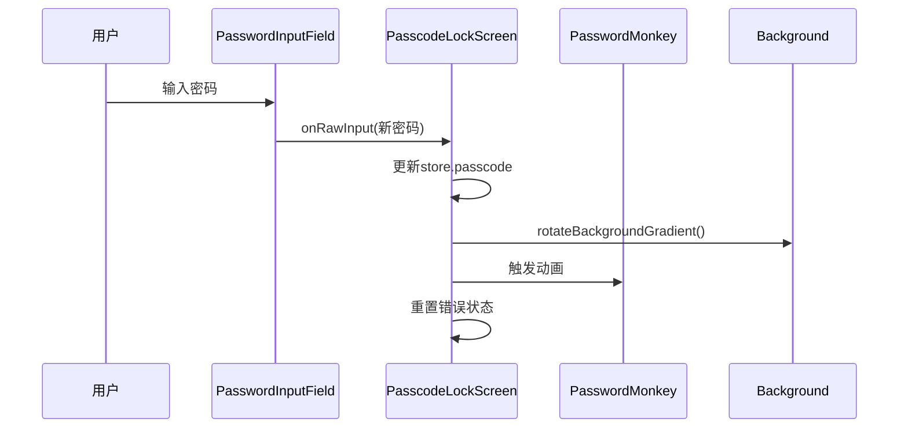
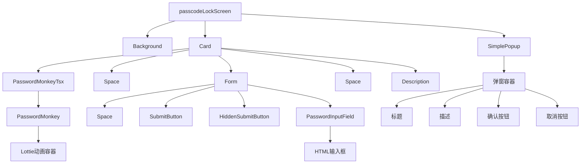

# 密码锁组件结构

<cite>
**本文档引用的文件**   
- [passcodeLockScreen.tsx](file://src/components/passcodeLock/passcodeLockScreen.tsx)
- [passcodeLockScreenController.tsx](file://src/components/passcodeLock/passcodeLockScreenController.tsx)
- [background.tsx](file://src/components/passcodeLock/background.tsx)
- [passwordMonkeyTsx.tsx](file://src/components/passcodeLock/passwordMonkeyTsx.tsx)
- [simplePopup.tsx](file://src/components/passcodeLock/simplePopup.tsx)
- [passwordInputField.ts](file://src/components/passwordInputField.ts)
- [password.ts](file://src/components/monkeys/password.ts)
- [passcodeLockScreen.module.scss](file://src/components/passcodeLock/passcodeLockScreen.module.scss)
- [passwordMonkeyTsx.module.scss](file://src/components/passcodeLock/passwordMonkeyTsx.module.scss)
</cite>

## 目录
1. [密码锁组件层次结构](#密码锁组件层次结构)
2. [核心子组件分析](#核心子组件分析)
3. [组件通信与状态管理](#组件通信与状态管理)
4. [组件树结构图](#组件树结构图)
5. [组件复用性与可扩展性](#组件复用性与可扩展性)
6. [Props接口定义与使用约束](#props接口定义与使用约束)

## 密码锁组件层次结构

密码锁UI组件采用分层架构设计，以`passcodeLockScreen`为核心容器组件，组织和协调各个子组件的工作。该组件作为密码锁功能的入口点，负责管理整体布局、状态流转和用户交互。其层次结构遵循单一职责原则，将不同的UI功能分解为独立的子组件。

`passcodeLockScreen`组件主要包含四个核心子组件：数字键盘（通过`PasswordInputField`实现）、密码输入框、状态指示器（通过`PasswordMonkeyTsx`实现）和背景组件（通过`Background`实现）。这些组件通过清晰的父子关系组织，形成一个完整的密码验证界面。主组件通过props向下传递必要的数据和回调函数，实现组件间的通信。

整个组件树的根节点是`passcodeLockScreen`，它位于`src/components/passcodeLock/`目录下，是密码锁功能的主视图组件。该组件不仅负责渲染UI，还集成了业务逻辑，如密码验证、尝试次数限制和解锁后的回调处理。其设计体现了关注点分离的原则，将UI渲染与业务逻辑处理有机结合。

**Section sources**
- [passcodeLockScreen.tsx](file://src/components/passcodeLock/passcodeLockScreen.tsx#L42-L252)

## 核心子组件分析

### 数字键盘与密码输入框

密码输入功能由`PasswordInputField`组件实现，该组件继承自基础的`InputField`，专门用于处理密码输入。它提供了安全的密码输入体验，包括输入掩码、焦点管理和输入验证等功能。在`passcodeLockScreen`中，该组件通过`InputFieldTsx`包装器被实例化，并通过`instanceRef`回调获取组件实例，以便主组件能够直接访问其内部方法和属性。

`PasswordInputField`的设计考虑了用户体验，支持键盘导航和快捷键操作。它通过`onRawInput`回调将输入值实时同步到主组件的状态存储中，确保密码数据的及时更新。同时，该组件还集成了错误处理机制，当用户输入错误密码时，可以通过`errorLabel`属性显示相应的错误信息。

### 状态指示器（密码猴子）

状态指示器以“密码猴子”（Password Monkey）的动画形式呈现，由`passwordMonkeyTsx`组件实现。该组件是一个动态的视觉反馈元素，通过Lottie动画展示密码输入的状态。它接收`passwordInputField`实例作为props，能够监听密码可见性切换等事件，并相应地播放不同的动画帧。

`PasswordMonkeyTsx`组件利用`createRenderEffect`在SolidJS的渲染周期中初始化`PasswordMonkey`类实例。该类负责加载和控制Lottie动画，根据密码输入框的状态（如密码显示/隐藏）触发动画的播放方向和目标帧。这种设计实现了UI状态与动画效果的紧密耦合，为用户提供直观的视觉反馈。

### 背景组件

背景组件由`background.tsx`文件实现，其主要职责是为密码锁界面提供动态的背景效果。该组件通过`ChatBackground`和`ChatBackgroundGradientRenderer`实现渐变背景的渲染。它仅在非移动设备（`ScreenSize.mobile`）上显示，体现了响应式设计的思想。

`Background`组件通过`gradientRendererRef`回调将内部的`ChatBackgroundGradientRenderer`实例暴露给父组件，使`passcodeLockScreen`能够控制背景渐变的动画。当用户输入密码时，主组件会调用`rotateBackgroundGradient`方法，触发动画更新，从而实现密码输入与背景变化的联动效果。

### 简单弹窗组件

`simplePopup`组件是一个通用的模态对话框，用于处理“忘记密码”时的登出确认操作。它使用`Portal`将弹窗渲染到DOM树的顶层，确保其始终位于其他内容之上。该组件实现了标准的弹窗行为，包括ESC键关闭、点击遮罩关闭和过渡动画。

弹窗通过`visible`属性控制显示状态，并接收`title`、`description`和`confirmButtonContent`等props来定制内容。其内部使用`Transition`组件实现进入和退出动画，提升了用户体验。两个按钮分别绑定`onConfirm`和`onClose`回调，实现了确认和取消操作的分离。

**Section sources**
- [passwordInputField.ts](file://src/components/passwordInputField.ts#L57-L100)
- [passwordMonkeyTsx.tsx](file://src/components/passcodeLock/passwordMonkeyTsx.tsx#L11-L54)
- [background.tsx](file://src/components/passcodeLock/background.tsx#L11-L30)
- [simplePopup.tsx](file://src/components/passcodeLock/simplePopup.tsx#L12-L83)
- [password.ts](file://src/components/monkeys/password.ts#L11-L69)

## 组件通信与状态管理

密码锁组件系统采用自上而下的单向数据流进行通信，结合回调函数实现子组件向父组件的事件传递。状态管理主要通过SolidJS的响应式系统实现，使用`createMutable`创建可变状态存储，确保状态变化能够自动触发UI更新。

`passcodeLockScreen`组件维护一个名为`store`的状态对象，其中包含`passcode`（当前输入的密码）、`isError`（输入错误状态）、`tooManyAttempts`（尝试次数过多状态）等关键状态。当用户在`PasswordInputField`中输入密码时，`onRawInput`回调会更新`store.passcode`，触发`createEffect`监听器执行。

**Diagram sources**
- [passcodeLockScreen.tsx](file://src/components/passcodeLock/passcodeLockScreen.tsx#L113-L118)
- [passwordMonkeyTsx.tsx](file://src/components/passcodeLock/passwordMonkeyTsx.tsx#L24-L32)
- [background.tsx](file://src/components/passcodeLock/background.tsx#L23-L24)

当用户点击提交按钮时，`onSubmit`方法会启动密码验证流程。该方法首先检查是否允许尝试（`canAttempt`），然后调用`isMyPasscode`验证密码。验证成功则调用`props.onUnlock`回调解锁；失败则增加尝试次数计数器，并在超过最大尝试次数后锁定一段时间。

组件间的通信还体现在动画协同上。例如，当从锁图标进入密码锁界面时，`fromLockIcon` props会触发一个动画序列：锁图标首先移动到猴子位置，然后消失，同时猴子从隐藏状态变为可见。这一系列动画通过CSS类和`pause`函数精确控制时间，实现了流畅的视觉过渡。

**Section sources**
- [passcodeLockScreen.tsx](file://src/components/passcodeLock/passcodeLockScreen.tsx#L127-L168)
- [passcodeLockScreenController.tsx](file://src/components/passcodeLock/passcodeLockScreenController.tsx#L93-L131)

## 组件树结构图

**Diagram sources**
- [passcodeLockScreen.tsx](file://src/components/passcodeLock/passcodeLockScreen.tsx#L191-L248)

## 组件复用性与可扩展性

密码锁组件系统在设计上充分考虑了复用性和可扩展性。`simplePopup`组件是一个典型的可复用组件，它不包含任何与密码锁相关的业务逻辑，仅提供通用的模态对话框功能，可以在应用的其他部分被广泛使用。

`PasswordMonkeyTsx`组件也具有良好的复用潜力。虽然目前它与密码输入框紧密耦合，但其核心功能——控制Lottie动画——是通用的。通过抽象动画控制逻辑，该组件可以被改造为一个通用的动画播放器，用于展示各种Lottie动画。

系统的可扩展性体现在其模块化设计上。例如，背景组件的实现可以轻松替换为其他视觉效果，只需保持`gradientRendererRef`接口不变。同样，密码输入验证逻辑被封装在`usePasscodeActions` hook中，可以独立于UI组件进行修改和扩展。

`passcodeLockScreenController`类提供了对密码锁功能的程序化控制，使得该功能可以被灵活地集成到不同的应用场景中。例如，它支持从锁图标动画进入，也支持直接显示，这种灵活性增强了组件的适应性。

**Section sources**
- [simplePopup.tsx](file://src/components/passcodeLock/simplePopup.tsx#L12-L83)
- [passcodeLockScreenController.tsx](file://src/components/passcodeLock/passcodeLockScreenController.tsx#L15-L179)

## Props接口定义与使用约束

`passcodeLockScreen`组件定义了清晰的props接口，主要包括：
- `onUnlock`: Function - 解锁成功后的回调函数，必填
- `fromLockIcon`: HTMLElement | undefined - 触发动画的锁图标元素，可选
- `onAnimationEnd`: Function | undefined - 动画结束后的回调函数，可选

`PasswordMonkeyTsx`组件的props接口包括：
- `ref`: Ref<HTMLDivElement> - 用于获取组件根元素的引用，可选
- `passwordInputField`: PasswordInputField - 密码输入框实例，必填
- `hidden`: boolean - 是否隐藏猴子，可选
- `size`: number - 猴子的尺寸，可选，默认100

`Background`组件仅有一个`gradientRendererRef`回调props，用于将内部渲染器实例传递给父组件。

`simplePopup`组件的props设计更为丰富，包括`visible`（显示状态）、`title`、`description`、`confirmButtonContent`等显示内容，以及`onClose`和`onConfirm`回调函数。

使用这些组件时需遵守以下约束：
1. `passcodeLockScreen`必须在解锁后调用`onUnlock`，否则应用将保持锁定状态
2. `PasswordMonkeyTsx`必须在挂载后立即加载动画资源，避免出现空白
3. `simplePopup`的`onConfirm`回调执行后，通常需要关闭弹窗（通过设置`visible`为false）
4. 所有涉及异步操作的方法（如`onSubmit`）必须妥善处理加载状态，防止重复提交

**Section sources**
- [passcodeLockScreen.tsx](file://src/components/passcodeLock/passcodeLockScreen.tsx#L42-L46)
- [passwordMonkeyTsx.tsx](file://src/components/passcodeLock/passwordMonkeyTsx.tsx#L11-L16)
- [background.tsx](file://src/components/passcodeLock/background.tsx#L11-L12)
- [simplePopup.tsx](file://src/components/passcodeLock/simplePopup.tsx#L12-L21)