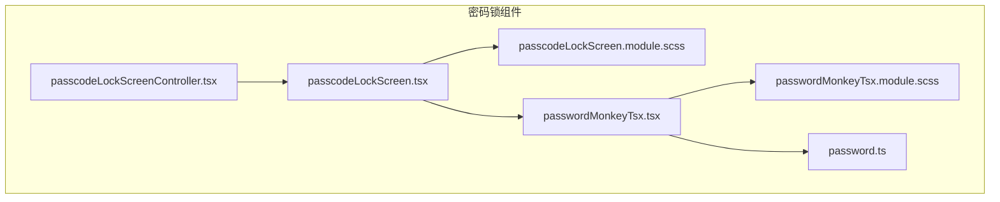
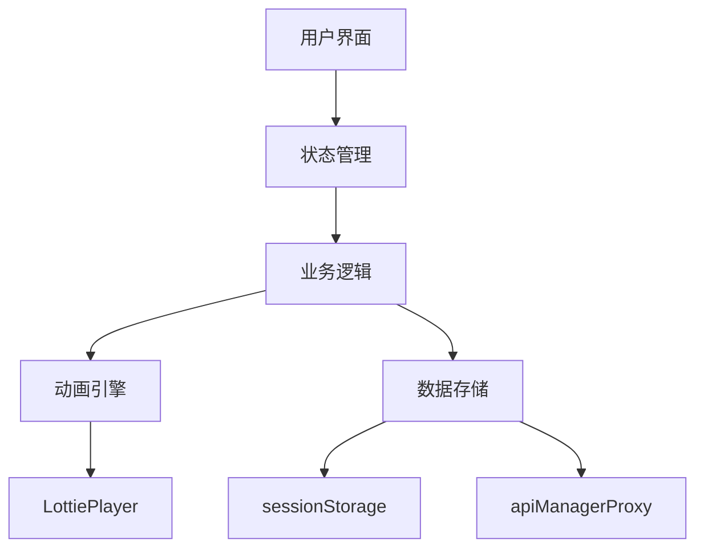
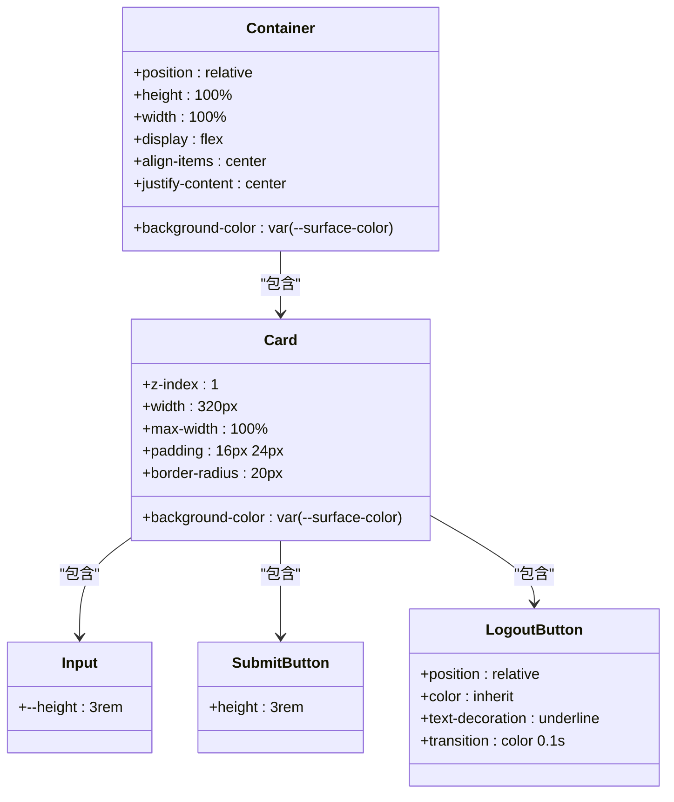
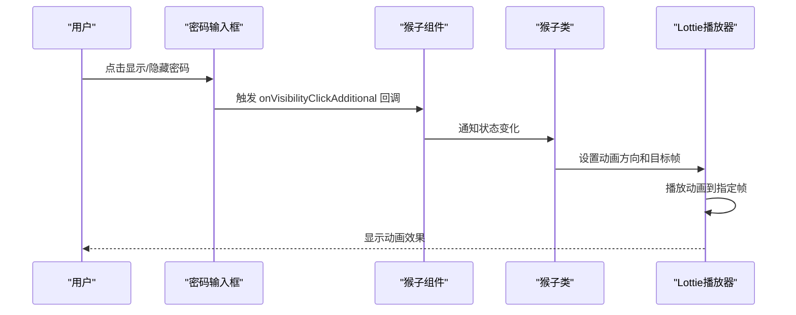
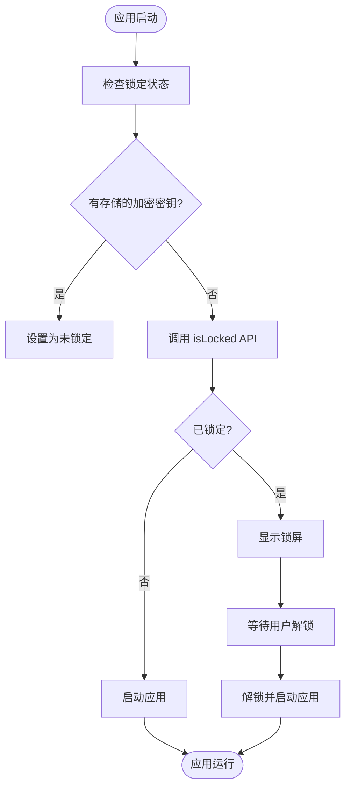
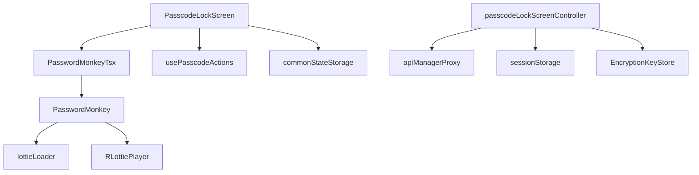

# 样式设计与动画效果

<cite>
**本文档引用的文件**  
- [passcodeLockScreen.module.scss](file://src/components/passcodeLock/passcodeLockScreen.module.scss)
- [passcodeLockScreen.tsx](file://src/components/passcodeLock/passcodeLockScreen.tsx)
- [passcodeLockScreenController.tsx](file://src/components/passcodeLock/passcodeLockScreenController.tsx)
- [passwordMonkeyTsx.module.scss](file://src/components/passcodeLock/passwordMonkeyTsx.module.scss)
- [passwordMonkeyTsx.tsx](file://src/components/passcodeLock/passwordMonkeyTsx.tsx)
- [password.ts](file://src/components/monkeys/password.ts)
- [variables.scss](file://src/scss/variables.scss)
- [mixins.scss](file://src/scss/mixins.scss)
- [mixins/_respondTo.scss](file://src/scss/mixins/_respondTo.scss)
- [mixins/_animationLevel.scss](file://src/scss/mixins/_animationLevel.scss)
- [passcodeLockScreen-Bd_62FBh.css](file://public/passcodeLockScreen-Bd_62FBh.css)
</cite>

## 目录
1. [简介](#简介)
2. [项目结构](#项目结构)
3. [核心组件](#核心组件)
4. [架构概述](#架构概述)
5. [详细组件分析](#详细组件分析)
6. [依赖分析](#依赖分析)
7. [性能考量](#性能考量)
8. [故障排除指南](#故障排除指南)
9. [结论](#结论)

## 简介
本文档全面记录密码锁界面的样式设计与动画实现机制。重点分析SCSS样式表的结构、关键样式规则、动画效果实现方式、主题适配机制、CSS类名命名规范以及样式复用策略。文档还详细说明了关键动画的时间函数和持续时间参数，并解释其用户体验设计考量。

## 项目结构
密码锁功能的实现主要集中在 `src/components/passcodeLock` 目录下，其样式文件采用SCSS模块化设计，并与JavaScript/TypeScript组件紧密配合。核心文件包括样式表、主屏幕组件、控制器和动画猴子组件。

**Diagram sources**
- [passcodeLockScreen.tsx](file://src/components/passcodeLock/passcodeLockScreen.tsx)
- [passcodeLockScreen.module.scss](file://src/components/passcodeLock/passcodeLockScreen.module.scss)
- [passcodeLockScreenController.tsx](file://src/components/passcodeLock/passcodeLockScreenController.tsx)
- [passwordMonkeyTsx.tsx](file://src/components/passcodeLock/passwordMonkeyTsx.tsx)
- [passwordMonkeyTsx.module.scss](file://src/components/passcodeLock/passwordMonkeyTsx.module.scss)
- [password.ts](file://src/components/monkeys/password.ts)

**Section sources**
- [passcodeLockScreen.module.scss](file://src/components/passcodeLock/passcodeLockScreen.module.scss)
- [passcodeLockScreen.tsx](file://src/components/passcodeLock/passcodeLockScreen.tsx)
- [passcodeLockScreenController.tsx](file://src/components/passcodeLock/passcodeLockScreenController.tsx)

## 核心组件
密码锁的核心组件包括主屏幕组件 `PasscodeLockScreen`、控制器 `PasscodeLockScreenController` 和动画猴子组件 `PasswordMonkeyTsx`。这些组件共同协作，实现了密码输入、验证、动画反馈和状态管理的完整流程。

**Section sources**
- [passcodeLockScreen.tsx](file://src/components/passcodeLock/passcodeLockScreen.tsx)
- [passcodeLockScreenController.tsx](file://src/components/passcodeLock/passcodeLockScreenController.tsx)
- [passwordMonkeyTsx.tsx](file://src/components/passcodeLock/passwordMonkeyTsx.tsx)

## 架构概述
密码锁的架构采用分层设计，上层为UI组件，中层为状态管理与业务逻辑，底层为动画引擎和数据存储。UI组件负责渲染和用户交互，控制器负责协调应用状态，动画组件则通过Lottie引擎实现复杂的视觉效果。

**Diagram sources**
- [passcodeLockScreen.tsx](file://src/components/passcodeLock/passcodeLockScreen.tsx)
- [passcodeLockScreenController.tsx](file://src/components/passcodeLock/passcodeLockScreenController.tsx)
- [password.ts](file://src/components/monkeys/password.ts)
- [lib/rlottie/rlottiePlayer.ts](file://src/lib/rlottie/rlottiePlayer.ts)
- [lib/sessionStorage.ts](file://src/lib/sessionStorage.ts)

## 详细组件分析

### 主屏幕组件分析
`PasscodeLockScreen` 组件是密码锁的入口，负责渲染输入表单、处理用户输入和管理错误状态。它通过 `createMutable` 创建一个响应式状态存储，用于跟踪密码输入、错误状态和尝试次数。

#### 样式规则分析

**Diagram sources**
- [passcodeLockScreen.module.scss](file://src/components/passcodeLock/passcodeLockScreen.module.scss)

**Section sources**
- [passcodeLockScreen.module.scss](file://src/components/passcodeLock/passcodeLockScreen.module.scss)
- [passcodeLockScreen.tsx](file://src/components/passcodeLock/passcodeLockScreen.tsx)

### 动画猴子组件分析
`PasswordMonkeyTsx` 组件负责显示一个会动的猴子动画，该动画会根据密码输入框的可见性状态做出反应。

#### 动画实现分析

**Diagram sources**
- [passwordMonkeyTsx.tsx](file://src/components/passcodeLock/passwordMonkeyTsx.tsx)
- [password.ts](file://src/components/monkeys/password.ts)

**Section sources**
- [passwordMonkeyTsx.module.scss](file://src/components/passcodeLock/passwordMonkeyTsx.module.scss)
- [passwordMonkeyTsx.tsx](file://src/components/passcodeLock/passwordMonkeyTsx.tsx)
- [password.ts](file://src/components/monkeys/password.ts)

### 控制器组件分析
`PasscodeLockScreenController` 是一个静态工具类，负责管理密码锁的全局状态，包括锁定、解锁和跨标签页同步。

#### 状态管理流程

**Diagram sources**
- [passcodeLockScreenController.tsx](file://src/components/passcodeLock/passcodeLockScreenController.tsx)

**Section sources**
- [passcodeLockScreenController.tsx](file://src/components/passcodeLock/passcodeLockScreenController.tsx)

## 依赖分析
密码锁组件依赖于多个核心库和工具，包括Lottie动画引擎、状态管理、API代理和会话存储。

**Diagram sources**
- [passcodeLockScreen.tsx](file://src/components/passcodeLock/passcodeLockScreen.tsx)
- [passcodeLockScreenController.tsx](file://src/components/passcodeLock/passcodeLockScreenController.tsx)
- [passwordMonkeyTsx.tsx](file://src/components/passcodeLock/passwordMonkeyTsx.tsx)
- [password.ts](file://src/components/monkeys/password.ts)

**Section sources**
- [passcodeLockScreen.tsx](file://src/components/passcodeLock/passcodeLockScreen.tsx)
- [passcodeLockScreenController.tsx](file://src/components/passcodeLock/passcodeLockScreenController.tsx)
- [password.ts](file://src/components/monkeys/password.ts)

## 性能考量
密码锁的实现考虑了多个性能因素。动画使用Lottie引擎进行硬件加速渲染，确保流畅性。状态管理采用响应式设计，最小化不必要的重渲染。网络请求通过代理进行优化，减少延迟。

## 故障排除指南
当密码锁功能出现问题时，应首先检查以下方面：
1. 确认 `passcodeLockScreen-Bd_62FBh.css` 样式表已正确加载
2. 检查Lottie动画资源 `TwoFactorSetupMonkeyPeek` 是否可访问
3. 验证 `apiManagerProxy` 是否正常工作
4. 确认 `sessionStorage` 中的加密密钥是否正确存储

**Section sources**
- [passcodeLockScreenController.tsx](file://src/components/passcodeLock/passcodeLockScreenController.tsx)
- [password.ts](file://src/components/monkeys/password.ts)

## 结论
密码锁的样式设计与动画实现体现了模块化、响应式和高性能的设计原则。通过SCSS变量和混入实现主题适配，利用Lottie引擎提供生动的动画反馈，结合SolidJS的响应式系统实现高效的状态管理。整个系统设计精巧，既保证了用户体验，又确保了代码的可维护性和可扩展性。