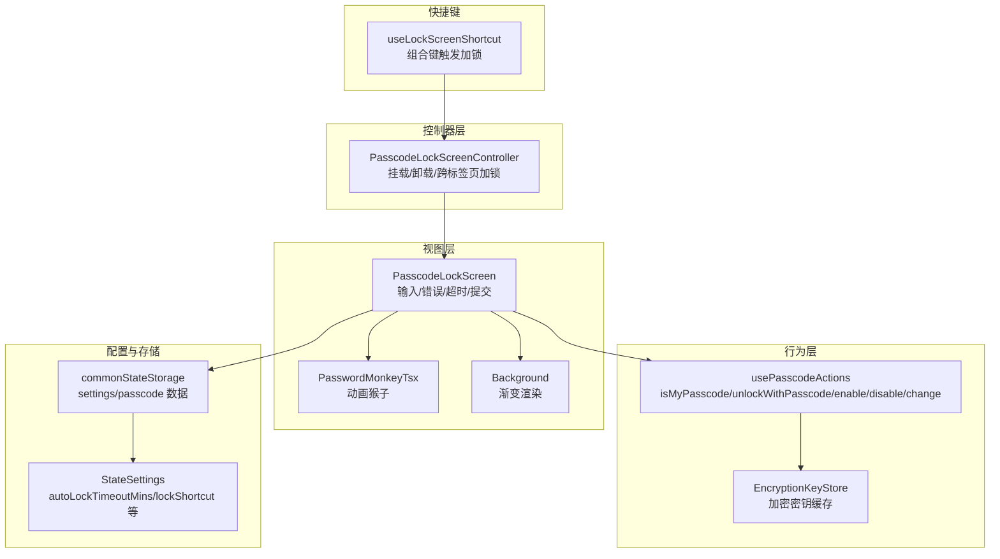
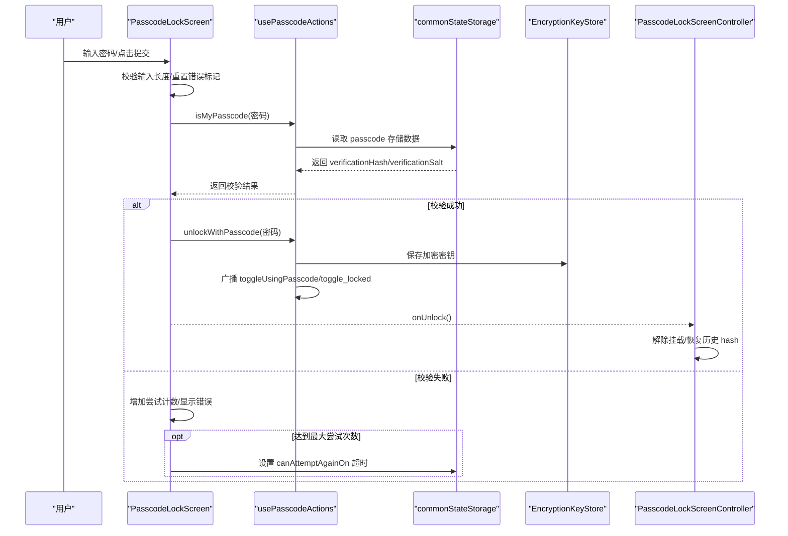
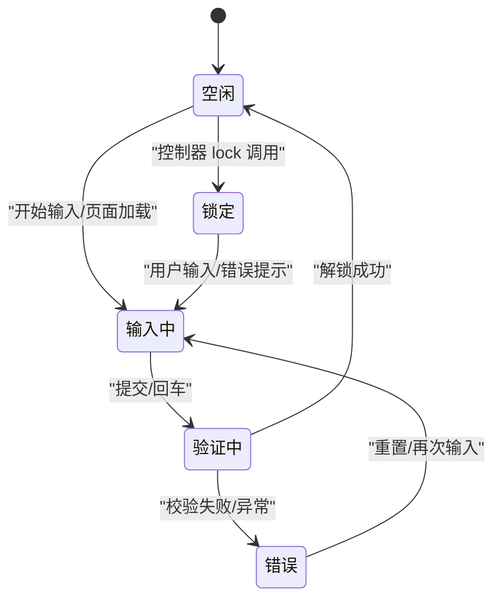
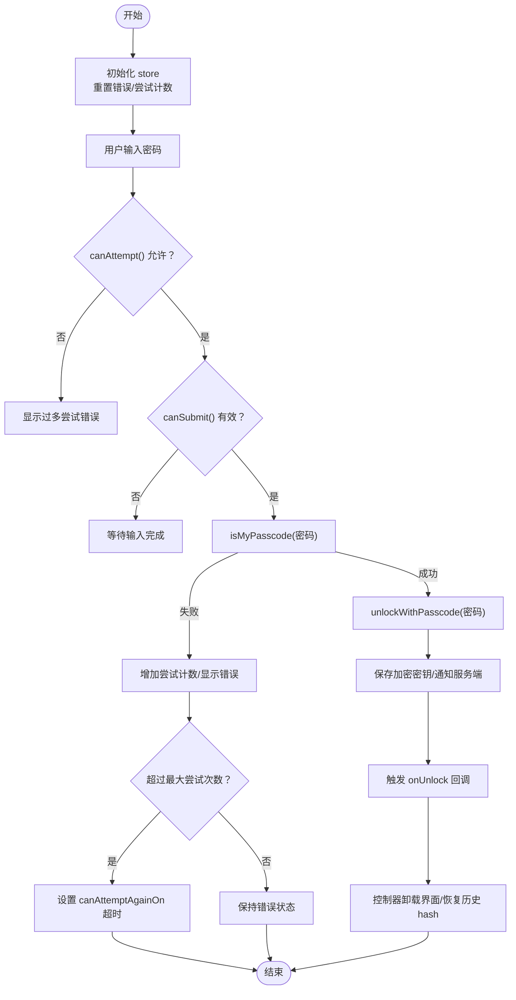
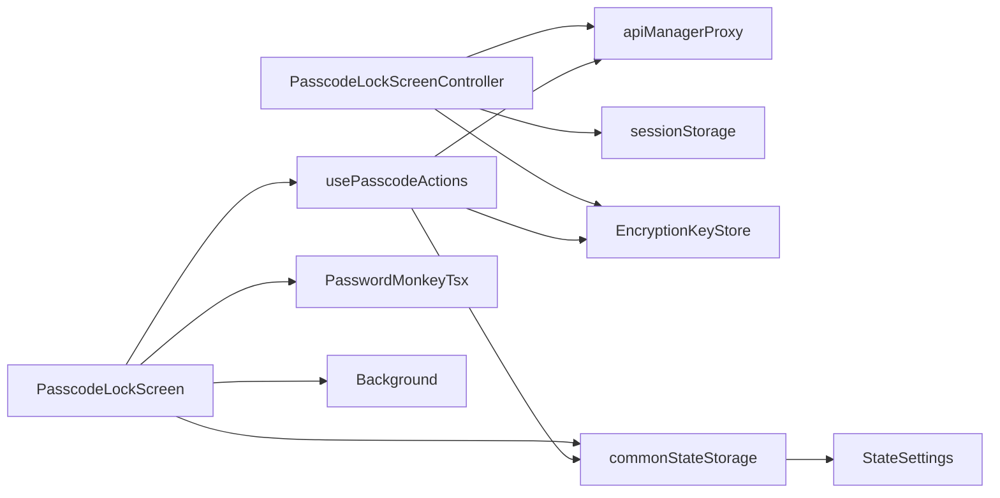

# 密码锁状态机设计

<cite>
**本文引用的文件列表**
- [passcodeLockScreenController.tsx](file://src/components/passcodeLock/passcodeLockScreenController.tsx)
- [passcodeLockScreen.tsx](file://src/components/passcodeLock/passcodeLockScreen.tsx)
- [passwordMonkeyTsx.tsx](file://src/components/passcodeLock/passwordMonkeyTsx.tsx)
- [actions.ts](file://src/lib/passcode/actions.ts)
- [constants.ts](file://src/lib/passcode/constants.ts)
- [keyStore.ts](file://src/lib/passcode/keyStore.ts)
- [commonStateStorage.ts](file://src/lib/commonStateStorage.ts)
- [state.ts](file://src/config/state.ts)
- [useLockScreenShortcut.ts](file://src/lib/appManagers/utils/useLockScreenShortcut.ts)
- [passcodeLockScreen.module.scss](file://src/components/passcodeLock/passcodeLockScreen.module.scss)
</cite>

## 目录
1. [引言](#引言)
2. [项目结构](#项目结构)
3. [核心组件](#核心组件)
4. [架构总览](#架构总览)
5. [详细组件分析](#详细组件分析)
6. [依赖关系分析](#依赖关系分析)
7. [性能考量](#性能考量)
8. [故障排查指南](#故障排查指南)
9. [结论](#结论)

## 引言
本文件系统性记录并解析密码锁状态机的设计与实现，重点覆盖以下方面：
- 状态机的状态定义与转换条件：空闲、输入中、验证中、错误、锁定
- 事件驱动机制：用户输入事件、验证结果事件、超时事件
- 副作用管理：UI 更新、错误提示、安全策略执行
- 可视化状态图与 Solid.js 响应式系统的状态同步方式
- 实际代码示例路径，帮助定位关键实现位置

## 项目结构
密码锁相关功能主要分布在以下模块：
- 控制器层：负责挂载/卸载锁屏界面、跨标签页加锁、应用启动等待等
- 视图层：密码锁界面、动画猴子、背景渐变渲染
- 行为层：密码校验、解锁、启用/禁用/修改密码、加密密钥存储
- 配置与存储：全局设置、本地状态存储、延迟初始化标志

图表来源
- [passcodeLockScreenController.tsx](file://src/components/passcodeLock/passcodeLockScreenController.tsx#L1-L180)
- [passcodeLockScreen.tsx](file://src/components/passcodeLock/passcodeLockScreen.tsx#L1-L252)
- [passwordMonkeyTsx.tsx](file://src/components/passcodeLock/passwordMonkeyTsx.tsx#L1-L54)
- [actions.ts](file://src/lib/passcode/actions.ts#L1-L169)
- [keyStore.ts](file://src/lib/passcode/keyStore.ts#L1-L39)
- [commonStateStorage.ts](file://src/lib/commonStateStorage.ts#L1-L49)
- [state.ts](file://src/config/state.ts#L106-L115)
- [useLockScreenShortcut.ts](file://src/lib/appManagers/utils/useLockScreenShortcut.ts#L1-L98)

章节来源
- [passcodeLockScreenController.tsx](file://src/components/passcodeLock/passcodeLockScreenController.tsx#L1-L180)
- [passcodeLockScreen.tsx](file://src/components/passcodeLock/passcodeLockScreen.tsx#L1-L252)
- [actions.ts](file://src/lib/passcode/actions.ts#L1-L169)
- [commonStateStorage.ts](file://src/lib/commonStateStorage.ts#L1-L49)
- [state.ts](file://src/config/state.ts#L106-L115)
- [useLockScreenShortcut.ts](file://src/lib/appManagers/utils/useLockScreenShortcut.ts#L1-L98)

## 核心组件
- PasscodeLockScreenController：负责在需要时挂载密码锁界面，控制动画入场/出场，以及跨标签页加锁；同时维护应用启动等待逻辑
- PasscodeLockScreen：负责用户交互、输入状态、错误提示、尝试次数限制与超时策略、提交验证、登出弹窗等
- usePasscodeActions：封装密码相关操作，包括校验、解锁、启用/禁用/修改密码、加密密钥保存与传播
- EncryptionKeyStore：在内存中缓存当前会话使用的加密密钥，供后续使用
- commonStateStorage：持久化存储 passcode 相关数据（校验哈希、盐值、加密盐），以及 settings 中的 passcode 配置
- StateSettings：定义 passcode 的自动锁间隔、快捷键开关与组合键、失败冷却时间等
- useLockScreenShortcut：监听组合键触发加锁，调用控制器进行加锁并广播状态变化

章节来源
- [passcodeLockScreenController.tsx](file://src/components/passcodeLock/passcodeLockScreenController.tsx#L1-L180)
- [passcodeLockScreen.tsx](file://src/components/passcodeLock/passcodeLockScreen.tsx#L1-L252)
- [actions.ts](file://src/lib/passcode/actions.ts#L1-L169)
- [keyStore.ts](file://src/lib/passcode/keyStore.ts#L1-L39)
- [commonStateStorage.ts](file://src/lib/commonStateStorage.ts#L1-L49)
- [state.ts](file://src/config/state.ts#L106-L115)
- [useLockScreenShortcut.ts](file://src/lib/appManagers/utils/useLockScreenShortcut.ts#L1-L98)

## 架构总览
密码锁状态机由“控制器 + 视图 + 行为 + 存储 + 快捷键”构成，采用事件驱动与 Solid.js 响应式系统协同工作：
- 用户事件：键盘输入、按钮点击、表单提交
- 验证事件：isMyPasscode 返回结果、unlockWithPasscode 成功或失败
- 超时事件：尝试次数超过阈值后，设置 settings.passcode.canAttemptAgainOn，后续可恢复
- 副作用：UI 提示、动画、登出弹窗、跨标签页加锁、加密密钥保存、状态广播

图表来源
- [passcodeLockScreen.tsx](file://src/components/passcodeLock/passcodeLockScreen.tsx#L111-L195)
- [actions.ts](file://src/lib/passcode/actions.ts#L81-L160)
- [commonStateStorage.ts](file://src/lib/commonStateStorage.ts#L1-L49)
- [keyStore.ts](file://src/lib/passcode/keyStore.ts#L1-L39)
- [passcodeLockScreenController.tsx](file://src/components/passcodeLock/passcodeLockScreenController.tsx#L146-L176)

## 详细组件分析

### 状态机状态与转换
- 空闲：未挂载密码锁界面，应用可正常运行
- 输入中：用户正在输入密码，界面显示输入框与错误提示区域
- 验证中：提交后进入异步校验阶段，期间禁止重复提交
- 错误：校验失败或达到最大尝试次数，显示相应错误文案
- 锁定：控制器挂载密码锁界面，执行入场动画，阻止应用继续启动

状态转换条件与触发点：
- 从空闲到输入中：用户开始输入或页面加载后聚焦输入框
- 从输入中到验证中：用户点击提交或按下回车
- 从验证中到错误：isMyPasscode 返回失败或异常
- 从验证中到空闲：unlockWithPasscode 成功，触发 onUnlock 回调
- 从空闲到锁定：控制器 lock 被调用（快捷键、跨标签页加锁等）

图表来源
- [passcodeLockScreen.tsx](file://src/components/passcodeLock/passcodeLockScreen.tsx#L111-L195)
- [passcodeLockScreenController.tsx](file://src/components/passcodeLock/passcodeLockScreenController.tsx#L83-L176)

章节来源
- [passcodeLockScreen.tsx](file://src/components/passcodeLock/passcodeLockScreen.tsx#L111-L195)
- [passcodeLockScreenController.tsx](file://src/components/passcodeLock/passcodeLockScreenController.tsx#L83-L176)

### 事件驱动机制
- 用户输入事件
  - 输入框实时更新 store.passcode，触发 createEffect 旋转背景渐变并清除错误标记
  - 键盘事件监听，当焦点不在输入框时自动聚焦输入框
- 验证结果事件
  - onSubmit 内部根据 canAttempt 与 canSubmit 判断是否允许提交
  - isMyPasscode 返回真时调用 unlockWithPasscode 并触发 onUnlock
- 超时事件
  - 尝试次数超过阈值后，写入 settings.passcode.canAttemptAgainOn，后续 canAttempt 会在超时后放行

章节来源
- [passcodeLockScreen.tsx](file://src/components/passcodeLock/passcodeLockScreen.tsx#L99-L195)
- [actions.ts](file://src/lib/passcode/actions.ts#L81-L160)
- [state.ts](file://src/config/state.ts#L106-L115)

### 副作用管理
- UI 更新
  - 输入框错误文案根据 tooManyAttempts/isError 动态切换
  - 登出弹窗可见性受 store.isLogoutPopupOpen 控制
  - 背景渐变旋转与动画猴子出场/隐藏
- 安全策略执行
  - 最大尝试次数与冷却时间：超过阈值后设置 canAttemptAgainOn
  - 加密密钥保存：unlockWithPasscode 后保存到 EncryptionKeyStore 并通知服务端
  - 跨标签页加锁：控制器 lockOtherTabs 与 toggleLockOthers
- 应用启动等待
  - 控制器在锁定状态下阻塞应用启动，解锁后 resolve 等待

章节来源
- [passcodeLockScreen.tsx](file://src/components/passcodeLock/passcodeLockScreen.tsx#L111-L248)
- [actions.ts](file://src/lib/passcode/actions.ts#L142-L160)
- [keyStore.ts](file://src/lib/passcode/keyStore.ts#L1-L39)
- [passcodeLockScreenController.tsx](file://src/components/passcodeLock/passcodeLockScreenController.tsx#L55-L77)

### Solid.js 响应式系统与状态同步
- 使用 createMutable 维护界面状态（isMonkeyHidden/isError/tooManyAttempts/passcode/isLogoutPopupOpen）
- 使用 createEffect/on 监听 store.passcode 变化，节流旋转背景渐变
- 使用 createResource 获取账户总数与设置项，用于 UI 文案与快捷键开关
- 使用 createSignal/createResource 监听设置项变化，动态更新快捷键监听
- 控制器通过 dispatchEvent 广播 toggle_locked，视图层监听并更新内部状态

章节来源
- [passcodeLockScreen.tsx](file://src/components/passcodeLock/passcodeLockScreen.tsx#L28-L62)
- [useLockScreenShortcut.ts](file://src/lib/appManagers/utils/useLockScreenShortcut.ts#L1-L98)
- [passcodeLockScreen.module.scss](file://src/components/passcodeLock/passcodeLockScreen.module.scss#L1-L66)

### 关键流程图：提交与解锁

图表来源
- [passcodeLockScreen.tsx](file://src/components/passcodeLock/passcodeLockScreen.tsx#L111-L195)
- [actions.ts](file://src/lib/passcode/actions.ts#L142-L160)
- [commonStateStorage.ts](file://src/lib/commonStateStorage.ts#L1-L49)
- [passcodeLockScreenController.tsx](file://src/components/passcodeLock/passcodeLockScreenController.tsx#L146-L176)

## 依赖关系分析
- PasscodeLockScreenController 依赖：
  - apiManagerProxy：与后台通信（保存加密密钥、切换使用密码、跨标签页加锁）
  - sessionStorage：临时存储加密密钥
  - EncryptionKeyStore：保存/导出加密密钥
  - appNavigationController：恢复历史 hash
- PasscodeLockScreen 依赖：
  - usePasscodeActions：isMyPasscode/unlockWithPasscode
  - commonStateStorage：读取/写入 settings.passcode
  - PasswordMonkeyTsx：动画猴子
  - Background：渐变背景
- usePasscodeActions 依赖：
  - commonStateStorage：读取/写入 passcode 数据
  - apiManagerProxy：切换使用密码、保存加密密钥、清理缓存
  - EncryptionKeyStore：保存加密密钥
- EncryptionKeyStore 依赖：
  - crypto.subtle：导入/导出密钥
- StateSettings 与 commonStateStorage：
  - 定义并持久化 passcode 配置（启用、自动锁、快捷键、冷却时间）

图表来源
- [passcodeLockScreenController.tsx](file://src/components/passcodeLock/passcodeLockScreenController.tsx#L1-L180)
- [passcodeLockScreen.tsx](file://src/components/passcodeLock/passcodeLockScreen.tsx#L1-L252)
- [actions.ts](file://src/lib/passcode/actions.ts#L1-L169)
- [commonStateStorage.ts](file://src/lib/commonStateStorage.ts#L1-L49)
- [state.ts](file://src/config/state.ts#L106-L115)

章节来源
- [passcodeLockScreenController.tsx](file://src/components/passcodeLock/passcodeLockScreenController.tsx#L1-L180)
- [passcodeLockScreen.tsx](file://src/components/passcodeLock/passcodeLockScreen.tsx#L1-L252)
- [actions.ts](file://src/lib/passcode/actions.ts#L1-L169)
- [commonStateStorage.ts](file://src/lib/commonStateStorage.ts#L1-L49)
- [state.ts](file://src/config/state.ts#L106-L115)

## 性能考量
- 节流与防抖：背景渐变旋转使用 throttle，减少高频重绘
- 防重复提交：isSubmiting 标志避免并发提交
- 按需渲染：动画猴子按需加载，未加载时显示占位图
- 缓存与延迟初始化：EncryptionKeyStore 与 DeferredIsUsingPasscode 在需要时才解析，降低启动开销
- 资源清理：组件卸载时重置输入框值，移除事件监听

[本节为通用建议，不直接分析具体文件]

## 故障排查指南
- 解锁后仍提示错误
  - 检查 isMyPasscode 是否返回真，确认 verificationHash/verificationSalt 是否正确写入
  - 确认 unlockWithPasscode 是否成功保存加密密钥并通知服务端
- 多次尝试后无法再次尝试
  - 检查 settings.passcode.canAttemptAgainOn 是否已设置且尚未到期
- 快捷键无效
  - 确认 settings.passcode.enabled/lockShortcutEnabled 为真，且组合键匹配
  - 检查 useLockScreenShortcut 是否已注册监听并触发控制器 lock
- 页面卡在锁定状态
  - 确认控制器 unlock 是否被调用，onUnlock 回调是否触发，历史 hash 是否恢复

章节来源
- [passcodeLockScreen.tsx](file://src/components/passcodeLock/passcodeLockScreen.tsx#L111-L195)
- [actions.ts](file://src/lib/passcode/actions.ts#L81-L160)
- [useLockScreenShortcut.ts](file://src/lib/appManagers/utils/useLockScreenShortcut.ts#L1-L98)
- [passcodeLockScreenController.tsx](file://src/components/passcodeLock/passcodeLockScreenController.tsx#L146-L176)

## 结论
该密码锁状态机以清晰的状态划分与事件驱动为核心，结合 Solid.js 响应式系统实现 UI 与业务逻辑的解耦。通过统一的控制器与行为层，实现了从输入、验证、错误处理到安全策略与跨标签页协作的完整闭环。建议在扩展新功能时遵循现有模式：将 UI 状态收敛于 createMutable，将业务逻辑收敛于 usePasscodeActions，将持久化与配置收敛于 commonStateStorage 与 StateSettings，确保状态一致性与可维护性。