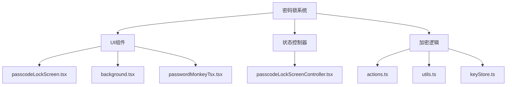
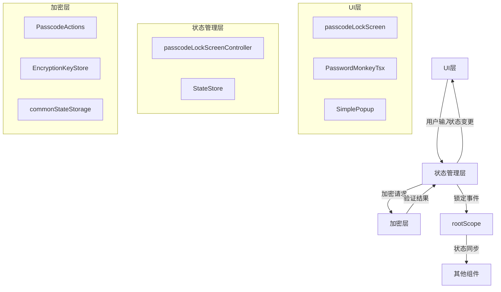
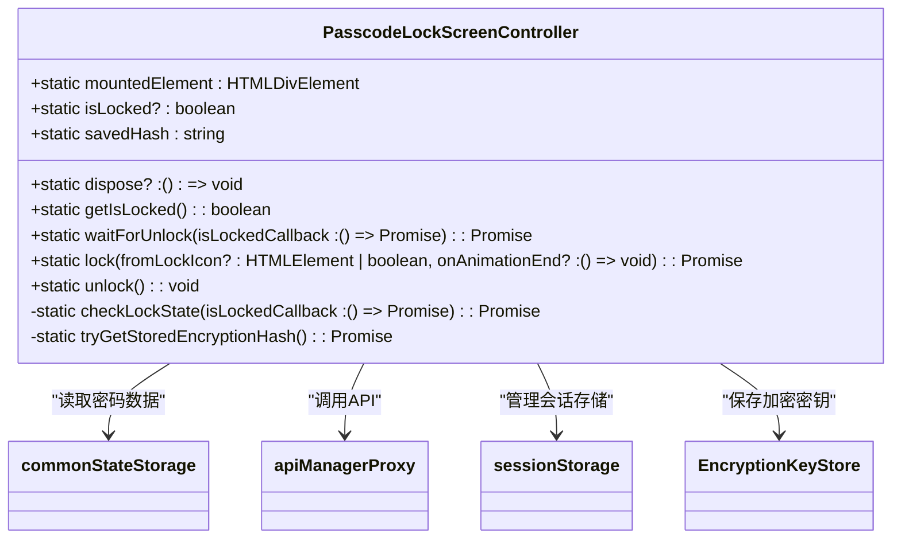
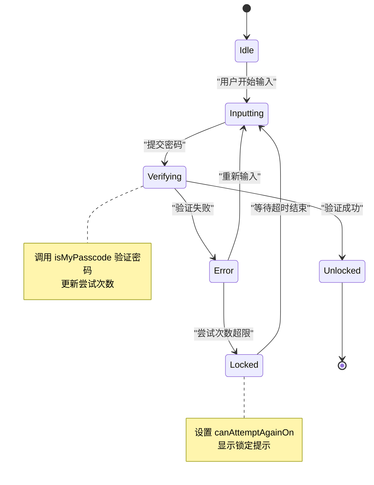
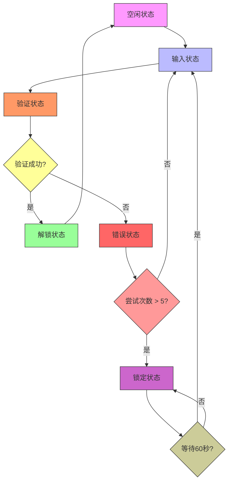
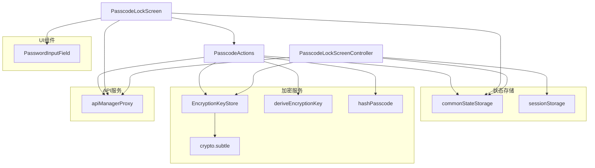

# 密码锁状态管理

<cite>
**本文档中引用的文件**  
- [passcodeLockScreenController.tsx](file://src/components/passcodeLock/passcodeLockScreenController.tsx)
- [passcodeLockScreen.tsx](file://src/components/passcodeLock/passcodeLockScreen.tsx)
- [actions.ts](file://src/lib/passcode/actions.ts)
- [constants.ts](file://src/lib/passcode/constants.ts)
- [keyStore.ts](file://src/lib/passcode/keyStore.ts)
- [commonStateStorage.ts](file://src/lib/commonStateStorage.ts)
- [utils.ts](file://src/lib/passcode/utils.ts)
- [lockButton.tsx](file://src/components/sidebarLeft/lockButton.tsx)
</cite>

## 目录
1. [简介](#简介)
2. [项目结构](#项目结构)
3. [核心组件](#核心组件)
4. [架构概述](#架构概述)
5. [详细组件分析](#详细组件分析)
6. [依赖分析](#依赖分析)
7. [性能考虑](#性能考虑)
8. [故障排除指南](#故障排除指南)
9. [结论](#结论)

## 简介
本文档详细记录了密码锁系统的状态管理机制。系统通过 `passcodeLockScreenController` 管理密码输入状态、错误计数和锁定状态，实现安全的用户认证流程。状态管理涵盖空闲、输入中、验证中、错误和锁定等状态，并通过持久化策略确保状态在页面刷新后仍可恢复。跨组件状态同步机制确保主界面与密码锁界面状态一致。系统包含完善的错误处理流程，包括尝试次数限制、延迟机制和账户锁定策略。同时提供扩展点和自定义配置选项，支持未来功能扩展。

## 项目结构
密码锁功能主要位于 `src/components/passcodeLock` 目录下，相关状态管理逻辑分布在 `src/lib/passcode` 目录中。系统采用模块化设计，将UI组件、状态控制器和加密逻辑分离。

**图示来源**  
- [passcodeLockScreen.tsx](file://src/components/passcodeLock/passcodeLockScreen.tsx)
- [passcodeLockScreenController.tsx](file://src/components/passcodeLock/passcodeLockScreenController.tsx)
- [actions.ts](file://src/lib/passcode/actions.ts)

**本节来源**  
- [src/components/passcodeLock](file://src/components/passcodeLock)
- [src/lib/passcode](file://src/lib/passcode)

## 核心组件
密码锁系统的核心组件包括 `passcodeLockScreenController`（状态控制器）、`passcodeLockScreen`（UI组件）和 `actions`（业务逻辑）。`passcodeLockScreenController` 负责管理全局锁定状态，`passcodeLockScreen` 处理用户交互和输入验证，`actions` 模块提供密码验证和加密功能。这些组件通过事件和状态共享实现协同工作，确保密码锁功能的完整性和安全性。

**本节来源**  
- [passcodeLockScreenController.tsx](file://src/components/passcodeLock/passcodeLockScreenController.tsx#L15-L177)
- [passcodeLockScreen.tsx](file://src/components/passcodeLock/passcodeLockScreen.tsx#L42-L251)
- [actions.ts](file://src/lib/passcode/actions.ts#L16-L168)

## 架构概述
密码锁系统采用分层架构，分为UI层、状态管理层和加密层。UI层负责用户界面展示和交互，状态管理层管理锁定状态和错误状态，加密层处理密码验证和密钥管理。系统通过事件驱动机制实现各层之间的通信，确保状态的一致性和安全性。

**图示来源**  
- [passcodeLockScreenController.tsx](file://src/components/passcodeLock/passcodeLockScreenController.tsx)
- [passcodeLockScreen.tsx](file://src/components/passcodeLock/passcodeLockScreen.tsx)
- [actions.ts](file://src/lib/passcode/actions.ts)

## 详细组件分析

### PasscodeLockScreenController 分析
`PasscodeLockScreenController` 是密码锁系统的状态控制器，负责管理全局锁定状态。它通过静态属性 `isLocked` 跟踪当前锁定状态，并提供 `lock` 和 `unlock` 方法来改变状态。控制器还管理应用启动时的锁定检查，确保在需要时显示密码锁界面。

**图示来源**  
- [passcodeLockScreenController.tsx](file://src/components/passcodeLock/passcodeLockScreenController.tsx#L15-L177)

**本节来源**  
- [passcodeLockScreenController.tsx](file://src/components/passcodeLock/passcodeLockScreenController.tsx#L15-L177)

### PasscodeLockScreen 分析
`PasscodeLockScreen` 是密码锁的UI组件，负责处理用户密码输入和验证。组件使用 `StateStore` 管理内部状态，包括密码输入、错误状态和尝试次数。通过 `onSubmit` 方法处理密码验证逻辑，根据验证结果更新状态并触发相应操作。

**图示来源**  
- [passcodeLockScreen.tsx](file://src/components/passcodeLock/passcodeLockScreen.tsx#L42-L251)

**本节来源**  
- [passcodeLockScreen.tsx](file://src/components/passcodeLock/passcodeLockScreen.tsx#L42-L251)

### 状态转换逻辑
密码锁系统定义了清晰的状态转换逻辑，确保用户交互的流畅性和安全性。系统主要状态包括空闲、输入中、验证中、错误和锁定状态。状态转换由用户操作和系统验证结果驱动。

**图示来源**  
- [passcodeLockScreen.tsx](file://src/components/passcodeLock/passcodeLockScreen.tsx#L142-L168)
- [passcodeLockScreenController.tsx](file://src/components/passcodeLock/passcodeLockScreenController.tsx#L83-L176)

**本节来源**  
- [passcodeLockScreen.tsx](file://src/components/passcodeLock/passcodeLockScreen.tsx#L142-L168)
- [passcodeLockScreenController.tsx](file://src/components/passcodeLock/passcodeLockScreenController.tsx#L83-L176)

## 依赖分析
密码锁系统依赖多个核心模块，包括状态存储、加密服务和UI组件。这些依赖关系确保了系统的功能完整性和安全性。

**图示来源**  
- [passcodeLockScreenController.tsx](file://src/components/passcodeLock/passcodeLockScreenController.tsx)
- [passcodeLockScreen.tsx](file://src/components/passcodeLock/passcodeLockScreen.tsx)
- [actions.ts](file://src/lib/passcode/actions.ts)
- [keyStore.ts](file://src/lib/passcode/keyStore.ts)

**本节来源**  
- [passcodeLockScreenController.tsx](file://src/components/passcodeLock/passcodeLockScreenController.tsx)
- [passcodeLockScreen.tsx](file://src/components/passcodeLock/passcodeLockScreen.tsx)
- [actions.ts](file://src/lib/passcode/actions.ts)
- [keyStore.ts](file://src/lib/passcode/keyStore.ts)

## 性能考虑
密码锁系统在性能方面进行了优化，确保用户交互的流畅性。系统使用节流函数 `throttle` 控制背景渐变动画的频率，避免过度渲染。密码验证使用Web Crypto API进行高效加密计算，确保安全性的同时保持良好性能。状态管理采用响应式设计，仅在状态变化时更新相关UI组件，减少不必要的重渲染。

**本节来源**  
- [passcodeLockScreen.tsx](file://src/components/passcodeLock/passcodeLockScreen.tsx#L111)
- [utils.ts](file://src/lib/passcode/utils.ts#L5-L45)

## 故障排除指南
当密码锁功能出现异常时，可参考以下排查步骤：

1. **检查存储状态**：确认 `commonStateStorage` 中的 `passcode` 数据是否完整，包含 `verificationHash`、`verificationSalt` 和 `encryptionSalt`。
2. **验证加密密钥**：检查 `EncryptionKeyStore` 是否正确保存了加密密钥。
3. **检查事件监听**：确认 `rootScope` 是否正确派发和监听 `toggle_locked` 事件。
4. **调试密码验证**：验证 `hashPasscode` 函数是否正确执行PBKDF2哈希计算。
5. **检查UI状态**：确认 `StateStore` 中的状态变量是否正确更新。

**本节来源**  
- [passcodeLockScreen.tsx](file://src/components/passcodeLock/passcodeLockScreen.tsx#L56-L62)
- [actions.ts](file://src/lib/passcode/actions.ts#L81-L88)
- [keyStore.ts](file://src/lib/passcode/keyStore.ts#L10-L13)
- [commonStateStorage.ts](file://src/lib/commonStateStorage.ts#L10-L27)

## 结论
密码锁状态管理系统设计完善，通过清晰的状态管理、安全的加密机制和流畅的用户交互，提供了可靠的用户认证功能。系统采用模块化设计，各组件职责明确，便于维护和扩展。状态持久化策略确保用户体验的一致性，错误处理机制有效防止暴力破解攻击。系统架构合理，性能优化到位，为应用的安全性提供了坚实保障。