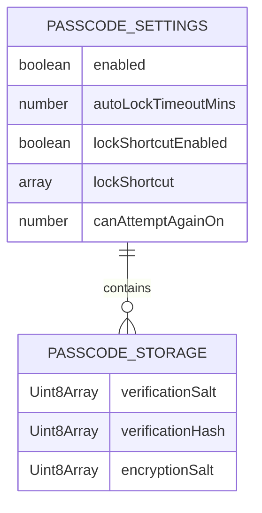
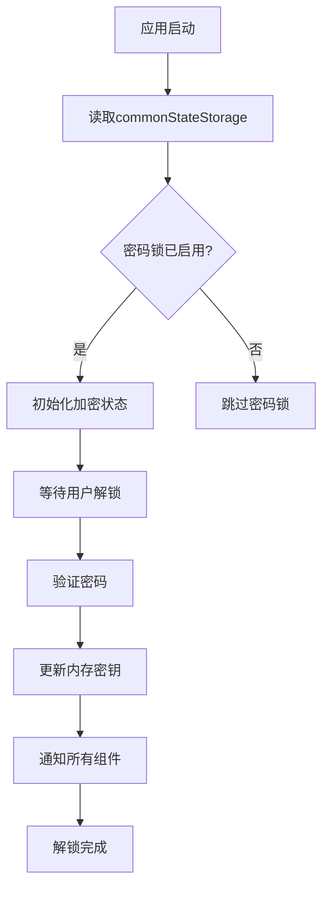
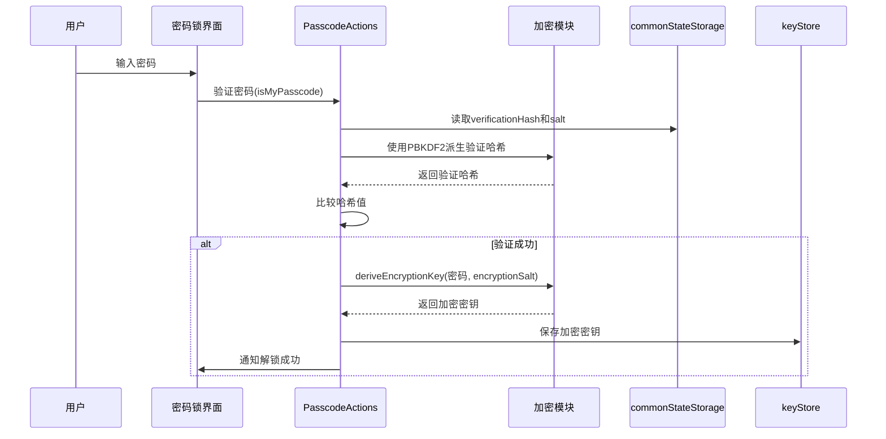
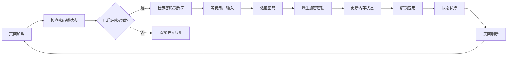
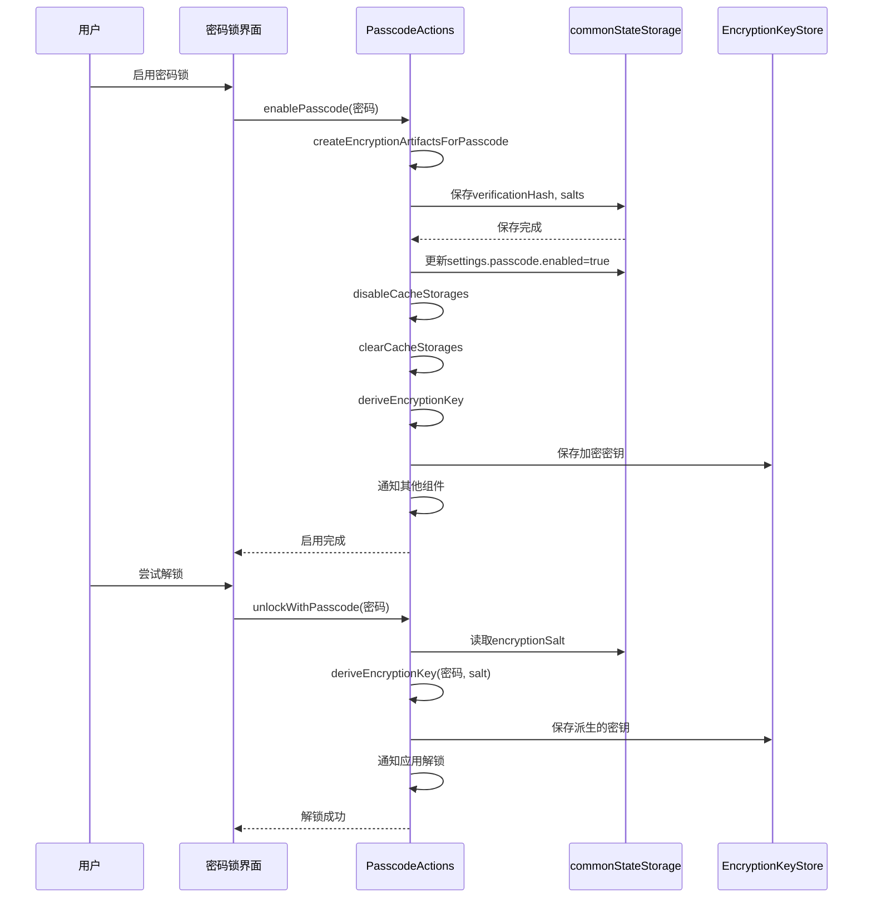

# 状态持久化

<cite>
**本文档中引用的文件**  
- [actions.ts](file://src/lib/passcode/actions.ts)
- [commonStateStorage.ts](file://src/lib/commonStateStorage.ts)
- [encryptedStorageLayer.ts](file://src/lib/encryptedStorageLayer.ts)
- [localStorage.ts](file://src/lib/localStorage.ts)
- [sessionStorage.ts](file://src/lib/sessionStorage.ts)
- [state.ts](file://src/config/state.ts)
- [passcodeLockScreen.tsx](file://src/components/passcodeLock/passcodeLockScreen.tsx)
- [passcodeLockScreenController.tsx](file://src/components/passcodeLock/passcodeLockScreenController.tsx)
- [keyStore.ts](file://src/lib/passcode/keyStore.ts)
- [utils.ts](file://src/lib/passcode/utils.ts)
- [constants.ts](file://src/lib/passcode/constants.ts)
</cite>

## 目录
1. [简介](#简介)
2. [核心状态数据存储机制](#核心状态数据存储机制)
3. [内存与持久化状态同步策略](#内存与持久化状态同步策略)
4. [加密存储实现方式](#加密存储实现方式)
5. [跨会话状态保持](#跨会话状态保持)
6. [持久化流程序列图](#持久化流程序列图)

## 简介
本文档详细记录了Telegram Web客户端中密码锁状态的持久化策略。系统通过多层存储架构实现关键安全状态的可靠保存，包括错误计数、最后尝试时间、锁定状态等敏感信息。持久化机制结合了IndexedDB与内存状态管理，通过加密存储保护用户数据安全，并确保在页面刷新或浏览器关闭后仍能恢复状态。

## 核心状态数据存储机制

密码锁的关键状态数据通过分层存储架构进行管理。核心状态数据包括错误尝试计数、锁定状态和重试时间限制，这些数据存储在`commonStateStorage`中，该存储基于IndexedDB实现。

错误尝试计数和锁定状态通过应用设置对象进行管理，该对象定义在`state.ts`文件中，包含`passcode`字段，其中`canAttemptAgainOn`属性记录了用户被锁定后允许再次尝试的时间戳。当用户连续错误尝试超过5次时，系统会设置此时间戳，阻止进一步的解锁尝试。

**图源**  
- [state.ts](file://src/config/state.ts#L106-L114)
- [commonStateStorage.ts](file://src/lib/commonStateStorage.ts#L10-L27)

**本节来源**  
- [commonStateStorage.ts](file://src/lib/commonStateStorage.ts)
- [state.ts](file://src/config/state.ts)

## 内存与持久化状态同步策略

系统采用内存状态与持久化存储同步的策略，确保密码锁状态在不同组件间保持一致。同步机制通过`DeferredIsUsingPasscode`类实现，该类管理一个延迟解析的Promise，用于协调密码锁状态的读取和更新。

状态同步的关键时机包括：
- 应用启动时从`commonStateStorage`读取密码锁启用状态
- 用户成功解锁后更新内存中的加密密钥
- 密码锁状态变更时同步到所有相关组件

**图源**  
- [passcodeLockScreenController.tsx](file://src/components/passcodeLock/passcodeLockScreenController.tsx#L55-L74)
- [commonStateStorage.ts](file://src/lib/commonStateStorage.ts#L44-L46)

**本节来源**  
- [passcodeLockScreenController.tsx](file://src/components/passcodeLock/passcodeLockScreenController.tsx)
- [commonStateStorage.ts](file://src/lib/commonStateStorage.ts)

## 加密存储实现方式

敏感数据的加密存储通过AES-GCM算法实现，结合PBKDF2密钥派生函数提供高强度保护。系统使用Web Crypto API进行加密操作，确保密钥安全管理。

加密实现的关键组件包括：
- **密钥派生**：使用PBKDF2算法，100,000次迭代，SHA-256哈希函数
- **加密算法**：AES-GCM模式，256位密钥长度
- **盐值管理**：为验证和加密分别生成独立的随机盐值
- **密钥存储**：加密密钥仅在内存中保存，不持久化到存储

**图源**  
- [utils.ts](file://src/lib/passcode/utils.ts#L5-L45)
- [keyStore.ts](file://src/lib/passcode/keyStore.ts)
- [actions.ts](file://src/lib/passcode/actions.ts)

**本节来源**  
- [utils.ts](file://src/lib/passcode/utils.ts)
- [keyStore.ts](file://src/lib/passcode/keyStore.ts)
- [actions.ts](file://src/lib/passcode/actions.ts)

## 跨会话状态保持

系统通过IndexedDB实现跨会话的状态保持，确保在页面刷新或浏览器关闭后仍能恢复密码锁状态。状态保持的关键机制包括：

1. **持久化存储**：使用`commonStateStorage`将密码锁配置和状态保存到IndexedDB
2. **内存恢复**：应用启动时从存储中恢复加密密钥状态
3. **会话管理**：通过`sessionStorage`管理临时会话数据

当用户启用密码锁时，系统会生成三个关键的加密材料：
- `verificationSalt`：用于密码验证的盐值
- `verificationHash`：密码的哈希值，用于验证
- `encryptionSalt`：用于派生加密密钥的盐值

这些材料被持久化存储，而实际的加密密钥仅在内存中保存，确保安全性。

**图源**  
- [passcodeLockScreen.tsx](file://src/components/passcodeLock/passcodeLockScreen.tsx)
- [commonStateStorage.ts](file://src/lib/commonStateStorage.ts)

**本节来源**  
- [passcodeLockScreen.tsx](file://src/components/passcodeLock/passcodeLockScreen.tsx)
- [commonStateStorage.ts](file://src/lib/commonStateStorage.ts)

## 持久化流程序列图

以下序列图展示了密码锁状态持久化的完整流程，包括启用、验证和状态同步的关键步骤：

**图源**  
- [actions.ts](file://src/lib/passcode/actions.ts)
- [commonStateStorage.ts](file://src/lib/commonStateStorage.ts)
- [keyStore.ts](file://src/lib/passcode/keyStore.ts)

**本节来源**  
- [actions.ts](file://src/lib/passcode/actions.ts)
- [commonStateStorage.ts](file://src/lib/commonStateStorage.ts)
- [keyStore.ts](file://src/lib/passcode/keyStore.ts)