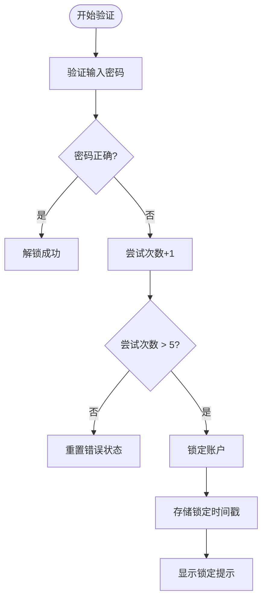
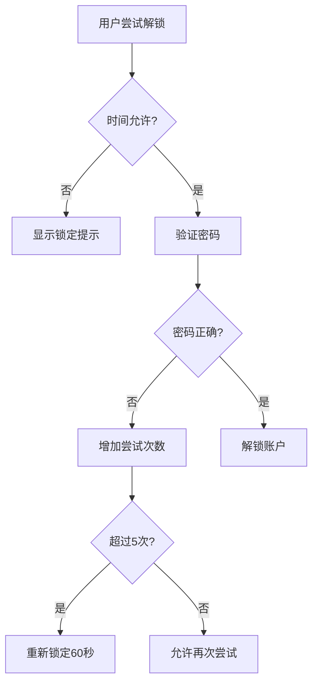
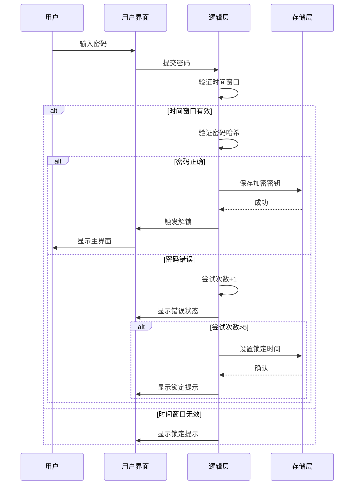

# 错误处理机制

<cite>
**本文档中引用的文件**  
- [passcodeLockScreen.tsx](file://src/components/passcodeLock/passcodeLockScreen.tsx)
- [passcodeLockScreenController.tsx](file://src/components/passcodeLock/passcodeLockScreenController.tsx)
- [passwordMonkeyTsx.tsx](file://src/components/passcodeLock/passwordMonkeyTsx.tsx)
- [actions.ts](file://src/lib/passcode/actions.ts)
- [constants.ts](file://src/lib/passcode/constants.ts)
- [utils.ts](file://src/lib/passcode/utils.ts)
- [keyStore.ts](file://src/lib/passcode/keyStore.ts)
- [password.tsx](file://src/components/popups/password.tsx)
- [pagePassword.ts](file://src/pages/pagePassword.ts)
</cite>

## 目录
1. [简介](#简介)
2. [尝试次数限制实现](#尝试次数限制实现)
3. [延迟机制与指数退避](#延迟机制与指数退避)
4. [账户锁定策略](#账户锁定策略)
5. [错误提示用户体验](#错误提示用户体验)
6. [错误处理流程图](#错误处理流程图)
7. [关键函数代码示例](#关键函数代码示例)
8. [总结](#总结)

## 简介
本文档详细分析密码锁系统的错误处理机制，涵盖尝试次数限制、延迟机制、账户锁定策略和用户体验设计。系统通过 SolidJS 框架实现，采用加密存储和状态管理来保障安全性。核心逻辑分布在 `passcodeLock` 组件和 `passcode` 工具库中，通过 `commonStateStorage` 持久化错误状态。

## 尝试次数限制实现

### 错误计数存储
错误尝试次数通过 `commonStateStorage` 进行持久化存储，该存储系统负责管理应用设置和密码相关数据。当用户连续输入错误密码时，系统会记录下次允许尝试的时间戳。

**Section sources**
- [passcodeLockScreen.tsx](file://src/components/passcodeLock/passcodeLockScreen.tsx#L128-L138)
- [actions.ts](file://src/lib/passcode/actions.ts#L6-L7)

### 计数递增逻辑
在 `passcodeLockScreen.tsx` 中，使用局部变量 `attempts` 跟踪当前会话的尝试次数。每次输入错误密码时，计数器递增，并在达到阈值后触发锁定机制。



**Diagram sources**
- [passcodeLockScreen.tsx](file://src/components/passcodeLock/passcodeLockScreen.tsx#L155-L162)

### 计数重置条件
计数器在以下情况下重置：
1. 用户成功解锁
2. 锁定时间过期后首次尝试
3. 应用重启且无有效加密密钥

重置逻辑在 `canAttempt` 函数中实现，通过检查 `canAttemptAgainOn` 时间戳来决定是否重置计数器。

**Section sources**
- [passcodeLockScreen.tsx](file://src/components/passcodeLock/passcodeLockScreen.tsx#L132-L138)

## 延迟机制与指数退避

### 延迟机制实现
系统采用固定延迟而非指数退避算法。当用户连续5次尝试失败后，账户将被锁定60秒。这个时间间隔由常量 `MAX_ATTEMPTS_TIMEOUT_SEC` 定义。

```typescript
const MAX_ATTEMPTS = 5;
const MAX_ATTEMPTS_TIMEOUT_SEC = 60;
```

### 时间间隔计算
时间间隔计算基于当前时间戳，使用 `Date.now()` 获取当前时间，并加上预设的超时秒数：

```javascript
settings.passcode.canAttemptAgainOn = Date.now() + MAX_ATTEMPTS_TIMEOUT_SEC * 1000;
```

该值存储在 `commonStateStorage` 中，确保跨会话的锁定状态持久化。

**Section sources**
- [passcodeLockScreen.tsx](file://src/components/passcodeLock/passcodeLockScreen.tsx#L38-L40)
- [passcodeLockScreen.tsx](file://src/components/passcodeLock/passcodeLockScreen.tsx#L160-L161)

## 账户锁定策略

### 锁定时长管理
账户锁定时长固定为60秒，由 `MAX_ATTEMPTS_TIMEOUT_SEC` 常量定义。系统不采用动态调整的锁定时间，而是保持一致的安全策略。

### 锁定状态持久化
锁定状态通过 `commonStateStorage` 持久化存储在客户端。关键数据包括：
- `canAttemptAgainOn`: 下次允许尝试的时间戳
- `verificationHash`: 密码验证哈希
- `verificationSalt`: 验证盐值

这些数据确保即使应用重启，锁定状态仍然有效。

**Section sources**
- [passcodeLockScreen.tsx](file://src/components/passcodeLock/passcodeLockScreen.tsx#L159-L161)
- [actions.ts](file://src/lib/passcode/actions.ts#L48-L54)

### 解锁条件验证
解锁条件验证包含多个层次：
1. **时间验证**: 检查当前时间是否超过 `canAttemptAgainOn`
2. **密码验证**: 使用 PBKDF2 算法验证密码哈希
3. **状态验证**: 确认加密密钥的有效性



**Diagram sources**
- [passcodeLockScreen.tsx](file://src/components/passcodeLock/passcodeLockScreen.tsx#L149-L162)

## 错误提示用户体验

### 错误动画设计
系统使用密码猴子（PasswordMonkey）作为主要的视觉反馈元素。当输入错误时：
- 密码猴子显示错误表情
- 输入框显示红色边框
- 背景渐变动画重置

这些动画通过 SolidJS 的响应式系统实现，确保流畅的用户体验。

**Section sources**
- [passwordMonkeyTsx.tsx](file://src/components/passcodeLock/passwordMonkeyTsx.tsx#L24-L32)
- [passcodeLockScreen.tsx](file://src/components/passcodeLock/passcodeLockScreen.tsx#L113-L118)

### 提示文本内容
系统提供本地化的错误提示文本：
- `PasscodeLock.WrongPasscode`: 密码错误提示
- `PasscodeLock.TooManyAttempts`: 尝试次数过多提示
- 支持多账户环境下的特定提示

提示文本通过 `i18n` 国际化系统加载，确保多语言支持。

### 视觉反馈机制
视觉反馈包含多个层次：
1. **即时反馈**: 输入时背景渐变动画
2. **错误反馈**: 红色边框和错误图标
3. **锁定反馈**: 显示完整的锁定状态信息
4. **成功反馈**: 平滑的解锁动画

这些反馈通过 CSS 类和 SolidJS 的 `classList` 实现动态控制。

**Section sources**
- [passcodeLockScreen.tsx](file://src/components/passcodeLock/passcodeLockScreen.tsx#L179-L184)
- [passcodeLockScreen.module.scss](file://src/components/passcodeLock/passcodeLockScreen.module.scss)

## 错误处理流程图



**Diagram sources**
- [passcodeLockScreen.tsx](file://src/components/passcodeLock/passcodeLockScreen.tsx#L142-L168)
- [actions.ts](file://src/lib/passcode/actions.ts#L81-L89)

## 关键函数代码示例

### 密码验证函数
`isMyPasscode` 函数负责验证用户输入的密码是否正确，使用 PBKDF2 算法进行安全哈希比较。

**Section sources**
- [actions.ts](file://src/lib/passcode/actions.ts#L81-L89)

### 解锁函数
`unlockWithPasscode` 函数在密码验证通过后执行，负责派生加密密钥并通知系统解锁。

**Section sources**
- [actions.ts](file://src/lib/passcode/actions.ts#L145-L159)

### 尝试验证函数
`canAttempt` 函数检查当前是否允许进行密码尝试，是错误处理的核心逻辑之一。

**Section sources**
- [passcodeLockScreen.tsx](file://src/components/passcodeLock/passcodeLockScreen.tsx#L127-L139)

## 总结
密码锁的错误处理机制通过多层次的安全策略确保账户安全。系统采用固定尝试次数限制（5次）和固定锁定时间（60秒），通过 `commonStateStorage` 实现状态持久化。用户体验方面，通过密码猴子动画和渐变背景提供直观的视觉反馈。虽然当前实现未采用指数退避算法，但其简洁的设计确保了安全性和可用性的平衡。