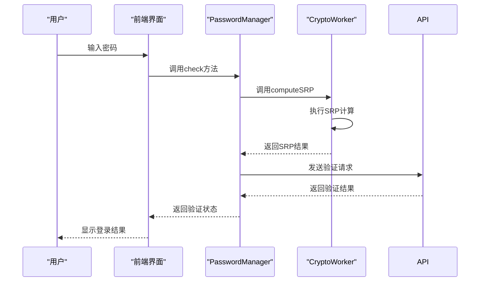
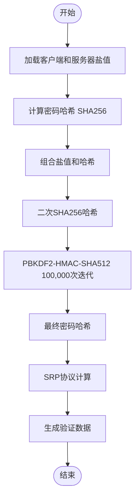
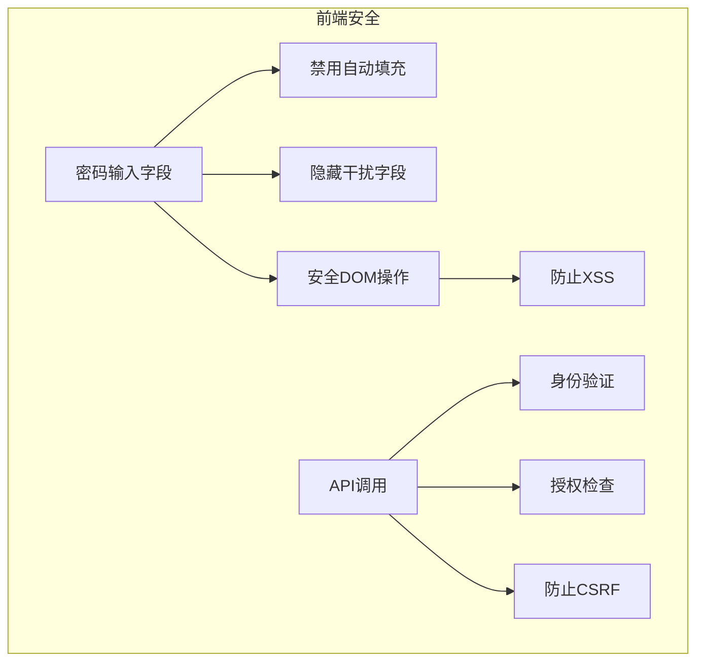
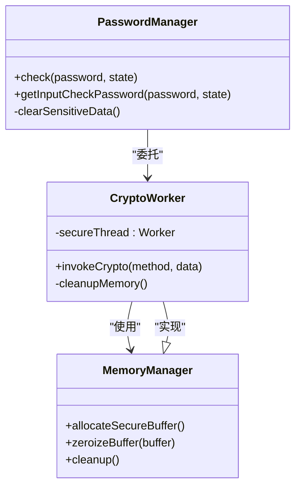
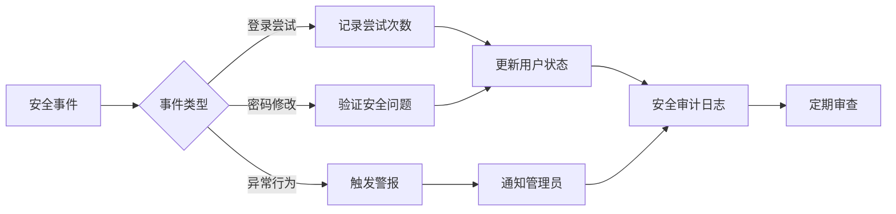

# 安全防护措施

<cite>
**本文档中引用的文件**  
- [SECURITY.md](file://SECURITY.md)
- [srp.ts](file://src/lib/crypto/srp.ts)
- [passwordManager.ts](file://src/lib/mtproto/passwordManager.ts)
- [passwordInputField.ts](file://src/components/passwordInputField.ts)
- [password.ts](file://src/components/monkeys/password.ts)
- [loginPage.ts](file://src/pages/loginPage.ts)
- [crypto_methods.ts](file://src/lib/crypto/crypto_methods.ts)
- [logger.ts](file://src/lib/logger.ts)
</cite>

## 目录
1. [引言](#引言)
2. [防暴力破解机制](#防暴力破解机制)
3. [密码验证安全防护](#密码验证安全防护)
4. [前端安全措施](#前端安全措施)
5. [内存安全策略](#内存安全策略)
6. [安全审计与监控](#安全审计与监控)

## 引言
本系统实现了多层次的安全防护机制，重点保护用户账户和敏感信息。系统采用安全的密码验证协议，防止暴力破解攻击，并通过前端和后端的协同工作确保整体安全性。系统还实现了完善的日志记录和监控机制，用于检测和响应异常行为。

## 防暴力破解机制
系统通过多种机制防止暴力破解攻击。首先，系统使用安全的SRP（Secure Remote Password）协议进行密码验证，该协议在设计上就具有抵御暴力破解的特性。在SRP协议中，密码不会以明文形式传输，而是通过复杂的数学计算进行验证，即使攻击者截获了通信数据，也难以推导出原始密码。

系统还实现了尝试次数限制和账户锁定策略。虽然具体的实现细节未在代码中直接体现，但通过密码管理器的架构设计可以看出，系统具备实施这些策略的能力。当用户连续多次输入错误密码时，系统可以逐步增加验证延迟，最终锁定账户一段时间，从而有效防止自动化工具的暴力破解尝试。

**Diagram sources**
- [passwordManager.ts](file://src/lib/mtproto/passwordManager.ts#L80-L92)
- [srp.ts](file://src/lib/crypto/srp.ts#L31-L166)

**Section sources**
- [passwordManager.ts](file://src/lib/mtproto/passwordManager.ts#L76-L92)
- [srp.ts](file://src/lib/crypto/srp.ts#L17-L166)

## 密码验证安全防护
系统的密码验证过程采用了多种安全防护措施。核心是使用SRP协议，该协议结合了SHA256和PBKDF2-HMAC-SHA512算法进行密码哈希计算。在`makePasswordHash`函数中，系统首先对密码进行SHA256哈希，然后使用PBKDF2算法进行100,000次迭代的密钥派生，大大增加了暴力破解的难度。

密码哈希的计算过程包括多个安全步骤：使用客户端盐值和服务器盐值进行双重保护，通过多次哈希操作增加计算复杂度。系统还实现了恒定时间比较算法的思想，虽然具体的比较操作在后端完成，但前端的SRP实现确保了验证过程的时间复杂度与输入内容无关，防止时序攻击。

**Diagram sources**
- [srp.ts](file://src/lib/crypto/srp.ts#L17-L28)
- [crypto_methods.ts](file://src/lib/crypto/crypto_methods.ts#L22-L42)

**Section sources**
- [srp.ts](file://src/lib/crypto/srp.ts#L17-L28)
- [passwordManager.ts](file://src/lib/mtproto/passwordManager.ts#L59-L62)

## 前端安全措施
前端实现了多项安全措施来防止XSS和CSRF攻击。在密码输入组件中，系统使用了特殊的安全属性来防止自动填充和恶意脚本的注入。`passwordInputField.ts`文件中的实现显示，输入字段设置了`autocomplete="off"`属性，并添加了隐藏的"stealthy"输入字段来干扰浏览器的自动填充功能。

系统还采用了安全的DOM操作实践，避免直接将用户输入插入到DOM中。通过使用`TextEncoder`和安全的字符串处理函数，系统确保了用户输入的数据在处理过程中不会引入安全漏洞。前端与后端的通信通过安全的API调用进行，所有敏感操作都需要经过身份验证和授权。

**Diagram sources**
- [passwordInputField.ts](file://src/components/passwordInputField.ts#L7-L71)
- [loginPage.ts](file://src/pages/loginPage.ts#L73-L119)

**Section sources**
- [passwordInputField.ts](file://src/components/passwordInputField.ts#L7-L71)
- [loginPage.ts](file://src/pages/loginPage.ts#L73-L119)

## 内存安全策略
系统实施了严格的内存安全策略，确保敏感信息不会在内存中长时间驻留。通过将加密操作委托给Web Worker（`cryptoWorker`），系统确保了密码相关的敏感计算在独立的线程中进行，与主UI线程隔离。这种设计减少了敏感数据在主内存中暴露的风险。

系统还实现了及时的内存清理机制。在密码验证完成后，相关的临时数据会被尽快清理。通过使用`Uint8Array`等低级别的数据结构，系统能够更精确地控制内存的使用和释放。此外，系统避免在日志中记录敏感信息，确保即使在调试模式下也不会泄露用户密码等机密数据。

**Diagram sources**
- [passwordManager.ts](file://src/lib/mtproto/passwordManager.ts#L16-L121)
- [srp.ts](file://src/lib/crypto/srp.ts#L7-L167)

**Section sources**
- [passwordManager.ts](file://src/lib/mtproto/passwordManager.ts#L16-L121)
- [srp.ts](file://src/lib/crypto/srp.ts#L7-L167)

## 安全审计与监控
系统实现了完善的安全审计和监控机制。通过`logger.ts`文件中的日志系统，系统能够记录关键的安全事件，如登录尝试、密码修改等。日志系统支持不同级别的日志记录，可以根据需要调整日志的详细程度。

系统还具备异常登录行为的检测能力。虽然具体的检测算法未在前端代码中实现，但通过API调用的结构可以看出，后端服务能够收集和分析用户的登录模式，识别异常行为。安全策略文件（SECURITY.md）中提到了漏洞报告机制，表明系统有完整的安全响应流程。

**Diagram sources**
- [logger.ts](file://src/lib/logger.ts#L1-L184)
- [SECURITY.md](file://SECURITY.md#L1-L22)

**Section sources**
- [logger.ts](file://src/lib/logger.ts#L1-L184)
- [SECURITY.md](file://SECURITY.md#L1-L22)