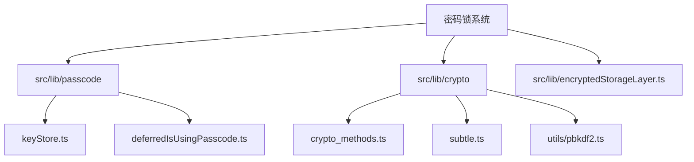
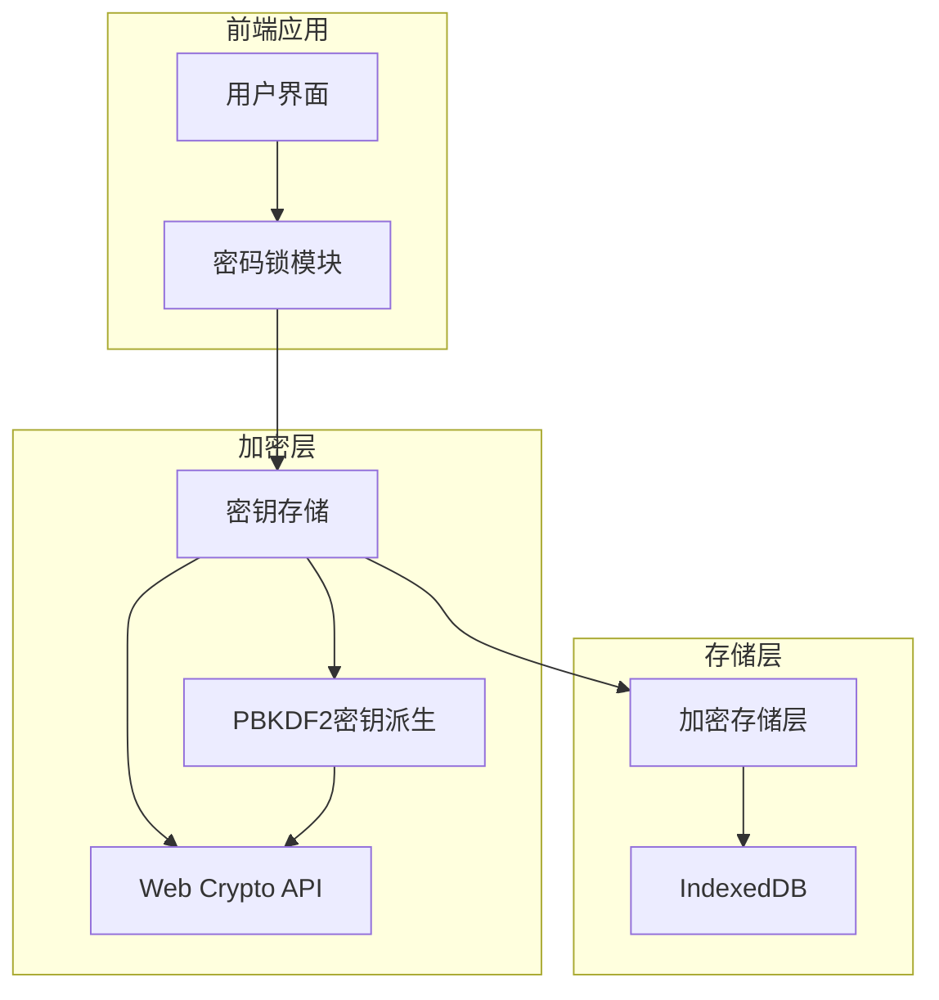
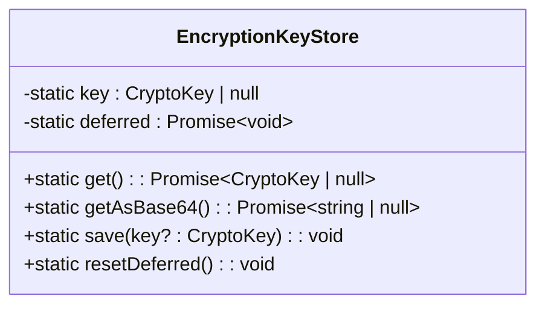
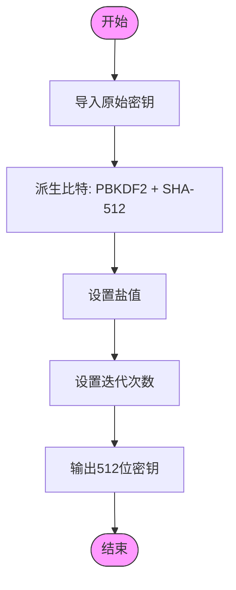
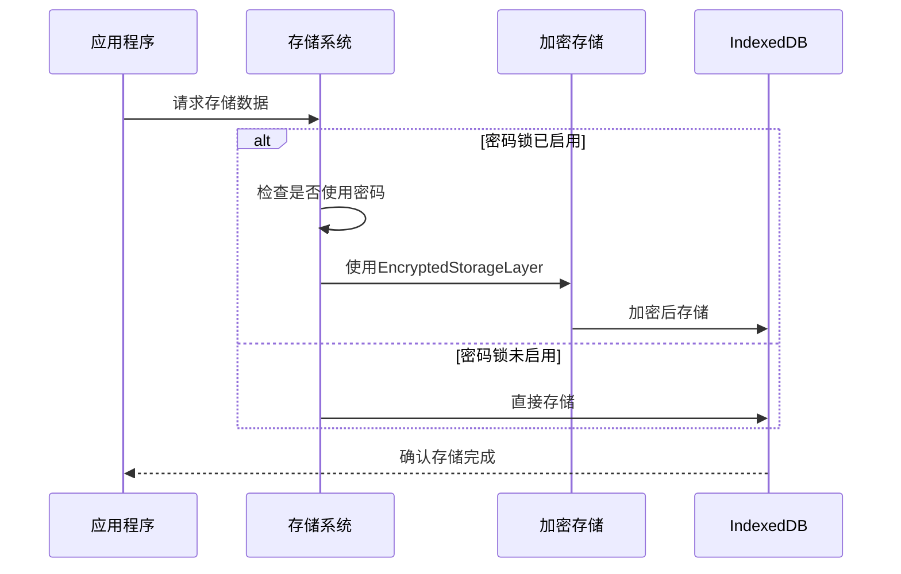
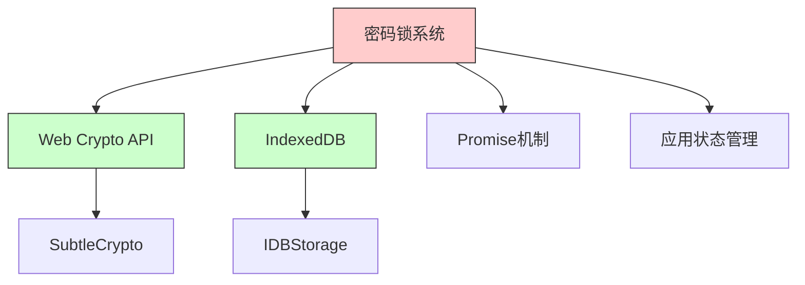

# 密钥存储与加密

<cite>
**本文档中引用的文件**
- [keyStore.ts](file://src/lib/passcode/keyStore.ts)
- [crypto_methods.ts](file://src/lib/crypto/crypto_methods.ts)
- [subtle.ts](file://src/lib/crypto/subtle.ts)
- [storage.ts](file://src/lib/storage.ts)
- [pbkdf2.ts](file://src/lib/crypto/utils/pbkdf2.ts)
- [encryptedStorageLayer.ts](file://src/lib/encryptedStorageLayer.ts)
- [deferredIsUsingPasscode.ts](file://src/lib/passcode/deferredIsUsingPasscode.ts)
</cite>

## 目录
1. [引言](#引言)
2. [项目结构](#项目结构)
3. [核心组件](#核心组件)
4. [架构概述](#架构概述)
5. [详细组件分析](#详细组件分析)
6. [依赖分析](#依赖分析)
7. [性能考虑](#性能考虑)
8. [故障排除指南](#故障排除指南)
9. [结论](#结论)

## 引言
本文档详细记录了密码锁系统的密钥存储和加密机制。重点分析了keyStore模块如何安全地存储和检索用户密码，包括加密算法的选择和密钥派生过程。文档还描述了数据保护策略、密码验证流程的安全性以及防暴力破解措施。

## 项目结构
密码锁和加密功能主要分布在`src/lib/passcode`和`src/lib/crypto`目录中。`passcode`目录包含密钥存储和密码管理相关组件，而`crypto`目录包含各种加密算法和工具。

**Diagram sources**
- [keyStore.ts](file://src/lib/passcode/keyStore.ts)
- [crypto_methods.ts](file://src/lib/crypto/crypto_methods.ts)
- [encryptedStorageLayer.ts](file://src/lib/encryptedStorageLayer.ts)

**Section sources**
- [keyStore.ts](file://src/lib/passcode/keyStore.ts)
- [crypto_methods.ts](file://src/lib/crypto/crypto_methods.ts)

## 核心组件
核心组件包括`EncryptionKeyStore`类，负责管理加密密钥的存储和检索；`pbkdf2`函数，用于密钥派生；以及`EncryptedStorageLayer`，提供加密存储功能。

**Section sources**
- [keyStore.ts](file://src/lib/passcode/keyStore.ts)
- [pbkdf2.ts](file://src/lib/crypto/utils/pbkdf2.ts)
- [encryptedStorageLayer.ts](file://src/lib/encryptedStorageLayer.ts)

## 架构概述
系统采用分层架构，将密钥管理、加密算法和数据存储分离。密钥存储通过`EncryptionKeyStore`类实现，加密操作通过Web Crypto API进行，数据存储则通过`EncryptedStorageLayer`实现加密持久化。

**Diagram sources**
- [keyStore.ts](file://src/lib/passcode/keyStore.ts)
- [pbkdf2.ts](file://src/lib/crypto/utils/pbkdf2.ts)
- [encryptedStorageLayer.ts](file://src/lib/encryptedStorageLayer.ts)

## 详细组件分析

### 密钥存储分析
`EncryptionKeyStore`类是密钥管理的核心，使用静态类模式确保全局唯一的密钥实例。

**Diagram sources**
- [keyStore.ts](file://src/lib/passcode/keyStore.ts#L5-L38)

**Section sources**
- [keyStore.ts](file://src/lib/passcode/keyStore.ts#L1-L39)

### 加密算法分析
系统使用PBKDF2算法进行密钥派生，结合SHA-512哈希函数和盐值来增强安全性。

**Diagram sources**
- [pbkdf2.ts](file://src/lib/crypto/utils/pbkdf2.ts#L3-L38)

**Section sources**
- [pbkdf2.ts](file://src/lib/crypto/utils/pbkdf2.ts#L1-L40)
- [subtle.ts](file://src/lib/crypto/subtle.ts#L1-L4)

### 数据保护策略
系统采用设备特定密钥和加密存储层来保护用户数据。当启用密码锁时，数据存储自动切换到加密模式。

**Diagram sources**
- [storage.ts](file://src/lib/storage.ts#L105-L119)
- [deferredIsUsingPasscode.ts](file://src/lib/passcode/deferredIsUsingPasscode.ts)

**Section sources**
- [storage.ts](file://src/lib/storage.ts#L1-L490)
- [encryptedStorageLayer.ts](file://src/lib/encryptedStorageLayer.ts)

## 依赖分析
系统依赖Web Crypto API进行加密操作，并使用IndexedDB进行数据持久化存储。密码锁功能与应用的存储系统深度集成。

**Diagram sources**
- [subtle.ts](file://src/lib/crypto/subtle.ts)
- [storage.ts](file://src/lib/storage.ts)
- [keyStore.ts](file://src/lib/passcode/keyStore.ts)

**Section sources**
- [subtle.ts](file://src/lib/crypto/subtle.ts#L1-L4)
- [storage.ts](file://src/lib/storage.ts#L19-L22)

## 性能考虑
密钥派生过程使用高迭代次数的PBKDF2算法，虽然增强了安全性，但可能影响性能。系统通过异步操作和Promise机制避免阻塞主线程。

## 故障排除指南
常见问题包括密钥存储失败、加密操作超时和存储权限问题。建议检查浏览器的Web Crypto API支持情况和IndexedDB访问权限。

**Section sources**
- [keyStore.ts](file://src/lib/passcode/keyStore.ts)
- [storage.ts](file://src/lib/storage.ts)

## 结论
该密码锁系统采用了现代加密技术，通过PBKDF2密钥派生、Web Crypto API和加密存储层提供了多层次的安全保护。系统设计考虑了安全性和性能的平衡，适合在Web应用中保护用户敏感数据。