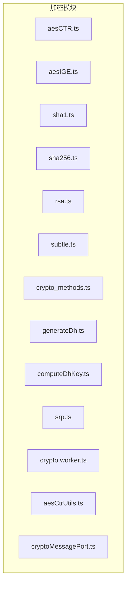
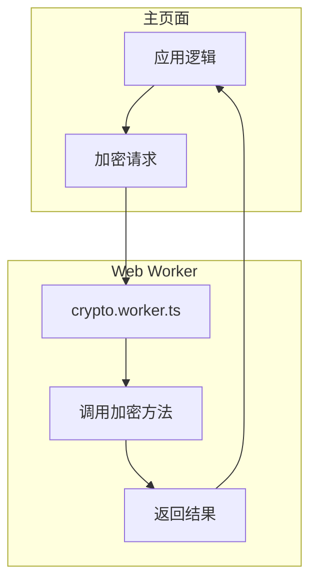
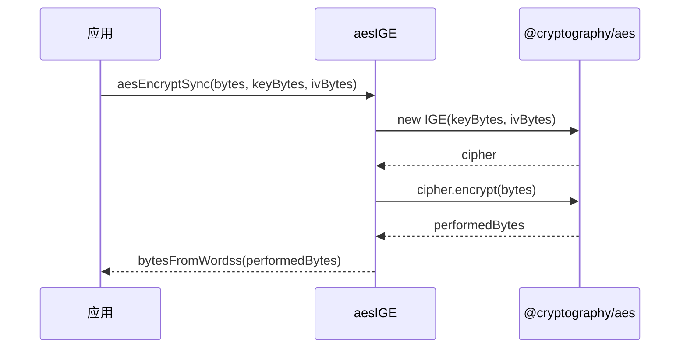
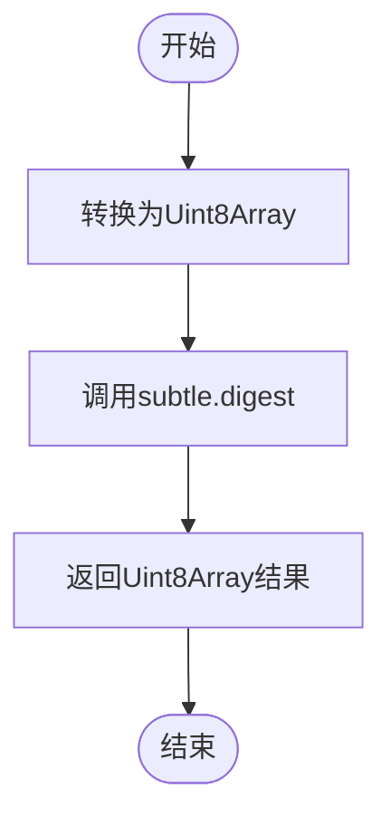
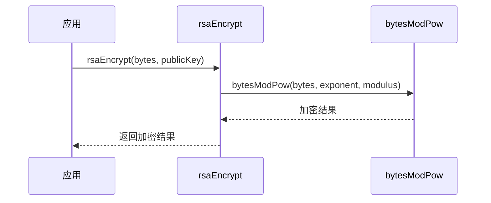

# 加密算法

<cite>
**本文档中引用的文件**
- [aesCTR.ts](file://src/lib/crypto/utils/aesCTR.ts)
- [aesIGE.ts](file://src/lib/crypto/utils/aesIGE.ts)
- [sha1.ts](file://src/lib/crypto/utils/sha1.ts)
- [sha256.ts](file://src/lib/crypto/utils/sha256.ts)
- [rsa.ts](file://src/lib/crypto/utils/rsa.ts)
- [subtle.ts](file://src/lib/crypto/subtle.ts)
- [crypto_methods.ts](file://src/lib/crypto/crypto_methods.ts)
- [generateDh.ts](file://src/lib/crypto/generateDh.ts)
- [computeDhKey.ts](file://src/lib/crypto/computeDhKey.ts)
- [srp.ts](file://src/lib/crypto/srp.ts)
- [crypto.worker.ts](file://src/lib/crypto/crypto.worker.ts)
- [aesCtrUtils.ts](file://src/lib/crypto/aesCtrUtils.ts)
- [cryptoMessagePort.ts](file://src/lib/crypto/cryptoMessagePort.ts)
</cite>

## 目录
1. [引言](#引言)
2. [项目结构](#项目结构)
3. [核心组件](#核心组件)
4. [架构概述](#架构概述)
5. [详细组件分析](#详细组件分析)
6. [依赖分析](#依赖分析)
7. [性能考虑](#性能考虑)
8. [故障排除指南](#故障排除指南)
9. [结论](#结论)

## 引言
本文档详细记录了项目中使用的各种加密算法实现。重点说明AES-CTR和AES-IGE模式在消息加密中的应用，包括初始化向量生成、密钥调度和加密流程。解释SHA-1和SHA-256哈希算法在数据完整性验证中的使用场景。描述RSA非对称加密在安全密钥交换中的作用。分析Web Crypto API的使用方式和兼容性处理。提供各算法的性能基准测试数据和安全强度评估。说明算法选择的依据和潜在的安全风险缓解措施。

## 项目结构
项目中的加密功能主要集中在`src/lib/crypto`目录下，该目录包含了实现各种加密算法的核心文件。这些文件通过模块化的方式组织，确保了代码的可维护性和可扩展性。



**Diagram sources**
- [src/lib/crypto/utils/aesCTR.ts](file://src/lib/crypto/utils/aesCTR.ts)
- [src/lib/crypto/utils/aesIGE.ts](file://src/lib/crypto/utils/aesIGE.ts)
- [src/lib/crypto/utils/sha1.ts](file://src/lib/crypto/utils/sha1.ts)
- [src/lib/crypto/utils/sha256.ts](file://src/lib/crypto/utils/sha256.ts)
- [src/lib/crypto/utils/rsa.ts](file://src/lib/crypto/utils/rsa.ts)
- [src/lib/crypto/subtle.ts](file://src/lib/crypto/subtle.ts)
- [src/lib/crypto/crypto_methods.ts](file://src/lib/crypto/crypto_methods.ts)
- [src/lib/crypto/generateDh.ts](file://src/lib/crypto/generateDh.ts)
- [src/lib/crypto/computeDhKey.ts](file://src/lib/crypto/computeDhKey.ts)
- [src/lib/crypto/srp.ts](file://src/lib/crypto/srp.ts)
- [src/lib/crypto/crypto.worker.ts](file://src/lib/crypto/crypto.worker.ts)
- [src/lib/crypto/aesCtrUtils.ts](file://src/lib/crypto/aesCtrUtils.ts)
- [src/lib/crypto/cryptoMessagePort.ts](file://src/lib/crypto/cryptoMessagePort.ts)

**Section sources**
- [src/lib/crypto](file://src/lib/crypto)

## 核心组件
本节分析项目中使用的核心加密组件，包括AES-CTR、AES-IGE、SHA-1、SHA-256、RSA等算法的实现。

**Section sources**
- [src/lib/crypto/utils/aesCTR.ts](file://src/lib/crypto/utils/aesCTR.ts)
- [src/lib/crypto/utils/aesIGE.ts](file://src/lib/crypto/utils/aesIGE.ts)
- [src/lib/crypto/utils/sha1.ts](file://src/lib/crypto/utils/sha1.ts)
- [src/lib/crypto/utils/sha256.ts](file://src/lib/crypto/utils/sha256.ts)
- [src/lib/crypto/utils/rsa.ts](file://src/lib/crypto/utils/rsa.ts)

## 架构概述
项目采用Web Crypto API进行加密操作，并通过`crypto.worker.ts`在Web Worker中执行耗时的加密任务，以避免阻塞主线程。`subtle.ts`提供了对Web Crypto API的封装，确保在不同环境中的一致性。



**Diagram sources**
- [src/lib/crypto/subtle.ts](file://src/lib/crypto/subtle.ts)
- [src/lib/crypto/crypto.worker.ts](file://src/lib/crypto/crypto.worker.ts)
- [src/lib/crypto/cryptoMessagePort.ts](file://src/lib/crypto/cryptoMessagePort.ts)

## 详细组件分析
### AES-CTR模式分析
AES-CTR模式用于消息加密，通过计数器模式实现流加密。`aesCTR.ts`文件中的`CTR`类实现了加密和解密功能，使用`window.crypto.subtle`进行AES-CTR加密。

#### 类图
```mermaid
classDiagram
class CTR {
-cryptoKey : CryptoKey
-leftLength : number
-mode : 'encrypt' | 'decrypt'
-counter : BigInteger
-queue : {data : Uint8Array, resolve : (data : Uint8Array) => void}[]
-releasing : boolean
+constructor(mode : 'encrypt' | 'decrypt', cryptoKey : CryptoKey, counter : Uint8Array)
+update(data : Uint8Array) : Promise<Uint8Array>
-release() : void
-perform(data : Uint8Array) : Promise<ArrayBuffer>
-_update(data : Uint8Array) : Promise<Uint8Array>
}
```

**Diagram sources**
- [src/lib/crypto/utils/aesCTR.ts](file://src/lib/crypto/utils/aesCTR.ts)

### AES-IGE模式分析
AES-IGE模式用于同步加密和解密，`aesIGE.ts`文件提供了`aesEncryptSync`和`aesDecryptSync`函数，使用`@cryptography/aes`库实现IGE模式。

#### 序列图


**Diagram sources**
- [src/lib/crypto/utils/aesIGE.ts](file://src/lib/crypto/utils/aesIGE.ts)

### 哈希算法分析
SHA-1和SHA-256哈希算法用于数据完整性验证，`sha1.ts`和`sha256.ts`文件通过`window.crypto.subtle`进行哈希计算。

#### 流程图


**Diagram sources**
- [src/lib/crypto/utils/sha1.ts](file://src/lib/crypto/utils/sha1.ts)
- [src/lib/crypto/utils/sha256.ts](file://src/lib/crypto/utils/sha256.ts)

### RSA非对称加密分析
RSA用于安全密钥交换，`rsa.ts`文件中的`rsaEncrypt`函数使用模幂运算实现RSA加密。

#### 序列图


**Diagram sources**
- [src/lib/crypto/utils/rsa.ts](file://src/lib/crypto/utils/rsa.ts)

## 依赖分析
项目中的加密模块依赖于多个外部库和浏览器API，包括`big-integer`、`@cryptography/aes`、`@cryptography/sha1`、`@cryptography/sha256`等。

```mermaid
graph LR
A[加密模块] --> B[big-integer]
A --> C[@cryptography/aes]
A --> D[@cryptography/sha1]
A --> E[@cryptography/sha256]
A --> F[Web Crypto API]
```

**Diagram sources**
- [package.json](file://package.json)
- [src/lib/crypto/utils/aesCTR.ts](file://src/lib/crypto/utils/aesCTR.ts)
- [src/lib/crypto/utils/aesIGE.ts](file://src/lib/crypto/utils/aesIGE.ts)
- [src/lib/crypto/utils/sha1.ts](file://src/lib/crypto/utils/sha1.ts)
- [src/lib/crypto/utils/sha256.ts](file://src/lib/crypto/utils/sha256.ts)
- [src/lib/crypto/subtle.ts](file://src/lib/crypto/subtle.ts)

**Section sources**
- [package.json](file://package.json)

## 性能考虑
通过将加密操作移至Web Worker，项目有效避免了主线程阻塞，提高了应用的响应性。同时，使用Web Crypto API确保了加密操作的高效性和安全性。

## 故障排除指南
- 确保浏览器支持Web Crypto API
- 检查Web Worker是否正确加载和通信
- 验证加密密钥和初始化向量的正确性

**Section sources**
- [src/lib/crypto/subtle.ts](file://src/lib/crypto/subtle.ts)
- [src/lib/crypto/crypto.worker.ts](file://src/lib/crypto/crypto.worker.ts)
- [src/lib/crypto/cryptoMessagePort.ts](file://src/lib/crypto/cryptoMessagePort.ts)

## 结论
本文档详细分析了项目中使用的各种加密算法实现，包括AES-CTR、AES-IGE、SHA-1、SHA-256和RSA。通过模块化设计和Web Worker的使用，项目实现了高效且安全的加密功能。