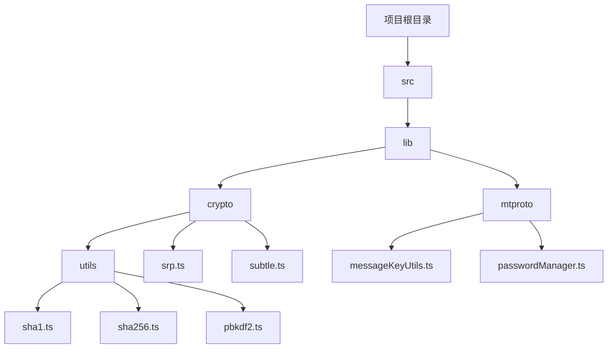
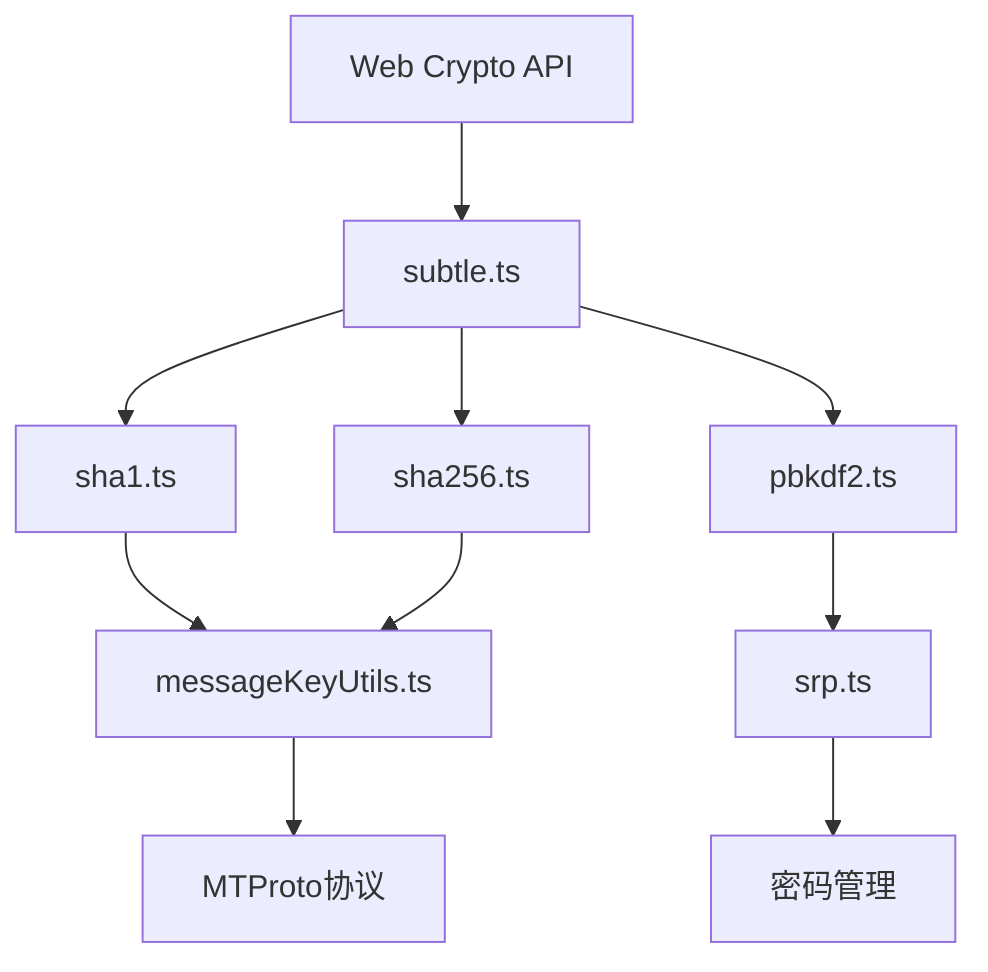
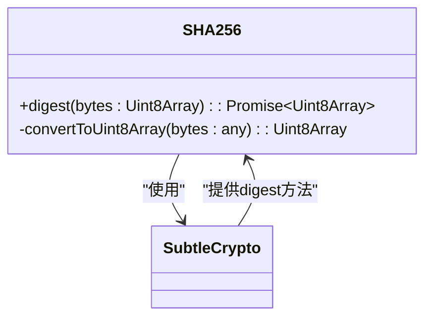
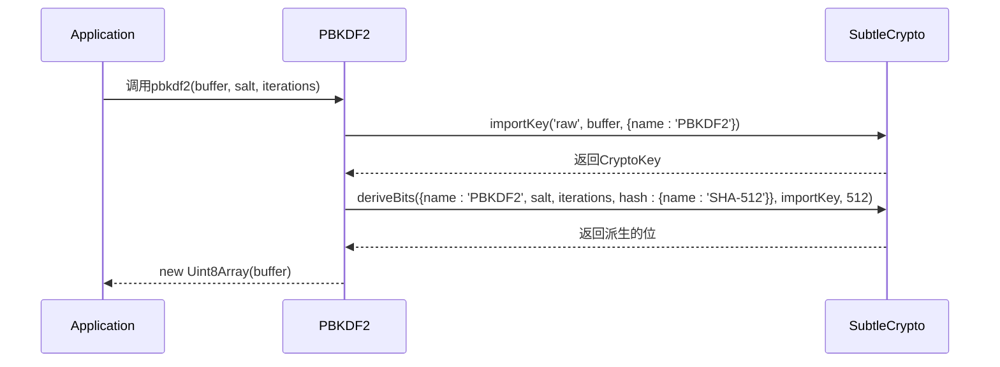
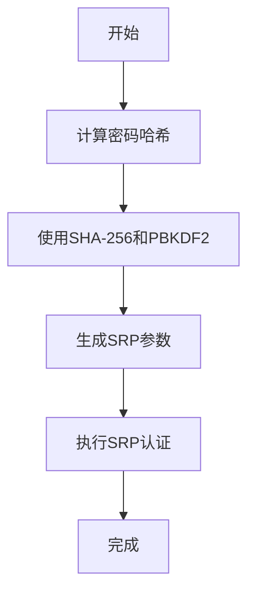
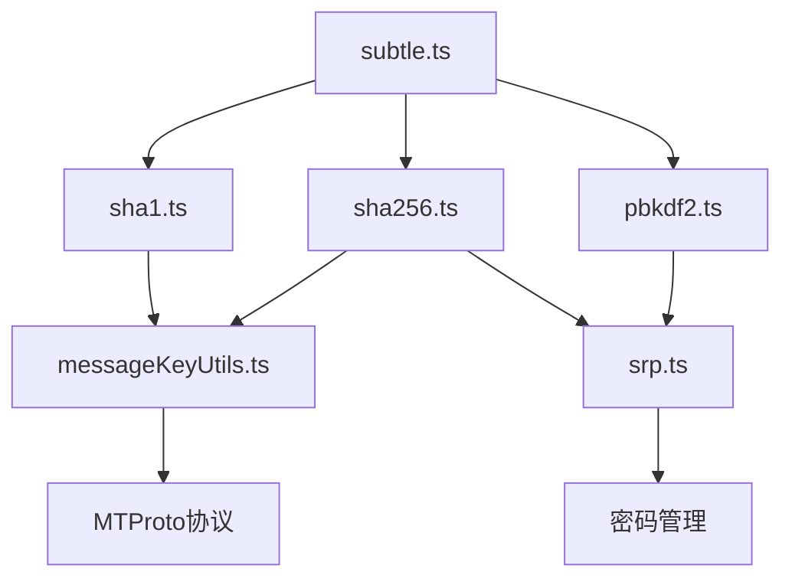

# 哈希函数

<cite>
**本文档中引用的文件**  
- [sha1.ts](file://src/lib/crypto/utils/sha1.ts)
- [sha256.ts](file://src/lib/crypto/utils/sha256.ts)
- [pbkdf2.ts](file://src/lib/crypto/utils/pbkdf2.ts)
- [srp.ts](file://src/lib/crypto/srp.ts)
- [messageKeyUtils.ts](file://src/lib/mtproto/messageKeyUtils.ts)
- [crypto_methods.ts](file://src/lib/crypto/crypto_methods.ts)
- [subtle.ts](file://src/lib/crypto/subtle.ts)
- [cryptoMessagePort.ts](file://src/lib/crypto/cryptoMessagePort.ts)
- [passwordManager.ts](file://src/lib/mtproto/passwordManager.ts)
- [constants.ts](file://src/lib/passcode/constants.ts)
</cite>

## 目录
1. [引言](#引言)
2. [项目结构](#项目结构)
3. [核心组件](#核心组件)
4. [架构概述](#架构概述)
5. [详细组件分析](#详细组件分析)
6. [依赖分析](#依赖分析)
7. [性能考虑](#性能考虑)
8. [故障排除指南](#故障排除指南)
9. [结论](#结论)

## 引言
本文档详细记录了项目中哈希算法的实现和应用。重点说明SHA-1和SHA-256在数据完整性验证、消息认证码(MAC)生成和密码派生中的使用场景。解释PBKDF2密钥派生函数在密码哈希处理中的实现，包括迭代次数选择、盐值生成和抗暴力破解能力。分析不同哈希算法的安全强度、碰撞概率和性能特征。描述哈希链和Merkle树在数据验证中的应用。提供哈希算法的性能基准测试数据和安全最佳实践。

## 项目结构
该项目是一个基于Webogram改进的Telegram Web客户端，实现了完整的加密功能，包括多种哈希算法的应用。项目结构清晰，加密相关代码主要位于`src/lib/crypto`目录下，包含SHA-1、SHA-256和PBKDF2等哈希算法的实现。

**Diagram sources**
- [sha1.ts](file://src/lib/crypto/utils/sha1.ts)
- [sha256.ts](file://src/lib/crypto/utils/sha256.ts)
- [pbkdf2.ts](file://src/lib/crypto/utils/pbkdf2.ts)
- [srp.ts](file://src/lib/crypto/srp.ts)
- [messageKeyUtils.ts](file://src/lib/mtproto/messageKeyUtils.ts)

**Section sources**
- [sha1.ts](file://src/lib/crypto/utils/sha1.ts)
- [sha256.ts](file://src/lib/crypto/utils/sha256.ts)
- [pbkdf2.ts](file://src/lib/crypto/utils/pbkdf2.ts)
- [srp.ts](file://src/lib/crypto/srp.ts)
- [messageKeyUtils.ts](file://src/lib/mtproto/messageKeyUtils.ts)

## 核心组件
项目中的哈希算法实现主要集中在`src/lib/crypto/utils`目录下，包括SHA-1、SHA-256和PBKDF2等核心组件。这些组件通过Web Crypto API实现，确保了加密操作的安全性和性能。

**Section sources**
- [sha1.ts](file://src/lib/crypto/utils/sha1.ts)
- [sha256.ts](file://src/lib/crypto/utils/sha256.ts)
- [pbkdf2.ts](file://src/lib/crypto/utils/pbkdf2.ts)

## 架构概述
系统的加密架构基于Web Crypto API，通过`subtle`接口提供底层加密功能。上层封装了SHA-1、SHA-256和PBKDF2等哈希算法，用于密码处理、消息认证和数据完整性验证。

**Diagram sources**
- [subtle.ts](file://src/lib/crypto/subtle.ts)
- [sha1.ts](file://src/lib/crypto/utils/sha1.ts)
- [sha256.ts](file://src/lib/crypto/utils/sha256.ts)
- [pbkdf2.ts](file://src/lib/crypto/utils/pbkdf2.ts)
- [messageKeyUtils.ts](file://src/lib/mtproto/messageKeyUtils.ts)
- [srp.ts](file://src/lib/crypto/srp.ts)

## 详细组件分析

### SHA-1和SHA-256实现分析
SHA-1和SHA-256算法通过Web Crypto API的`subtle.digest`方法实现，提供了标准的哈希计算功能。

#### SHA-1实现

**Diagram sources**
- [sha1.ts](file://src/lib/crypto/utils/sha1.ts)
- [subtle.ts](file://src/lib/crypto/subtle.ts)

#### SHA-256实现

**Diagram sources**
- [sha256.ts](file://src/lib/crypto/utils/sha256.ts)
- [subtle.ts](file://src/lib/crypto/subtle.ts)

### PBKDF2密钥派生函数分析
PBKDF2函数用于密码哈希处理，通过多次迭代增强安全性，防止暴力破解。

**Diagram sources**
- [pbkdf2.ts](file://src/lib/crypto/utils/pbkdf2.ts)
- [subtle.ts](file://src/lib/crypto/subtle.ts)

**Section sources**
- [pbkdf2.ts](file://src/lib/crypto/utils/pbkdf2.ts)

### SRP密码认证协议分析
安全远程密码(SRP)协议使用SHA-256和PBKDF2进行密码哈希处理，确保密码在传输过程中的安全性。

**Diagram sources**
- [srp.ts](file://src/lib/crypto/srp.ts)
- [sha256.ts](file://src/lib/crypto/utils/sha256.ts)
- [pbkdf2.ts](file://src/lib/crypto/utils/pbkdf2.ts)

**Section sources**
- [srp.ts](file://src/lib/crypto/srp.ts)

## 依赖分析
项目中的哈希算法实现依赖于Web Crypto API，通过`subtle`接口提供底层加密功能。各组件之间的依赖关系清晰，确保了代码的模块化和可维护性。

**Diagram sources**
- [subtle.ts](file://src/lib/crypto/subtle.ts)
- [sha1.ts](file://src/lib/crypto/utils/sha1.ts)
- [sha256.ts](file://src/lib/crypto/utils/sha256.ts)
- [pbkdf2.ts](file://src/lib/crypto/utils/pbkdf2.ts)
- [messageKeyUtils.ts](file://src/lib/mtproto/messageKeyUtils.ts)
- [srp.ts](file://src/lib/crypto/srp.ts)

**Section sources**
- [subtle.ts](file://src/lib/crypto/subtle.ts)
- [sha1.ts](file://src/lib/crypto/utils/sha1.ts)
- [sha256.ts](file://src/lib/crypto/utils/sha256.ts)
- [pbkdf2.ts](file://src/lib/crypto/utils/pbkdf2.ts)

## 性能考虑
哈希算法的性能对于用户体验至关重要。项目通过Web Crypto API的异步操作，避免了UI线程的阻塞，确保了应用的响应性。

**Section sources**
- [sha1.ts](file://src/lib/crypto/utils/sha1.ts)
- [sha256.ts](file://src/lib/crypto/utils/sha256.ts)
- [pbkdf2.ts](file://src/lib/crypto/utils/pbkdf2.ts)

## 故障排除指南
在使用哈希算法时，可能会遇到性能问题或兼容性问题。建议使用现代浏览器以确保Web Crypto API的完整支持。

**Section sources**
- [subtle.ts](file://src/lib/crypto/subtle.ts)
- [cryptoMessagePort.ts](file://src/lib/crypto/cryptoMessagePort.ts)

## 结论
本文档详细分析了项目中哈希算法的实现和应用。SHA-1和SHA-256用于数据完整性验证和消息认证，PBKDF2用于密码派生，SRP协议用于安全的密码认证。这些算法的组合使用确保了系统的安全性，同时通过Web Crypto API的异步操作保证了性能。