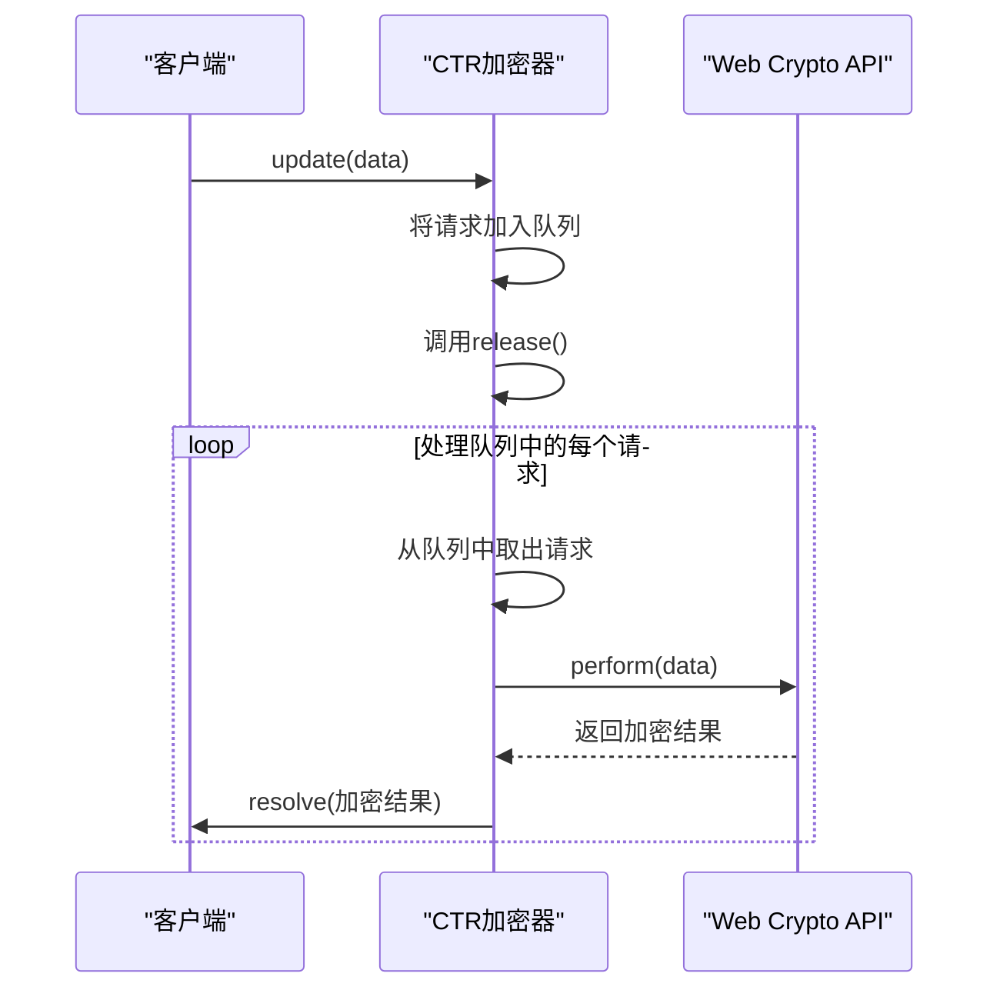
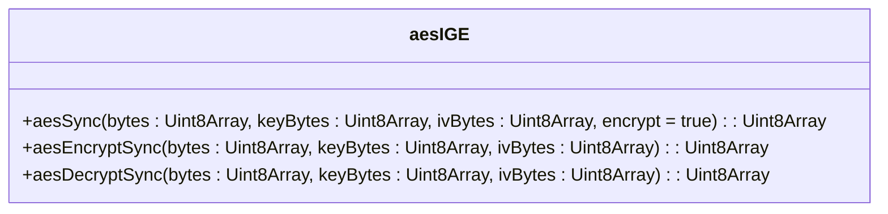
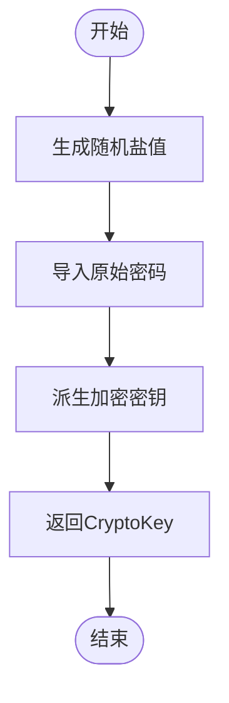
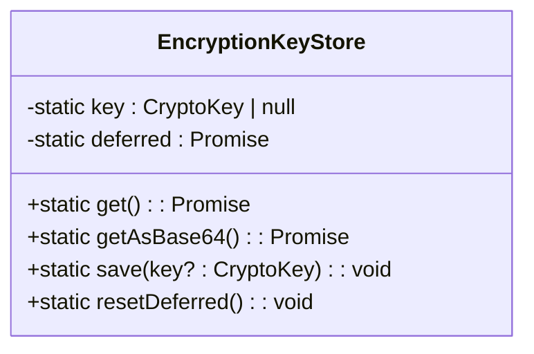
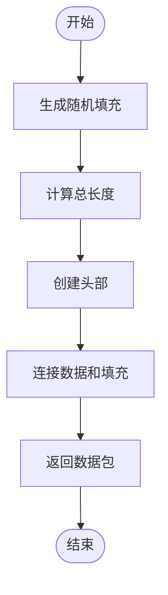
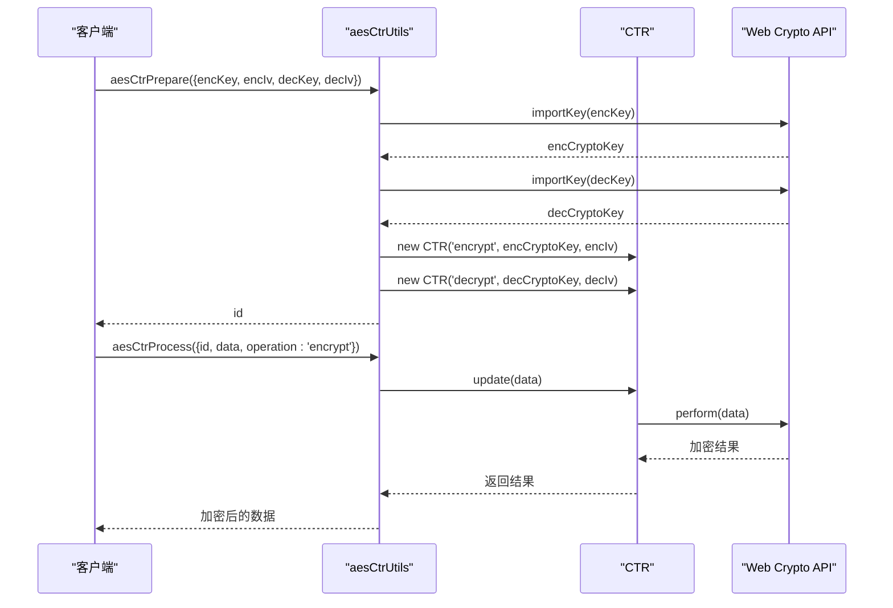

# 对称加密

<cite>
**本文档中引用的文件**  
- [aesCTR.ts](file://src/lib/crypto/utils/aesCTR.ts)
- [aesCTRJs.ts](file://src/lib/crypto/utils/aesCTRJs.ts)
- [aesIGE.ts](file://src/lib/crypto/utils/aesIGE.ts)
- [aesCtrUtils.ts](file://src/lib/crypto/aesCtrUtils.ts)
- [obfuscation.ts](file://src/lib/mtproto/transports/obfuscation.ts)
- [messageKeyUtils.ts](file://src/lib/mtproto/messageKeyUtils.ts)
- [p2PEncryptor.ts](file://src/lib/calls/p2P/p2PEncryptor.ts)
- [utils.ts](file://src/lib/passcode/utils.ts)
- [keyStore.ts](file://src/lib/passcode/keyStore.ts)
- [subtle.ts](file://src/lib/crypto/subtle.ts)
</cite>

## 目录
1. [引言](#引言)
2. [AES-CTR模式实现](#aes-ctr模式实现)
3. [AES-IGE模式应用](#aes-ige模式应用)
4. [加密密钥管理](#加密密钥管理)
5. [消息分块与重组](#消息分块与重组)
6. [性能与安全特性分析](#性能与安全特性分析)
7. [加密流程示例](#加密流程示例)
8. [结论](#结论)

## 引言
本文档详细记录了项目中对称加密算法的实现和应用，重点说明AES-CTR模式在消息内容加密中的具体实现，包括计数器生成、加密流程和并行处理能力。同时解释AES-IGE模式在特定场景下的使用，包括初始化向量(IV)的生成和传播机制。分析两种模式的安全特性、性能差异和适用场景。提供加密密钥的生成、存储和轮换机制说明，并描述如何处理加密消息的分块和重组。

**Section sources**
- [aesCTR.ts](file://src/lib/crypto/utils/aesCTR.ts#L1-L98)
- [aesIGE.ts](file://src/lib/crypto/utils/aesIGE.ts#L1-L22)

## AES-CTR模式实现

### 计数器生成
AES-CTR模式使用计数器作为加密的核心组件。在`aesCTR.ts`文件中，计数器通过BigInteger实现，初始值由传入的counter参数决定。计数器的递增通过`bigInt.add(1)`方法实现，确保每次加密操作都使用不同的计数器值。

```mermaid
classDiagram
class CTR {
-cryptoKey : CryptoKey
-leftLength : number
-mode : 'encrypt' | 'decrypt'
-counter : BigInteger
-queue : {data : Uint8Array, resolve : (data : Uint8Array) => void}[]
-releasing : boolean
+constructor(mode : 'encrypt' | 'decrypt', cryptoKey : CryptoKey, counter : Uint8Array)
+update(data : Uint8Array) : Promise<Uint8Array>
-release() : Promise<void>
-perform(data : Uint8Array) : Promise<ArrayBuffer>
-_update(data : Uint8Array) : Promise<Uint8Array>
}
```

**Diagram sources**
- [aesCTR.ts](file://src/lib/crypto/utils/aesCTR.ts#L14-L98)

### 加密流程
AES-CTR模式的加密流程通过`update`方法实现。该方法采用异步处理机制，将待加密数据放入队列中，通过`release`方法逐个处理。加密过程使用Web Crypto API的`subtle.encrypt`方法，以AES-CTR模式对数据进行加密。

加密流程的关键步骤包括：
1. 将数据分块处理，确保每次加密的数据长度为16字节的倍数
2. 使用当前计数器值进行加密
3. 递增计数器用于下一次加密操作
4. 处理剩余数据，确保所有数据都被正确加密

**Section sources**
- [aesCTR.ts](file://src/lib/crypto/utils/aesCTR.ts#L30-L98)
- [aesCtrUtils.ts](file://src/lib/crypto/aesCtrUtils.ts#L18-L54)

### 并行处理能力
AES-CTR模式通过队列机制实现并行处理能力。`CTR`类维护一个队列，将所有加密请求按顺序处理。`release`方法确保同一时间只有一个加密操作在执行，避免了并发问题。



**Diagram sources**
- [aesCTR.ts](file://src/lib/crypto/utils/aesCTR.ts#L30-L48)
- [aesCtrUtils.ts](file://src/lib/crypto/aesCtrUtils.ts#L46-L50)

## AES-IGE模式应用

### 初始化向量生成
AES-IGE模式使用初始化向量(IV)来确保加密的安全性。在`aesIGE.ts`文件中，IV通过外部传入的方式提供，确保每次加密都使用不同的IV值。



**Diagram sources**
- [aesIGE.ts](file://src/lib/crypto/utils/aesIGE.ts#L6-L22)

### 传播机制
AES-IGE模式的传播机制通过`aesSync`函数实现。该函数使用IGE模式对数据进行同步加密或解密。加密过程包括：
1. 将输入数据、密钥和IV转换为Word数组
2. 使用IGE模式进行加密或解密
3. 将结果转换回Uint8Array格式

**Section sources**
- [aesIGE.ts](file://src/lib/crypto/utils/aesIGE.ts#L6-L22)
- [messageKeyUtils.ts](file://src/lib/mtproto/messageKeyUtils.ts#L1-L63)

## 加密密钥管理

### 密钥生成
加密密钥通过PBKDF2算法从用户密码生成。在`utils.ts`文件中，`deriveEncryptionKey`函数使用SHA-256哈希函数和100,000次迭代来生成256位AES-GCM密钥。



**Diagram sources**
- [utils.ts](file://src/lib/passcode/utils.ts#L21-L34)

### 密钥存储
加密密钥通过`EncryptionKeyStore`类进行管理。该类使用静态变量存储密钥，并提供异步获取机制。密钥存储在内存中，确保安全性。



**Diagram sources**
- [keyStore.ts](file://src/lib/passcode/keyStore.ts#L5-L38)

### 密钥轮换
密钥轮换机制通过重新生成盐值和派生新密钥来实现。当用户更改密码时，系统会生成新的盐值并重新派生密钥，确保旧密钥无法解密新数据。

**Section sources**
- [utils.ts](file://src/lib/passcode/utils.ts#L36-L45)
- [keyStore.ts](file://src/lib/passcode/keyStore.ts#L25-L28)

## 消息分块与重组

### 分块处理
消息分块处理在`obfuscation.ts`文件中实现。系统使用随机填充机制，将数据包长度调整为4字节的倍数。填充字节数为0到3字节，由`nextRandomUint(8) % 3`决定。



**Diagram sources**
- [padded.ts](file://src/lib/mtproto/transports/padded.ts#L15-L22)

### 重组机制
消息重组通过`readPacket`方法实现。该方法从数据包中提取有效数据，忽略填充部分。重组过程包括：
1. 读取数据包长度
2. 跳过头部4字节
3. 根据数据包长度模4的结果，确定填充长度
4. 提取有效数据

**Section sources**
- [padded.ts](file://src/lib/mtproto/transports/padded.ts#L25-L32)
- [obfuscation.ts](file://src/lib/mtproto/transports/obfuscation.ts#L167-L181)

## 性能与安全特性分析

### 安全特性
AES-CTR模式的安全性基于以下特性：
- 使用唯一的计数器值确保相同明文产生不同密文
- 通过Web Crypto API的硬件加速提高安全性
- 防止重放攻击，每个消息使用不同的计数器

AES-IGE模式的安全性基于：
- 使用初始化向量(IV)增加随机性
- 同步加密确保数据完整性
- 防止模式识别攻击

### 性能差异
AES-CTR模式在性能上优于AES-IGE模式，主要体现在：
- 支持并行加密，提高处理速度
- 使用Web Crypto API的硬件加速
- 减少内存占用，通过流式处理

### 适用场景
AES-CTR模式适用于：
- 大数据量加密
- 实时通信加密
- 需要高性能加密的场景

AES-IGE模式适用于：
- 小数据量加密
- 需要同步加密的场景
- 特定协议要求的加密方式

**Section sources**
- [aesCTR.ts](file://src/lib/crypto/utils/aesCTR.ts#L1-L98)
- [aesIGE.ts](file://src/lib/crypto/utils/aesIGE.ts#L1-L22)
- [obfuscation.ts](file://src/lib/mtproto/transports/obfuscation.ts#L74-L87)

## 加密流程示例

### 加密过程
加密过程通过`aesCtrPrepare`和`aesCtrProcess`函数实现。首先准备加密环境，然后处理数据。



**Diagram sources**
- [aesCtrUtils.ts](file://src/lib/crypto/aesCtrUtils.ts#L18-L54)
- [aesCTR.ts](file://src/lib/crypto/utils/aesCTR.ts#L30-L98)

### 解密过程
解密过程与加密过程类似，但使用解密模式。

**Section sources**
- [aesCtrUtils.ts](file://src/lib/crypto/aesCtrUtils.ts#L46-L50)
- [aesCTR.ts](file://src/lib/crypto/utils/aesCTR.ts#L30-L98)

## 结论
本项目实现了完整的对称加密体系，包括AES-CTR和AES-IGE两种模式。AES-CTR模式通过计数器机制和并行处理能力，提供了高性能的加密解决方案，适用于大数据量和实时通信场景。AES-IGE模式通过初始化向量和同步加密机制，提供了额外的安全保障，适用于特定协议要求的场景。

密钥管理通过PBKDF2算法和安全存储机制确保了密钥的安全性。消息分块与重组机制通过随机填充和精确提取，确保了数据传输的完整性和效率。

整体加密体系设计合理，兼顾了安全性、性能和可维护性，为项目提供了可靠的加密保障。