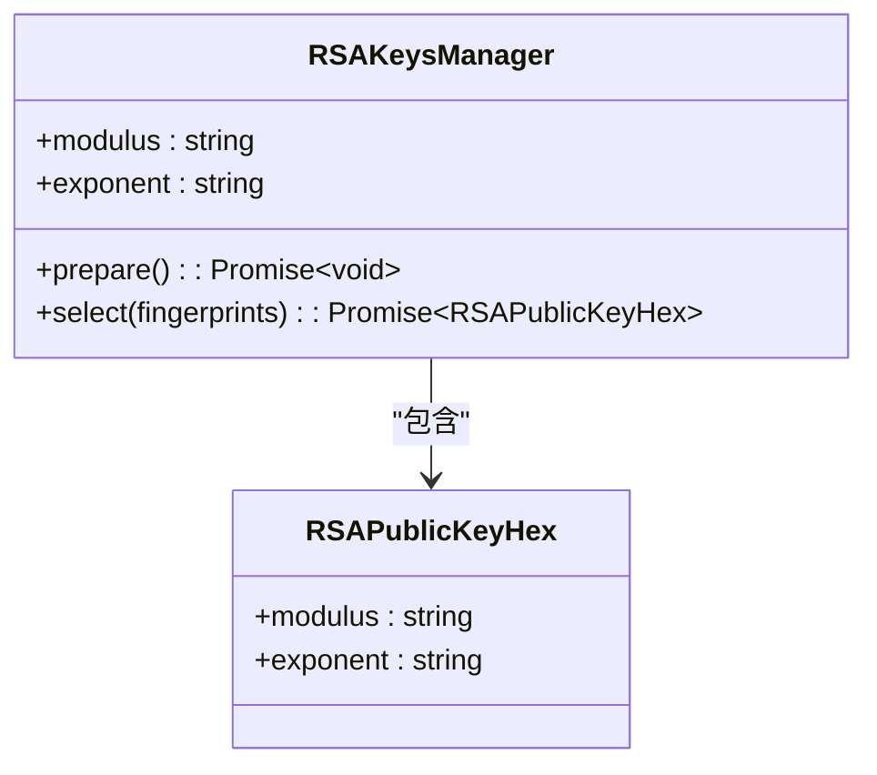
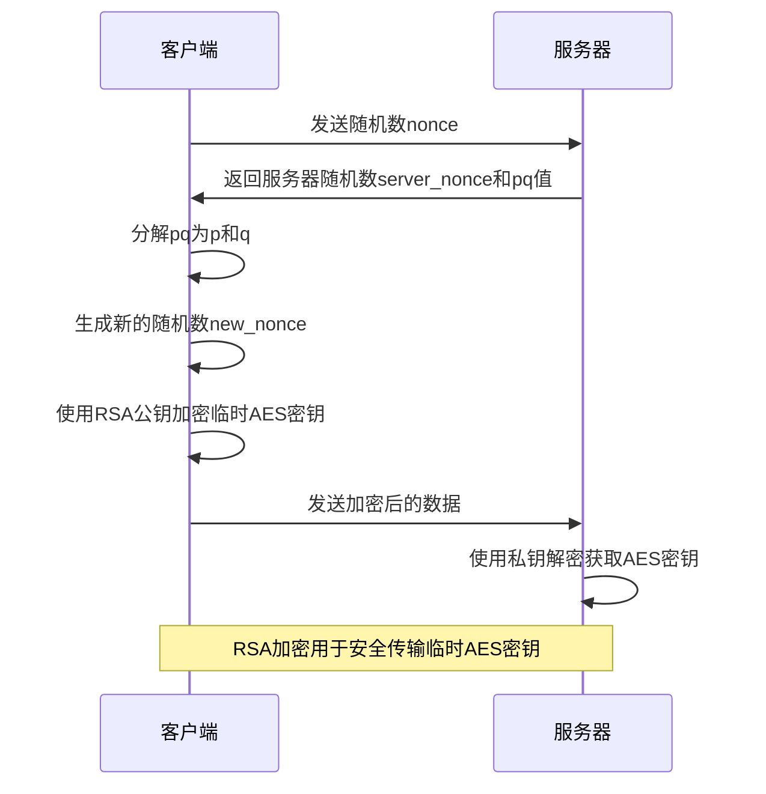
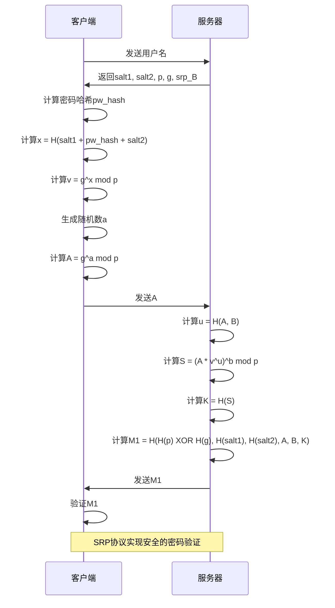
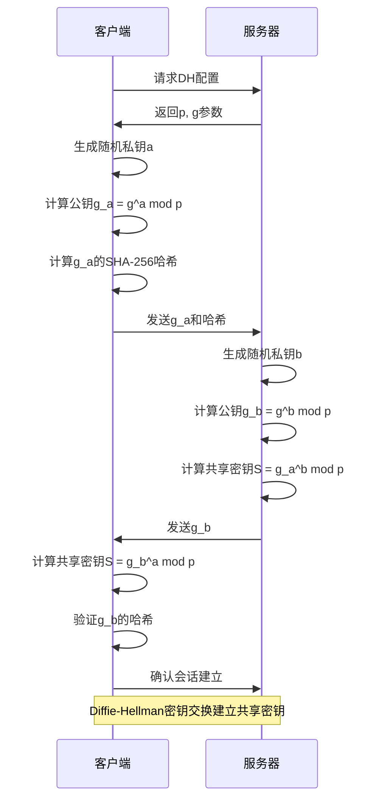
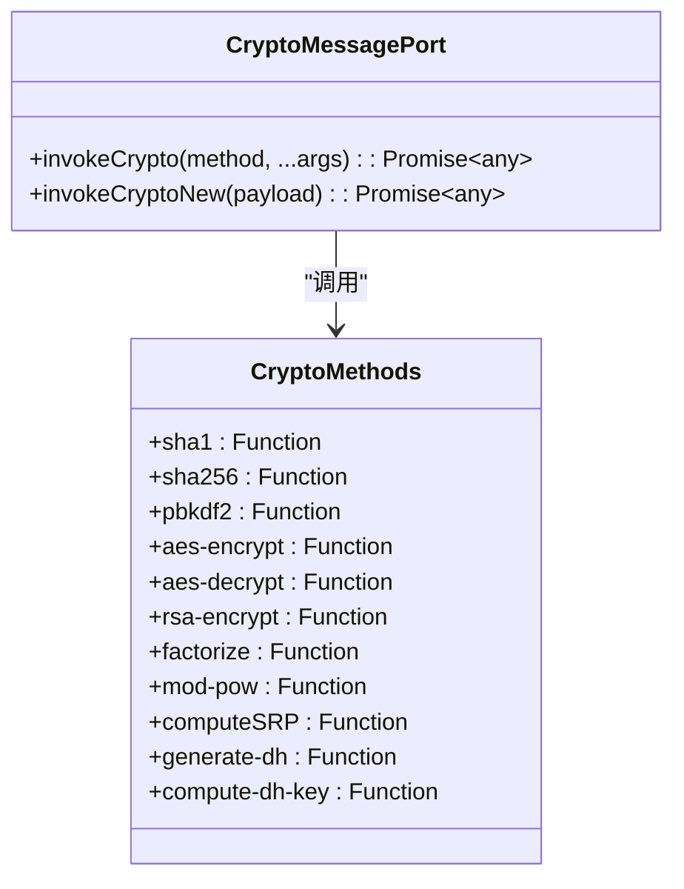

# 非对称加密

<cite>
**本文档引用的文件**   
- [rsaKeysManager.ts](file://src/lib/mtproto/rsaKeysManager.ts)
- [rsa.ts](file://src/lib/crypto/utils/rsa.ts)
- [srp.ts](file://src/lib/crypto/srp.ts)
- [authorizer.ts](file://src/lib/mtproto/authorizer.ts)
- [generateDh.ts](file://src/lib/crypto/generateDh.ts)
- [computeDhKey.ts](file://src/lib/crypto/computeDhKey.ts)
- [cryptoMessagePort.ts](file://src/lib/crypto/cryptoMessagePort.ts)
- [crypto_methods.ts](file://src/lib/crypto/crypto_methods.ts)
- [tl_utils.ts](file://src/lib/mtproto/tl_utils.ts)
</cite>

## 目录
1. [引言](#引言)
2. [RSA算法实现](#rsa算法实现)
3. [SRP协议实现](#srp协议实现)
4. [Diffie-Hellman密钥交换](#diffie-hellman密钥交换)
5. [公钥基础设施](#公钥基础设施)
6. [性能优化与量子计算威胁缓解](#性能优化与量子计算威胁缓解)
7. [结论](#结论)

## 引言
本项目实现了完整的非对称加密体系，包括RSA算法、SRP(Secure Remote Password)协议和Diffie-Hellman密钥交换机制。这些加密技术共同构成了安全通信的基础，确保了用户数据的机密性、完整性和身份验证。系统遵循MTProto协议的安全准则，实现了端到端加密和安全的身份验证流程。

## RSA算法实现

### 密钥管理与分发
项目中的RSA密钥管理由`RSAKeysManager`类实现，负责管理Telegram服务器的公钥。系统预置了多个公钥，包括生产环境和测试环境的密钥。公钥以十六进制格式存储，包含模数(modulus)和指数(exponent)两个关键参数。



**图源**
- [rsaKeysManager.ts](file://src/lib/mtproto/rsaKeysManager.ts#L24-L143)

### RSA加密流程
RSA加密在密钥交换过程中发挥关键作用。当客户端需要与服务器建立安全连接时，使用服务器的公钥对临时AES密钥进行加密。加密过程采用RSA-OAEP方案，确保了加密的安全性。



**图源**
- [authorizer.ts](file://src/lib/mtproto/authorizer.ts#L282-L337)
- [rsa.ts](file://src/lib/crypto/utils/rsa.ts#L5-L7)

**节源**
- [rsaKeysManager.ts](file://src/lib/mtproto/rsaKeysManager.ts#L92-L120)
- [rsa.ts](file://src/lib/crypto/utils/rsa.ts#L5-L7)

## SRP协议实现

### SRP协议概述
SRP(Secure Remote Password)协议用于实现安全的密码验证，避免了在通信过程中直接传输密码。该协议基于Diffie-Hellman密钥交换原理，结合密码哈希技术，实现了零知识证明的身份验证。

### 密码哈希与验证流程
SRP协议首先对用户密码进行多重哈希处理，生成密码哈希值。这个过程包括SHA-256哈希、PBKDF2密钥派生函数和额外的SHA-256哈希步骤。

```mermaid
flowchart TD
A[用户密码] --> B[SHA-256(client_salt + password + client_salt)]
B --> C[server_salt + hash + server_salt]
C --> D[SHA-256(hash)]
D --> E[PBKDF2(hash, client_salt, 100000)]
E --> F[server_salt + hash + server_salt]
F --> G[SHA-256(hash)]
G --> H[最终密码哈希]
style A fill:#f9f,stroke:#333
style H fill:#bbf,stroke:#333
```

**图源**
- [srp.ts](file://src/lib/crypto/srp.ts#L17-L28)

### SRP验证流程
SRP验证流程包括客户端和服务器之间的多次交互，通过数学计算验证双方是否拥有相同的密码信息，而无需直接传输密码。



**图源**
- [srp.ts](file://src/lib/crypto/srp.ts#L31-L166)

**节源**
- [srp.ts](file://src/lib/crypto/srp.ts#L17-L166)
- [mock/srp.ts](file://src/mock/srp.ts#L1-L52)

## Diffie-Hellman密钥交换

### DH参数生成
Diffie-Hellman密钥交换用于在不安全的信道上建立共享密钥。系统使用预定义的大素数p和生成元g作为公共参数，确保了密钥交换的安全性。

```mermaid
classDiagram
class DiffieHellman {
+p : Uint8Array
+g : number
+a : Uint8Array
+g_a : Uint8Array
+g_a_hash : Uint8Array
+generateDh(dhConfig) : Promise~dh~
+computeDhKey(g_b, a, p) : Promise~{key, key_fingerprint}~
}
class MessagesDhConfig {
+p : Uint8Array
+g : number
}
DiffieHellman --> MessagesDhConfig : "使用"
```

**图源**
- [generateDh.ts](file://src/lib/crypto/generateDh.ts#L16-L51)
- [computeDhKey.ts](file://src/lib/crypto/computeDhKey.ts#L10-L17)

### 端到端加密会话建立
Diffie-Hellman密钥交换在端到端加密会话建立中发挥核心作用。客户端和服务器各自生成私钥，并交换公钥，最终计算出相同的共享密钥。



**图源**
- [authorizer.ts](file://src/lib/mtproto/authorizer.ts#L400-L507)
- [generateDh.ts](file://src/lib/crypto/generateDh.ts#L16-L51)

**节源**
- [authorizer.ts](file://src/lib/mtproto/authorizer.ts#L400-L507)
- [generateDh.ts](file://src/lib/crypto/generateDh.ts#L16-L51)
- [computeDhKey.ts](file://src/lib/crypto/computeDhKey.ts#L10-L17)

## 公钥基础设施

### 证书验证机制
系统实现了严格的证书验证机制，确保使用的DH参数符合安全标准。验证过程包括检查素数p的值、生成元g的值以及公钥gA的范围。

```mermaid
flowchart TD
A[接收DH参数] --> B{g == 3?}
B --> |否| C[拒绝连接]
B --> |是| D{p == 预定义大素数?}
D --> |否| C
D --> |是| E{1 < gA < p-1?}
E --> |否| C
E --> |是| F{2^(2048-64) < gA < p-2^(2048-64)?}
F --> |否| C
F --> |是| G[接受连接]
style C fill:#f99,stroke:#333
style G fill:#9f9,stroke:#333
```

**图源**
- [authorizer.ts](file://src/lib/mtproto/authorizer.ts#L454-L498)

### 参数验证流程
参数验证流程确保了Diffie-Hellman密钥交换的安全性，防止了各种可能的攻击，如小指数攻击和中间人攻击。

**节源**
- [authorizer.ts](file://src/lib/mtproto/authorizer.ts#L454-L498)

## 性能优化与量子计算威胁缓解

### 加密操作优化
系统通过Web Worker实现了加密操作的并行处理，避免了阻塞主线程。加密方法通过消息端口调用，实现了计算密集型任务的异步处理。



**图源**
- [cryptoMessagePort.ts](file://src/lib/crypto/cryptoMessagePort.ts#L20-L67)
- [crypto_methods.ts](file://src/lib/crypto/crypto_methods.ts#L22-L42)

### 量子计算威胁应对
虽然当前实现主要基于经典密码学算法，但系统架构设计考虑了未来的升级需求。通过模块化的设计，可以相对容易地集成抗量子密码算法，如基于格的加密算法或哈希签名方案。

**节源**
- [cryptoMessagePort.ts](file://src/lib/crypto/cryptoMessagePort.ts#L20-L67)
- [crypto_methods.ts](file://src/lib/crypto/crypto_methods.ts#L22-L42)

## 结论
本项目实现了一套完整的非对称加密体系，包括RSA算法、SRP协议和Diffie-Hellman密钥交换。这些技术共同确保了通信的安全性，实现了安全的密钥交换、身份验证和端到端加密。系统遵循MTProto协议的安全准则，通过严格的参数验证和优化的加密操作，提供了高效且安全的通信保障。未来可以通过模块化升级，应对量子计算带来的安全威胁。