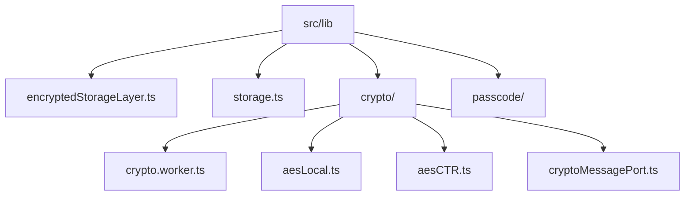
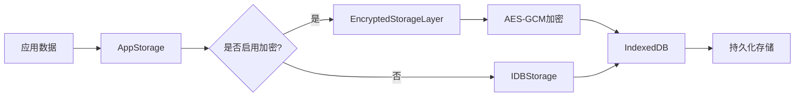
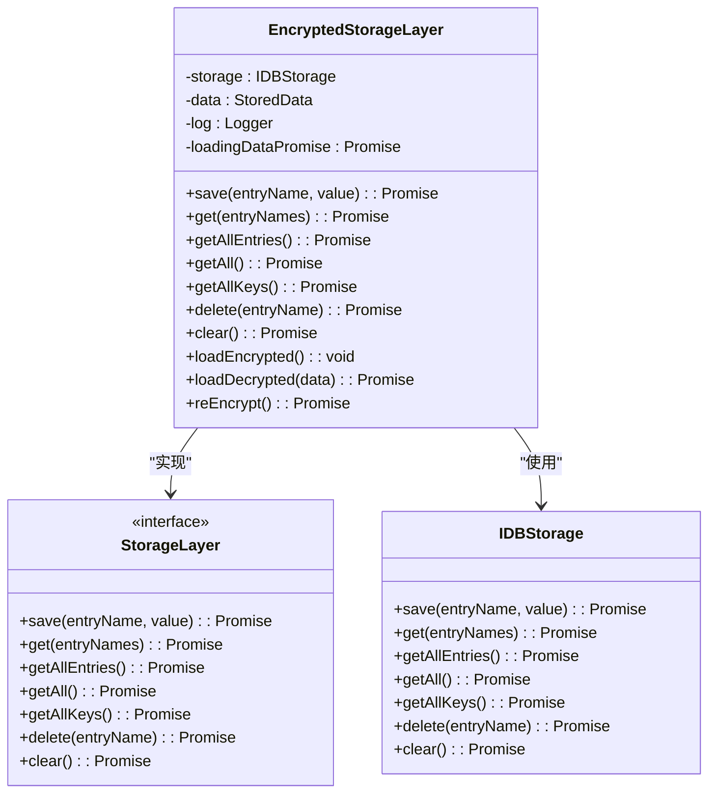
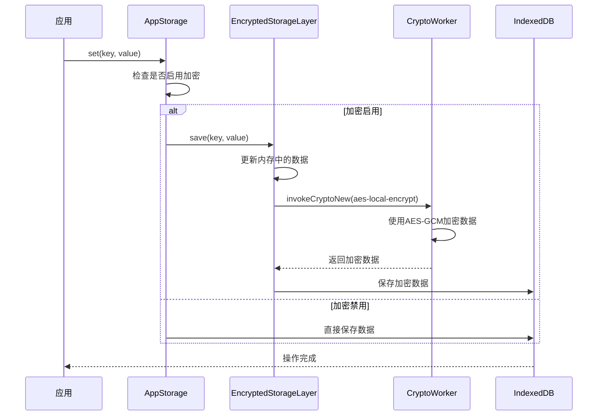
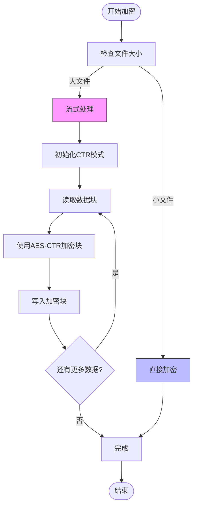
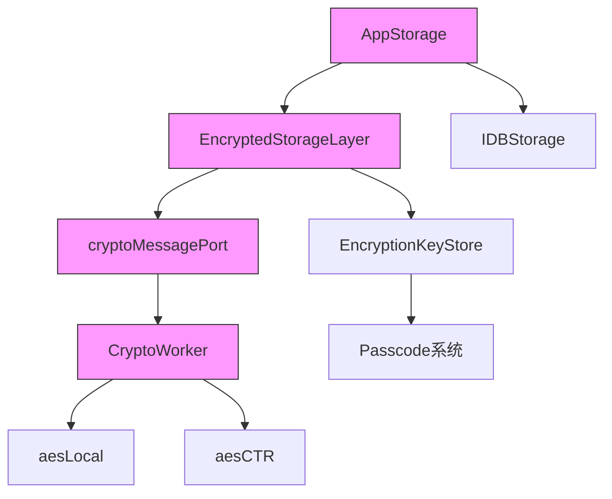

# 存储加密

<cite>
**本文档中引用的文件**  
- [encryptedStorageLayer.ts](file://src/lib/encryptedStorageLayer.ts)
- [storage.ts](file://src/lib/storage.ts)
- [crypto.worker.ts](file://src/lib/crypto/crypto.worker.ts)
- [aesLocal.ts](file://src/lib/crypto/utils/aesLocal.ts)
- [aesCTR.ts](file://src/lib/crypto/utils/aesCTR.ts)
- [cryptoMessagePort.ts](file://src/lib/crypto/cryptoMessagePort.ts)
- [passcodeLockScreen.tsx](file://src/components/passcodeLock/passcodeLockScreen.tsx)
</cite>

## 目录
1. [简介](#简介)
2. [项目结构](#项目结构)
3. [核心组件](#核心组件)
4. [架构概述](#架构概述)
5. [详细组件分析](#详细组件分析)
6. [依赖分析](#依赖分析)
7. [性能考虑](#性能考虑)
8. [故障排除指南](#故障排除指南)
9. [结论](#结论)

## 简介
本文档详细记录了本地存储数据的加密保护机制。重点说明了`encryptedStorageLayer`如何对IndexedDB和localStorage中的敏感数据进行透明加密，解释AES-CTR模式在文件分块加密中的应用，描述大文件加密的流式处理机制和内存优化策略，分析加密元数据的存储格式和完整性验证方法，说明加密存储的性能影响和优化措施，并提供数据恢复和迁移方案的详细说明。

## 项目结构
项目采用分层架构设计，将加密存储功能独立为专门的模块。核心加密逻辑位于`src/lib`目录下，通过模块化设计实现了加密层与存储层的分离。

**Diagram sources**
- [encryptedStorageLayer.ts](file://src/lib/encryptedStorageLayer.ts)
- [storage.ts](file://src/lib/storage.ts)
- [crypto.worker.ts](file://src/lib/crypto/crypto.worker.ts)

**Section sources**
- [encryptedStorageLayer.ts](file://src/lib/encryptedStorageLayer.ts)
- [storage.ts](file://src/lib/storage.ts)

## 核心组件
核心加密组件包括`EncryptedStorageLayer`类，负责管理加密数据的存储和检索；`AppStorage`类，提供统一的存储接口；以及一系列加密工具类，实现具体的加密算法。

**Section sources**
- [encryptedStorageLayer.ts](file://src/lib/encryptedStorageLayer.ts)
- [storage.ts](file://src/lib/storage.ts)

## 架构概述
系统采用分层加密架构，通过`EncryptedStorageLayer`对底层存储进行透明加密。当启用密码保护时，所有敏感数据在写入IndexedDB之前都会经过加密处理。

**Diagram sources**
- [storage.ts](file://src/lib/storage.ts)
- [encryptedStorageLayer.ts](file://src/lib/encryptedStorageLayer.ts)

## 详细组件分析

### 加密存储层分析
`EncryptedStorageLayer`实现了对IndexedDB数据的透明加密保护，确保敏感信息在存储时得到充分保护。

#### 类图

**Diagram sources**
- [encryptedStorageLayer.ts](file://src/lib/encryptedStorageLayer.ts)

**Section sources**
- [encryptedStorageLayer.ts](file://src/lib/encryptedStorageLayer.ts)

### 加密机制分析
系统采用AES-GCM模式进行数据加密，结合密码派生机制确保数据安全性。

#### 加密流程序列图

**Diagram sources**
- [storage.ts](file://src/lib/storage.ts)
- [encryptedStorageLayer.ts](file://src/lib/encryptedStorageLayer.ts)
- [crypto.worker.ts](file://src/lib/crypto/crypto.worker.ts)

### 大文件加密流式处理
对于大文件加密，系统采用流式处理机制，避免内存溢出问题。

#### 流式加密流程图

**Diagram sources**
- [aesCTR.ts](file://src/lib/crypto/utils/aesCTR.ts)
- [crypto.worker.ts](file://src/lib/crypto/crypto.worker.ts)

## 依赖分析
系统各组件之间存在明确的依赖关系，确保加密功能的正确实现。

**Diagram sources**
- [storage.ts](file://src/lib/storage.ts)
- [encryptedStorageLayer.ts](file://src/lib/encryptedStorageLayer.ts)
- [cryptoMessagePort.ts](file://src/lib/crypto/cryptoMessagePort.ts)
- [crypto.worker.ts](file://src/lib/crypto/crypto.worker.ts)

**Section sources**
- [storage.ts](file://src/lib/storage.ts)
- [encryptedStorageLayer.ts](file://src/lib/encryptedStorageLayer.ts)
- [cryptoMessagePort.ts](file://src/lib/crypto/cryptoMessagePort.ts)

## 性能考虑
加密存储机制在保证安全性的同时，也考虑了性能优化。

### 加密性能优化策略
- **异步处理**：所有加密操作都在独立的Web Worker中执行，避免阻塞主线程
- **节流机制**：使用`asyncThrottle`对存储操作进行节流，减少频繁的磁盘写入
- **内存优化**：大文件采用流式处理，避免一次性加载整个文件到内存
- **延迟加载**：加密数据在首次访问时才进行解密，减少启动时的计算开销

**Section sources**
- [encryptedStorageLayer.ts](file://src/lib/encryptedStorageLayer.ts)
- [crypto.worker.ts](file://src/lib/crypto/crypto.worker.ts)

## 故障排除指南
当遇到加密存储相关问题时，可以参考以下排查步骤：

1. 检查密码是否正确设置
2. 验证加密密钥是否正常生成和存储
3. 检查IndexedDB是否可访问
4. 确认Web Crypto API是否可用
5. 查看控制台日志中的加密相关错误信息

**Section sources**
- [encryptedStorageLayer.ts](file://src/lib/encryptedStorageLayer.ts)
- [crypto.worker.ts](file://src/lib/crypto/crypto.worker.ts)
- [passcodeLockScreen.tsx](file://src/components/passcodeLock/passcodeLockScreen.tsx)

## 结论
本系统通过`EncryptedStorageLayer`实现了对本地存储数据的全面加密保护。采用AES-GCM模式确保数据的机密性和完整性，通过Web Worker实现加密操作的异步处理，避免影响主线程性能。对于大文件，系统采用AES-CTR模式的流式处理机制，有效管理内存使用。整个加密架构设计合理，既保证了数据安全，又兼顾了性能表现。