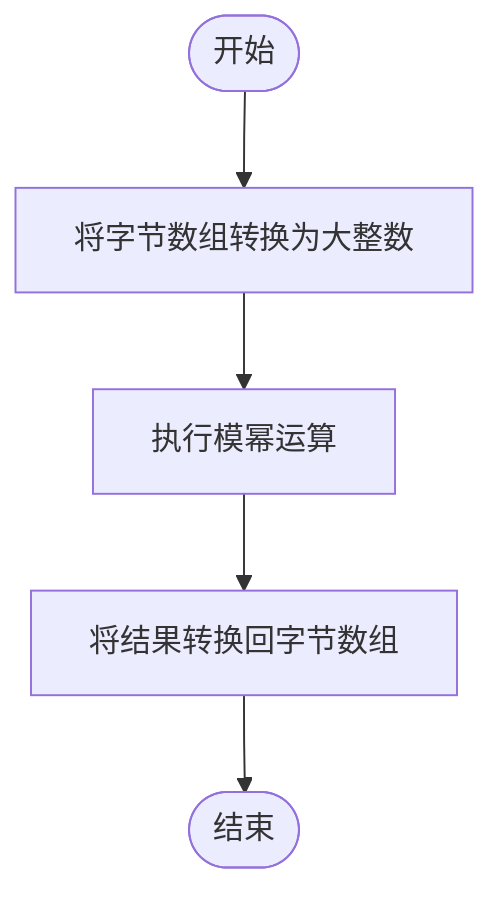
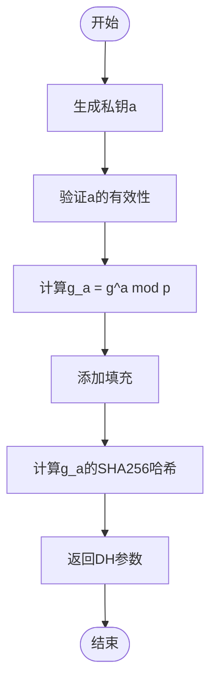
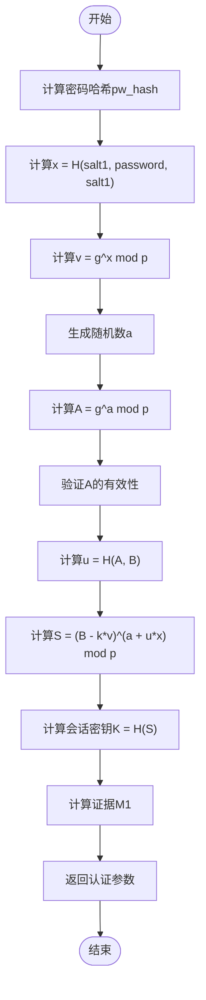
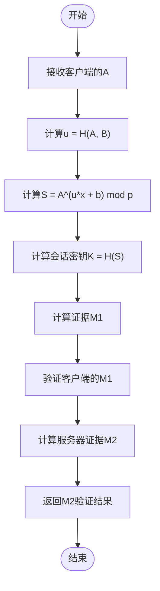
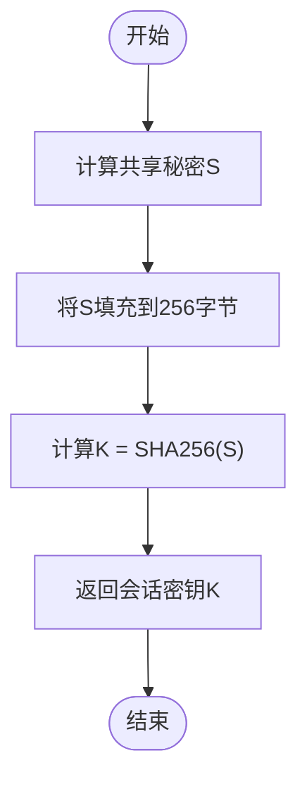
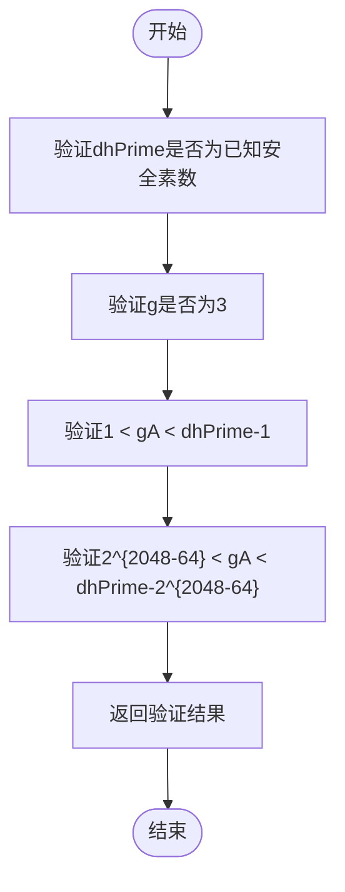
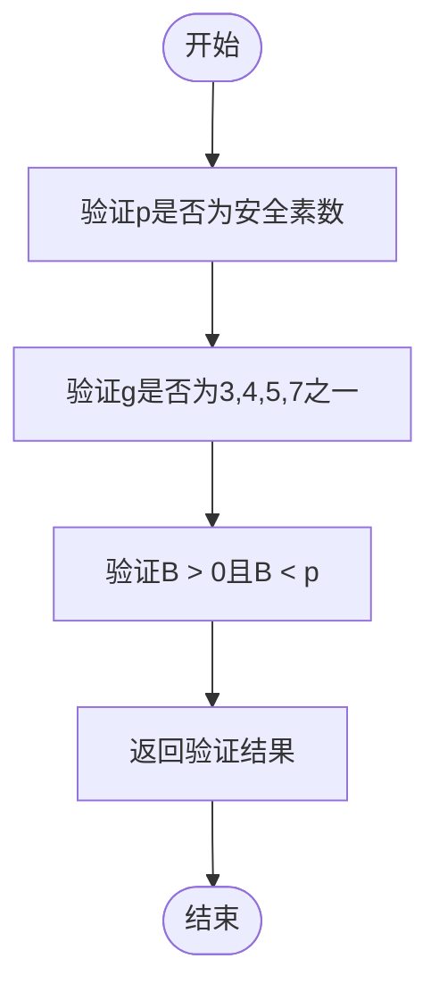
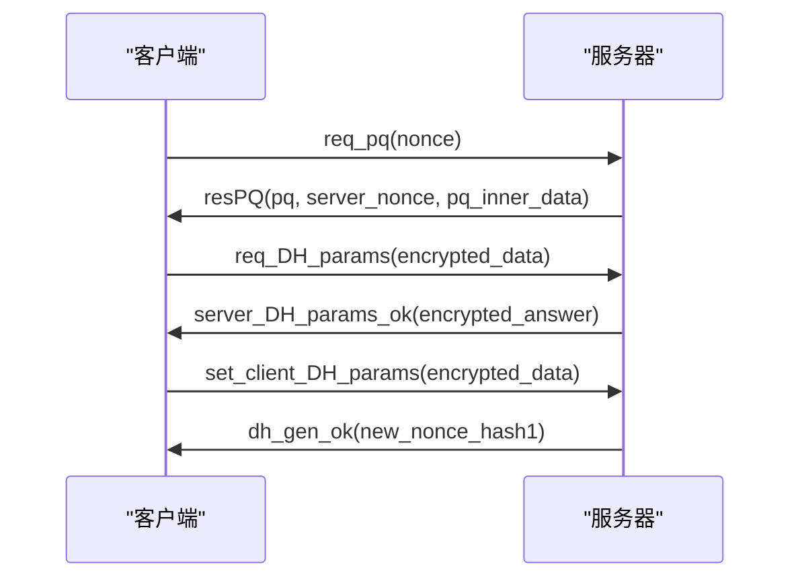
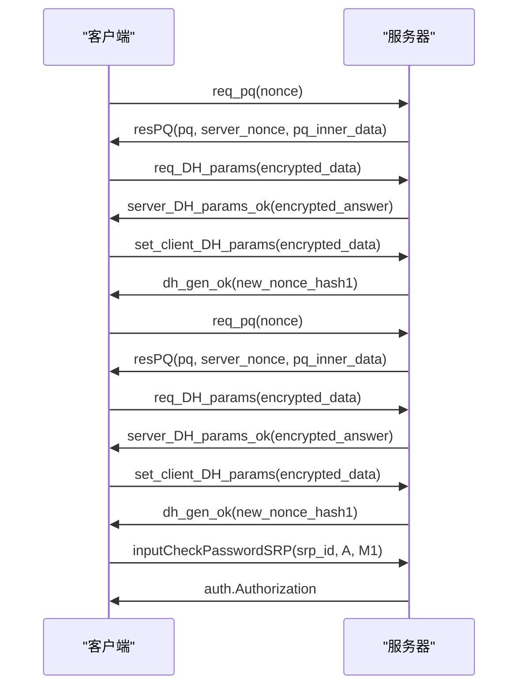
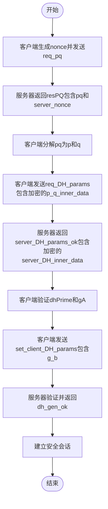

# 密钥交换

<cite>
**本文档引用的文件**   
- [computeDhKey.ts](file://src/lib/crypto/computeDhKey.ts)
- [generateDh.ts](file://src/lib/crypto/generateDh.ts)
- [srp.ts](file://src/lib/crypto/srp.ts)
- [authorizer.ts](file://src/lib/mtproto/authorizer.ts)
- [crypto.worker.ts](file://src/lib/crypto/crypto.worker.ts)
- [cryptoMessagePort.ts](file://src/lib/crypto/cryptoMessagePort.ts)
- [bytesModPow.ts](file://src/helpers/bytes/bytesModPow.ts)
- [aesIGE.ts](file://src/lib/crypto/utils/aesIGE.ts)
- [BrentPollard.ts](file://src/lib/crypto/utils/factorize/BrentPollard.ts)
- [mock/srp.ts](file://src/mock/srp.ts)
- [srp.test.ts](file://src/tests/srp.test.ts)
- [crypto_methods.test.ts](file://src/tests/crypto_methods.test.ts)
</cite>

## 目录
1. [引言](#引言)
2. [Diffie-Hellman密钥交换实现](#diffie-hellman密钥交换实现)
3. [SRP协议实现](#srp协议实现)
4. [安全措施与验证机制](#安全措施与验证机制)
5. [协议交互时序图](#协议交互时序图)
6. [性能对比与选择策略](#性能对比与选择策略)
7. [关键参数安全性分析](#关键参数安全性分析)
8. [不安全信道上的安全会话建立](#不安全信道上的安全会话建立)
9. [潜在攻击面防护](#潜在攻击面防护)
10. [结论](#结论)

## 引言
本文档全面记录了密钥交换协议的实现，重点分析Diffie-Hellman密钥交换和SRP（安全远程密码协议）在用户认证过程中的应用。文档详细说明了两种协议的具体实现、安全措施、性能对比以及在不安全信道上建立安全会话的完整流程。

## Diffie-Hellman密钥交换实现

Diffie-Hellman密钥交换在代码库中通过多个组件实现，主要涉及模幂运算的优化和密钥生成过程。

### 模幂运算优化
模幂运算是Diffie-Hellman密钥交换的核心算法，其实现位于`src/helpers/bytes/bytesModPow.ts`。该函数使用`big-integer`库进行大数运算，将字节数组转换为大整数，执行模幂运算后，再将结果转换回字节数组。

**Diagram sources**
- [bytesModPow.ts](file://src/helpers/bytes/bytesModPow.ts#L1-L9)

### 密钥生成流程
密钥生成流程在`src/lib/crypto/generateDh.ts`中实现。该函数生成客户端的私钥`a`，并计算公钥`g_a = g^a mod p`。

**Diagram sources**
- [generateDh.ts](file://src/lib/crypto/generateDh.ts#L1-L51)

**Section sources**
- [generateDh.ts](file://src/lib/crypto/generateDh.ts#L1-L51)

## SRP协议实现

SRP（安全远程密码协议）在用户认证过程中用于安全地验证用户密码，同时防止中间人攻击。

### 客户端密钥协商流程
客户端密钥协商流程在`src/lib/crypto/srp.ts`中实现。该流程包括密码哈希计算、验证值生成和会话密钥计算。

**Diagram sources**
- [srp.ts](file://src/lib/crypto/srp.ts#L1-L166)

### 服务器端密钥协商流程
服务器端密钥协商流程与客户端类似，但使用不同的参数和验证步骤。

**Diagram sources**
- [srp.ts](file://src/lib/crypto/srp.ts#L1-L166)

### 会话密钥生成
会话密钥生成过程在`src/lib/crypto/srp.ts`中实现，使用SHA256哈希函数对共享秘密进行处理。

**Diagram sources**
- [srp.ts](file://src/lib/crypto/srp.ts#L141-L142)

**Section sources**
- [srp.ts](file://src/lib/crypto/srp.ts#L1-L166)

## 安全措施与验证机制

### Diffie-Hellman参数验证
在`src/lib/mtproto/authorizer.ts`中实现了Diffie-Hellman参数的验证机制，确保参数的安全性。

**Diagram sources**
- [authorizer.ts](file://src/lib/mtproto/authorizer.ts#L454-L497)

### SRP参数验证
SRP协议中的参数验证包括对模数p、生成元g和验证值B的检查。

**Diagram sources**
- [srp.ts](file://src/lib/crypto/srp.ts#L37-L43)

**Section sources**
- [authorizer.ts](file://src/lib/mtproto/authorizer.ts#L454-L497)
- [srp.ts](file://src/lib/crypto/srp.ts#L37-L43)

## 协议交互时序图

### Diffie-Hellman密钥交换时序

**Diagram sources**
- [authorizer.ts](file://src/lib/mtproto/authorizer.ts#L282-L578)

### SRP认证时序

**Diagram sources**
- [authorizer.ts](file://src/lib/mtproto/authorizer.ts#L282-L578)
- [srp.ts](file://src/lib/crypto/srp.ts#L158-L163)

## 性能对比与选择策略

### 性能对比
| 协议 | 计算复杂度 | 通信轮次 | 安全性 | 适用场景 |
|------|-----------|---------|-------|---------|
| Diffie-Hellman | 高 | 3 | 高 | 会话密钥建立 |
| SRP | 高 | 3 | 高 | 用户认证 |

**Section sources**
- [computeDhKey.ts](file://src/lib/crypto/computeDhKey.ts#L10-L16)
- [srp.ts](file://src/lib/crypto/srp.ts#L31-L166)

### 选择策略
- **Diffie-Hellman**: 用于建立安全会话密钥，适用于需要前向安全性的场景
- **SRP**: 用于用户认证，避免密码明文传输，适用于需要强身份验证的场景

## 关键参数安全性分析

### Diffie-Hellman参数
- **p**: 2048位安全素数，值为c71caeb9...fcc5b
- **g**: 生成元，固定为3
- **a, b**: 客户端和服务器的私钥，随机生成
- **g_a, g_b**: 客户端和服务器的公钥

### SRP参数
- **p**: 2048位安全素数，与Diffie-Hellman相同
- **g**: 生成元，通常为3
- **salt1, salt2**: 密码哈希盐值
- **v**: 验证值，v = g^x mod p
- **A, B**: 客户端和服务器的公钥

**Section sources**
- [authorizer.ts](file://src/lib/mtproto/authorizer.ts#L460-L461)
- [srp.ts](file://src/lib/crypto/srp.ts#L9-L11)

## 不安全信道上的安全会话建立

### 完整流程

**Diagram sources**
- [authorizer.ts](file://src/lib/mtproto/authorizer.ts#L282-L578)

**Section sources**
- [authorizer.ts](file://src/lib/mtproto/authorizer.ts#L282-L578)

## 潜在攻击面防护

### 中间人攻击防护
- **Diffie-Hellman**: 通过验证已知的dhPrime值来防止中间人攻击
- **SRP**: 通过零知识证明机制，确保密码不会在传输过程中暴露

### 重放攻击防护
- 使用随机生成的nonce和server_nonce
- 通过SHA1哈希验证消息完整性

### 参数篡改防护
- 对关键参数进行多重验证
- 使用RSA加密保护传输的参数

**Section sources**
- [authorizer.ts](file://src/lib/mtproto/authorizer.ts#L454-L497)
- [srp.ts](file://src/lib/crypto/srp.ts#L94-L108)

## 结论
本文档详细分析了Diffie-Hellman密钥交换和SRP协议的实现。两种协议都采用了严格的安全措施来防止各种攻击，包括中间人攻击、重放攻击和参数篡改。Diffie-Hellman适用于会话密钥建立，而SRP更适合用户认证场景。在实际应用中，应根据具体需求选择合适的协议。